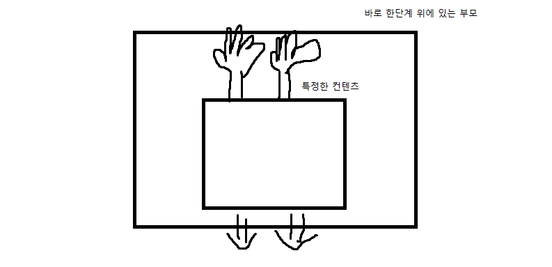

# 🐱‍🏍Padding VS Margin

---

 

일단, 둘의 차이는 기본적으로 이 사진 한 장이 정말 잘 설명해 주고 있다.

padding은 경계의 안쪽이고 margin은 경계의 바깥쪽이다. 

근데, 항상 헷갈리는 것이 특정한 Object 위쪽에 공간이 필요할 때 padding-top을 써야 할 지, margin-top을 써야 할 지 잘 이해가 되지 않았던 적이 많다. 사실 그림으로 보기에도 padding-top을 늘리나, margin-top을 늘리나 결과는 똑같은게 아닌가? 라는 생각을 드는데 실제로 코드화 시키게 되면 내가 원하는 결과를 도출하는 코드는 딱 한 개 뿐이다.  

찾아보니까 내 생각에는 명쾌하다는 느낌이 드는 답변이 하나 있었다.

특정한 컨텐츠와 그 컨텐츠 바로 상위 부모의 관계에서 컨텐츠 자체를 아래로 밀어 내고 싶을 때, margin-top을 그렇지 않을 때는 padding-top을 쓰면 된다는 것이다.

 

이 사진 처럼, 특정한 컨텐츠 위쪽에 손이 있다고 생각하고 부모는 고정되어 있다 가정한다. 이 특정한 컨텐츠가 부모를 밀어서 자신이 아랫쪽으로 움직이는 모양을 연출하고 싶을 때! 그때 margin-top을 사용하는 것이고, 이 케이스와 어울리지 않는다 싶을 때 padding-top을 쓴다고 생각하면 이해하기가 편할 것 같다. 

또한, 여기서의 부모는 바로 한단계 상위의 요소라는 것을 반드시 명심해야 한다. 또한, 한단계 상위 요소가 없을 시에는 밀 수가 없기 때문에 padding-top만 가능하다.

