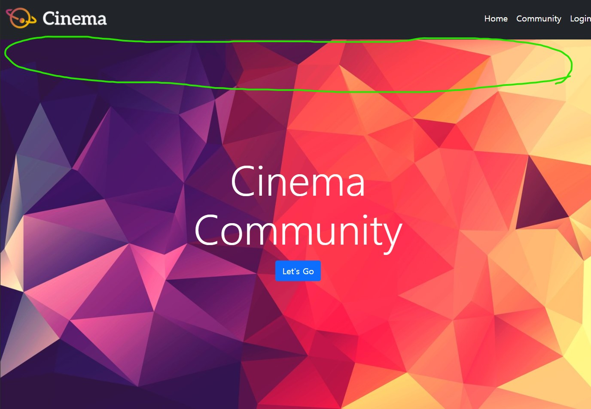

# 🐱‍🏍fixed-top으로 설정해놓은 네비게이션바 때문에 사진이 가려지는 현샹

---

부트스트랩을 사용하여 간단한 웹을 만들어 보는 연습을 하던 중 fixed-top으로 설정해놓은 네비게이션바 때문에 사진이 가려지는 현상이 발생하였다. 이 문제를 해결하기 위해  별에 별 짓을 다 해봤지만 쉽게 해결되지 않았다. 그러다 어느 블로그의 글을 보고 해결 방법을 알게 되었고 나중에도 이런 문제가 발생할 가능성이 크기에 기록해둔다.


문제의 사진이다. 초록색으로 동그라미를 쳐 놓은 부분에서 문제가 발생한다. 바로 fixed-top으로 설정해놓은 네비게이션바 때문에 기존 사진의 상단 부분이 잘리는 문제이다. 코드는 다음과 같다.

```html
  <!-- 1. navbar -->
  <nav class="navbar navbar-expand-lg fixed-top navbar-dark bg-dark d-flex justify-content-between">
    ~~~~~~~~
  </nav>
```

이 문제를 해결하기 위한 핵심은 !!!!!!!  <u>**웹이 보이기는 평면이지만 사실은 평면이 아니라는 것이다.**</u> 웹은 엄밀히 말해 평면이 아니라 벡터의 모양을 취하고 있다고 생각하는 것이 좋다. 즉, x, y 축 뿐만 아니라 z축이 존재하는 것이고 z-index가 이를 활용하는 요소라고 봐도 무방할 것 같다. 

내가 이 문제에서 어려움을 느낀 가장 큰 이유도 웹을 평면이라 생각했기 때문이다. 평면이고 네비게이션바를 상단에 고정 시켰다면 당연히 그 밑의 다른 요소들은 알아서 밀려날 것이라 생각했다. 하지만, 네비게이션바는 상단에 고정된 것이 아니라 z축, 즉 위로 떠 있는 상태인 것이다. 때문에 그 밑에 있어야할 사진의 윗부분이 네비게이션바 밑으로 들어가게 된 것이다.  

이 문제를 해결하는 방법은 2가지가 있다.

<br/>

### 첫번째, body 자체에 padding-top을 주는 것이다.

```css
/* CSS 파일에서 */
body {
   padding-top: 70px; 
}

/* 부트스트랩을 사용할 경우 */
<body class="pt-5">
```

<br/>

### 두번째,  사진에 margin-top을 주는 것이다.

```css
/* CSS 파일에서, 사진의 요소를 헤더 태그 속에 두었다. */
header {
  margin-top: 70px;
}

/* 부트스트랩을 사용할 경우 */
<body class="mt-5">
```

<br/>



>수정된 결과(가려져 있던 사진의 윗부분이 정상적으로 보인다.)

---

## ✔느낀점

<br/>

역시 CSS 너무 어렵다. 또한, margin의 개념과 padiing의 개념을 정확히 이해하고 구분할 필요가 있겠다라는 생각이 많이 들었다. 다음 글을 이 둘의 차이가 될 것 같다.

<br/>

<br/>

찾아보니까 https://dongkyun-jang.tistory.com/75?category=960934 예전에도 똑같은 문제를 겪은 적이 있었다. 역시.... 복습해야 한다. 복습 안하면 또 삽질한다...

---

## 참고자료

https://meaownworld.tistory.com/133

https://stackoverflow.com/questions/11124777/twitter-bootstrap-navbar-fixed-top-overlapping-site