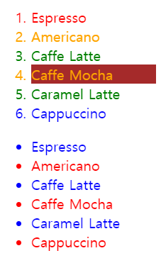
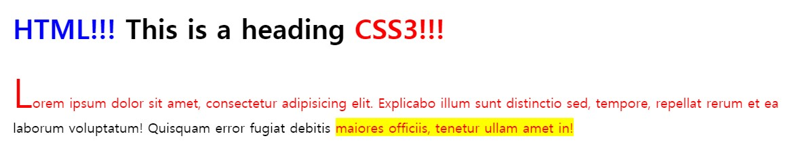

# CSS 기본에 대한 정리(리셋CSS + 셀렉터)

> https://poiemaweb.com/css3-syntax
>
> 이웅모 님의 블로그를 학습하며 새로 배워나가는 것들을 정리합니다. (좋은 책부터 블로그까지 정말 최고라고 생각합니다.)
>
> 항상 CSS를 사용하기는 하지만 내가 CSS를 제대로 사용하고 있는게 맞나?? 라는 의문이 들었던 적이 너무 많습니다.
>
> 때문에 이번 학습을 통해 어느 정도의 CSS 기초는 확실히 짚고 넘어가는 계기가 되었으면 좋겠습니다.

---

### HTML과 CSS를 연동하는 3가지 방법

1. Link Style

```html
<!DOCTYPE html>
<html>
  <head>
    <link rel="stylesheet" href="css/style.css">
  </head>
  <body>
    <h1>Hello World</h1>
  </body>
</html>
```

2. Embedding Style

```html
<!DOCTYPE html>
<html>
  <head>
    <style>
      h1 { color: red; }
      p  { background: aqua; }
    </style>
  </head>
  <body>
    <h1>Hello World</h1>
  </body>
</html>
```

3. inline Style

```html
<!DOCTYPE html>
<html>
  <body>
    <h1 style="color: red">Hello World</h1>
    <p style="background: aqua">This is a web page.</p>
  </body>
</html>
```

기본적으로 Link Style을 사용해야 한다. HTML과 CSS는 관심사가 다르다보니 이들을 서로 다른 파일로 구분하는 것이 좋다.

하지만, critical css의 개념에서는 인라인 스타일링 또한 함께 사용하게 된다.

---

### Reset CSS 사용하기

모든 웹 브라우저는 디폴트 스타일을 가지고 있다. 때문에 CSS가 없어도 작동한다.

하지만, 이 디폴트 스타일 때문에 내가 직접 지정한 스타일이 아닌 조금 변형된 스타일이 적용되는 경우가 존재한다. 

때문에 Reset CSS를 활용하여 브라우저 별로 제각각인 디폴트 스타일을 하나의 스타일로 통일시켜줄 필요가 있다.

자주 사용되는 Reset CSS는 

- [normalize CSS](https://necolas.github.io/normalize.css/8.0.1/normalize.css)
- [Eric Meyer’s reset](http://meyerweb.com/eric/tools/css/reset/)

이 두가지라고 한다. 다음은 Eric Meyer의 리셋 CSS이다.

```css
/* http://meyerweb.com/eric/tools/css/reset/
  v2.0 | 20110126
  License: none (public domain)
*/

html, body, div, span, applet, object, iframe,
h1, h2, h3, h4, h5, h6, p, blockquote, pre,
a, abbr, acronym, address, big, cite, code,
del, dfn, em, img, ins, kbd, q, s, samp,
small, strike, strong, sub, sup, tt, var,
b, u, i, center,
dl, dt, dd, ol, ul, li,
fieldset, form, label, legend,
table, caption, tbody, tfoot, thead, tr, th, td,
article, aside, canvas, details, embed,
figure, figcaption, footer, header, hgroup,
menu, nav, output, ruby, section, summary,
time, mark, audio, video {
  margin: 0;
  padding: 0;
  border: 0;
  font-size: 100%;
  font: inherit;
  vertical-align: baseline;
}
/* HTML5 display-role reset for older browsers */
article, aside, details, figcaption, figure,
footer, header, hgroup, menu, nav, section {
  display: block;
}
body {
  line-height: 1;
}
ol, ul {
  list-style: none;
}
blockquote, q {
  quotes: none;
}
blockquote:before, blockquote:after,
q:before, q:after {
  content: '';
  content: none;
}
table {
  border-collapse: collapse;
  border-spacing: 0;
}
```

---

## 셀렉터

---

### 복수 개의 셀렉터를 연속하여 지정할 수 있으며 쉼표로 구분한다.

```css
h1, p { color: red; }
```

---

### 전체 셀렉터

> HTML 문서 내의 모든 요소 선택 (head 또한 포함)

```css
* { color: red; }
```

---

### 클래스 셀렉터 재사용

```html
<!DOCTYPE html>
<html>
<head>
  <style>
    /* class 어트리뷰트 값이 text-center인 모든 요소를 선택 */
    .text-center { text-align: center; }
    /* class 어트리뷰트 값이 text-large인 모든 요소를 선택 */
    .text-large  { font-size: 200%; }
    /* class 어트리뷰트 값이 text-red인 모든 요소를 선택 */
    .text-red    { color: red; }
    /* class 어트리뷰트 값이 text-blue인 모든 요소를 선택 */
    .text-blue   { color: blue; }
  </style>
</head>
<body>
  <p class="text-center">Center</p>
  <p class="text-large text-red">Large Red</p>
  <p class="text-center text-large text-blue">Center Large Blue</p>
</body>
</html>
```

공통의 스타일 파일에 미리 클래스 선택자들을 선언해두면 **재사용 측면**에서 유리하게 CSS를 사용할 수 있다.

---

### 어트리뷰트 셀렉터

| 패턴               | 설명                                      |
| ------------------ | ----------------------------------------- |
| 셀렉터[어트리뷰트] | 지정된 어트리뷰트를 갖는 모든 요소를 선택 |

```html
<!DOCTYPE html>
<html>
<head>
  <style>
    /* a 요소 중에 href 어트리뷰트를 갖는 모든 요소 */
    a[href] { color: red; }
  </style>
</head>
<body>
  <a href="http://www.poiemaweb.com">poiemaweb.com</a><br>
  <a href="http://www.google.com" target="_blank">google.com</a><br>
  <a href="http://www.naver.com" target="_top">naver.com</a>
</body>
</html>
```

| 패턴                                                         | 설명                                                         |
| ------------------------------------------------------------ | ------------------------------------------------------------ |
| 셀렉터[어트리뷰트                                        ="값"] | 지정된 어트리뷰트를 가지며 지정된 값과 어트리뷰트의 값이 일치하는 모든 요소를 선택한다. |

```html
<!DOCTYPE html>
<html>
<head>
  <style>
    /* a 요소 중에 target 어트리뷰트의 값이 "_blank"인 모든 요소 */
    a[target="_blank"] { color: red; }
  </style>
</head>
<body>
  <a href="http://www.poiemaweb.com">poiemaweb.com</a><br>
  <a href="http://www.google.com" target="_blank">google.com</a><br> //이것만 빨간색
  <a href="http://www.naver.com" target="_top">naver.com</a>
</body>
</html>
```

추가적으로 많은 어트리뷰트 셀렉터들이 있는데 사실상 위의 두 개 말고는 크게 쓸 일이 있을까 싶다. 대부분 정규표현식과 맥락이 일치하므로 그와 관련해서 생각하면 쉽게 사용할 수 있겠다.

https://poiemaweb.com/css3-selector

---

### 후손 셀렉터


자신의 1 level 상위에 속하는 요소를 부모 요소, 1 level 하위에 속하는 요소를 **자손 요소(자식 요소)**라한다.

자신보다 n level 하위에 속하는 요소는 **후손 요소(하위 요소)**라 한다.

후손 셀렉터는 셀렉터A의 모든 후손(하위) 요소 중 셀렉터B와 일치하는 요소를 선택한다.

```html
<!DOCTYPE html>
<html>
<head>
  <style>
    /* div 요소의 후손요소 중 p 요소 */
    div p { color: red; }
  </style>
</head>
<body>
  <h1>Heading</h1>
  <div>
    <p>paragraph 1</p>
    <p>paragraph 2</p>
    <span><p>paragraph 3</p></span>
  </div>
  <p>paragraph 4</p>
</body>
</html>
```

paragraph1, paragraph2, paragraph3가 빨간색이된다.

---

### 자식 셀렉터

```css
<!DOCTYPE html>
<html>
<head>
  <style>
    /* div 요소의 자식요소 중 p 요소 */
    div > p { color: red; }
  </style>
</head>
<body>
  <h1>Heading</h1>
  <div>
    <p>paragraph 1</p>
    <p>paragraph 2</p>
    <span><p>paragraph 3</p></span>
  </div>
  <p>paragraph 4</p>
</body>
</html>
```

paragraph1, paragraph2 만이 빨간색이 된다.

---

### 인접 형제 셀렉터

셀렉터A의 형제 요소 중 셀렉터A 바로 뒤에 위치하는 셀렉터B 요소를 선택한다. A와 B 사이에 다른 요소가 존재하면 선택되지 않는다.

```html
<!DOCTYPE html>
<html>
<head>
  <style>
    /* p 요소의 형제 요소 중에 p 요소 바로 뒤에 위치하는 ul 요소를 선택한다. */
    p + ul { color: red; }
  </style>
</head>
<body>
  <div>A div element.</div>
  <ul>
    <li>Coffee</li>
    <li>Tea</li>
    <li>Milk</li>
  </ul>
  
  <p>The first paragraph.</p>
  <!-- 아래 문단만 빨간색이 된다. -->
  <ul>
    <li>Coffee</li>
    <li>Tea</li>
    <li>Milk</li>
  </ul>
  <!-- *********************** -->

  <h2>Another list</h2>
  <ul>
    <li>Coffee</li>
    <li>Tea</li>
    <li>Milk</li>
  </ul>
</body>
</html>
```

---

### 일반 형제 셀렉터

셀렉터A의 형제 요소 중 셀렉터A 뒤에 위치하는 셀렉터B 요소를 모두 선택한다.

```html
<!DOCTYPE html>
<html>
<head>
  <style>
    /* p 요소의 형제 요소 중에 p 요소 뒤에 위치하는 ul 요소를 모두 선택한다.*/
    p ~ ul { color: red; }
  </style>
</head>
<body>
  <div>A div element.</div>
  <ul>
    <li>Coffee</li>
    <li>Tea</li>
    <li>Milk</li>
  </ul>

  <p>The first paragraph.</p>
  <!-- 빨간색 -->
  <ul>
    <li>Coffee</li>
    <li>Tea</li>
    <li>Milk</li>
  </ul>
  <!-- ****** -->
    
  <h2>Another list</h2>
  <!-- 빨간색 -->
  <ul>
    <li>Coffee</li>
    <li>Tea</li>
    <li>Milk</li>
  </ul>
  <!-- ****** -->
</body>
</html>
```

---

### 가상 클래스 셀렉터

가상 클래스는 요소의 특정 상태에 따라 스타일을 정의할 때 사용된다. 특정 상태란 예를 들어 다음과 같다.

- 마우스가 올라와 있을때
- 링크를 방문했을 때와 아직 방문하지 않았을 때
- 포커스가 들어와 있을 때

이러한 특정 상태에는 원래 클래스가 존재하지 않지만 가상 클래스를 임의로 지정하여 선택하는 방법이다.

가상 클래스는 마침표 대신 콜론(:)을 사용한다. CSS 표준에 의해 미리 정의된 이름이 있기 때문에 임의의 이름을 사용할 수는 없다.

| 가상 클래스 | 설명                             |
| ----------- | -------------------------------- |
| :link       | 셀렉터가 방문하지 않은 링크      |
| :visited    | 셀렉터가 방문한 링크             |
| :hover      | 셀렉터에 마우스가 올라와 있을 때 |
| :active     | 셀렉터가 클릭된 상태일 때        |
| :focus      | 셀렉터에 포커스가 들어와 있을 때 |

:active 정도가 헷갈릴 수 있는데 마우스 클릭을 꾹 누르고 있을 때 나타나지는 CSS 값이 active 라고 할 수 있다.

| 가상 클래스 | 설명                             |
| ----------- | -------------------------------- |
| :checked    | 셀렉터가 체크 상태일 때          |
| :enabled    | 셀렉터가 사용 가능한 상태일 때   |
| :disabled   | 셀렉터가 사용 불가능한 상태일 때 |

input[type="radio"] 혹은 input[type="checkbox"] 와 같은 것들에서 사용할 수 있겠다.

---

### 구조 가상 클래스 셀렉터

| 가상 클래스  | 설명                                                         |
| ------------ | ------------------------------------------------------------ |
| :first-child | 셀렉터에 해당하는 모든 요소 중 첫번째 자식인 요소를 선택한다. |
| :last-child  | 셀렉터에 해당하는 모든 요소 중 마지막 자식인 요소를 선택한다. |

```html
<!DOCTYPE html>
<html>
<head>
  <style>
    /* p 요소 중에서 첫번째 자식을 선택 */
    p:first-child { color: red; }

    /* p 요소 중에서 마지막 자식을 선택 */
    /* body 요소의 두번째 p 요소는 마지막 자식 요소가 아니다.
       body 요소의 마지막 자식 요소는 div 요소이다. */
    p:last-child { color: blue; }
  </style>
</head>
<body>
  <!-- body 태그의 첫번째 자식 p 요소 이기 때문에 빨간색이 된다. -->
  <p>This paragraph is the first child of its parent (body).</p>

  <!-- 변화없음 -->
  <h1>Welcome to My Homepage</h1>
  <p>This paragraph is not the first child of its parent.</p>
  
  <!-- div 태그의 첫번째 자식 p 요소 이기 때문에 빨간색이 된다. -->
  <!-- div 태그의 마지막 자식 p 요소 이기 때문에 파란색이 된다. -->
  <div>
    <p>This paragraph is the first child of its parent (div).</p>
    <p>This paragraph is not the first child of its parent.</p>
  </div>
</body>
</html>
```

---

| 가상 클래스        | 설명                                                         |
| ------------------ | ------------------------------------------------------------ |
| :nth-child(n)      | 셀렉터에 해당하는 모든 요소 중 앞에서 n번째 자식인 요소를 선택 |
| :nth-last-child(n) | 셀렉터에 해당하는 모든 요소 중 뒤에서 n번째 자식인 요소를 선택 |

```html
<!DOCTYPE html>
<html>
<head>
  <style>
    /* ol 요소의 자식 요소인 li 요소 중에서 짝수번째 요소만을 선택 */
    ol > li:nth-child(2n)   { color: orange; }
    /* ol 요소의 자식 요소인 li 요소 중에서 홀수번째 요소만을 선택 */
    ol > li:nth-child(2n+1) { color: green; }

    /* ol 요소의 자식 요소인 li 요소 중에서 첫번쨰 요소만을 선택 */
    ol > li:first-child     { color: red; }
    /* ol 요소의 자식 요소인 li 요소 중에서 마지막 요소만을 선택 */
    ol > li:last-child      { color: blue; }

    /* ol 요소의 자식 요소인 li 요소 중에서 4번째 요소 요소만을 선택 */
    ol > li:nth-child(4)    { background: brown; }

    /* ul 요소의 모든 자식 요소 중에서 뒤에서부터 시작하여 홀수번째 요소만을 선택 */
    ul > :nth-last-child(2n+1) { color: red; }
    /* ul 요소의 모든 자식 요소 중에서 뒤에서부터 시작하여 짝수번째 요소만을 선택 */
    ul > :nth-last-child(2n)   { color: blue; }
  </style>
</head>
<body>
  <ol>
    <li>Espresso</li>
    <li>Americano</li>
    <li>Caffe Latte</li>
    <li>Caffe Mocha</li>
    <li>Caramel Latte</li>
    <li>Cappuccino</li>
  </ol>

  <ul>
    <li>Espresso</li>
    <li>Americano</li>
    <li>Caffe Latte</li>
    <li>Caffe Mocha</li>
    <li>Caramel Latte</li>
    <li>Cappuccino</li>
  </ul>
</body>
</html>
```

기본적으로 0과 음수는 생략되기 때문에 다음과 같은 결과가 만들어진다.



---

| 가상 클래스          | 설명                                                         |
| -------------------- | ------------------------------------------------------------ |
| :first-of-type       | 셀렉터에 해당하는 요소의 부모 요소의 자식 요소 중 첫번째 등장하는 요소를 선택 |
| :last-of-type        | 셀렉터에 해당하는 요소의 부모 요소의 자식 요소 중 마지막에 등장하는 요소를 선택 |
| :nth-of-type(n)      | 셀렉터에 해당하는 요소의 부모 요소의 자식 요소 중 앞에서 n번째에 등장하는 요소를 선택 |
| :nth-last-of-type(n) | 셀렉터에 해당하는 요소의 부모 요소의 자식 요소 중 뒤에서 n번째에 등장하는 요소를 선택 |

---

### 부정 셀렉터

| 가상 클래스  | 설명                                    |
| ------------ | --------------------------------------- |
| :not(셀렉터) | 셀렉터에 해당하지 않는 모든 요소를 선택 |

```html
<!DOCTYPE html>
<html>
<head>
  <style>
    /* input 요소 중에서 type 어트리뷰트의 값이 password가 아닌 요소를 선택 */
    input:not([type=password]) {
      background: yellow;
    }
  </style>
</head>
<body>
  <input type="text" value="Text input">
  <input type="email" value="email input">
  <input type="password" value="Password input">
</body>
</html>
```

`input[type="text"]`와 `input[type="email"]`만 배경색이 노란색이 된다.

---

### 정합성 체크 셀렉터

> 이거는 알아두면 쓸 일이 꽤 많을 듯

| 가상 클래스 | 설명                                                  |
| ----------- | ----------------------------------------------------- |
| :valid      | 정합성이 검증이 성공한 input 요소 또는 form 요소 선택 |
| :invalid    | 정합성이 검증이 실패한 input 요소 또는 form 요소 선택 |

```html
<!DOCTYPE html>
<html>
<head>
  <style>
    input[type="text"]:valid {
      background-color: greenyellow;
    }

    input[type="text"]:invalid {
      background-color: red;
    }
  </style>
</head>
<body>
  <label>입력값이 반드시 필요
    <input type="text" required>
  </label>
  <br>
  <label>특수문자를 포함하지 않는 4자리 문자 또는 숫자
    <input type="text" value="ab1!"
      pattern="[a-zA-Z0-9]{4}" required>
  </label>
  <br>
  <label>핸드폰 번호 형식
    <input type="text" value="010-1111-2222"
      pattern="^\d{3}-\d{3,4}-\d{4}$" required>
  </label>
</body>
</html>
```

pattern과 required의 조건에 맞으면 greenyellow, 틀리면 red가 될 것이다.

이런 식으로 pattern이라는 속성을 통해 valid한지 알 수 있다는 것을 기억해둘 필요가 있겠다.

---

### 가상 요소 셀렉터

가상 요소는 요소의 특정 부분에 스타일을 적용시키기 위해서 사용. 특정 부분이란 다음과 같다.

- 요소 컨텐츠의 첫글자 또는 첫줄
- 요소 컨텐츠의 앞 또는 뒤

가상 요소에는 두 개의 콜론을 사용한다.

| 가상 클래스    | 설명                                                         |
| -------------- | ------------------------------------------------------------ |
| ::first-letter | 컨텐츠의 첫글자를 선택                                       |
| ::first-line   | 컨텐츠의 첫줄을 선택(블록 요소에만 적용 가능)                |
| ::after        | 컨텐츠의 뒤에 위치하는 공간을 선택한다. 일반적으로 content 프로퍼티와 함께 사용 |
| ::before       | 컨텐츠의 앞에 위치하는 공간을 선택한다. 일반적으로 content 프로퍼티와 함께 사용 |
| ::selection    | 드래그한 컨텐츠를 선택                                       |

```html
<!DOCTYPE html>
<html>
<head>
  <style>
    /* p 요소 콘텐츠의 첫글자를 선택 */
    p::first-letter { font-size: 3em; }
    /* p 요소 콘텐츠의 첫줄을 선택 */
    p::first-line   { color: red; }

    /* h1 요소 콘텐츠의 앞 공간에 content 어트리뷰트 값을 삽입한다 */
    h1::before {
      content: " HTML!!! ";
      color: blue;
    }
    /* h1 요소 콘텐츠의 뒷 공간에 content 어트리뷰트 값을 삽입한다 */
    h1::after {
      content: " CSS3!!!";
      color: red;
    }

    /* 드래그한 콘텐츠를 선택한다 */
    ::selection {
      color: red;
      background: yellow;
    }
  </style>
</head>
<body>
  <h1>This is a heading</h1>
  <p>Lorem ipsum dolor sit amet, consectetur adipisicing elit. Explicabo illum sunt distinctio sed, tempore, repellat rerum et ea laborum voluptatum! Quisquam error fugiat debitis maiores officiis, tenetur ullam amet in!</p>
</body>
</html>
```


