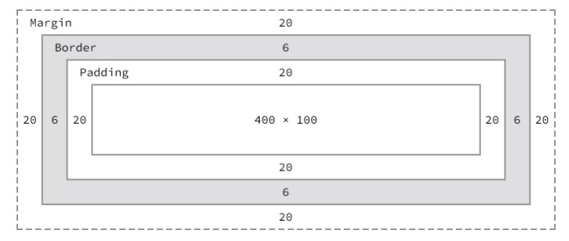
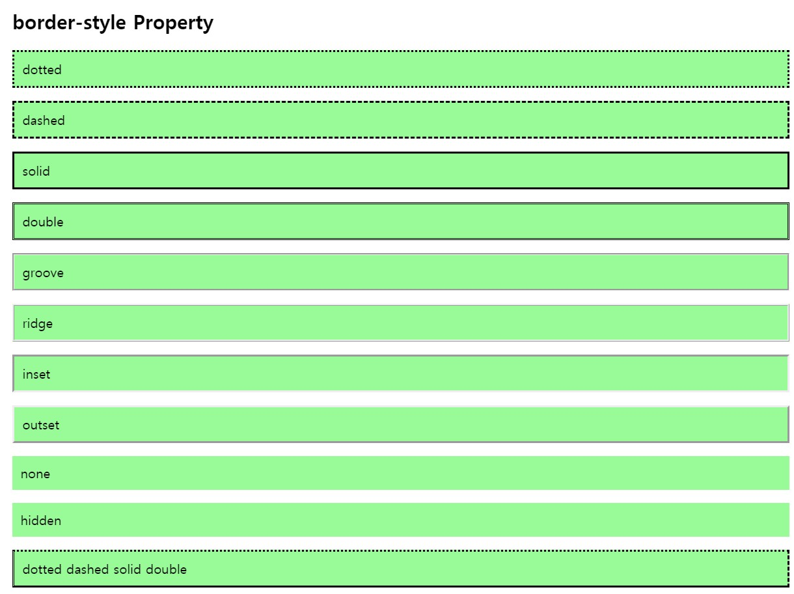

# CSS 기본에 대한 정리(박스 모델)

---

### width / height 프로퍼티

width와 height 프로퍼티는 요소의 너비와 높이를 지정하기 위해 사용한다.

만일 width와 height로 지정한 컨텐츠 영역보다 실제 컨텡츠가 크면 컨텐츠 영역을 넘치게 된다는 것에 유의해야 한다.

기본적으로 width와 height 프로퍼티는 컨텐츠 영역을 대상으로 요소의 너비와 높이를 지정하므로 박스 전체 크기는 다음과 같이 계산할 수 있다.

전체 너비

> width + left padding + right padding + left border + right border + left margin + right margin

전체 높이

> height + top padding + bottom padding + top border + bottom border + top margin + bottom margin



width와 height 프로퍼티의 초기값은 `auto`

---

### margin

4개의 값을 지정할 때

margin: 25px 50px 75px 100px;

- margin-top: 25px;
- margin-right: 50px;
- margin-bottom: 75px;
- margin-left: 100px;

3개의 값을 지정할 때

margin: 25px 50px 75px;

- margin-top: 25px;
- margin-right: 50px; margin-left: 50px;
- margin-bottom: 75px

2개의 값을 지정할 때

margin: 25px 50px;

- margin-top: 25px; margin-bottom: 25px;
- margin-right: 50px; margin-left: 50px;

1개의 값을 지정할 때

margin: 25px;

- margin-top: 25px; margin-right: 25px; margin-bottom: 25px; margin-left: 25px;

---

### max-width / min-width

요소의 너비가 브라우저 너비보다 크면 가로 스크롤바가 만들어진다. 이 문제를 해결하기 위해서 `max-width` 프로퍼티를 사용할 수 있다.

`max-width` 프로퍼티는 요소 너비의 최대값을, `min-width` 프로퍼티는 요소 너비의 최솟값을 지정한다. 예를 들어 `max-width: 300px;`의 경우, 브라우저의 너비가 300px 보다 작아지면 요소 너비는 브라우저의 너비에 따라서 작아진다.

`min-width: 300px;`의 경우 브라우저의 너비가 300px보다 작아져도 요소 너비는 지정 너비(300px)를 유지한다.

---

## border 프로퍼티

---

### border-style

```html
p.dotted {
	border-style: dotted;
}

<p class="dotted">dotted</p>
```




프로퍼티 값의 개수에 따라 4개 방향에 대하여 각각 스타일을 지정할 수도 있다.

---

### border-width

`border-width`로 프로퍼티의 테두리 두께를 지정할 수 있다. 값의 개수에 따라 4개 방향에 대한 각각의 지정이 가능하다.

`border-width` 프로퍼티는 `border-style`과 함께 사용하지 않으면 적용되지 않는다.

---

### border

`border`프로퍼티는 `border-width`, `border-style`, `border-color`를 한번에 설정하기 위한 shorthand 프로퍼티이다.

```css
p {
	border: 5px solid red;
}
```

---

### box-sizing

> 최근에 이거 때문에 애를 먹은 적이 있었다.
>
> 이번 기회에 차이를 확실히 이해하고 기억해둘 필요가 있겠다.

| 키워드      | 설명                                                         |
| ----------- | ------------------------------------------------------------ |
| content-box | width, height 프로퍼티 값은 content 영역을 의미(기본값)      |
| border-box  | width, height 프로퍼티 값은 content 영역, padding, border가 포함된 값을 의미 |

보통 박스를 생각하면 마진을 제외한 border-box의 모양을 생각하게 된다. 하지만, default 값이 content-box이기에 가끔 예기치 못한 에러(오른쪽에 공간이 남는)를 겪는 경우가 발생하곤 한다.

때문에 이 차이를 인지하고 `border-box`에서 너비나 높이가 내 예상과 다르게 동작한다면 해당 부분을 의심해볼 필요가 있다.

`box-sizing` 프로퍼티는 상속되지 않는다. 따라서 box-sizing 프로퍼티를 사용하도록 초기화하려면 아래와 같이 정의한다.

```html
html {
  box-sizing: border-box;
}
*, *:before, *:after {
  box-sizing: inherit;
}
```

이전 셀렉터 정리에서 `::before`, `::after` 였는데 왜 이번에는 콜론이 한 개인가 찾아봤더니 콜론을 하나만 쓰는 것은 CSS2 문법이라고 한다. 브라우저에서는 CSS2 구문인 `:before` 또한 허용한다.

아마도 구문법을 사용하는 것은 구브라우저에 대한 지원을 위해서가 아닐까 싶다.

