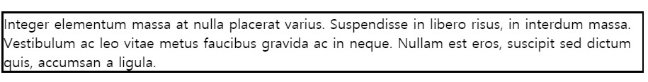
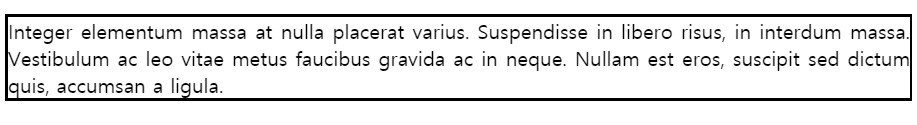

# CSS 기본에 대한 정리(폰트와 텍스트)

---

- font-familly

폰트는 여러 개를 동시에 지정이 가능하다. 첫번째 지정한 폰트가 클라이언트 컴퓨터에 설치되어 있지 않은 경우, 다음에 지정된 폰트를 적용한다. 따라서 마지막에 지정하는 폰트는 대부분의 OS에 기본적으로 설치되어 있는 generic-family 폰트(Serif, Sans-serif, Mono space)를 지정하는 것이 일반적이다.

---

- line-height

텍스트의 높이를 지정한다. 대부분 브라우저의 default line height는 약 110% ~ 120% 이다.

---

### 텍스트를 수직 정렬 시키고 싶다면 어떻게 해야 할까?

이 경우 부모 요소의 `height` 값과 수직 정렬이 되어야 하는 자식 요소의 `line-height` 값을 일치시키면 중앙정렬 시킬 수 있다.

---

- letter-spacing

글자 사이의 간격을 지정한다.

---

- text-align 프로퍼티

텍스트의 수평 정렬을 정의한다.

| 이름        | 설명                                                         |
| ----------- | ------------------------------------------------------------ |
| start       | 쓰기 방식이 좌횡서면 left와 같고, 우횡서면 right와 같다      |
| end         | 쓰기 방식이 좌횡서면 right와 같고, 우횡서면 left와 같다      |
| left        | 인라인 컨텐츠를 줄 상자의 왼쪽 모서리로 정렬한다             |
| right       | 인라인 컨텐츠를 줄 상자의 오른쪽 모서리로 정렬한다           |
| center      | 인라인 컨텐츠를 줄 상자의 가운데로 정렬                      |
| justify     | 인라인 컨텐츠를 양쪽 정렬. 마지막 줄은 제외하고, 줄 상자의 왼쪽과 오른쪽 끝에 텍스트를 맞추기 위해 사이 공간을 띈다. |
| justify-all | justify와 같지만 마지막 줄에도 적용                          |

left 속성인 경우

justify 속성인 경우

보통 `text-align`을 사용한다면 `left` 혹은 `justify`를 쓰게 될 것이다. 사실상 이 둘이 굉장히 비슷한데 차이를 확인하기 위해서는 두 사진의 오른쪽 끝을 확인하면 된다. `left`의 경우에는 오른쪽 공간이 미세하게 더 넓다. `justify`의 경우에는 왼쪽과 오른쪽 공간이 동일하다. 둘 다 적용해보고 더 어울리는 것을 선택하면 좋지 않을까 싶다.

> 만약 a 요소가 있었다면 중앙 정렬은 적용되지 않는다. 이는 a 요소가 inline 요소이기 때문이다. inline 요소는 width 프로퍼티가 없으므로 중앙 개념이 존재하지 않는다. a 요소에 `display: block;`을 지정한다면 중앙 정렬이 가능할 것이다.
>
> inline 요소의 경우에는 `margin` 프로퍼티가 존재하지 않는다. 때문에 inline 요소를 중앙 정렬 해야 하는 경우에는 보통 `text-align: center`를 사용한다.
>
> 반면 block 요소의 경우에는 margin 프로퍼티가 존재하기 때문에, `margin: 0 auto`를 주면 중앙 정렬이 된다.

---

- text-decoration 프로퍼티

| 이름         | 설명                    |
| ------------ | ----------------------- |
| none         | 링크 태크에서 밑줄 제거 |
| overline     | 위에 줄 생성            |
| line-through | 관통하는 줄 생성        |
| underline    | 아래에 줄 생성          |

---

- ### 🔴white-space 프로퍼티

white space는 공백(space), 들여쓰기(tab), 줄바꿈(line break)을 의미한다. 

HTML은 기본적으로 연속적인 공백, 들여쓰기는 1번만 실행되며, 줄바꿈은 무시된다.

또한, 텍스트는 부모의 가로 영역을 벗어나지 않고 자동 줄바꿈(wrap)된다.

`white-space` 프로퍼티는 이러한 기본 동작을 제어하기 위한 프로퍼티이다.

| 프로퍼티값 | line break | space / tab | wrapping(자동줄바꿈) |
| ---------- | ---------- | ----------- | -------------------- |
| normal     | 무시       | 1번만 반영  | O                    |
| nowrap     | 무시       | 1번만 반영  | X                    |
| pre        | 반영       | 그대로 반영 | X                    |
| pre-wrap   | 반영       | 그대로 반영 | O                    |
| pre-line   | 반영       | 1번만 반영  | O                    |

보통 `normal`을 가장 많이 사용하게 되지 않을까 싶다.

---

- overflow 프로퍼티

`overflow`는 요소의 컨텐츠가 너무 커서 요소의 블록 서식 맥락에 맞출 수 없을 때의 처리법을 지정한다.

`overflow` 속성은 아래의 키워드 값을 하나 또는 두 개 사용해 지정한다. 두 개를 사용한 경우 첫번째 값은 `overflow-x`, 두번째 값은 `overflow-y`를 지정한다. 하나만 사용하면 지정한 값을 양 축 모두에 적용한다.		

| 값      | 설명                                                         |
| ------- | ------------------------------------------------------------ |
| visible | 컨텐츠를 자르지 않으며, 경계 밖으로 컨텐츠가 넘칠 수 있습니다. |
| hidden  | 컨텐츠를 경계 안에 맞추기 위해 잘라냅니다.                   |
| scroll  | 컨텐츠를 경계 안에 맞추기 위해 잘라냅니다. 브라우저는 컨텐츠를 실제로 잘라냈는지 여부를 따지지 않고 항상 스크롤바를 노출시킵니다. |
| auto    | 컨텐츠가 잘리지 않으면 스크롤바가 생기지 않고, 컨텐츠가 잘리게 되면 스크롤바가 생깁니다. |

---

- text-overflow 프로퍼티

부모 영역을 벗어난 wrapping(자동줄바꿈)이 되지 않은 텍스트의 처리 방법을 정의한다. 해당 프로퍼티를 사용하기 위해서는 아래의 조건이 필요하다.

1. width 프로퍼티가 지정되어 있어야 한다. 이를 위해 필요할 경우 block 레벨 요소로 변경하여야 한다.
2. 자동 줄바꿈을 방지하려면 white-space 프로퍼티를 nowrap으로 설정한다.
3. overflow 프로퍼티에 반드시 `visible` 이외의 값이 지정되어 있어야 한다.

| 값       | 설명                                                         |
| -------- | ------------------------------------------------------------ |
| clip     | 영역을 벗어난 텍스트를 표시하지 않는다.(기본값)              |
| ellipsis | 영역을 벗어난 텍스트를 잘라내어 보이지 않게 하고 말줄임표(...)를 표시한다. |

