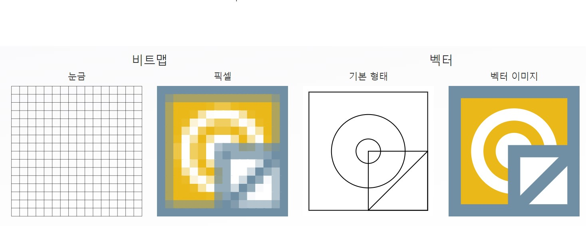
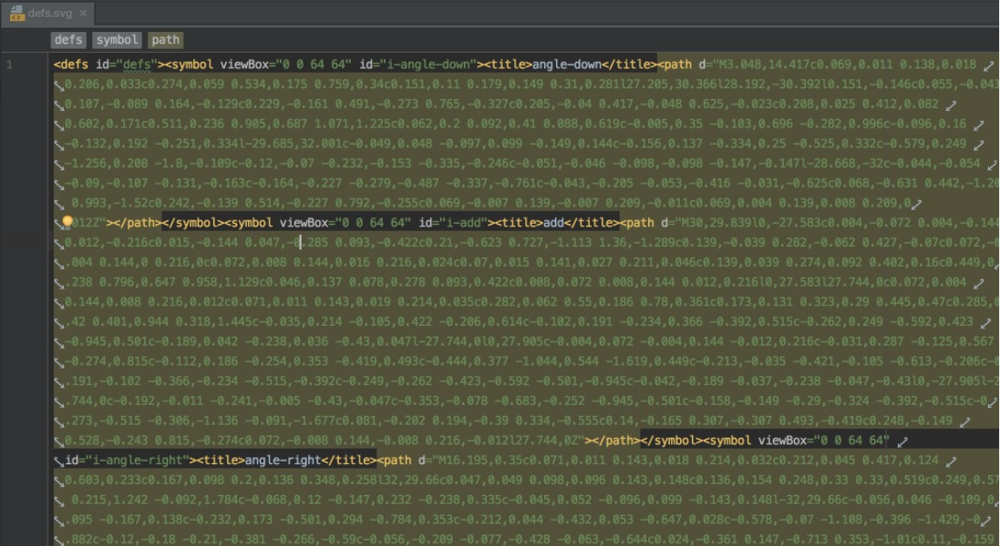
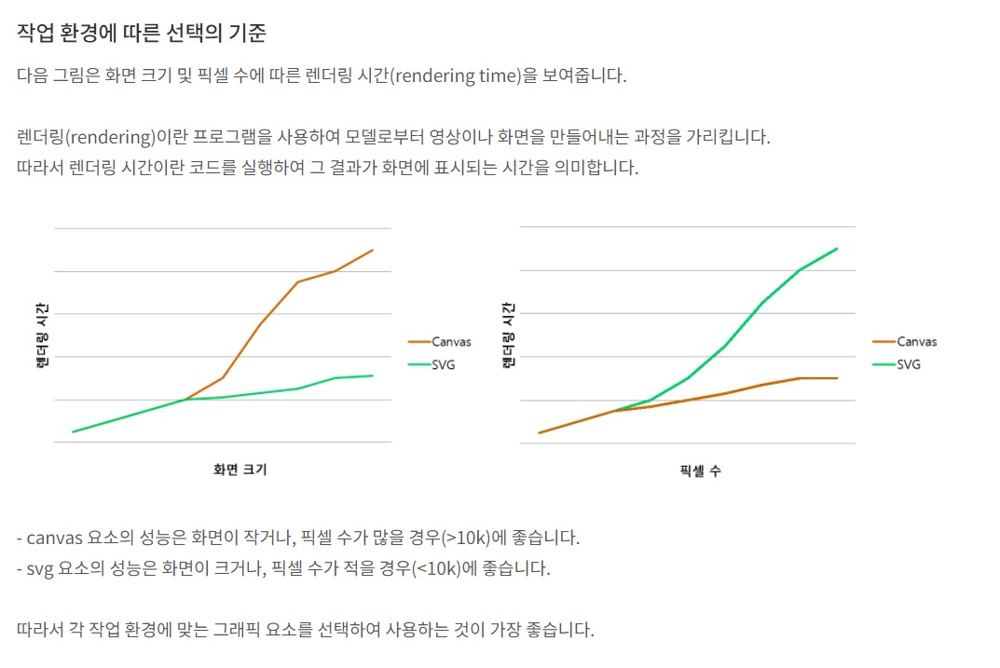

# 🎐SVG vs Canvas

> TCP school에 따르면, canvas 요소와 svg 요소는 거의 같은 결과물을 얻을 수 있는 비슷한 동작을 하는 요소이다. 어떤 경우에는 canvas 요소를 사용하는 것이 더 나으며, 어떤 경우에는 svg 요소를 사용하는 것이 더 나은 경우가 있다.
>
> 솔직히 이런 이미지를 써야 할 정도로 웹사이트의 성능을 고려하는 프로젝트를 해본적은 없다. 하지만, 나중에 분명히 이런 이미지 파일 형식을 쓰는 날이 올 것이기 때문에 뭐 간단하게만이라도 정리하고 넘어가자.

---

이미지는 기본적으로 비트맵 이미지와 벡터 이미지로 구분된다.

비트맵 이미지

> 비트맵은 화면 상의 각 점들을 직교좌표계로 사용하여 픽셀 단위로 나타낸다. (픽셀이란 이미지를 구성하는 최소단위의 점)
>
> 비트맵은 가로 곱하기 세로 만큼의 픽셀 정보를 저장하기 때문에, 사이즈가 커질 수록 용량이 커진다. 벡터 방식에 비해 상대적으로 용량이 크고, 처리 속도가 느리다.
>
> 하나의 픽셀은 또 서브픽셀로 이루어져 있다. 각 정의된 픽셀들이 모여 지도(Map)를 만들게 되고, 하나의 이미지 파일을 구성한다.
>
> 픽셀을 사용하는 방식이기 때문에 이미지의 크기를 확대해 나타내면 이미지 테두리 부분이 울퉁불퉁해지게 된다.
>
> 일반적으로 많이 써온 jpg, png, gif 확장자들이 비트맵 이미지에 해당한다.

벡터 이미지

> 벡터 방식은 비트맵과 상반되는 방식으로 표현된다. 그래픽의 형태들이 수학적인 공식으로 이루어져 있다.
>
> 점과 점을 연결해 선을 만들 수 있고, 선이 모여 면을 만들 수 있다. 이렇게 만들어진 선은 두께, 색상, 곡률 값을 갖게 되고, 면은 색상 값을 가지게 된다.
>
> 이렇게 수학적인 함수 관계로 이미지를 표현해 점, 선, 면이 모여 벡터 그래픽을 만들게 된다.
>
> 벡터의 점은 좌표계(x, y)로 구성되기 때문에, 비트맵과 달리 이미지를 줄이거나 깨지는 현상이 일어나지 않는다. **또한 사이즈를 키워도 용량은 변하지 않는다.** 픽셀로 구성되는 비트맵보다 용향이 현저히 적기 때문에 파일을 관리하기에도 편리하다.
>
> 원하는 해상도의 비트맵 이미지로의 변환도 가능하다.
>
> svg가 벡터 이미지에 해당한다.



위에서도 확인했듯이 SVG는 이미지의 확장자이고, 반면 Canvas는 HTML의 엘리먼트이다. 이 둘은 사실상 결이 다르긴 하지만 이미지를 표현하는데 둘다 많이 쓰인다. 때문에 둘의 차이를 이해하고 필요한 확장자, 요소를 선택할 필요가 있다.

---

### SVG

여기는 책의 내용을 정리해야겠다.

이미지 생성 후 텍스트 편집기로 편집할 수 있다.

크기를 조절해도 이미지가 깨끗이 유지된다.

해상도에 구애받지 않는다. (픽셀 기반이 아니기 때문에)

SVG 이미지는 기존의 img 태그를 이용해 파일 형태로 삽입할 수 있다.

```html

```

뿐만 아니라 SVG 파일은 텍스트 편집기를 통해 편집이 가능하다(XML을 기반으로한 언어이기 때문에).

실제로 svg 파일을 열어보면 다음과 같은 일련의 텍스트가 나오는 것을 확인할 수 있다.



---

### Canvas

https://developer.mozilla.org/ko/docs/Web/API/Canvas_API/Tutorial/Basic_usage

---

### SVG vs Canvas

SVG는 XML의 2D 그래픽을 기술하는 **언어**이다. Canvas는 자바스크립트로 2D 그래픽을 그려낸다.

SVG는 XML을 기반으로 하여, 모든 요소가 SVG DOM 내에서 사용할 수 있음을 의미한다. 또한 요소에 이벤트 핸들러를 첨부할 수 있다. 반면 Canvas에는 이벤트 핸들러를 달 수 없다.

Canvas는 픽셀로 렌더링된다. (픽셀을 사용하기 때문에 해상도에 의존하게 된다.)

그래픽 집약적인 게임 어플리케이션에서는 Canvas를 사용하는 것이 유리하다.

| Canvas                              | SVG                                          |
| ----------------------------------- | -------------------------------------------- |
| 픽셀(pixel) 기반                    | 모영 기반                                    |
| 단일 HTML 요소                      | DOM의 일부분이 되는 다중 그래픽 요소         |
| 스크립트를 통해서만 수정할 수 있다. | 스크립트 및 CSS를 통해서도 수정할 수 있다.   |
| 그래픽이 주작업인 게임에 적합하다.  | 렌더링 영역이 넓은 응용 프로그램에 적합하다. |



TCP School에 따르면 다음과 같다고 한다.

- canvas 요소는 복잡하고 고성능의 애니메이션 작업이나 동영상 조작 등의 작업에 잘 어울린다.
- svg 요소는 고품질의 문서 작업이나 정적 이미지의 조작 작업 등에 잘 어울린다.

---

## 참고문헌

https://m.blog.naver.com/data_flow/221825910467

https://ko.vectormagic.com/support/understanding_vector_images (이미지 출처)

https://m.blog.naver.com/PostView.naver?isHttpsRedirect=true&blogId=pjh445&logNo=220043315711

http://tcpschool.com/html/html5_graphic_canvasVsSvg