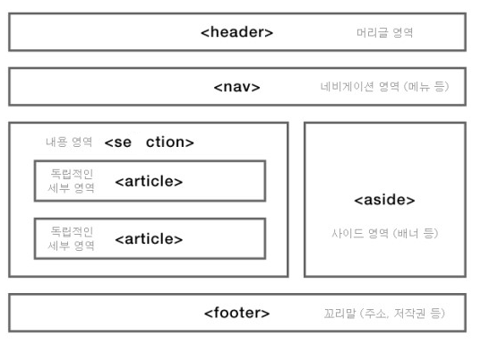

# 🧶새로알게된 태그들과 시멘틱 태그

> HTML5 + CSS3 웹 표준의 정석 (이지스퍼블리싱) 책을 참고하였습니다.

---

`<strong>` 태그, `<b>` 태그

> 텍스트 중에서 굵게 표시하려고 할 때 <strong> 태그나 <b> 태그를 사용한다. 눈으로 보기에는 차이가 느껴지지 않는 두 태그를 구분하는 이유는 화면 낭독기에서의 기능 차이 때문이다.
>
> 경고나 주의 사항처럼 중요한 내용이어서 강조해야 하는 경우에는 <strong> 태그를 사용하고 문서의 키워드처럼 단순히 굵게 표시할 때는 <b> 태그를 사용한다. <strong> 태그를 사용하면 그 부분이 강조되었다고 화면 낭독기가 알려준다.

---

`<blockquote>` 태그, `<q>` 태그        

> 인용한 내용을 표시하기 위한 태그들이다. 
>
> blockquote는 들여쓰기와 줄바꿈이 실행된다. (논문 맨 아래에 주석을 다는 것처럼)
>
> q는 들여쓰기와 줄바꿈이 실행되지 않는다. 단지, 큰 따옴표로 이 부분이 인용이라는 것을 보여준다.

---

`img`의 `alt` 속성

> alt 속성은 이미지를 설명하는 대체 텍스트를 삽입할 때 사용한다. 웹 문서를 읽어 주는 화면 낭독기도 문서 상의 텍스트만 읽어 주기 때문에 이미지를 만나면 그대로 건너 뛴다. 하지만 img의 alt 속성을 이용하면 이미지에 대한 설명을 넣을 수 있고 alt 속성의 텍스트로 화면 낭독기가 시각장애인에게 읽어 줄 수도 있다. 시각장애인이 아닌 경우에도 alt 속성은 유용하게 사용할 수 있는데, 바로 연결 속도가 느리거나 이미지를 제대로 표시할 수 없는 상황이 생기는 경우이다. 이미지를 제대로 표시할 수 없는 상황에서 이미지 자리에 alt 속성에 쓴 내용이 표시되어 어떤 이미지가 사용되었는지 짐작할 수 있게 한다.
>
> 하지만, 불릿 이미지나 작은 아이콘처럼 특별한 의미 없이 화면을 꾸미기 위해 사용한 이미지에는 대체 텍스트를 지정하지 않아도 된다.

---

### HTML5 시멘틱 태그

```html
// HTML4

<div id="header">
	// 헤더와 메뉴
</div>
<div id="content">
	// 본문 내용
</div>
<div id="footer">
	// 푸터
</div>
```

HTML4에서는 HTML 태그가 문서 내용들을 화면에 보여 주는 역할만 했기 때문에 화면을 구성하는 역할은 대부분 <div> 태그가 맡았고 수많은 <div> 태그들은 다시 id 속성으로 구분했다.

하지만, 이런 방법은 제작자 자신이 나중에 보더라도 이해하기 어려울 뿐만 아니라, 담당자가 바뀌면 문서 구조를 이해하는데 많은 시간이 걸리곤 했다.더구나 시각장애인용 화면 낭독기나 검색 엔진에서 웹 소스를 읽을 때도 어느 부분이 메뉴이고 본문인지 구별할 수 없었다.

이 때문에 더 이해하기 쉬운 문서구조를 만들기 위해 시맨틱 태그가 등장하였다.



(실제로는 아래 코드 처럼 nav가 header 안으로 들어가는 모양이 현대 웹 표준에 더 적절할 듯.)

```html
<body>
	<header>
		<h1>애완견 종류</h1>
		<nav>
			...
		</nav>
	</header>
	<section>
		<h2>활달한 강아지</h2>
		<article>
			<h3>요크셔테리아</h3>
			<p>생기있고 활달한 성질을 가지고 있다.</p>
		</article>
	</section>
	<footer>
		<p>published by dk.</p>
	</footer>
</body>
```

---

### header 태그

사이트 전체의 헤더는 주로 페이지 맨 위쪽이나 왼쪽에 삽입하며 헤더의 내용으로는 주로 <form> 태그를 사용해 검색 창을 넣거나 <nav> 태그를 사용해 사이트 메뉴를 넣는다.

header 태그는 본문 중에 사용해 해당 부분의 머리말로 사용할 수도 있다.

---

### nav 태그

nav 태그는 내비게이션 역할을 위해 활용한다. nav 태그는 내비게이션 메뉴뿐만 아니라 푸터에 있는 사이트 링크 모음 부분에도 많이 사용된다. 다시 말해 사용하는 위치의 영향을 받지 않아 header나 footer 태그 또는 aside 태그 안에 포함시킬 수도 있고, 독립해 사용할 수도 있다.

---

### section 태그

section 태그는 문서에서 콘텐츠 영역을 나타낸다. 다시 말해 section 태그는 문맥 흐름 중에서 콘텐츠를 주제별로 묶을 때 사용하며 그 안에는 섹션 제목을 나타내는 <h1>~<h6> 제목 태그가 함께 사용되기도 한다. 

또한, section 태그 안에 또 다른 section 태그를 넣을 수도 있다.

---

### article 태그

article을 어디에 활용할지는 굉장히 헷갈리는 부분이다. 보통 블로그의 포스트나 웹 사이트의 내용, 사용자가 등록한 코멘트, 독립적인 웹 콘텐츠 항목이 이에 해당한다. 다시 말해 태그를 적용한 부분을 떼어 내 독립적으로 배포하거나 재사용하더라도 완전히 하나의 콘텐츠가 된다면 article 태그를 사용한다.

---

### aside 태그

사이드바가 aside 태그이다. 사이드바는 필수 요소가 아니므로 광고나 링크 모음 들 문서의 메인 내용에 영향을 미치지 않는 내용들을 넣을 때만 사용한다.

---

### iframe 태그

일반적으로 웹 문서 안에 내용을 직접 입력하지만 다른 외부 문서를 삽입할 수도 있다. 이렇게 웹 문서 안에 다른 웹 문서를 가져와 표시하는 것을 인라인 프레임이라고 한다. 인라인 프레임을 삽입하는 태그는 iframe 태그이다.

---

### footer 태그

일반적으로 웹 문서 끝자락에 들어가는 <footer> 태그 안에는 사이트 제작자의 연락처 정보와 저작권 정보를 표시한다.

---

### address 태그

address 태그는 주로 footer 태그 안에 사용된다. 웹 사이트와 관련된 우편 주소 혹은 제작자의 이름이나 연락처 정보들을 남기는데 활용한다.

---

## 참고문헌

HTML5 + CSS3 웹표준의 정석 (이지스퍼블리싱)
