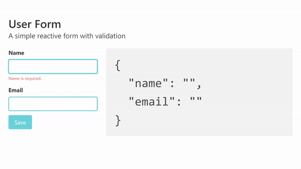

```javascript
/* JavaScript DOM Exercises 01 Tutorial: https://youtu.be/EHF7xBUAmrQ */

/*
  Exercise 01
  -----------
  Highlight all of the words over 8 characters long in the paragraph text (with a yellow background for example)
*/
const paragraph = document.querySelector('p');
paragraph.innerHTML = paragraph.innerText
  .split(' ')
  .map(word => word.length > 8 ? `<span style="background-color: yellow">${word}</span>` : word)
  .join(' ')
  
/*
  Exercise 02
  -----------
  Add a link back to the source of the text after the paragraph tag.
  (https://forcemipsum.com/)
*/
const link = document.createElement('a');
link.href = 'https://forceipsum.com';
link.innerText = 'Textgenerated from Forcem Ipsum';
document.body.appendChild(link);

/*
  Exercise 03
  -----------
  Split each new sentence on to a separate line in the paragraph text.
  A sentence can be assumed to be a string of text terminated with a period (.)
*/
paragraph.innerHTML = paragraph.innerText
  .split(/\.[^\.|<]/)
  .join('.</p><p>') + '</p>';


/* 
  Exercise 04
  -----------
  Count the number of words in the paragraph tag and display the count afer the heading.
  You can assume that all words are separated by one singular whitespace.
*/
cosnt wordCount = paragraph.innerText.split(' ').length;
const wordCountElem = document.createElement('div');
wordCountElem.innerText = `${wordCount} words`;
document.body.insertBefore(wordCountElem, paragraph);

/*
  Exercise 05
  -----------
  Replace all question marks (?) with thinking faces (🤔) and exclamation marks (!) with astonished faces (😲) 
*/
Array.from(document.querySelectorAll('p'))
  .forEach(p => {
    p.innerHTML = p.innerHTML
      .replace(/\?/g, '🤔')
      .replace(/\!/g, '😲');
})
```

```javascript
/* JavaScript DOM Exercises 02 Tutorial: https://youtu.be/qQy5K-pE8Fo */
/*
  Exercises 01
  ------------
  Add a label to each of the input fields: username, password, confirm password
*/
document.getElementById('username')
  .insertAdjacentHTML('beforeBegin', '<label for="username">Username: </label>');
document.getElementById('password')
  .insertAdjacentHTML('beforeBegin', '<label for="password">Password: </label>');
document.getElementById('confirmPassword')
  .insertAdjacentHTML('beforeBegin', '<label for="confirmPassword">Confirm Password: </label>');

/*
  Exercise 02
  -----------
  Add a required validation to each input that shows an error message next to the entry if it does not have any text entered.
*/
const checkInput = (event) => {
  const errorElement = Array.from(event.target.parentNode.querySelectorAll('span'));
  if (event.target.value === '' && !errorElement.length) {
    event.target.insertAdjacentHTML('afterEnd', '<span class="text-danger">Required</span>')
  }
  
  if (errorElement && event.target.value !== '') {
    errorElement.forEach(elem => elem.remove());
  }
};

document.getElementById('username')
  .addEventListener('blur', checkInput);    
document.getElementById('password')
  .addEventListener('blur', checkInput);
document.getElementById('confirmPassword')
  .addEventListener('blur', checkInput);

/*
  Exercise 03
  -----------
  Add a further validation to check if the user input in the password and confirm password inputs match.  Show an error message if they do not.
*/
document.getElementById('confirmPassword')
  .addEventListener('blur', (event) => {
    if (event.target.value !== document.getElementById('password').value) {
      event.target.insertAdjacentHTML('afterEnd', '<span class="text-danger">Passwords Should Match</span>')
    }
})

/*
  Exercise 04
  -----------
Ensure the ‘Register’ button is disabled until the user has entered valid data into all the input fields.  Once they have, the registration button should then be enabled.
*/
const btn = document.querySelector('button');
btn.setAttribute('disabled', "");
document.getElementById('registrationForm')
  .addEventListener('change', (event) => {
    const formIsFilled = Array.from(document.querySelectorAll('input'))
      .every(input => input.value);
    if (formIsFilled) {
      btn.removeAttribute('disabled');
    }
});

/*
  Exercise 05
  -----------
When the user clicks the ‘Register’ button, a message should be displayed informing them of a successful user registration.
*/
const form = document.getElementById('registrationForm');

form.addEventListener('submit', (event) => {
  event.preventDefault();
  const alert = document.createElement('div');
  alert.classList.add('alert', 'alert-success');
  alert.innerText = 'User registered Successfully';
  // append는 DOM 요소 뒤에 DOM 요소를 추가할 때, prepend는 DOM 요소 앞에 DOM 요소를 추가할 떄.
  // append와 appendChild의 차이에 대한 명시 필요
  form.prepend(alert);
});


/*
  Exercise 02
  -----------
  Add a required validation to each input that shows an error message next to the entry if it does not have any text entered.
*/


```

---

`blur` 이벤트는 엘리먼트의 포커스가 해제되었을 때 발생한다. 



이 gif 파일에서 처럼 엘리먼트에 포커스가 생기고 해제되는 그 시점에 이벤트가 발생한다.

`focusout` 또한 `blur`와 동일한 기능을 수행하는데 가장 다른 점은 `focusout`은 이벤트 버블링이 발생한다는 것이다,

---

Element.insertAdjacentHTML()

**`insertAdjacentHTML()`** 메서드는 HTML or XML 같은 특정 텍스트를 파싱하고, 특정 위치에 DOM tree 안에 원하는 node들을 추가 한다. 이미 사용중인 element 는 다시 파싱하지 않는다. 그러므로 element 안에 존재하는 element를 건드리지 않는다. (innerHtml은 과 좀 다름). innerHtml보다 작업이 덜 드므로 빠르다.

```html
element.insertAdjacentHTML(position, text);

// 실제 사용 예시
  event.target.insertAdjacentHTML('afterEnd', '<span class="text-danger">Passwords Should Match</span>')
```

position에는 `beforebegin (element 앞에)`, `afterbegin (element 안에 가장 첫번째 child)`, `beforeend (element 안에 가장 마지막 child)`, `afterend (element 뒤에)`

text는 HTML 또는 XML로 해석될 수 있는 문자열이다!

---

Element.setAttribute()

속성 값을 줄 수 있다.

```javascript
Element.setAttribute(name, value);

// 실제 사용 예시
<button type="button" onclick="alert('Hello World!')" disabled>클릭해 보세요!</button>

var b = document.querySelector("button");

b.setAttribute("name", "helloButton");
b.setAttribute("disabled", "");    // disabled와 같이 key-value 쌍이 아닌 경우 뒤에 빈 문자열을 넣으면 된다.
```

https://developer.mozilla.org/en-US/docs/Web/API/Element/prepend

https://webruden.tistory.com/634

https://mygumi.tistory.com/321

https://hyejin-dev.tistory.com/12

---

```javascript
/*
Exercise 1
--------------
Move the contents of the two paragraphs into one single <p> tag.  Ensure there are no empty <p> tags left on the page.
*/
const paragraph = document.querySelectorAll('p');
paragraph[1].insertAdjacentHTML('afterBegin', paragraph[0].innerText)
paragraph[0].remove();

/*
Exercise 2
--------------
Reduce the font-size of the paragraph text to be half the size of the menu text.
*/
const menuItem = document.querySelector('.menu ul li');
const menuItemFontSize = parseInt(window.getComputedStyle(menuItem).getPropertyValue('font-size'));
// 이런 식으로 스타일 조작이 가능하다!
document.querySelector('p').style['font-size'] = `${menuItemFontSize / 2}px`;

/*
Exercise 3
--------------
Move the ‘Services’ menu item to be before the ‘About’ menu item (after Home).
*/
const services = document.querySelector('.menu ul li:nth-child(3)');
const about = document.querySelector('.menu ul li:nth-child(2)');
// about.insertAdjacentHTML('beforeBegin', services.innerText);
about.insertAdjacentElement('beforeBegin', services);

/*
  Exercise 04
  -----------
  Create the following new entries in the menu: FAQs, Pricing
*/
const menu = document.querySelector('.menu ul');
const faqElem = document.createElement('li');
const pricingElem = document.createElement('li');
faqElem.innerText = 'FAQs';
pricingElem.innerText = 'Pricing';
menu.appendChild(faqElem);
menu.appendChild(pricingElem);

/*
Exercise 5
--------------
Add a hover effect to the menu items so when the user hovers over them the background and font-size change.  (Must be done with JavaScript!)
*/
const hoverEffect = (e) => {
  const elem = e.target;
  elem.style['background-color'] = '#f2f2f2';
  elem.style['font-size'] = '20px';
}

const normalEffect = (e) => {
  const elem = e.target;
  elem.style['background-color'] = '#fff';
  elem.style['font-size'] = '16px';
};

Array.from(document.querySelectorAll('.menu ul li')).forEach(elem => {
   elem.addEventListener('mouseover', hoverEffect);
   elem.addEventListener('mouseleave', normalEffect);
});
```

