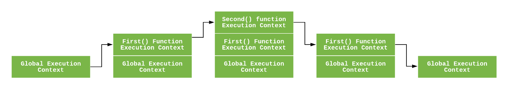

자바스크립트의 핵심 개념들인 Hoisting, Scope, Closure와 같은 개념들을 이해하기 위해서는 Execution Context와 Execution Stack에 대한 이해가 필요하다. 

자바스크립트 코드를 실행한다는 말은, 내부적으로 실행 컨텍스트가 동작하기 시작한다는 말과 같다.

실행 컨텍스트에는 3가지 종류가 존재한다.

- Global Execution Context

  > 가장 기본이 되는 실행 컨텍스트이다. 어떠한 함수에도 포함되지 않는 코드들이 전역 실행 컨텍스트에 포함된다. 전역 실행 컨텍스트는 2가지의 일을 한다. 첫째, 전역 객체(= window object)를 만든다. 둘째, 전역 객체를 `this`의 값으로 설정한다. 하나의 프로그램에서 전역 실행 컨텍스트는 단 한 개만이 존재할 수 있다.

- Functional Execution Context

  > 함수가 호출 될 때마다, 각 함수에 대한 함수 실행 컨텍스트가 만들어진다. 각 함수는 자신만의 실행 컨텍스트를 가진다. 하지만, 이 실행 컨텍스트가 실제로 만들어지기 위해서는 해당 함수가 호출되어야 한다. 하나의 프로그램에서 함수 실행 컨텍스트는 여러개가 존재할 수 있다.

- Eval Function Execution Context

  > 사용하지 않는다. Eval function에 대해 궁금하다면 [이곳](https://developer.mozilla.org/ko/docs/Web/JavaScript/Reference/Global_Objects/eval)의 내용을 읽어보면 된다.

---

## Execution Stack

실행 스택(다른 프로그래밍 언어들에서는 "calling stack"이라 부른다.)은 LIFO(Last in, First out) 형태의 스택 구조이다. 코드가 실행되면서 만들어지는 모든 실행 컨텍스트들은 이 실행 스택에 쌓인다. 

자바스크립트 엔진이 스크립트 코드를 처음 만나게 되면, 전역 실행 컨텍스트를 만들고 이를 실행 스택에 푸시(push)한다. 이후에 자바스크립트 엔진이 함수 호출을 발견하게 되면, 새로운 함수 실행 컨텍스트를 만들고 이를 실행 스택에 푸시한다.

해당 함수의 실행이 끝나면, 자바스크립트 엔진은 이 함수에 대한 함수 실행 컨텍스트를 팝(pop)한다.

조금 더 쉬운 이해를 위해 코드로 보자.

```javascript
let a = 'Hello World!';
function first() {
  console.log('Inside first function');
  second();
  console.log('Again inside first function');
}
function second() {
  console.log('Inside second function');
}
first();
console.log('Inside Global Execution Context');
```



- 코드의 가장 처음에서 전역 실행 컨텍스트가 만들어지고 푸시된다.
- 자바스크립트 엔진이 `first()`를 보는 순간 first 함수에 대한 함수 실행 컨텍스트가 만들어지고 푸시된다.
- 이후 first 함수가 실행된다.
- first 함수 실행 도중, `second()`를 만난다. 자바스크립트 엔진은 바로 second 함수에 대한 함수 실행 컨텍스트를 만들고 푸시한다.
- 이후 second 함수가 실행된다.
- second 함수의 실행이 끝나고 second 함수에 대한 실행 컨텍스트는 팝된다.
- first 함수의 실행이 끝나고 first 함수에 대한 실행 컨텍스트는 팝된다.
- 해당 프로그램에 대한 실행이 끝나고 전역 실행 컨텍스트가 팝된다.

---

## 그렇다면 실행 컨텍스트는 어떻게 만들어지는걸까?

자바스크립트 엔진이 실행 컨텍스트를 만드는 과정은 크게 두 개의 phase로 구성된다. 첫번째는 **Creation Phase** 두번째는 **Execution Phase**이다.


### The Creation Phase

실행 컨텍스트는 실질적으로 creation phase동안 만들어진다. creation phase는 다시 크게 두가지를 만드는 것으로 구분될 수 있는데, **LexicalEnvironment**와 **VariableEnvironment**이다.


https://blog.bitsrc.io/understanding-execution-context-and-execution-stack-in-javascript-1c9ea8642dd0

https://poiemaweb.com/js-execution-context

