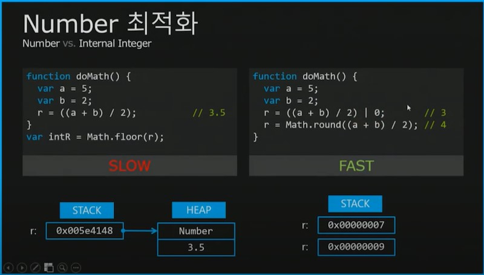

# 👀Number형의 범위

---

c/c++ 이라는 언어가 만들어졌을 때는 메모리를 아낄 필요가 있었다. 떄문에 숫자를 표현하는 int형에 4byte만을 할당했다.

메모리 용량이 과거보다 월등히 커진 상황에서 등장한 자바스크립트는 상대적으로 메모리 관리에 대한 압박에서 자유로워졌다. 때문에 숫자에 조금 더 넉넉하게 8byte를 할당했다.

하지만, 자바스크립트의 Number형의 범위는 -(2^53 - 1) ~ (2^53 - 1) 이다. 8byte를 할당했다면 (2^64-1) 까지 가능해야 하는게 아닌가라는 생각이 들 수 있다. 

|2^53-1|까지만을 사용할 수 있는 이유는 64bit 중에서 1bit는 부호비트로, 11비트는 지수부로, 52비트를 가수부로 사용하기 때문이다. 이 때문에 표현할 수 있는 수의 범위는 |2^53-1|이 된다.

지수부, 가수부에 대해 이해하기 위해서는 부동 소수점을 알아야 한다. 하지만, 이 글은 단순히 왜 자바스크립의 Number형의 범위가 |2^53-1|인가를 설명하기 위한 글이라 더 이상 적지 않겠다. 아래 링크로 달아놓은 글들을 통해 더 깊게 이해할 수 있다. 

---

### Number 객체에 대한 최적화

> https://www.youtube.com/watch?v=9MZl8Uq9Gmw
>
> 이 강의의 내용이다. 2014년 강의라 아직도 이러한지는 정확히 모르겠다. 오픈카톡에 이와 관련된 내용을 물어봤는데 다들 이런거는 신경쓰지 말라고 하신다. 실제 개발에서 이런 자잘한 것 까지 신경쓰지는 않아도 되는건지는 모르겠지만, 뭐 일단 알아둔다고 손해보는 것은 없으니 정리는 해두자.

(일단 강의 그대로 작성한다.)

자바스크립트에서는 원시값의 경우 아래와 같이 31비트에 값이 저장되고 이 값이 원시값이라는 표시를 하기 위해 맨 마지막 1비트에 1을 할당한다. 반면 객체의 경우 포인팅 주소가 31비트에 저장되고 맨 마지막 비트에 0을 할당한다. 실제 내용은 힙영역에 저장되게 된다. 

일단 강의에서는 이렇게 설명하셨다. 그런데 제일 중요한 것은 자바스크립트에서는 원시값도 객체라는 것이다... 아마도 이 강의가 2014년에 나온 강의이기 때문이지 않을까 생각이 든다. 때문에 위의 설명을 제대로 이해하지 못 하였다.

뭐 어쨋든 위의 내용이 맞든 틀리든, 효율적이든 효율적이지 않든 간에 이 예시 코드는 그 자체로 유용하게 쓰일 수 있다.

실수 뒤에 `|0` 이라는 비트 연산을 사용하게 되면, 소수점 이하 값들이 모두 떨어져나간다. 굉장히 유용한 코드라는 생각이 든다.

또한, 어짜피 정수로 바뀌어야할 실수값이라면 당연히 정수로 바꿔서 저장하는 것이 더 깔끔한 코드를 만들 수 있다.

떄문에 소수점 이하를 버리고 싶을 때는 `|0` 이라는 비트 연산자를, 반올림을 하고 싶을 때는 `Math.round()`를 사용한다는 것을 기억하자.

---

[지수부 가수부에 대한 설명](https://ko.wikipedia.org/wiki/%EB%B6%80%EB%8F%99%EC%86%8C%EC%88%98%EC%A0%90)

[single-precision(32bit를 사용하는 컴퓨터)에서는 지수부로 8bit를, double-precision(64bit를 사용하는 컴퓨터)에서는 지수부로 11bit를 사용한다는 글. ](https://en.wikipedia.org/wiki/Exponent_bias)

> 근데 정확히 왜 8bit, 11bit가 필요한건지는 찾아봣는데도 모르겠음.

[10진수를 부동소수점으로 바꾸는걸 친절하게 설명해줌](https://www.youtube.com/watch?v=8afbTaA-gOQ)

---

## 참고문헌

코어 자바스크립트 (정재승 지음)