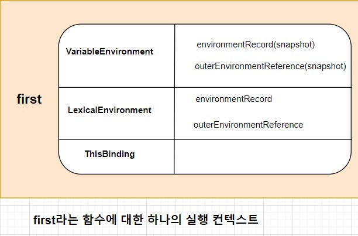

# ✔✔실행 컨텍스트

---

> 정말 중요하지만, 정말 어려운 개념이다. 이에 대해 정말 자세하고 정확히 설명되어 있는 자료를 찾기가 너무 힘들었다. 그러던 와중 '코어 자바스크립트' 라는 책과 https://blog.bitsrc.io/understanding-execution-context-and-execution-stack-in-javascript-1c9ea8642dd0 이곳의 문서를 읽게 되었다. 사실 아래에 쓰는 모든 내용들은 이 두 곳에서 설명한 내용들을 짜집기한 수준 밖에 되지 않는다. 때문에 이 글을 읽기 전에 코어 자바스크립트와 해당 url의 글을 읽고 오는 것을 추천한다. 

## Execution Context

자바스크립트의 핵심 개념들인 Hoisting, Scope, Closure와 같은 개념들을 이해하기 위해서는 Execution Context와 Execution Stack에 대한 이해가 필요하다. 

자바스크립트 코드를 실행한다는 말은, 내부적으로 실행 컨텍스트가 동작하기 시작한다는 말과 같다.

실행 컨텍스트에는 3가지 종류가 존재한다.

- Global Execution Context(전역 실행 컨텍스트)

  > 가장 기본이 되는 실행 컨텍스트이다. 어떠한 함수에도 포함되지 않는 코드들이 전역 실행 컨텍스트에 포함된다. 전역 실행 컨텍스트는 2가지의 일을 한다. 첫째, 전역 객체(= window object)를 만든다. 둘째, 전역 객체를 `this`의 값으로 설정한다. 하나의 프로그램에서 전역 실행 컨텍스트는 단 한 개만이 존재할 수 있다.

- Functional Execution Context(함수형 실행 컨텍스트)

  > 함수가 호출 될 때마다, 각 함수에 대한 함수 실행 컨텍스트가 만들어진다. 각 함수는 자신만의 실행 컨텍스트를 가진다. 하지만, 이 실행 컨텍스트가 실제로 만들어지기 위해서는 해당 함수가 호출되어야 한다. 하나의 프로그램에서 함수 실행 컨텍스트는 여러개가 존재할 수 있다.

- Eval Function Execution Context

  > 사용하지 않는다. Eval function에 대해 궁금하다면 [이곳](https://developer.mozilla.org/ko/docs/Web/JavaScript/Reference/Global_Objects/eval)의 내용을 읽어보면 된다.

---

## Execution Stack(Call Stack)

실행 스택(다른 프로그래밍 언어들에서는 "call stack"이라 부른다.)은 LIFO(Last in, First out) 형태의 스택 구조이다. 코드가 실행되면서 만들어지는 모든 실행 컨텍스트들은 이 실행 스택에 쌓인다. 

자바스크립트 엔진이 스크립트 코드를 처음 만나게 되면, 전역 실행 컨텍스트를 만들고 이를 실행 스택에 푸시(push)한다. 이후에 자바스크립트 엔진이 함수 호출을 발견하게 되면, 새로운 함수 실행 컨텍스트를 만들고 이를 실행 스택에 푸시한다.

해당 함수의 실행이 끝나면, 자바스크립트 엔진은 이 함수에 대한 함수 실행 컨텍스트를 팝(pop)한다.

ES5까지는 이렇게 자동으로 생성되는 전역공간을 제외하면, 실행 컨텍스트를 구성하는 방법은 함수를 실행하는 것 뿐이었다.(Eval 실행 컨텍스트는 사실상 쓰이지 않기 떄문에)

하지만, ES6가 등장하게 되면서, 블록({})에 의해서도 실행 컨텍스트가 만들어지게 되었다.  

조금 더 쉬운 이해를 위해 코드로 보자.

```javascript
let a = 'Hello World!';
function first() {
  console.log('Inside first function');
  second();
  console.log('Again inside first function');
}
function second() {
  console.log('Inside second function');
}
first();
console.log('Inside Global Execution Context');
```


- 코드의 가장 처음에서 전역 실행 컨텍스트가 만들어지고 푸시된다.
- 자바스크립트 엔진이 `first()`를 보는 순간 first 함수에 대한 함수 실행 컨텍스트가 만들어지고 푸시된다.
- 이후 first 함수가 실행된다.
- first 함수 실행 도중, `second()`를 만난다. 자바스크립트 엔진은 바로 second 함수에 대한 함수 실행 컨텍스트를 만들고 푸시한다.
- 이후 second 함수가 실행된다.
- second 함수의 실행이 끝나고 second 함수에 대한 실행 컨텍스트는 팝된다.
- first 함수의 실행이 끝나고 first 함수에 대한 실행 컨텍스트는 팝된다.
- 해당 프로그램에 대한 실행이 끝나고 전역 실행 컨텍스트가 팝된다.

---

## 그렇다면 실행 컨텍스트는 어떻게 만들어지는걸까?

자바스크립트 엔진이 실행 컨텍스트를 만드는 과정은 크게 두 개의 phase로 구성된다. 첫번째는 **Creation Phase** 두번째는 **Execution Phase**이다.


### The Creation Phase

실행 컨텍스트는 실질적으로 creation phase동안 만들어진다. 

하나의 실행 컨텍스트가 가지는 구조는 다음 사진과 같다. (함수의 이름은 first라고 가정한다.)



- VariableEnvironment - 현재 컨텍스트 내의 식별자들에 대한 정보 + 외부 환경 정보. LexicalEnvironment의 스냅샷으로, 변경사항은 반영되지 않는다는 특징이 있다.
- LexicalEnvironment - 처음에는 VariableEnvironment와 같지만 변경 사항이 실시간으로 반영된다.
- ThisBinding - this 식별자가 바라봐야 할 대상 객체.

---

### VariableEnvironment와 LexicalEnvironment

실행 컨텍스트를 생성할 때 VariableEnvironment에 정보를 먼저 담은 다음, 이를 그대로 복사해서 LexicalEnvironment를 만들고, 이후에는 LexicalEnvironment를 주로 활용하게 된다.

때문에 초기화 과정 중에는 사실상 VariableEnvironment와 LexicalEnvironment가 완전히 동일하다.

이후 코드가 진행됨에 따라 LexicalEnvironment의 내부는 계속해서 변화하지만, VariableEnvironment는 초기의 값을 계속해서 유지한다.

간단히 말해서 VariableEnvironment는 최초의 LexicalEnvironment에 대한 스냅샷이다.

---

### VariableEnvironment와 LexicalEnvironment의 내부요소

- #### environmentRecord와 호이스팅

  environmentRecord에는 현재 컨텍스트와 관련된 코드의 식별자 정보들이 저장된다.

  컨텍스트를 구성하는 함수에 지정된 매개변수 식별자, 선언한 함수가 있을 경우 그 함수 자체, var로 선언된 변수의 식별자 등이 식별자에 해당한다.

  컨텍스트 내부 전체를 처음부터 끝까지 쭉 훑어나가면서 이러한 식별자들을 순서대로 수집한다.

  변수 정보를 수집하는 과정을 모두 마쳤더라도, 아직 실행 컨텍스트가 관여할 코드들은 실행되기 전의 상태이다. 코드가 실행되기 전임에도 불구하고 자바스크립트 엔진은 이미 해당 환경에 속한 코드의 변수명들을 모두 알고 있게 되는 셈이다. (실행은 Creation Phase가 끝나고, Execution Phase가 되었을 때 시작한다.)

  그렇다면 엔진의 실제 동작 방식 대신에 '자바스크립트 엔진은 식별자들을 최상단으로 끌어올려놓은 다음 실제 코드를 실행한다.' 라고 생각해도 코드를 해석하는 데는 문제될 것이 전혀 없다.

  여기에서 '호이스팅'의 개념이 등장한다. 호이스팅을 한 줄로 정의하자면, '모든 선언을 최상단으로 끌어올린다.' 라고 말할 수 있다. 

  실제로 자바스크립트 엔진이 선언들을 끌어올리지는 않지만, 개념을 쉽게 이해하기 위해서 끌어올렸다고 가정하는 것이다.

  어떻게 변수를 수집해 environmentRecord에 저장하는지 설명하기 위해 여러 개의 예를 들겠다.

  ---

  

  ```javascript
  // 1. 원본 코드
  
  function a(x) {		  // 수집 대상 1(매개변수)
  	console.log(x)    // (1)
  	var x			 // 수집 대상 2(변수 선언)
  	console.log(x)	  // (2)
  	var x = 2         // 수집 대상 3(변수 선언)
  	console.log(x)    // (3)
  }
  
  a(1)
  ```

  ```javascript
  // 2. 매개변수를 변수 선언/할당과 같다고 간주해서 변환한 상태
  
  function a() {
  	var x = 1        // 수집 대상 1(매개변수 선언)
  	console.log(x)   // (1)
  	var x            // 수집 대상 2(변수 선언)
  	console.log(x)   // (2)
  	var x = 2        // 수집 대상 3(변수 선언)
  	console.log(x)   // (3)
  }
  
  a()
  ```

  ```javascript
  // 3. 호이스팅을 마친 상태                                          
  
  function a() {												
  	var x          // 수집 대상 1의 변수 선언 부분				  
  	var x          // 수집 대상 2의 변수 선언 부분
  	var x          // 수집 대상 3의 변수 선언 부분
  	
  	x = 1          // 수집 대상 1의 할당 부분
  	console.log(x) // (1)
  	console.log(x) // (2)
  	x = 2          // 수집 대상 3의 할당 부분
  	console.log(x) // (3)
  }
  
  a()
  ```

  이제 호이스팅이 끝났으니 Creation Phase가 끝났다. (원래는 Creation Phase에서 스코프 체인 수집 및 this 할당도 이루어져야 하지만 일단 이 과정들이 다 끝났다고 가정한다.) 이제 Execution Phase가 실행된다.

  - 첫번째 `var x`가 선언된다. x에 undefined가 할당된다.
  - 두번째, 세번째 `var x`는 이미 선언된 변수 x가 있으므로 무시한다.
  - x에 1을 할당한다.
  - x 값을 두 번 출력한다. (1), (2) 모두 1이 출력된다.
  - x에 2를 할당한다.
  - x 값을 한 번 출력한다. (3)은 2가 된다.
  - 실행이 끝났다. 해당 실행 컨텍스트는 실행 스택에서 팝된다.

  호이스팅 개념을 완벽하게 이해한다면 이렇게 값을 예측하는 일은 그리 어려운 일이 아니다.

  ---

  ```javascript
  // 1. 원본 코드 (위의 코드와 파라미터 부분만 빼고 동일하다.)
  
  function a() {		  // 
  	console.log(x)    // (1)
  	var x			 // 수집 대상 1(변수 선언)
  	console.log(x)	  // (2)
  	var x = 2         // 수집 대상 2(변수 선언)
  	console.log(x)    // (3)
  }
  
  a()
  ```

  ```javascript
  // 2. 호이스팅을 마친 상태
  
  function a() {
  	var x            // 수집 대상 1의 변수 선언 부분
  	var x            // 수집 대상 2의 변수 선언 부분
  	
  	console.log(x)   // (1)
  	console.log(x)   // (2)
  	x = 2            // 수집 대상 2의 할당 부분
  	console.log(x)   // (3)
  }
  
  a()
  ```

  - 첫번째 `var x`가 선언된다. x에 undefined가 할당된다.
  - 두번째 `var x`는 이미 선언된 변수 x가 있으므로 무시한다.
  - x 값을 두 번 출력한다. (1), (2) 모두 `undefined`가 출력된다.
  - x에 2를 할당한다.
  - x 값을 한 번 출력한다. (3)은 2가 된다.
  - 실행이 끝났다. 해당 실행 컨텍스트는 실행 스택에서 팝된다.

  ---

  ```javascript
  // 1. 원본 코드
  
  function a() {
  	console.log(b)       // (1)
  	var b = 'bbb'        // 수집 대상 1(변수 선언)
  	console.log(b)       // (2)
  	function b () {}     // 수집 대상 2(함수 선언)
  	console.log(b)       // (3)
  }
  
  a()
  ```

  ```javascript
  // 2. 호이스팅을 마친 상태
  
  function a() {
  	var b               // 수집 대상 1. 변수는 선언부만 끌어올린다.
  	function b () {}    // 수집 대상 2. 함수 선언문은 전체를 끌어올린다.
  	
  	console.log(b)      // (1)
  	b = 'bbb'           // 변수의 할당부는 원래 자리에 있는다.
  	console.log(b)      // (2)
  	console.log(b)      // (3)
  }
  
  a()
  ```

  ```javascript
  // 3. 함수 선언문이 표현식으로 전환된다.
  
  function a () {
  	var b
  	var b = function b () {}   //  <- 바뀐 부분
  	
  	console.log(b)            // (1)
  	b = 'bbb'
  	console.log(b)            // (2)
  	console.log(b)            // (3)
  }
  
  a()
  ```

  - 첫번째 `var b`가 선언된다. b에 `undefined`가 할당된다.
  - 기존에 있던 `var b`에 `function b()`가 할당된다.
  - b 값을 출력한다. (1)은 `function b()`가 된다.
  - b에 'bbb'를 할당한다.
  - b를 두 번 출력한다. (2) 와 (3) 은 'bbb'가 된다.

  이 예제는 꽤 헷갈릴 수 있기 때문에 유심히봐야 한다.

  ---

  ```javascript
  // 1. 원본 코드
  
  console.log(sum(1, 2))
  console.log(multiply(3, 4))
  
  function sum (a, b) {               // 함수 선언문 sum
  	return a + b
  }
  
  var multiply = function (a, b) {    // 함수 표현식 multiply
  	return a * b
  }
  ```

  ```javascript
  // 2. 호이스팅을 마친 상태
  
  var sum = function sum (a, b) {     // 함수 선언문은 전체를 호이스팅한다.
  	return a + b 
  }
  var multiply                        // 변수는 선언부만 끌어올린다.
  
  console.log(sum(1, 2))
  console.log(multiply(3, 4))
  
  multiply = function (a, b) {        // 변수의 할당부는 원래 자리에 남는다.
  	return a * b
  }
  ```

  - `sum`이 선언된다. `var sum`에 `undefined`가 할당된다.
  - multiply가 선언된다. `var multiply`에 `undefined`가 할당된다.
  - 다시 맨 위로 올라간다. sum에 `function sum()`을 할당한다.
  - `sum(1, 2)`를 실행한다. 정상적으로 3이 나온다.
  - `multiply(3, 4)`를 실행한다. multiply는 `undefined`인데 함수 실행을 시켰다. 때문에 `multiply is not a function`이라는 에러 메세지가 출력된다.
  - 에러로 인해 이후 코드는 실행되지 않고 런타임이 종료된다.

  ---

  ```javascript
  // 1. 원본 코드
  
  function a () {
  	console.log(a)       // (1)
  	let a = 'aaa'        // 수집 대상 1(변수 선언)
  	console.log(a)       // (2)
  }
  
  a()
  ```

  ```javascript
  // 2. 호이스팅을 마친 상태
  
  function a () {
  	let a                // 변수의 선언부는 끌어올린다.
  	
  	console.log(a)       // (1)
  	a = 'aaa'            // 변수의 할당부는 원래 자리에 남는다.
  	console.log(a)       // (2)
  }
  
  a()
  ```

  - `let a`가 선언된다.
  - a값을 출력한다. 하지만, a에는 값이 할당되지 않았다. 때문에 `ReferenceError: Cannot access 'a' before initialization`라는 에러 메세지가 출력된다.

  ---

  이 지점에서 다시 한 번 호이스팅의 정의에 대해 짚고 넘어갈 필요가 있다.

  호이스팅이란, **함수 안에 있는 선언들을 모두 끌어올려서 해당 함수 유효 범위의 최상단에 선언하는 것이다.**

  그런데 보통 많은 블로그에서 var은 호이스팅되지만, let과 const는 호이스팅되지 않는다고 설명한다.

  이는 명백히 잘못된 설명이다.

  var, let, const 모두 최상단에 **선언**된다. 즉, var, let, const 모두 호이스팅된다. 하지만, 특정한 값(undefined)이 선언과 동시에 초기화되는 것은 var 뿐인 것이다. 

  > 조금 더 자세한 설명이다.
  >
  > **Note —** As you might have noticed that the `let` and `const` defined variables do not have any value associated with them during the creation phase, but `var` defined variables are set to `undefined `.
  >
  > This is because, during the creation phase, the code is scanned for variable and function declarations, while the function declaration is stored in its entirety in the environment, the variables are initially set to `undefined `(in case of `var`) or remain uninitialized (in case of `let `and `const`).
  >
  > This is the reason why you can access `var `defined variables before they are declared (though `undefined`) but get a reference error when accessing `let` and `const` variables before they are declared.
  >
  > This is, what we call hoisting.
  >
  > **Note —** During the execution phase, if the JavaScript engine couldn’t find the value of `let` variable at the actual place it was declared in the source code, then it will assign it the value of `undefined`.
  >
  > 출처: https://blog.bitsrc.io/understanding-execution-context-and-execution-stack-in-javascript-1c9ea8642dd0
  >
  > <br/>
  >
  > 변수의 선언은 총 3단계로 구성된다고 한다.
  >
  > - 선언 단계
  >
  >   > 변수 객체에 변수를 등록한다. 이 변수 객체는 스코프가 참조할 수 있는 대상이 된다.
  >
  > - 초기화 단계
  >
  >   > 변수 객체에 등록된 변수를 메모리에 할당한다. 이 단계에서 변수는 undefined로 초기화 된다.
  >
  > - 할당 단계
  >
  >   > undefined로 초기화된 변수에 실제값을 할당한다.
  >
  > **var 키워드로 선언된 변수는 선언 단계와 초기화 단계가 한 번에 이루어진다.**
  >
  > 출처: https://poiemaweb.com/js-execution-context

  <br/>

  이 지점에서 또 다시 새로운 질문이 제기 될 수 있다. 

  ```javascript
  // 1. 원본 코드
  
  function a () {
  	let x
  	console.log(x)   
  }
  
  a()
  ```

  이 코드는 어떻게 `undefined`를 출력하는 것인가??

  

  이 질문에 대답하기 위해서는, 지금까지 우리가 선언과 할당을 분리했다는 것을 기억해야한다. (물론, var의 경우 선언과 할당으로 분리하더라도 선언 시에 메모리 공간에 해당 변수가 존재하지 않는다면 바로 undefined로 할당해버린다.)

  다시 한 번 분리해서 확인한다.

  ```javascript
  // 2. 호이스팅을 마친 상태
  
  function a () {
  	let x
  	
  	x
  	console.log(x)    // (1)
  }
  
  a()
  ```

  - `let x`가 선언된다.
  - x를 만나고 x에 대한 메모리에 할당된 값이 없는 것을 확인하고 `undefined`를 할당한다.
  - (1)에서 `undefined`가 출력된다.

  ---

  environmentRecord가 어떻게 구성되는지. 그 과정에서 어떤 식의 호이스팅이 발생하는지에 대해 자세하게 설명하였다.

  다시 한 번 말하지만, 실제로 변수 및 함수 선언이 물리적으로 작성한 코드의 상단으로 옮겨지는 것이 아니다. 변수 및 함수 선언은 컴파일 단계에서 메모리에 저장되지만, 코드에서는 원래 입력한 위치와 정확히 일치한 곳에 계속해서 위치한다.

  다만, 설명과 이해를 위해서는 물리적으로 코드를 상단으로 옮기는 것이 편하기 때문에 그리한 것이다.

  <br/>

  추가적으로 let, const와 var가 저장되는 위치가 다르다는 점도 알고 있어야 한다.

  ES6부터는 함수 선언과 let, const에 대한 내용들은 LexicalEnvironment의 environmentRecord에 저장된다.

  var에 관련된 내용들은 VariableEnvironment의 environmentRecord에 저장된다.

  ---

- ### outerEnvironmentReference

  스코프란 식별자에 대한 유효범위이다. 어떤 경계 A의 외부에서 선언한 변수는 A의 외부 뿐만 아니라 A의 내부에서도 접근이 가능하다. 반면, A의 내부에서 선언한 변수는 오직 A의 내부에서만 접근할 수 있다.

  ES6 부터는 총 3 종류의 스코프가 만들어진다. 1. 전역 스코프 2. 함수에 의한 스코프 3. 블록에 의한 스코프 

  식별자의 유효 볌위(스코프)를 안에서부터 바깥으로 차례로 검색해나가는 것은 스코프 체인이라고 한다. 그리고 이를 가능하게 하는 것이 바로 LexicalEnvironment의 두 번째 수집 자료인 outerEnvironmentReference이다.

  outerEnvironmentReference는 현재 호출된 함수가 선언될 당시의 LexicalEnvironment를 참조한다. '선언될 당시' 라는 점에 주목해야 한다. 

  예를 들어, A 함수 내부에 B 함수를 선언하고 다시 B 함수 내부에 C 함수를 선언했다고 가정하자.

  ```javascript
  function A () {
  	// ...
  	function B () {
  		// ...
  		function C () {
  			// ...
  		}
  	}
  }
  ```

  이 경우 함수 C의 LexicalEnvironment에 있는 outerEnvironmentReference는 함수 C가 선언되던 때의 함수 B의 LexicalEnvironment를 참조한다.

  함수 B의 LexicalEnvironment에 있는 outerEnvironmentReference는 다시 함수 B가 선언되던 때의 함수 A의 LexicalEnvironment를 참조한다.

  이처럼 outerEnvironmentReference는 연결 리스트(Linked List)의 형태를 띈다.

  선언 시점의 LexicalEnvironment를 계속 찿아 올라가면 마지막엔 전역 컨텍스트의 LexicalEnvironment가 있을 것이다.

  또한, 각 outerEnvironmentReference는 오직 자신이 선언된 시점의 LexicalEnvironment만 참조하고 있으므로 가장 가까운 요소부터 차례대로만 접근할 수 있고 다른 순서로 접근하는 것은 불가능할 것이다.

  이런 구조적 특징 때문에 여러 스코프에서 동일한 식별자를 선언한 경우에는 **무조건 스코프 체인 상에서 가장 먼저 발견된 식별자에만 접근 가능**하게 된다.

---

https://blog.bitsrc.io/understanding-execution-context-and-execution-stack-in-javascript-1c9ea8642dd0

https://poiemaweb.com/js-execution-context

https://medium.com/korbit-engineering/let%EA%B3%BC-const%EB%8A%94-%ED%98%B8%EC%9D%B4%EC%8A%A4%ED%8C%85-%EB%90%A0%EA%B9%8C-72fcf2fac365

https://stackoverflow.com/questions/31219420/are-variables-declared-with-let-or-const-hoisted

https://developer.mozilla.org/ko/docs/Glossary/Hoisting

코어 자바스크립트(정재남, 위키북스)

이 스택오버플로에 연동되어있는 ES2016가서 내용을 더 확인해야 한다.