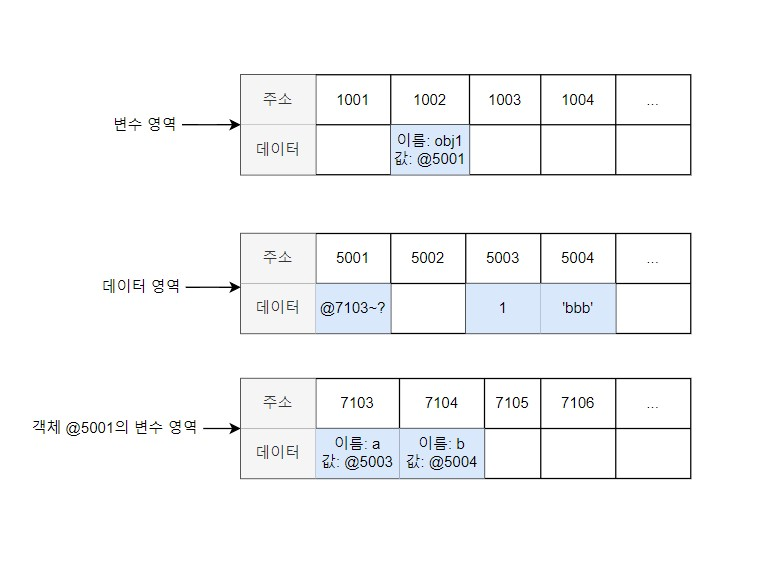

# 데이터 타입의 종류

> 거의 코어 자바스크립트 책에 있는 내용들입니다.
>
> 이 책의 모든 내용들이 너무 좋지만, 이미 있는 모던 자바스크립트 책과 내용이 유사한 부분이 많아서 구매를 하지는 않았습니다. 하지만, 이 책의 가장 첫 부분인 데이터 타입만은 다른 책과는 비교도 안될 정도의 깊은 설명이 있었습니다. 때문에 이 부분만을 조금 정리하고 싶어서 이렇게 문서화하게 되었습니다. 꼭!!! 코어 자바스크립트와 모던 자바스크립트 이 두 책은 구매해서 읽어보시기를 추천합니다. 저도 코어 자바스크립트를 빠른 시일 내에 구매하도록 하겠습니다.

---


자바스크립트의 데이터 타입은 이렇게 7개가 기본적으로 존재한다.

기본형(Primitive type)은 불변성(immutability)을 띈다. 언뜻 생각했을 때 혼란스러울 수 있는 것이 기본형인 숫자 10을 담은 변수 a에 다시 숫자 15를 넣으면 a의 값은 15로 변한다. 그렇다면 '변하지 않는다' 는게 어떤 의미일까.

---

### 데이터 할당

```javascript
var a = 'abc';
```

이런 코드를 보면 우리는 당연히 메모리에서 비어있는 공간을 확보하고 그곳에 a라는 이름과 abc라는 값을 할당할 것이라고 기대한다. (실제 C언어에서는 그러한 식으로 할당한다.)

하지만, 자바스크립트에서는 해당 위치에 문자열 'abc'를 직접 저장하지 않는다. 자바스크립트에서는 변수를 저장하는 영역과 데이터를 저장하는 영역을 구분해서 사용한다.

(위의 두 행이 변수 영역, 아래 두 행이 데이터 영역이라고 가정한다.)

| 주소   | ...  | 1002 | 1003               | 1004  | 1005 | ...  |
| ------ | ---- | ---- | ------------------ | ----- | ---- | ---- |
| 데이터 |      |      | 이름: a, 값: @5004 |       |      |      |
| 주소   | ...  | 5002 | 5003               | 5004  | 5005 | ...  |
| 데이터 |      |      |                    | 'abc' |      |      |

1. 변수 영역에서 빈 공간(@1003)을 확보한다.
2. 확보한 공간의 식별자를 a로 지정한다.
3. 데이터 영역의 빈 공간(@5004)에 문자열 'abc'를 저장한다.
4. 변수 영역에서 a라는 식별자를 검색한다(@1003).
5. 앞서 저장한 문자열의 주소(@5004)를 @1003의 공간에 대입한다.

**왜 변수 영역에 값을 직접 대입하지 않고 굳이 번거롭게 한 단계를 더 거치는 것일까??**

> 데이터 변환을 자유롭게 할 수 있게 함과 동시에 메모리를 더욱 효율적으로 관리하기 위한 고민의 결과이다. 이전에 자바스크립트는 숫자형 데이터에 대해 64비트(8바이트)의 공간을 확보한다고 했다. 반면 문자열은 특별히 정해진 규격이 존재하지 않는다. 한 글자마다 영어는 1바이트, 한글은 2바이트 등으로 각각 필요한 메모리 용량이 가변적이며 전체 글자 수 역시 가변적이기 때문이다.
>
> 만약 미리 확보한 공간 내에서만 데이터 변환을 할 수 있다면 변환한 데이터를 다시 저장하기 위해서는 '확보된 공간을 변환된 데이터 크기에 맞게 늘리는 작업'이 선행돼야 할 것이다. 해당 공간이 메모리 상에서 가장 마지막에 있었다면 뒤쪽으로 늘리기만 하면 되니까 어렵지 않겠지만, 중간에 있는 데이터를 늘려야 하는 상황이라면 해당 공간보다 뒤에 저장된 데이터들을 전부 뒤로 옮기고, 이동시킨 주소를 각 식별자에 다시 연결하는 작업을 수행해야 한다. 이는 굉장히 비효율적이다. 때문에 효율적으로 문자열 데이터의 변환을 처리하려면 변수와 데이터를 별도의 공간에 나누어 저장하는 것이 최적이다.


문자열 'abc'의 마지막에 'def'를 추가하라고 하면 컴퓨터는 'abcdef'라는 문자열을 새로 만들어 별도의 공간에 저장하고, 그 주소를 변수 공간에 연결한다. 반대로 'abc'의 마지막 'c'를 제거하라고해도 새로 만든다. 기존 문자열에 어떤 변화를 가하든 상관없이 무조건 새로 만들어 별도의 공간에 저장한다.

다른 예로 500개의 변수를 생성해서 모든 변수에 5를 할당하는 상황을 생각해보자. 각 변수를 별개로 인식하려면 500개의 변수 공간을 확보하는 것은 불가피하다. 그런데 각 변수 공간마다 매번 숫자 5를 할당하려고 하면 숫자형은 8바이트가 필요하다고 했으니까 총 4000 바이트가 필요해진다. 그 대신 5를 별도의 공간에 한 번 만 저장하고 해당 주소만 입력하게 된다면 어떻게 될까? 예를 들어 주소 공간의 크기가 2바이트하고 한다면 1008바이트만 이용하면 된다. 이처럼 변수 영역과 데이터 영역을 분리하면 중복된 데이터에 대한 처리 효율이 높아진다.

---

이러한 자바스크립트의 특징을 이해하면, '변하지 않는다'는 말이 어떠한 의미인지 이해할 수 있게 된다.

immutable, 즉 불변성에서 변하면 안되는 대상은 **데이터 영역**이다. 즉, 변수 영역은 얼마든지 변할 수 있고 이 말은 재할당 또한 얼마든지 가능하다는 의미이다.

반면에 항상 불변성과 비슷해서 혼동을 일으키는 상수(constant)에서 변하면 안되는 대상은 **변수 영역**이다. 때문에 상수는 재할당이 금지되는 것이다.

---

### 가변값

기본형 데이터는 모두 불변값임을 확인했다. 그렇다면 참조형 데이터의 경우에는 어떨까? 참조형 데이터의 경우 기본적으로 가변값인 경우가 많지만 변경 불가하게 만들거나 아예 불변값으로 만드는 방법도 존재한다. 

```javascript
// 참조형 데이터의 할당

var obj1 = {
	a: 1,
	b: 'bbb',
};
```



1. 컴퓨터는 우선 변수 영역의 빈 공간(@1002)을 확보하고, 그 주소의 이름을 obj1으로 지정한다.
2. 임의의 데이터 저장 공간(@5001)에 데이터를 저장하려고 보니여러 개의 프로퍼티로 이뤄진 데이터 그룹이다. 이 그룹 내부의 프로퍼티들을 저장하기 위해 별도의 변수 영역을 마련하고, 그 영역의 주소(@7103 ~ ?)를 @5001에 저장한다. (객체의 프로퍼티들을 저장하기 위한 메모리 영역은 크기가 정해져 있지 않고 필요한 시점에 동적으로 확보한다. 때문에 끝나는 지점을 정확히 지정하지 않는다.)
3. @7103 및 @7104에 각각 a와 b라는 프로퍼티 이름을 지정한다.
4. 데이터 영역에서 숫자 1을 검색한다. 검색 결과가 없으므로 임의로 @5003에 저장하고, 이 주소를 @7103에 저장한다. 문자열 'bbb' 역시 임의로 @5004에 저장하고, 이 주소를 @7104에 저장한다.

기본형 데이터와의 차이는 '객체의 변수(프로퍼티) 영역'이 별도로 존재한다는 점이다. 그림을 자세히 보면 객체가 별도로 할애한 영역은 변수 영역일 뿐 '데이터 영역'은 기존의 메모리 공간을 그대로 활용하고 있다. 데이터 영역에 저장된 값은 모두 불변값이다. 그러나, 변수에는 다른 값을 얼마든지 대입할 수 있다. 이 부분 때문에 흔히 참조형 데이터는 불변하지 않다(가변값이다)라고 하는 것이다.

---
### 객체 내부의 값 수정

```javascript
var obj1 = {
	a: 1,
	b: 'bbb',
};
obj1.a = 2;
```


내부의 값이 수정되었을 때 새로운 객체가 만들어진 것이 아니라 기존의 객체 내부의 값만 바뀐 것을 파악할 수 있다.

---

### 중첩된 참조형 객체의 프로퍼티 할당

```javascript
var obj = {
	x: 3,
	arr: [ 3, 4, 5 ]
};
```


1. 컴퓨터는 우선 변수 영역의 빈 공간(@1002)을 확보하고, 그 주소의 이름을 obj로 지정한다.
2. 임의의 데이터 저장공간(@5001)에 데이터를 저장하려는데. 이 데이터는 여러 개의 변수와 값들을 모아놓은 그룹(객체)이다. 이 그룹의 각 변수(프로퍼티)들을 저장하기 위해 별도의 변수 영역을 마련하고(@7104~?), 그영역의 주소를 @5001에 저장한다.
3. @7103에 이름 x를, @7104에 이름 arr를 지정한다.
4. 데이터 영역에서 숫자 3을 검색한다. 없으므로 임의로 @5002에 저장하고, 이 주소를 @7103에 저장한다.
5. @7104에 저장할 값은 배열로서 역시 데이터 그룹이다. 이 그룹 내부의 프로퍼티들을 저장하기 위해 별도의 변수 영역을 마련하고(@7104~?), 그 영역의 주소를 @7104에 저장한다.
6. 배열의 요소가 총 3개이므로 3개의 변수 공간을 확보라고 각각 인덱스를 부여한다. (0, 1, 2)
7. 데이터 영역에서 숫자 3을 검색해서(@5002) 그 주소를 @8104에 저장한다.
8. 데이터 영역에 숫자 4가 없으므로 @5004에 저장하고, 이 주소를 @8105에 저장한다.
9. 데이터 영역에 숫자 5가 없으므로 @5005에 저장하고, 이 주소를 @8106에 저장한다.

이제 obj.arr[1] 을 검색하고자 하면 메모리에서는 다음과 같은 검색 과정을 거친다.

1. obj 검색 1: obj라는 식별자를 가진 주소를 찾는다. (@1002) 
2. obj 검색 2: 값이 주소이므로 그 주소로 이동한다. (@5001)
3. obj 검색 3: 값이 주소이므로 그 주소로 이동한다. (@7103~?)
4. obj.arr 검색 1: arr이라는 식별자를 가진 주소를 찾는다. (@7104)
5. obj.arr 검색 2: 값이 주소이므로 그 주소로 이동한다. (@5003)
6. obj.arr 검색 3: 값이 주소이므로 그 주소로 이동한다. (@8104~?)
7. obj.arr[1] 검색 1: 인덱스 1에 해당하는 주소를 찾는다. (@8105)
8. obj.arr[1] 검색 2: 값이 주소이므로 그 주소로 이동한다. (@5004)
9. obj.arr[1] 검색 3: 값이 숫자형 데이터이므로 4를 반환한다.

**@1002 -> @5001 -> (@7103 ~ ?) -> @7104 -> @5003 -> (@8104 ~ ?) -> @8105 -> @5004 -> 4반환**

---

### 만약 위의 상태에서 `obj.arr = 'str';` 과 같은 재할당 명령을 내리면 어떻게 될까.


@5006에 문자열 'str'을 저장하고, 그 주소를 @7104에 저장한다. 그러면 @5003은 더이상 자신의 주소를 참조하는 변수가 하나도 없게 된다. 어떤 데이터에 대해 자신의 주소를 참조하는 변수의 개수를 참조 카운트라고 한다. @5003의 참조 카운트는 @7104에 @5003이 저장돼 있던 시점까지는 1이었다가 @7104에 @5006이 저장되는 순간 0이 된다. 참조 카운트가 0인 메모리 주소는 가비지 컬렉터의 수거 대상이 된다. (가비지 컬렉터는 런타임 환경에서 수거 대상들을 수거)

@5003은 참조 카운트가 0이 됨에 따라 GC 대상이 되고, 이후 언젠가 담겨 있던 데이터인 @8104~? 라는 값이 사라진다. 이 과정에서 연쇄적으로 @8104~? 의 각 데이터들의 참조 카운트가 0이 되고, 이들 역시 GC의 대상이 되어 함께 사라진다.

---

### 변수 복사 비교

```javascript
var a = 10;
var b = a;

var obj1 = { c: 10, d: 'ddd' };
var obj2 = obj1;
```


변수를 복사하는 과정은 기본형 데이터와 참조형 데이터 모두 같은 주소를 바라보게 되는 점에서 동일하다. (copy on write) @1001과 @1002는 모두 값이 @5001이 됐고, @1003과 @1004에는 모두 값이 @5002가 됐다. 복사 과정은 동일하지만 데이터 할당 과정에서 이미 차이가 있기 때문에 변수 복사 이후의 동작에도 큰 차이가 발생한다.

---

### 변수 복사 이후 값 변경

```javascript
var a = 10;
var b = a;
var obj1 = { c: 10, d: 'ddd' };
var obj2 = obj1;

b = 15;
obj2.c = 20;
```


지금의 상태를 코드로 표현하면 다음과 같다.

```javascript
a !== b
obj1 === obj2
```

이 결과가 바로 기본형과 참조형 데이터의 가장 큰 차이점이다. 대부분의 자바스크립트 책에서 '기본형은 값을 복사하고 참조형은 주솟값을 복사한다'고 설명하고 있지만, 사실은 어떤 데이터 타입이든 변수에 할당하기 위해서는 주솟값을 복사해야 하기 때문에, 엄밀히 따지면 자바스크립트의 모든 데이터 타입은 참조형 데이터일 수 밖에 없다. 다만 기본형은 주솟값을 복사하는 과정이 한 번만 이루어지고, 참조형은 한 단계를 더 거치게 된다는 차이가 있는 것이다.

한 가지 더 짚고 넘어갈 내용이 있다. 위의 예제는 직접 변경할 때와 값이 아닌 내부 프로퍼티를 변경할 때의 결과를 비교한 것이다. 가만 보면 애초에 비교 대상의 조건 자체가 서로 다르니 동작도 다른게 당연할 수 밖에 없다. 같은 조건인 상태에서 비교하면 어떨지 확인하자.

---

### 객체 자체를 변경한 경우

```javascript
var a = 10;
var b = a;
var obj1 = { c: 10, d: 'ddd' };
var obj2 = obj1;

b = 15;
obj2 = { c: 20, d: 'ddd' };
```


객체 자체를 변경하는 경우 이렇게 정상적으로 복사가 이루어진다.

즉, 참조형 데이터가 '가변값'이라고 설명할 때의 '가변'은 참조형 데이터 자체를 변경할 경우가 아니라 그 내부의 프로퍼티를 변경할 때만 성립한다.

---

### 객체 동결

`Object.freeze()`를 사용하면 된다. 하지만 이 동결은 얕은 동결이기 때문에 재귀적으로 해당 메서드를 사용하거나 라이브러리를 이용해야 한다. (immutable.js)

---

### 객체의 깊은 복사

라이브러리를 사용하면 되겠지만 사용하지 못하는 경우 2가지 방법이 존재한다.

- 재귀적인 복사 수행

  ```javascript
  var copyObjectDeep = function(target) {
  	var result = {};
  	if (typeof target === 'object' && target !== null) {
  		for (var prop in target) {
  			result[prop] = copyObjectDeep(target[prop]);
  		}
  	} else {
  		result = target;
  	}
  	return result;
  };
  
  var obj = {
      a: 1,
      b: {
          c: null,
          d: [1, 2]
      }
  };
  var obj2 = copyObjectDeep(obj);
  ```

- `JSON.parse(JSON.stringify( object ))` 를 이용하는 법

  > 하지만 이 방법은 순수한 정보들은 모두 복사가 이뤄지나,  메서드(함수)나 숨겨진 프로퍼티인 `__proto__` 나 `getter/setter` 등과 같이 JSON으로 변경할 수 없는 프로퍼티들은 모두 무시해버리기 때문에 유의해서 사용해야 한다.

---

## 참고문헌

코어 자바스크립트 (위키북스)

모던 자바스크립트 Deep Dive (위키북스)