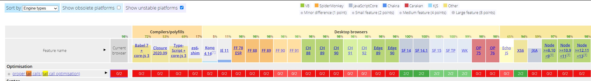

명령형 프로그래밍은 명사 중심의 언어. 함수형 프로그래밍은 동사 중심의 언어

함수형 프로그래밍의 목푠느 단순히 함수를 사용하는 것이 아니다. 진짜 목표는 애플리케이션의 부수 효과(side effect)를 방지하고 상태 변이를 감소하기 위해 데이터의 제어 흐름과 연산을 추상화하는 것이다. 

함수형 프로그래밍은 큰 틀에서 선언적 프로그래밍 패러다임에 속한다. 내부적으로 코드를 어떻게 구현했는지, 데이터는 어떻게 흘러가는지 밝히지 않은 해 연산/작업을 표현하는 사상이다. 아직은 자바, C#, C++ 등의 구조적/객체지향 언어가 지원하는 명령형 또는 절차적 모델이 더 많이 쓰인다. 명령형 프로그램은 어떤 결과를 내기 위해 시스템의 상태를 변경하는 구문을 위에서 아래로 쭉 늘어놓은 순차열에 불과하다.

```javascript
// 명령형
var array = [0, 1, 2, 3, 4, 5, 6, 7, 8, 9]
for(let i = 0; i < array.length; i++) {
	array[i] = Math.pow(array[i], 2)
}

// 함수형
[0, 1, 2, 3, 4, 5, 6, 7, 8, 9].map(
	function(num) {
		return Math.pow(num, 2)
	}
)
```

왜 루프를 제거해야할까? 루프는 재사용하기도 어렵거니와 다른 연산에 끼워 넣기도 어려운 명령형 제어 구조물이다. 또, 루프는 성격상 반복할 때마다 값이나 상태가 계속해서 바뀐다. 그러나 함수형 프로그램은 무상태성(statelessness)과 불변성을 지향한다. 무상태 코드는 전역 상태를 바꾸거나 혼선을 일으킬 가능성이 전혀 없다. 상태를 두지 않으려면 부수 효과와 상태 변이를 일으키지 않는 순수 함수(pure function)를 써야 한다.

```javascript
// 불순한 코드
var counter = 0
function increment() {
	return ++counter
}
```


부수효과가 발생하는 상황은 다양하다.

- 전역 볌위에서 변수, 속성, 자료구조를 변경
- 함수의 원래 인수 값을 변경
- 사용자 입력을 처리
- 예외를 일으킨 해당 함수가 붙잡지 않고(catch) 그대로 예외를 던짐(throw)
-  화면 또는 로그 파일에 출력
- HTML 문서, 브라우저, 쿠키, DB에 질의

객체를 생성/변경하지 못하고 콘솔에 출력조차 할 수 없다면 그런 프로그램이 대체 무슨 소용일까요? 역동적으로 움직이며 온갖 변경이 난무하는 프로그램에서 순수함수를 사용하기란 현실적으로 어려울 수 있지만, 실제로 함수형 프로그래밍은 모든 상태 변이를 근절하자는 건 아니고, 상태 변이를 줄이고 관리할 수 있는 프레임워크를 제공하여 순수/불순 함수를 구분하자는 것이다. 

커링이라는 유명한 FP 기법

이제 좀 더 현실적인 예제를 확인해보자

모 대학교 전산실에 근무하는 개발자로, 학생 데이터를 관리하는 애플리케이션을 개발하는 프로젝트에 참여 중이라고 가정한다. 

```javascript
// 부수효과를 일으키는 명령형 showStudent 함수

function showStudent(ssn) {
	let student = db.find(ssn);
	if(student !== null) {
		document.querySelector(`#${elementId}`).innerHTML = `${student.ssn}, ${student.forstname}, ${student.lastname}`;
	}
	else {
		throw new Error('학생을 찾을 수 없습니다!');
	}
}

showStudent('444-44-4444');
```

```javascript
var find = curry((db, id) => {
	let obj = db.find(id);
	if(obj === null) {
		throw new Error('객체를 찾을 수 없습니다.');
	}
	return obj;
})

var csv = student => `#${elementId}`).innerHTML = `${student.ssn}, ${student.forstname}, ${student.lastname}`;

var append = curry((selector, info) => {
	document.querySelector(selector).innerHTML = info;
});
```

참조 투명성은 순수함수를 정의하는 좀 더 공식적인 방법이며, 여기서 순수성이란 함수의 인수와 결괏값 사이의 순수한 매핑 관계를 의미한다. 따라서 어떤 함수가 동일한 입력을 받았을 때 동일한 결과를 내면 이를 참조 투명한 함수라고 합니다. 

```javascript
// 참조 투명성을 지키지 않은 함수
var counter = 0;

function increment() {
	return ++counter;
}

// 참조 투명성을 지킨 함수
var increment = counter => counter + 1;
```

불변 데이터 유지하기

불변 데이터는 한번 생성된 후에는 절대 바뀌지 않는다. 다른 언어도 그렇듯이 문자열, 숫자등 자바스크립트의 모든 기본형(원시 자료형)은 처음부터 불변이다. 그러나 배열 등의 객체는 불변이 아니어서 함수 인수로 전달해도 원래 내용이 변경되어 부수효과가 발생할 소지가 남아있다. 배열을 정렬하는 간단한 코드를 확인하자.

```javascript
var arr = [1, 2, 3, 4, 5]

arr.sort((a, b) => b - a)
```

이 코드는 arr 자체를 수정하게 된다. 떄문에 부수 효과에 해당한다.

함수형 프로그래밍의 작업 단위는 바로 함수 자신이다. 

함수 체인은 필요한 시점까지 실행을 미루는 느긋한 평가(lazy evaluation) 를 수행한다. 다른 데에선 전현 쓸 일이 없는 일련의 코드를 전부 실행하지 않아도 되니 CPU 부하가 줄어들고 성능이 좋아진다.

굳이 리액티브와 함수형을 섞어 쓸 필요는 없지만, 함수형으로 사고하다 보면 두 가지를 혼용하게 되어 결국 함수형 리액티브 프로그래밍이라는 정말 기막힌 아키텍쳐에 눈을 뜨게 됩니다.

함수형 프로그래밍은 지금까지 여러분이 맞닥뜨린 프로그래밍 난제를 전혀 다른 방식으로 접근.도전하게 유도하는 일대 패러다임의 전환입니다. 그럼, 이미 널리 알려진 객체지향 설계를 함수형 프로그래밍이 완전히 대체하는 것인가? 함수형 프로그래밍을 코드에 적용하는 건 전부를 얻거나 전부를 읽는 식의 접근 방법이 아니다. 이미 객체지향형 아키텍쳐와 함수형 프로그래밍을 병용하여 혜택을 본 애플리케이션 사례는 많다. 함수형 프로그래밍은 불변성과 공유 상태를 엄격하게 통제하므로 멀티스레드 프로그램보다 직관적으로 작성할 수 있다. 자바스크립트는 싱글스레드로 작동하는 플랫폼이므로 멀티스레드는 우리가 걱정하거나 이 책에서 다룰 주제는 아니다. 

자바스크립트에서의 함수형 프로그래밍

자바스크립트에서는 어떻게 변수들을 불변하게 관리할 수 있을까?

원사 타입의 경우 const를 활용하면 불변하게 만들 수 있다. 하지만 문제는 객체!!(자바스크립트의 배열은 객체이기 때문에 객체로 묶어서 언급하겠다.)

깊이가 얕은 경우 `Object.freeze()`를 사용하면 된다(shallow freeze). 하지만, 객체의 깊이가 깊은 경우에는 이런 얕은 동결로는 문제를 해결할 수 없다. 크게 두가지의 방법이 있다

첫번째로는 재귀 함수를 만들어 객체의 중첩된 구조를 일일이 수작업으로 동결하는 방법이다.

```javascript
var isObject = (val) => val && typeof val === 'object';

function deepFreeze(obj) {
	if(isObject(obj) && !Object.isFrozen(obj)) {
		Object.keys(obj).forEach(name => deepFreeze(obj[name]));
		
		Object.freeze(obj);
	}
	return obj;
}
```

두번쨰 방법은 immutable.js 나 mori.js를 사용하는 방법.

고계함수

map, filter, reduce

```javascript
// 명령형 프로그래밍
var result = [];
for(let i = 0; i< names.length; i++) {
	var n = names[i];
	if(n !== undefined && n !== null) {
		var ns = n.replace(/_/, '').split(' ');
		for(let j = 0; j < ns.length; j++) {
			var p = ns[j];
			p = p.charAt(0).toUpperCase() + p.slice(1);
			ns[j] = p;
		}
		if(result.indexOf(ns.join(' ')) < 0) {
			result.push(ns.join(' '))''
		}
	}
}
result.sort();

// 함수형 프로그래밍(lodash 코드 인듯?)
_.chain(names)
	.filter(isValid)
	.map(s => s.replace(/_/, ' '))
	.uniq()
	.map(_.startCase)
	.sort()
	.value();
```


꼬리 호출 최적화(tail-call optimization)

Tail Call 방식으로 짜여지면 Stack을 새로 만들지 않고 이미 있는 Stack 속의 값만 대체해서 Stack을 재사용하는 방식으로 동작하도록 최적화 할 수 있다. 이러한 최적화를 [**Tail Call Optimization(또는 Tail Call Elimination)**](http://c2.com/cgi/wiki?TailCallOptimization)이라고 하며 **언어의 실행 환경에서 지원해줘야 한다.**



현재 꼬리 호출 최적화를 지원하는 브라우저는 사파리 뿐이다. 하지만, 다른 브라우저들도 머지 않아 이 기능을 지원하겠지.

ES6부터는 꼬리 호출 최적화까지 추가되어 사실상 재귀와 수동 반복(for문)의 성능 차이는 미미해졌다.

```javascript
// 일반 재귀
function sum(arr) {
	if(_.isEmpty(arr)) {
		return 0;
	}
	return _.first(arr) + sum(_.rest(arr));
}

// 꼬리 재귀
function sum(arr, acc = 0) {
	if(_.isEmpty(arr)) {
		return 0;
	}
	return sum(_.rest(arr), acc + _.first(arr))
}
```


 함수형 프로그래밍이 왜 대세인지 위에 나열한 특징들을 본다고 하더라도 잘 이해가 되지 않을 수 있다. 함수형 언어가 이토록 각광받고 있는 이유는 사실 프로세서 발전의 한계 요인이 가장 크다. 과거 70~80년대부터 몇년 전 까지만 해도 프로세서 하나의 성능은 굉장한 속도로 발전하였다. CPU의 성능이 18개월 마다 2배씩 향상이 된다는 법칙이 있을 정도로 CPU 성능의 발전 속도는 굉장했다. 그러나 최근에 들어서는 발전의 속도가 많이 더디어지고 있어, 프로세서의 성능보다는 프로세서를 넣을 수 있는 개수에 발전의 초점을 맞추고 있다. 즉, 프로세서의 성능보다 개수가 점차 중요해짐에 따라 동시성을 이용한 병렬/분산 프로그래밍이 중요해지고 있고, 동시성 프로그래밍을 부작용 없이 가장 잘 할 수 있는 함수형 프로그래밍이 각광을 받고 있는 것이다. 이렇기 때문에 스칼라,  F#, 클로저, 하스켈과 같은 함수형 프로그래밍 언어들이 새롭게 뜨고 있고, 함수형프로그래밍이 아니던 언어Java, C++, C#, JavaScript 등에서도 함수형 프로그래밍을 조금씩 도입하고 있는 것이다.

출처: https://swchon.tistory.com/1 [SoftWare CHON]


Moore's law

[인텔](https://namu.wiki/w/인텔)의 고든 무어가 1965년에 주장한 법칙. $1000로 살 수 있는 [반도체](https://namu.wiki/w/반도체)의 집적회로 성능은 2년마다 2배로 증가한다는 법칙이다. 좀 더 광범위하게 정의하면 **[컴퓨터](https://namu.wiki/w/컴퓨터)의 성능은 일정 시기마다 배가하며 기하급수적으로 증가한다**는 법칙을 말한다고 볼 수 있다.

무어의 법칙은 안 좋은 의미로 깨질 조짐이 보여 왔다. 일단 CPU의 초당 계산 속도는 2010년 즈음부터 이미 2년마다 2배라는 법칙을 따라가지 못하는 중이다.[[3\]](https://namu.wiki/w/무어의 법칙#fn-3)[[4\]](https://namu.wiki/w/무어의 법칙#fn-4) 이유는 [멀티코어 프로세서](https://namu.wiki/w/멀티코어 프로세서)에서 자세히 나와있는데, 주된 이유로는 발열 등으로 코어 하나의 집적도를 높이기 힘들어진 것이 주된 이유.

사실 CPU의 집적도를 높여서 연산 속도를 높이는 방식은 이미 한참 전에 끝나 있다. [멀티코어 프로세서](https://namu.wiki/w/멀티코어 프로세서)가 그 때문에 도입된 기술이고, 현재 멀티 프로세싱 기술은 코어 당 클럭의 숫자 그대로 온전히 연산 속도를 내지 못한다. 현재 CPU 속도는 L2 [캐시](https://namu.wiki/w/캐시)와 아키텍처 개선을 통해 높이는 것이 대세. 또한 [GPGPU](https://namu.wiki/w/GPGPU) 같이 작은 코어를 잔뜩 때려박아서 연산 속도를 높이는 방식은 아직도 유효하다. [슈퍼컴퓨터](https://namu.wiki/w/슈퍼컴퓨터) 역시 같은 원리로 성능이 향상 중이다. 그리고 [SoC](https://namu.wiki/w/SoC)처럼 하나의 칩에 다양한 기능을 넣는 등 컴퓨터 기술은 다양하고 광범위한 방향으로 발전하고 있다. [4GHz의 벽](https://namu.wiki/w/4GHz의 벽)도 읽어보면 이해하는 데 도움이 될 것이다.

