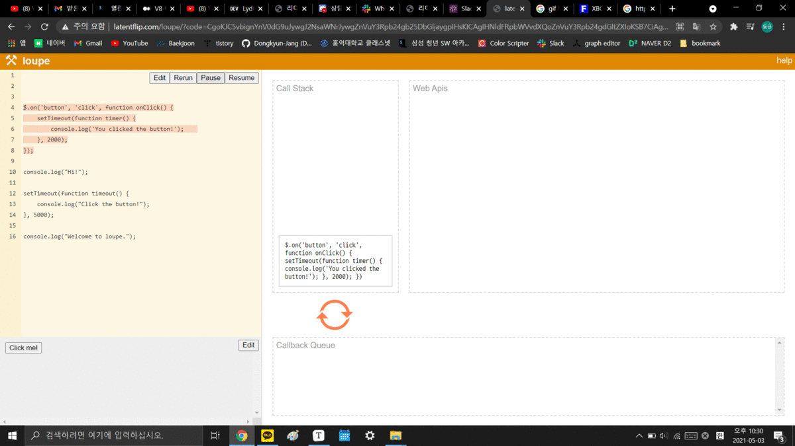

# 🐱‍🚀이벤트 루프

> 
>
> 브라우저의 자바스크립트 파일 처리는, 이벤트 루프를 기반으로 하는 동시성(Concurrency) 모델이다.
>
> 이벤트 루프는 크게 4가지로 구성된다. Call Stack, Web API(Browser API), Task Queue(Event Queue, Message Queue), Event Loop
>
> Call Stack
>
> > 요청이 들어올 때마다 해당 요청을 순차적으로 처리하는 스택 형태의 자료구조
>
> Web API
>
> > 자바스크립트 엔진이 아닌 브라우저 영억에서 제공하는 API
> >
> > setTimeout(), DOM events, AJAX로 데이터를 가져오는 등의 시간이 소요되는 일들을 처리한다.
>
> Task Queue
>
> > Web API로 갔던 함수들이 실행을 마치게 되면, 해당 함수의 콜백 함수들은 Task Queue에 와서 기다리게 된다.
> >
> > 메인 스레드가 끝난 후 실행되어 후속 자바스크립트 코드가 차단되는 것을 방지한다.
>
> Event Loop
>
> > 콜 스택이 비어 있는 지 여부를 확인한다.
> >
> > 비어 있는 경우 Task Queue에서 실행 대기중인 콜백이 있는지 확인한다.
> >
> > Task Queue에 대기중인 콜백이 있다면 가장 앞에 있는 콜백을 콜 스택에 푸시한다.
>
> 

JS는 싱글 스레드이다.

컴퓨터가 여러 개의 CPU를 가지고 있어도 메인 스레드라 불리는 단일 스레드에서만 작업을 수행한다.

즉, 이벤트를 처리하는 Call Stack이 하나인 언어라는 것이다.

one thread == one call stack == one thing at a time

이벤트를 처리할 수 있는 콜 스택이 하나이기 때문에, 시간이 오래 걸리는 작업이 들어오게 되면 딱 하나 있는 스레드는 다른 일을 하지 못하고 이 일만 하게 된다. 

이 문제를 해결하기 위해 브라우저는 JS 파일을 처리할 때, 시간이 오래 걸리는 작업은 Web API로 보내버린다.

Web API에서 처리된 이벤트들은 처리된 순서대로 task queue에서 기다리게 되고, 콜 스택이 비면 이벤트 루프가 task queue에서 가장 오래 된(제일 앞의) 이벤트를 콜 스택으로 보낸다.

---

이 과정을 애니메이션으로 보면 다음과 같다.

> 출처: https://dev.to/lydiahallie/javascript-visualized-event-loop-3dif
>
> 여러 사이트 글을 읽다가 발견하게 되었는데 이벤트 루프를 이해하는데 최고다...
>
> 역시 백마디 글보다 하나의 이미지가 훨씬 더 깊은 이해를 시키는 경우가 많다.


 


---

또 다른 예제이다.

```javascript
const foo = () => console.log("First");
const bar = () => setTimeout(() => console.log("Second"), 500);
const baz = () => console.log("Third");

bar();
foo();
baz();
```


Q. 그렇다면 위의 코드 흐름으로 볼 때, "First", "Third" 가 출력되고 500ms가 지난 후에 "Second" 가 출력되는걸까?

A. 아니다. 저 500ms는 Web API에서 머무르게 되는 시간만을 의미한다. 즉, Web API에서 500ms 머문 이후에 Task Queue에 들어가게 된다. 때문에 "Second" 가 출력되기 위해서는 bar 함수가 실행된 이후 최소 500ms의 시간이 필요한 것이지 500ms 이후에 "Second" 가 출력될 것이라고 단정지을 수는 없는 것이다.

---

위의 예제를 이해했다면 우리는 **Zero delays**에 대해서도 이해할 수 있다.

```javascript
const foo = () => console.log("First");
const bar = () => setTimeout(() => console.log("Second"), 0);
const baz = () => console.log("Third");

bar();
foo();
baz();
```

이번에는 기다리는 시간을 0ms로 둔다. 어떤 결과가 나올까? 답은

```javascript
First
Third
Second
```

위의 예제와 똑같은 결과가 나온다 이다. 0ms를 기다린 이후에, 콜 스택에 들어오는 것이 아니라 Task Queue에 들어가는 것이기 때문에 맨 마지막에 실행되는 것이다.

Zero delays를 활용하면, 동기적으로 동작하는 함수도 비동기적으로 동작하게 만들 수 있다.

---

이번에는 클릭 이벤트가 존재하는 예제이다.



주의 깊게 봐야할 부분은 `$.on('button', 'click', function onClick () {})` 부분이 계속 Web API에 존재한다는 것이다. 

실행의 마지막 부분에 좌측 하단의 Click me! 버튼을 5번 누르자, Task Queue에 button이 click되었을 때 발생하는 콜백 함수인 `onClick()` 함수가 5개  들어가게 되는 것을 확인할 수 있다. 5개의 `onClick()` 함수들은 콜 스택이 비어있기 때문에 하나씩 순서대로 실행된다.

이 예제를 통해 이벤트리스너에 의한 콜백 함수들이 어떤 순서로 실행되는지 알 수 있다.

---

## Never Blocking

이벤트 루프 모델의 재밌는 부분은 다른 언어와 달리 자바스크립트는 절대로 Block하지 않는 다는 것이다. I/O 처리는 흔히 이벤트와 콜백으로 처리 된다. 이 덕분에 기다리지 않고, 그동안 다른 작업들을 수행할 수 있는 것이다.

---

## 정리

자바스크립트는 싱글 스레드이다. 때문에 같은 시간에 한가지 일 밖에 처리하지 못한다. 

참고문헌

https://dev.to/lydiahallie/javascript-visualized-event-loop-3dif

https://developer.mozilla.org/ko/docs/Web/JavaScript/EventLoop

https://www.youtube.com/watch?v=8aGhZQkoFbQ