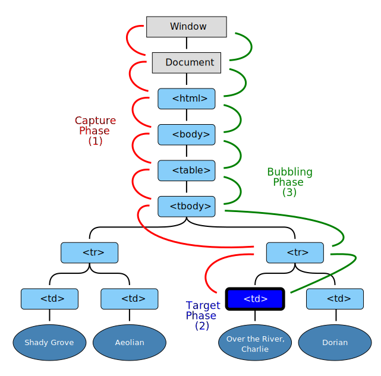

# 이벤트 핸들러

> 모던 자바스크립트를 요약하는 글입니다.
>
> 이벤트 핸들러는 이벤트가 발생했을 때 **브라우저**에 호출을 위임한 함수이다. 다시 말해, 이벤트가 발생하면 **브라우저**에 의해 호출될 함수가 이벤트 핸들러이다.
>
> 즉, 이벤트 핸들러를 작동시키는 주체는 브라우저라는 것을 알아야 한다.

---

만약 함수 참조가 아니라 함수 호출문을 등록하게 되면 함수 호출문의 평가 결과가 이벤트 핸들러로 등록된다.

```html
<button onClick="sayHi('Lee')">Click</button>

<script>
	function sayHi(name) {
        console.log(name);
    }
</script>
```

하지만, 위 예제는 이벤트 핸들러 어트리뷰트 값으로 함수 호출문을 할당했다. 이때 이벤트 핸들러 어트리뷰트 값은 사실 암묵적으로 생성될 이벤트 핸들러의 함수 몸체를 의미한다.

즉, `onClick="sayHi('Lee')"` 어트리뷰트는 파싱되어 

```javascript
function onClick(e) {
	sayHi('Lee');
}
```

해당 함수를 암묵적으로 생성하고, 이벤트 핸들러 프로퍼티에 할당한다.

이처럼 동작할 수 있도록 만들어진 이유는 이벤트 핸들러에 인수를 전달하기 위함이다.  만약 이벤트 핸들러 어트리뷰트 값으로 함수 참조를 할당해야 한다면 이벤트 핸들러 함수에 인수를 전달하기 곤란하다.

때문에 다음과 같은 이벤트 핸들러 함수 할당도 가능하다.

```html
<button onClick="console.log('Hi!'); console.log('Hi');">Click me</button>
```

---

### 이벤트를 다는 두가지 방법

- 이벤트 핸들러 프로퍼티에 함수 바인딩

```javascript
const $button = document.querySelector('button');

$button.onClick = function () {
	console.log('test');
}
```

해당 방식의 가장 큰 문제는 이벤트 핸들러 프로퍼티에 하나의 이벤트 핸들러만 바인딩 할 수 있다는 것이다.

- addEventListener 방식 (실질적으로 사용하게 되는 방식)

```javascript
const $button = document.querySelector('button');

$button.addEventListener('click', () => {
	console.log('test');
})
```

addEventListener 메서드는 하나 이상의 이벤트 핸들러를 등록할 수 있다. 이때 이벤트 핸들러는 등록된 순서대로 호출된다.

만일 똑같은 이벤트 핸들러를 중복으로 등록하면 하나만 등록된다.

```javascript
const handleClick = () => console.log('123');

$button.addEventListener('click', handleClick);
$button.addEventListener('click', handleClick);
```

이렇게하면 실질적으로는 하나의 `handleClick`만이 등록된다.

사실 addEventListener에서 가장 중요한 것은 잘 쓰이지 않는 3번째 인자이다.

`EventTarget.addEventListener('eventType', functionName [, useCapture])`

`useCapture`의 자리를 생략하거나 false를 지정하면 버블링 단계에서 이벤트를 캐치, true를 지정하면 캡처링 단계에서 이벤트를 캐치한다. 더 깊은 내용은 이후에 추가한다.

---

### removeEventListener

이벤트 핸들러를 줄 수 있다는건, 제거도 가능하다는 것이다.

하지만, 이벤트 핸들러를 등록할 때 사용했던 인수들을 동일하게 전달해야지만 제거된다.

```javascript
$button.addEventListener('click', handleClick);

$button.removeEventListener('click', handleClick, true)    // 제거 실패(인자의 개수가 다르다)
$button.removeEventListener('click', handleHover, true)    // 제거 실패(인자의 내용이 다르다)
$button.removeEventListener('click', handleClick)    // 제거 성공
```

---

### 이벤트 객체

이벤트 객체는 이벤트가 발생하였을 때, 동적으로 생성된다.

---

### target vs currentTarget

target은 이벤트를 발생시킨 DOM 요소이다.

currentTarget은 이벤트 핸들러가 바인딩된 DOM 요소이다.

일반적으로 이벤트 객체의 target 프로퍼티와 currentTarget 프로퍼티는 동일한 DOM 요소를 가리킨다. 하지만, 이벤트 위임에서 이벤트 객체의 target 프로퍼티와 currentTarget 프로퍼티가 서로 다른 DOM 요소를 가리킬 수 있다.

---

### 🔴이벤트 전파



두번째 <tr>의 첫번째 <td>를 클릭했을 때 나타나는 이벤트 전파

캡쳐링 단계

> 이벤트가 상위 요소에서 하위 요소 방향으로 전파

타깃 단계

> 이벤트가 이벤트 타깃에 도달

버블링 단계

> 이벤트가 하위 요소에서 상위 요소 방향으로 전파


Event phase constants

| Constant              | Value | Description                                                  |
| --------------------- | ----- | ------------------------------------------------------------ |
| Event.NONE            | 0     | 아무런 이벤트도 발생하지 않는다.                             |
| Event.CAPTURING_PHASE | 1     | 이벤트가 상위 개체를 통해 전파된다. 이 프로세스는 `Window`, `Document`에서 시작하여, `HTMLHtmlElement` 등 대상의 부모에 도달할 때까지 요소들을 통과한다. 이 단계에서 `EventTarget.addEventListener()`가 호출될 때 캡처 모드에 있는 이벤트 리스너가 트리거 된다. |
| Event.AT_TARGET       | 2     | 이벤트가 이벤트 타깃에 도착. 이 단계에서 등록된 이벤트 리스너가 호출된다. 만약 Event.Bubble이 false 라면, 이 단계가 완료된 다음 이벤트 진행은 종료된다. |
| Event_BUBBLING_PHASE  | 3     | 이벤트가 역순으로 대상의 조상을 통해 전파된다. 대상의 부모부터 시작해서, `Window`를 포함하는 단계까지 도달한다. 이는 버블링으로 알려져 있으며, Event.Bubble이 true일 때만 발생한다. 프로세스 중에 이 단계에 등록된 Event Listeners가 트리거 된다. |

---

```html
 <body>
    <ul id="fruits">
      <li id="apple">Apple</li>
      <li id="banana">Banana</li>
      <li id="orange">Orange</li>
    </ul>

    <script>
      const $fruits = document.getElementById("fruits");

      $fruits.addEventListener("click", (e) => {
        console.log(`이벤트 단계: ${e.eventPhase}`);
        console.log(`이벤트 타깃: ${e.target}`);
        console.log(`커런트 타깃: ${e.currentTarget}`);
      });
    </script>
  </body>
```


노란색 영역이 li 3개가 합쳐진 영역, 주황색이 이벤트 핸들러가 바인딩되어 있는 ul의 영역이다.


노란색 영역을 클릭했을 때 나오는 콘솔과 노란색 영역을 제외한 주황색 영역을 클릭했을 때  나오는 콘솔이다.

먼저, 노란색 영역을 먼저 보겠다. 노란색 영역을 클릭하게 되면 이벤트를 발생시키는 DOM은 `<li>`태그가 된다. 때문에 이벤트 타깃으로 `<li>`태그가 등록되어 있는 것을 볼 수 있다. 하지만, 실제 이벤트가 바인딩되어 있는 DOM은 `<ul>`태그이다. 때문에 커런트 타깃은 `<ul>`태그가 된다.

다음은 주황색 영역이다. 노란색을 제외한 주황색 영역을 클릭하게 되면 이벤트를 발생시키는 DOM과 이벤트가 바인딩 되어 있는 DOM 모두가 `<ul>`태그가 된다. 때문에, 이벤트 타깃과 커런트 타깃 모두가 `<ul>`태그임을 확인할 수 있다.

이벤트 단계의 경우 방금 표에서 확인했듯이 1 - 캡쳐링, 2 - 타깃, 3 - 버블링이다.

주황색 영역의 경우 2가 나오는 것은 당연하다. 이벤트를 발생시킨 DOM과 이벤트가 바인딩되어 있는 DOM이 같은 경우를 타깃 단계라고 하기 때문이다.

반면에 노란색의 경우 이벤트 단계가 3이 나온 것이 조금은 의아할 수도 있다.

1. li 요소를 클릭하면 클릭 이벤트가 발생하여 클릭 이벤트 객체가 생성되고, `li` 요소가 이벤트 타깃이 된다.
2. 이때 이벤트 객체는 `window`에서 시작하여 이벤트 타깃(`li` 요소)으로 전파된다. 이것이 캡쳐링 단계이다.
3. 이후 이벤트 객체는 이벤트를 발생시킨 이벤트 타깃에 도달한다. 이것이 타깃 단계이다.
4. 이후 이벤트 객체는 이벤트 타깃에서 시작해서 `window` 방향으로 전파된다. 이것이 버블링 단계이다.

결국, `li` 요소를 클릭했을 때 이벤트가 실질적으로 바인딩되어 있는 ul 요소에 가장 먼저 도달하게 되는 순간은 **캡쳐링 단계**이다. 그렇다면 분명 이벤트 단계가 1이 출력되었어야 할 것 같은데 실제로는 3이 출력된다.

이는 이벤트 핸들러 어트리뷰트/프로퍼티 방식으로 등록한 이벤트 핸들러와 `addEventListener` 방식으로 등록한 이벤트 핸들러 모두 기본적으로 타깃 단계와 버블링 단계만을 캐치할 수 있기 때문이다.

하지만, 이 두 방식에는 차이가 존재하는데 `addEventListener`의 경우에는 캡쳐링 단계 또한 선별적으로 캐치할 수 있다는 것이다.

`addEventListener`의 3번째 인수로 `true`를 전달하면 캡쳐링 단계 또한 캐치가 가능해진다. 3번째 인수를 생략하거나 `false`를 전달하면 타깃 단계와 버블링 단계의 이벤트만 캐치할 수 있다.

이를 이해했다면 아래의 코드에서 나오는 결과를 예측해볼 수 있다.

```html
 <body>
    <ul id="fruits">
      <li id="apple">Apple</li>
      <li id="banana">Banana</li>
      <li id="orange">Orange</li>
    </ul>

    <script>
      const $fruits = document.getElementById("fruits");
      const $banana = document.getElementById('banana');

      $fruits.addEventListener("click", (e) => {
        console.log(`이벤트 단계: ${e.eventPhase}`);  // 3: 버블링 단계
        console.log(`이벤트 타깃: ${e.target}`);  // [object HTMLLIElement]
        console.log(`커런트 타깃: ${e.currentTarget}`);  // [object HTMLUListElement]
      });
      
      $fruits.addEventListener("click", (e) => {
      	console.log(`이벤트 단계: ${e.eventPhase}`);  // 1: 캡처링 단계
        console.log(`이벤트 타깃: ${e.target}`);  // [object HTMLLIElement]
        console.log(`커런트 타깃: ${e.currentTarget}`);  // [object HTMLUListElement]
      }, true);
      
       $banana.addEventListener("click", (e) => {
      	console.log(`이벤트 단계: ${e.eventPhase}`);  // 2: 타깃 단계
        console.log(`이벤트 타깃: ${e.target}`);  // [object HTMLLIElement]
        console.log(`커런트 타깃: ${e.currentTarget}`);  // [object HTMLLIElement]
      });
    </script>
  </body>
```


---

### 버블링을 통해 전파되지 않는 이벤트

대부분의 이벤트는 캡처링과 버블링을 통해 전파된다. 하지만 다음 이벤트는 버블링을 통해 전파되지 않는다.

- 포커스 이벤트: focus/blur
- 리소스 이벤트: load/unload/abort/error
- 마우스 이벤트: mouseenter/mouseleave

위 이벤트는 버블링되지 않기 때문에 이벤트 타깃의 상위 요소에서 위 이벤트를 캐치하려면 캡처링 단계의 이벤트를 캐치해야 한다. 하지만 위 이벤트를 상위 요소에서 캡쳐해야 할 경우는 그리 많지 않고, 상위 요소에서 캐치해야만 한다면 대체할 수 있는 이벤트도 존재한다.

focus/blur 이벤트는 focusin/focusout으로, mouseenter/mouseleave는 mouseover/mouseout으로 대체할 수 있다. focusin/focusout, mouseover/mouseout은 버블링을 통해 전파된다. 때문에 캡처링 단계에서 이벤트를 캐치해야 하는 경우는 거의 없다.

---

```html
  <body>
    <p>버블링과 캡쳐링 이벤트 <button>버튼</button></p>
    <script>
      document.body.addEventListener("click", () => {
        console.log("Handler for body");
      });

      document.querySelector("p").addEventListener(
        "click",
        (e) => {
          console.log("Handler for paragraph");
        },
        true
      );

      document.querySelector("button").addEventListener("click", (e) => {
        console.log("Handler for button");
      });
    </script>
  </body>
```

위의 내용을 모두 이해했다면 p 태그 부분을 눌렀을 때와 button 태그 부분을 눌렀을 때 무엇이 콘솔창에 나올지 예측해볼 수 있다.

1. `button` 요소에서 클릭 이벤트가 발생한 경우

   - 가장 먼저 캡처링 단계를 캐치하는 `p` 요소의 이벤트 핸들러가 가장 먼저 호출

   - 타깃 단계의 `button` 요소의 이벤트 핸들러 호출

   - 버블링 단계에서 `body` 요소의 이벤트 핸들러 호출

     ```html
     Handler for paragraph
     Handler for button
     Handler for body
     ```

2. `p` 요소에서 클릭 이벤트가 발생한 경우

   - 타깃 단계의 `p` 요소의 이벤트 핸들러 호출

   - 버블링 단계에서 `body` 요소의 이벤트 핸들러 호출

     ```
     Handler for paragraph
     Handler for body
     ```

----

### 참고문헌

모던자바스크립트 딥다이브

https://developer.mozilla.org/ko/docs/Web/API/Event/eventPhase

