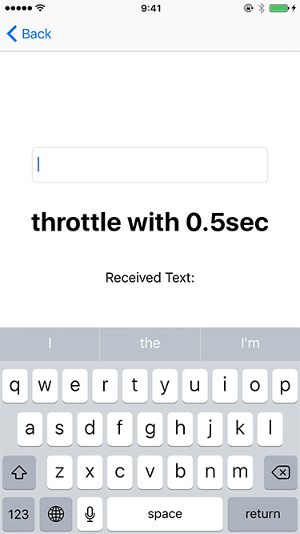

# 🎇디바운스와 스로틀

> 모던 자바스크립트 Deep Dive 41장을 바탕으로 작성합니다.

---

scroll, resize, input, mousemove와 같은 이벤트에 바인딩된 이벤트 핸들러는 과도하게 호출되어 성능에 문제를 일으킬 수 있다. 디바운스(debounce)와 스로틀(throttle)은 짧은 시간 간격으로 연속해서 발생하는 이벤트를 그룹화해서 과도란 이벤트 핸들러의 호출을 방지하는 프로그래밍이다.

---

### 디바운스


디바운스는 짧은 시간 간격으로 발생하는 이벤트를 그룹화해서 마지막에 한 번만 이벤트 핸들러가 호출되도록 한다.

참고한 블로그에서는 디바운스를 이렇게 표현한다.

*당신이 엘리베이터 안에 있다고 상상해 보세요. 문이 닫히기 시작하고 갑자기 다른 사람이 타려고 한다면 엘리베이터가 층으로 이동하는 기능을 시작하지 않아서 문이 다시 열리게 됩니다. 그리고 또 다른 사람에 의해 층의 이동 변경 기능이 일어나게 됩니다. 즉, 엘리베이터는 기능을 지연시키고 있지만(층간 이동), 자원을 최적화하게 됩니다.*

출처: https://webclub.tistory.com/607 [Web Club]

**그렇다면 디바운스는 어떠한 경우에 사용해야 할까?**

이벤트가 연속해서 발생하다가, 일정 시간 동안 더 이상 이벤트 발생하지 않게 되면 그때 딱 한 번 이벤트 핸들러를 호출하는 특징을 가지는 디바운스는 resize 이벤트 처리, input 요소에 입력된 값으로 AJAX 요청하는 입력 필드 자동완성 UI 구현, 버튼 중복 클릭 방지 처리 등에 유용하게 사용된다.

```javascript
<script>
	const $input = document.querySelector('input')
	const $msg = document.querySelector('.msg')
    
	const debounce = (callback, delay) => {
		let timerId;
		// debounce 함수는 timerId를 기억하는 클로저를 반환한다. (이 말을 아직 정확히 이해하지 못함...)
		return event => {
			// delay가 경과하기 이전에 이벤트가 발생하면 이전 타이머를 취소하고 새로운 타이머를 재설정.
             // 따라서 delay보다 짧은 간격으로 이벤트가 발생하면 callback은 호출되지 않는다.
             if (timerId) clearTimeout(timerId)
             timerId = setTimeout(callback, delay, event)
		}
	}
    
    // debounce 함수가 반환하는 클로저가 이벤트 핸들러로 등록된다.
    // 300ms보다 짧은 간격으로 input 이벤트가 발생하면 debounce 함수의 콜백 함수는
    // 호출되지 않다가 300ms 동안 input 이벤트가 더 이상 발생하지 않으면 한 번만 호출된다.
    $input.oninput = debounce(e => {
        $msg.textContent = e.target.value
    }, 300)
</script>
```

위 예제는 debounce 함수의 기초 구현일 뿐이지 완벽하지는 않다고 한다. 실무에서는 Underscore의 debounce 함수나 Lodash의 debounce 함수를 사용하는 것을 권장한다.

---

### 스로틀



스로틀은 이벤트를 일정한 주기마다 발생하도록 하는 기술이다. 만약, throttle의 설정시간으로 1ms를 주게되면 해당 이벤트는 1ms 동안 최대 한번만 발생하게 된다.

**그렇다면 스로틀은 어떠한 경우에 사용해야 할까?**

스로틀은 scroll 이벤트 처리나 무한 스크롤 UI 구현 등에 유용하게 사용된다.

**왜 디바운스가 아니라 스로틀을 통해 무한 스크롤을 구현해야 하는걸까?**

> 먼저 디바운스와 스로틀의 차이에 대해 짚고 넘어가야 한다. 디바운스는 연속된 이벤트가 끝난 이후에 딱 한 번 이벤트 핸들러를 호출한다. 반면, 스로틀은 연속된 이벤트 중간중간 일정한 주기마다 이벤트 핸들러를 호출할 수 있다.
>
> 이 차이 때문에 스로틀이 더 적합한 것이다. 디바운스는 스크롤을 멈출 때만 이벤트를 발생시키므로 사용자가 스크롤을 끝까지 내리고 일정 시간 기다리면 그제서야 Ajax 요청을 통해 추가적인 데이터를 제공하게 된다. 이것보다는 당연히 스크롤 이벤트가 발생하는 중간중간 특정 지점을 넘어갔는지 확인하고, 넘어갔다면 스크롤이 맨 끝에 도착하기 전에 미리 Ajax 요청을 보내놓는 것이 훨씬 효율적일 것이다. 

```javascript
<script>
	const $container = document.querySelector('.container')
	const $throttleCount = document.querySelector('throttle-count')
	
	const throttle = (callback, delay) => {
		let timerId
		// throttle 함수는 timerId를 기억하는 클로저를 반환한다.
		return event => {
			// delay가 경과하기 이전에 이벤트가 발생하면 아무것도 하지 않다가
			// delay가 경과했을 때 이벤트가 발생하면 새로운 타이머를 재설정한다.
			// 따라서 delay 간격으로 callback이 호출된다.
			if (timerId) return
			timerId = setTimeout(() => {
				callback(event)
				timerId = null
			}, delay, event)
		}
	}
	
	$container.addEventListener('scroll', throttle(() => {
		// throttle 함수가 반환하는 클로저가 이벤트 핸들러로 등록된다.
		$throttleCount.textContent = ++throttleCount
	}, 100))
</script>
```

위 예제는 throttle 함수의 기초 구현일 뿐이지 완벽하지는 않다고 한다. 실무에서는 Underscore의 throttle 함수나 Lodash의 throttle 함수를 사용하기를 권장한다. 

---

### 디바운스와 스로틀의 차이점(출처: https://webclub.tistory.com/607)

디바운스와 스로틀의 가장 큰 차이점은 스로틀은 적어도 X밀리 초마다 정기적으로 기능 실행을 보장한다는 것이다.

디바운스는 아무리 많은 이벤트가 발생해도 모두 무시하고 특정 시간사이에 어떤 이벤트도 발생하지 않았을 때 딱 한번만 마지막 이벤트를 발생시키는 기법이다.

---

## 참고자료

https://webclub.tistory.com/607

https://fabioars.github.io/underwater/docs/functions.html    // 이미지 출처

모던 자바스크립트 Deep Dive(위키북스) 