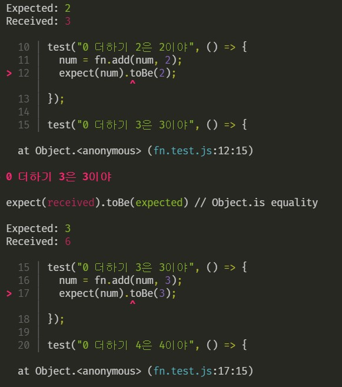

# 👏jest를 사용한 TDD 연습

>자바스크립트는 최근 몇 년간 비약적인 발전을 통해 사용 범위를 넓혀오고 있으며, 프론트엔드 환경에서 요구하는 애플리케이션의 수준도 나날이 복잡해지고 있다. 이와 더불어 자바스크립트의 테스트 환경도 짧은 기간 동안 많은 변화를 겪었는데, 특히 [Node.js](https://nodejs.org/en/)의 등장 이후 무수히 많은 도구가 쏟아져 나오며 빠른 속도로 발전해오고 있다.
>
>프론트엔드 코드는 사용자에 따라 다양한 환경(브라우저, 기기, 운영체제 등)에서 실행되기 때문에 테스트할 때 많은 변수들을 고려해야 한다. 이 때문에 자바스크립트는 테스트를 위한 환경과 테스트 도구들을 얼마나 잘 이해하고 있는지가 중요한 요소이며, 프로젝트의 성격에 맞게 테스트의 범위나 테스트 대상을 결정하는 등의 전략을 세울 때에도 많은 노하우가 필요하다.
>
>https://ui.toast.com/fe-guide/ko_TEST
>
>해당 블로그에 왜 자바스크립트에서의 TDD가 중요한지와 여러가지 테스트 도구들에 대한 사용법들을 설명해주고 있다.
>
>그중에서도 가장 점유율이 높은 jest를 학습해보려 한다.
>
>https://www.youtube.com/channel/UCxft4RZ8lrK_BdPNz8NOP7Q
>
>유튜브 코딩앙마 님의 강의를 참고하였습니다. 정말 좋은 강의 감사합니다.

---

### 1. 프로젝트 폴더를 만들고 기본 설정을 수행한다

`$yarn init`    // `package.json` 생성

`$yarn add --dev jest`    // jest 설치

```javascript
"scripts": {
    "test": "jest"    // jest 실행을 위한 명령어 수정
},
```


---

### 2. 원하는 자바스크립트 파일을 생성한다.

`yarn test`명령어를 통해 jest를 실행하게 되면 프로젝트 내의 모든 테스트 파일들이 실행된다. 테스트 파일들이란, `***.test.js`와 같이 중간에 test가 명시되어 있는 파일 혹은 `__test__` 폴더 속에 있는 파일들을 의미한다.

```javascript
// fn.js를 파일명으로 설정하겠다.

const fn = {
  add: (num1, num2) => num1 + num2,
};

module.exports = fn;
```

```javascript
// 테스트 수행을 위한 파일
// fn.test.js

const fn = require("./fn");

test("1은 1이야", () => {
  expect(1).toBe(1);
});

test("2 더하기 3은 5야", () => {
  expect(fn.add(2, 3)).toBe(5);
});

test("3 더하기 3은 5야", () => {
  expect(fn.add(3, 3)).not.toBe(5);
});
```


다음과 같이 테스트가 잘 수행되었음을 확인할 수 있다.

test의 첫번째 인자는 해당 테스트에 대한 설명, 두번째 인자는 실제 테스트를 위한 콜백 함수가 들어간다. 다른 개발자가 봤을 때 이름만 보고 해당 테스트가 어떠한 테스트를 수행하는지 알 수 있도록 자세하게 표현해놓을 필요가 있다.

---

### 기본형과 참조형

객체를 반환하는 함수를 추가한다.

```javascript
const fn = {
  add: (num1, num2) => num1 + num2,
  makeUser: (name, age) => ({ name, age }),
};

module.exports = fn;
```

```javascript
const fn = require("./fn");

test("이름과 나이를 전달받아서 객체를 반환해줘", () => {
  expect(fn.makeUser("Mike", 30)).toBe({
    name: "Mike",
    age: 30,
  });
});

test("이름과 나이를 전달받아서 객체를 반환해줘", () => {
  expect(fn.makeUser("Mike", 30)).toEqual({
    name: "Mike",
    age: 30,
  });
});
```

이런 식으로 테스트해보면 결과는 어떨까?


다음과 같이 `toBe`를 사용한 테스트는 실패하고, `toEqual`을 사용한 테스트는 성공하는 것을 확인할 수 있다.

그 이유는 테스트를 통해 검사하는 값이 이번에는 기본형이 아닌 참조형 즉 객체이기 때문이다.

하지만 에러 메시지를 보게되면 `If it should pass with deep equality, replace "toBe" with "toStrictEqual"` 즉, `toEqual`도 아닌 `toStrictEqual`을 쓰라고 명시되어 있다.

---

### toEqual과 toStrictEqual

기존 `makeUser` 함수에 인자값을 추가하는데 default 값으로 `undefined`를 준다.

```javascript
const fn = {
  add: (num1, num2) => num1 + num2,
  makeUser: (name, age) => ({ name, age, gender: undefined }),
};

module.exports = fn;
```

```javascript
test("이름과 나이를 전달받아서 객체를 반환해줘", () => {
  expect(fn.makeUser("Mike", 30)).toEqual({
    name: "Mike",
    age: 30,
  });
});

test("이름과 나이를 전달받아서 객체를 반환해줘", () => {
  expect(fn.makeUser("Mike", 30)).toStrictEqual({
    name: "Mike",
    age: 30,
  });
});

test("이름과 나이를 전달받아서 객체를 반환해줘", () => {
  expect(fn.makeUser("Mike", 30)).toStrictEqual({
    name: "Mike",
    age: 30,
    gender: undefined,
  });
});
```


해당 결과는 다음과 같다. 즉, `toStrictEqual`이 조금 더 엄격한 검사를 수행하게 되는 메서드이다.

개발자의 입장에서 봤을 때 `toStrictEqual`을 사용했을 때 나오는 결과물이 실제로 기대했던 결과물일 것이다. 때문에 `toEqual` 보다는 `toStrictEqual`을 사용하는 것이 더 좋은 선택지가 될 것이다.

---

### 기본값을 체크하는 다른 메서드들

| 메서드        | 의미                     |
| ------------- | ------------------------ |
| toBeNull      | null의 유무만 확인       |
| toBeUndefined | undefined의 유무만 확인  |
| toBeDefined   | toBeUndefined의 반대     |
| toBeTruthy    | Boolean의 true인지 확인  |
| toBeFalsy     | Boolean의 false인지 확인 |

```javascript
test("null은 null입니다", () => {
	expect(null).toBeNull();
});

test("비어있지 않은 문자열은 true입니다", () => {
	expect(fn.add("hello", "world")).toBeTruthy();
})
```

---

### 숫자와 관련된 비교

| 메서드                 | 의미        |
| ---------------------- | ----------- |
| toBeGreaterThan        | 크다        |
| toBeGreaterThanOrEqual | 크거나 같다 |
| toBeLessThan           | 작다        |
| toBeLessThanOrEqual    | 작거나 같다 |

```javascript
test("ID는 10자 이하여야 합니다", () => {
  const id = "THE_BLACK";
  expect(id.length).toBeLessThanOrEqual(10);
});

test("비밀번호는 반드시 4자리여야 합니다", () => {
  const pw = "1234";
  expect(pw.length).toBe(4);
});
```

그렇다면 소수점을 계산하는 경우에는 어떻게 테스트할 수 있을까?

자바스크립트의 경우 소수점 계산을 하게 되면 정확한 값이 나오지 않는 경우들이 발생한다. ex) 0.1 + 0.2 = 0.3000000000004

때문에 소수점 계산을 테스트하는 경우 약간의 오차가 가능하도록 설정해야 하는데, 이것을 위한 메서드가 `toBeCloseTo`이다.

```javascript
test("0.1 더하기 0.2는 0.3입니다", () => {
	expect(fn.add(0.1, 0.2)).toBe(0.3);
});    // fail

test("0.1 더하기 0.2는 0.3입니다", () => {
	expect(fn.add(0.1, 0.2)).toBeCloseTo(0.3);
});    // successs
```

---

### 문자열에서 특정한 문자를 포함하고 있는지 확인

해당 경우 `toMatch(정규표현식)` 메서드를 사용한다.

```javascript
test("Hello World에 a라는 글자가 있나?", () => {
  expect("Hello World").toMatch(/a/g);
});    // fail

test("Hello World에 H라는 글자가 있나?", () => {
  expect("Hello World").toMatch(/H/g);
});    // success
```

---

### 에러 발생을 확인하는 메서드

```javascript
// fn.js

const fn = {
  add: (num1, num2) => num1 + num2,
  makeUser: (name, age) => ({ name, age, gender: undefined }),
  throwErr: () => {
    throw new Error("에러 났어요");
  },
};

module.exports = fn;
```

```javascript
test("에러 나온다 이거", () => {
  expect(() => fn.throwErr()).toThrow();
});    // success

test("에러 나온다 이거", () => {
  expect(() => fn.throwErr()).toThrow("ss");
});    // fail

test("에러 나온다 이거", () => {
  expect(() => fn.throwErr()).toThrow("에러 났어요");
});    // success
```

---

여기에 나온 메서드들 뿐만 아니라 훨씬 많은 메서드들이 존재하고

https://jestjs.io/docs/en/expect

에서 확인할 수 있다.

---

### 비동기 테스트

getName이라는 비동기 함수를 작성하고 테스트 코드를 넣어보자

```javascript
const fn = {
  add: (num1, num2) => num1 + num2,
  getName: (callback) => {
    const name = "Mike";
    setTimeout(() => {
      callback(name);
    }, 3000);
  },
};

module.exports = fn;
```

```javascript
const fn = require("./fn");

test("3초 후에 받아온 이름은 Mike", () => {
  function callback(name) {
    expect(name).toBe("Mike");
  }
  fn.getName(callback);
});

```


얼핏 보면 제대로 테스트를 통과한 것처럼 보인다. 하지만, 이상한 점이 존재하는데 우리가 `setTimeout`의 두번째 인자로 3000ms를 주었다는 사실이다.

그렇다는 것은 최소한 3000ms는 기다리고 콜백 함수가 실행되었어야 하는데 그렇지 않고 1ms가 지나고 나서 바로 함수가 실행되었다.

왜 그럴까?

jest의 특징 때문이다. jest의 특성상 코드를 쭉 한번씩 실행시키고나면 이후에 추가로 기다리지 않고 테스트를 바로 종료시켜버린다.

이를 해결하기 위해 우리는 `done`이라는 파라미터를 활용할 수 있다. 기존 함수 선언은 그대로 두고 테스트 코드만 이런 식으로 수정한다.

```javascript
const fn = require("./fn");

test("3초 후에 받아온 이름은 Mike", (done) => {
  function callback(name) {
    expect(name).toBe("Mike");
    done();
  }
  fn.getName(callback);
});
```


`done()`을 활용하여 콜백 함수가 종료되면, 그때 테스트를 종료하라고 명시하였다.

이 덕분에 이전 결과와는 달리 최소 3000ms (실제로는 3010ms) 를 기다리고 나서 결과값이 출력된 것을 확인할 수 있다.

또한, 실제 비동기를 사용하듯이 try/catch 구문을 비동기 테스트에서 활용할 수도 있으며 이것이 조금 더 정형화된 케이스이다.

```javascript
const fn = require("./fn");

test("3초 후에 받아온 이름은 Mike", (done) => {
  function callback(name) {
    try {
      expect(name).toBe("Mike");
    } catch (error) {
      console.log(error);
    } finally {
      done();
    }
  }
  fn.getName(callback);
});

```

---

### Promise를 사용하는 예제

```javascript
const fn = {
  getAge: () => {
    const age = 30;
    return new Promise((res, rej) => {
      setTimeout(() => {
        res(age);
        //rej("err");
      }, 3000);
    });
  },
};

module.exports = fn;
```

```javascript
test("3초 후에 받아온 이름은 Mike", () => {
  return fn.getAge().then((age) => {
    expect(age).toBe(30);
  });
});
```

이런 식으로 Promise를 테스트할 수 있다. 이전에 봤던 비동기 테스트와 가장 다른 점은

1. done이 빠졌다
2. return문이 추가되었다

이 두가지 측면이다. 또한 프로미스의 경우 더 간단하게도 표현이 가능하다.

```javascript
test("3초 후에 받아온 이름은 Mike", () => {
  return expect(fn.getAge()).resolves.toBe(30);
  //return expect(fn.getAge()).rejects.toMatch("err");
});
```

이런 식으로도 테스트를 수행할 수 있다. `res`를 통해 전달된 인자값이 `resolves`를 통해, `rej`를 통해 전달된 인자값이 `rejects`를 통해 처리된다는 것을 확인 할 수 있다.

(숫자 비교는 `toBe`, 문자열 비교는 `toMatch`라는 것을 잊지 말자)

---

### async/await 사용하기

```javascript
const fn = {
  getAge: () => {
    const age = 30;
    return new Promise((res, rej) => {
      setTimeout(() => {
        res(age);
      }, 3000);
    });
  },
};

module.exports = fn;

```

```javascript
test("3초 후 나이 30", async () => {
  const age = await fn.getAge();
  expect(age).toBe(30);
});
```

비동기 테스팅의 여러 모양을 봤지만 당연히 이 모양이 가장 익숙하고 해당 모양을 가장 많이 쓰게 되지 않을까 싶다.

물론, 다음과 같은 모양 또한 가능하다.

```javascript
test("3초 후 나이 30", async () => {
    await expect(fn.getAge()).resolves.toBe(30);
})
```

이 모양도 좋은듯

---

### 테스트 이전에 어떠한 동작이 필요한 경우

```javascript
const fn = require("./fn");

let num = 0;

test("0 더하기 1은 1이야", () => {
  num = fn.add(num, 1);
  expect(num).toBe(1);
});

test("0 더하기 2은 2이야", () => {
  num = fn.add(num, 2);
  expect(num).toBe(2);
});

test("0 더하기 3은 3이야", () => {
  num = fn.add(num, 3);
  expect(num).toBe(3);
});

test("0 더하기 4은 4이야", () => {
  num = fn.add(num, 4);
  expect(num).toBe(4);
});

```

다음과 같은 테스트 코드를 실행 시키면 이런 결과를 얻게 된다.



첫번째 테스트 코드만 통과하고 나머지 테스트들에서는 모두 실패하게 되는데 이는 num 값이 이전 테스트 함수들에 의해 값이 계속해서 누적되기 때문이다.

물론, 매 테스트 함수의 첫번째 줄에서 num을 0으로 초기화 시키는 방법도 있겠지만, 만약 테스트 함수가 백만개라면 백만번을 그렇게 수정해야 된다. 때문에 이를 편하게 수행하기 위해 jest에서 제공하는 메서드가 있는데 이것이 `beforeEach`이다.

```javascript
const fn = require("./fn");

let num = 0;

beforeEach(() => {
  num = 0;
});

test("0 더하기 1은 1이야", () => {
  num = fn.add(num, 1);
  expect(num).toBe(1);
});

test("0 더하기 2은 2이야", () => {
  num = fn.add(num, 2);
  expect(num).toBe(2);
});

test("0 더하기 3은 3이야", () => {
  num = fn.add(num, 3);
  expect(num).toBe(3);
});

test("0 더하기 4은 4이야", () => {
  num = fn.add(num, 4);
  expect(num).toBe(4);
});
```

이런 식으로 테스트 코드를 작성하면, 각각의 테스트 함수들은 실행되기 이전에 beforeEach를 한번 호출하고, 그 다음에 자신을 실행시킨다. 

```javascript
afterEach(() => {
  num = 0;
});
```

afterEach라는 메서드도 존재하며, 각각의 테스트 함수들이 실행된 이후에 afterEach를 한번 호출하게 된다.


하지만, 해당 메서드는 다음과 같은 경우에서 굉장히 비효율적일 수 있다.

```javascript
const fn = {
  connectUserDb: () => {
    return new Promise((res) => {
      setTimeout(() => {
        res({
          name: "Mike",
          age: 30,
          gender: "male",
        });
      }, 500);
    });
  },
  disconnectDb: () => {
    return new Promise((res) => {
      setTimeout(() => {
        res();
      }, 500);
    });
  },
};

module.exports = fn;
```

```javascript
const fn = require("./fn");

let user;

beforeEach(async () => {
  user = await fn.connectUserDb();
});

afterEach(() => {
  return fn.disconnectDb();
});

test("이름은 Mike", () => {
  expect(user.name).toBe("Mike");
});

test("나이는 30", () => {
  expect(user.age).toBe(30);
});

test("성별은 남성", () => {
  expect(user.gender).toBe("male");
});
```

db에서 유저의 정보를 가져오고 유저의 정보를 삭제하는 과정을 반복하는 예제이다.


다음에서 볼 수 있듯이 각각의 함수 호출이 1000ms 넘어가게 된다. 하지만 생각해보면 이 경우에는 테스트 함수 호출마다 데이터를 가져오고 삭제할 필요가 없다. 전체의 처음에서만 딱 한 번 데이터를 가져오고 전체의 마지막에서만 딱 한 번 데이터를 삭제하는 것이 훨씬 더 효율적인 선택일 것이다.

이럴 때 사용할 수 있는 메서드가 `beforeAll`과 `afterAll`이다.

```javascript
const fn = require("./fn");

let user;

beforeAll(async () => {
  user = await fn.connectUserDb();
});

afterAll(() => {
  return fn.disconnectDb();
});

test("이름은 Mike", () => {
  expect(user.name).toBe("Mike");
});

test("나이는 30", () => {
  expect(user.age).toBe(30);
});

test("성별은 남성", () => {
  expect(user.gender).toBe("male");
});

```


매 테스트 함수 호출 마다 데이터를 가져오고 삭제하는 것에서 딱 한번 가져오고 딱 한번 삭제하는 연산으로 바뀌면서 소요 시간이 엄청 줄어든 것을 확인할 수 있다.

---

### 단위로 묶기

바로 위 코드의 또 다른 문제는 결국 전역에서의 실행이라는 것이다. 하지만, 실제로는 저러한 api 호출과 비슷한 서로 다른 함수 호출이 하나의 테스트 파일 안에서 여러번 일어날 수도 있게 된다. 때문에 어느정도 관심사가 비슷한 테스트 함수들을 하나로 묶어 줄 필요가 존재한다. 

이를 위해 사용하는 키워드가 `describe`이다.

```javascript
const fn = require("./fn");

beforeAll(() => console.log("밖 beforeAll"));  // 1
beforeEach(() => console.log("밖 beforeEach"));  // 2, 6
afterEach(() => console.log("밖 afterEach"));  // 4, 10
afterAll(() => console.log("밖 afterAll"));  // 마지막

test(" 0 + 1 = 1", () => {
  expect(fn.add(0, 1)).toBe(1);  // 3
});

describe("Car 관련 작업", () => {
  beforeAll(() => console.log("안 beforeAll"));  // 5
  beforeEach(() => console.log("인 beforeEach"));  // 7
  afterEach(() => console.log("안 afterEach"));  // 9
  afterAll(() => console.log("안 afterAll"));  // 마지막 - 1

  test(" 0 + 1 = 1", () => {
    expect(fn.add(0, 1)).toBe(1);  // 8
  });
});
```

이 실행 순서를 잘 기억해야 한다. 특히 전역의 beforeEach와 afterEach가 각각 2번씩 호출되게 되는데 이 시점이 어느 때인지를 잘 이해하고 있어야 한다.

안 beforeEach는 반드시 밖 beforeEach 이후에 실행된다는 것과, 안 afterEach는 반드시 밖 afterEach 이전에 실행된다는 사실을 잘 기억해두어야지 순서가 헷갈리지 않는다.

밖 beforeEach  =>  안 beforeEach  =>  test 수행  =>  안 afterEach  =>  밖 afterEach 

---

### 필요한 것만 다시 테스트하기

```javascript
const fn = require("./fn");

let num = 0;
test("0 더하기 1은 1", () => {
  expect(fn.add(num, 1)).toBe(1);
});

test("0 더하기 2은 2", () => {
  expect(fn.add(num, 2)).toBe(2);
});

test("0 더하기 3은 3", () => {
  expect(fn.add(num, 3)).toBe(3);
});

test("0 더하기 4은 4", () => {
  expect(fn.add(num, 4)).toBe(4);
});

test("0 더하기 5은 5", () => {
  expect(fn.add(num, 5)).toBe(6);
});
```

이 경우 당연히 맨 마지막 테스트만 틀리게 된다. 

그렇다면 당연히 맨 마지막 테스트만 수정하게 될텐데 test를 돌리게 되면 당연히 전체가 모두 테스팅 되면서 이미 확인했던 테스트까지도 다시 확인하게 된다. 또한 이런 경우 코드가 틀린 건지 아니면 외부의 어떠한 요인 때문에 값이 달라지는지 정확하게 알 수 없다. 때문에 정확하게 요인을 파악하기 위해서라도 마지막 테스트 딱 하나만 다시 실행해볼 필요가 있다.

해당 경우 only를 통해 원하는 기능을 얻을 수 있다.

```javascript
...생략

test.only("0 더하기 5은 5", () => {
  expect(fn.add(num, 5)).toBe(6);
});
```

이런 식으로 only를 붙이면 only를 붙인 테스트 코드만 동작한다.

또한, 특정한 테스트 케이스의 경우 다른 테스트에 영향을 끼치게 될 수도 있다. 이때 다른 테스트 케이스에까지 영향을 끼치는 케이스만 빼고 실행을 하고 싶다면 사용할 수 있는 방법은 2가지이다.

1. 주석처리한다.
2. skip을 붙인다.

```javascript
...생략

test.skip("0 더하기 5은 5", () => {
  expect(fn.add(num, 5)).toBe(6);
});
```

이런 식으로 skip을 붙이면 해당 테스트 코드는 건너뛰게 된다.

---

mock 함수

mock이 모형, 모의 뜻

mock function: 테스트하기 위해 흉내만 내는 함수

userDB에 접근해서 유저의 정보를 가져와야하는 경우 작서앻야 하는 코드가 상당히 많아짐. 또한 이런 작업은 외부 요인의 영향을 받음

테스트에서 같은 코드는 동일한 결과를 내는 것이 굉장히 중요

```javascript
const mockFn = jest.fn();

mockFn();
mockFn(1);

test("함수는 2번 호출되었고 인자는 empty와 1이다", () => {
  console.log(mockFn.mock.calls);
  expect("dd").toBe("dd");
});
```


다음과 같이 mock 함수를 호출할 때 넘겨주었던 파라미터 값들이 배열로 들어있게 된다.

실제 mock 함수는 다음과 같이 사용할 수 있겠다.

```javascript
const mockFn = jest.fn();

function forEachAdd1(arr) {
  arr.forEach((num) => {
    mockFn(num + 1);
  });
}

forEachAdd1([10, 20, 30]);

test("함수 호출은 3번 됩니다.", () => {
  expect(mockFn.mock.calls.length).toBe(3);
}); // success

test("전달된 값은 11, 21, 31 입니다.", () => {
  expect(mockFn.mock.calls[0][0]).toBe(11);
  expect(mockFn.mock.calls[1][0]).toBe(21);
  expect(mockFn.mock.calls[2][0]).toBe(31);
}); // success
```

또한, mock 함수에서는 results 요소를 통해 함수의 반환값을 확인할 수 있다.

```javascript
const mockFn = jest.fn((num) => num + 1);

mockFn(10);
mockFn(20);
mockFn(30);

test("함수 호출은 3번 됩니다.", () => {
  console.log(mockFn.mock.results);
});
```


이런 식으로 mock 함수 호출에 대한 결과값이 results 라는 객체 배열에 저장되게 된다.

이를 활용하여 다음과 같이 테스트 할 수도 있다.

```javascript
const mockFn = jest.fn((num) => num + 1);

mockFn(10);
mockFn(20);
mockFn(30);

test("10에서 1 증가한 값이 반환된다", () => {
  expect(mockFn.mock.results[0].value).toBe(11);
});  // success

test("20에서 1 증가한 값이 반환된다", () => {
  expect(mockFn.mock.results[1].value).toBe(21);
});  // success

test("30에서 1 증가한 값이 반환된다", () => {
  expect(mockFn.mock.results[2].value).toBe(31);
});  // success
```

---

### mock 함수를 활용하여 비동기 처리

fn.js에 api 통신을 통해 사용자를 만드는 함수가 정의되어 있다고 가정한다.

```javascript
const fn = require("./fn");

test("유저를 만든다.", () => {
	const user = fn.createUser("Mike");
	expect(user.name).toBe("Mike");
})
```

우리는 이런 식으로 테스트를 할 수 있을 것이다. 하지만, 이 코드의 가장 큰 문제는 실제로 유저를 만든다는 것이다. 이 코드는 단순히 테스트 용도의 코드이기 때문에 실제로 유저를 만드는 api통신을 해서는 안된다. 때문에 이런 경우에도 mock 함수를 활용하여 처리한다.

```javascript
const fn = require("./fn");

jest.mock("./fn");

fn.createUser.mockReturnValue({ name: "Mike" });

test("유저를 만든다", () => {
  const user = fn.createUser("Mike");
  expect(user.name).toBe("Mike");
});

```

이런 식으로 작성하면 실제로 fn.createUser 함수를 호출하지는 않으면서 테스트를 할 수 있다.

---

### 자주 쓰이는 mock 함수의 메서드들

```javascript
const mockFn = jest.fn();

mockFn(10, 20);
mockFn();
mockFn(30, 40);

test("한번 이상 호출?", () => {
	expect(mockFn).toBeCalled();
});

test("정확히 3번 호출?", () => {
	expect(mockFn).toBeCalledTimes(3);
});

test("10이랑 20 전달받은 함수가 있는가?", () => {
	expect(mockFn).toBeCalledWith(10, 20);
});

test("마지막 함수는 30이랑 40을 받았나요?", () => {
	expect(mockFn).lastCalledWith(30, 40);
})
```

해당 코드는 모두 통과한다.

---

## 참고문헌

유튜브) 코딩앙마
