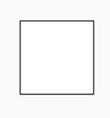
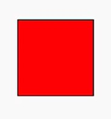
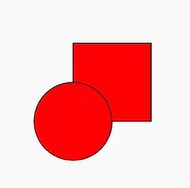
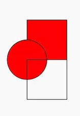
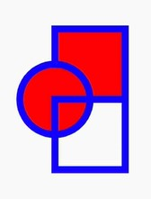
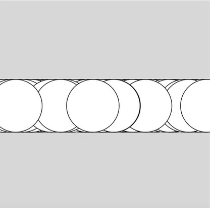
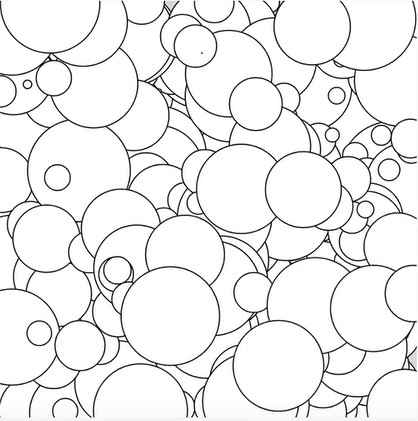
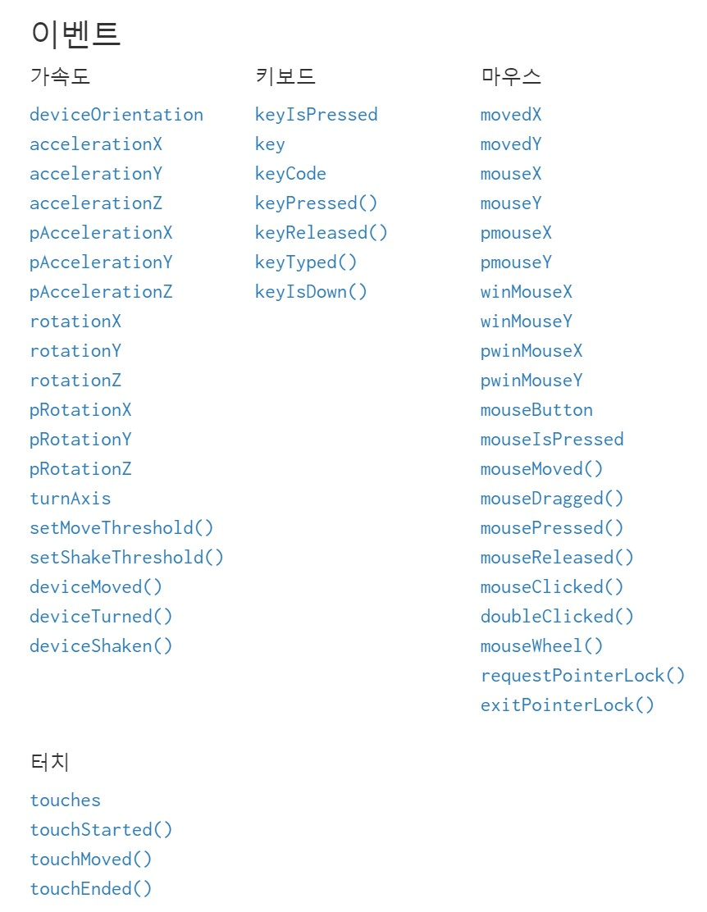

# 💨p5.js

> https://editor.p5js.org/
>
> 테스트 코드들은 해당 에디터에서 동작시켜보면 조금 더 빠르고 정확하게 이해할 수 있습니다.

---

### 색깔을 채우고 싶다면 그리기 전에 채워야 한다

```javascript
function setup() {
	createCanvas(400, 400);
	rect(100, 100, 100);
	fill('red');
}
```



이런 식으로 100x100의 사각형을 그린 뒤에 색깔을 채우려하면 반영되지 않는다.

반드시, 그리기 전에 채워야 한다.

```javascript
function setup() {
	createCanvas(400, 400);
    fill('red');
	rect(100, 100, 100);
}
```



또한, 한번 채우면 그 뒤는 계속해서 반영된다.

```javascript
function setup() {
	createCanvas(400, 400);
    fill('red');
	rect(100, 100, 100);
	circle(100, 200, 100);
}
```



만약, 색깔을 지우고 싶다면 `noFill()` 메서드를 활용한다.

```javascript
function setup() {
	createCanvas(400, 400);
    fill('red');
	rect(100, 100, 100);
	circle(100, 200, 100);
	noFill();
	rect(100, 200, 100);
}
```



---

### 테두리 그리기

```javascript
function setup() {
	createCanvas(400, 400);
	stroke('blue');
	strokeWeight(10);
    fill('red');
	rect(100, 100, 100);
	circle(100, 200, 100);
	noFill();
	rect(100, 200, 100);
}
```



---

### rgba 사용하기

`fill(red, green, blue, alpha)` 기존에 색깔을 채울 때 처럼 rgba를 사용 할 수 있다.

다만, 다른 점은 기본 CSS에서는 alpha의 범위가 0 - 1이라면 p5.js에서는 alpha의 범위가 0 - 255 이다.

---

### draw 함수의 특성

```javascript
function setup() {
	// content
}

function draw() {
	// content
}
```

보통 이런 식으로 `draw()` 함수는 `setup()` 함수 뒤에 위치하게 된다. 제일 중요한 것은 딱 한 번만 실행되는 setup() 함수와는 달리, `draw()` 함수는 계속해서 실행이 된다는 것이다.

이런 `draw()` 함수의 특징과 `random()` 함수를 활용하면 재미있는 모양들을 만들어 볼 수 있다.

먼저, `random()` 함수에 대해 먼저 알아본다. `random()` 함수를 사용하면 0 - 1 사이의 특정한 실수값이 나오게 된다. 만약 캔버스의 크기가 400이라면 `random() * 400`을 활용하여(0 - 400 사이의 특정한 실수값) 가로축으로 랜덤한 위치에 원하는 도형이 계속 그려지는 것을 확인 할 수 있다. 또한, `random() * 400` 대신 `random(400)` 구문을 사용해서도 똑같은 결과를 얻을 수 있다.

또한, `random(-10, 10)` 이런 식의 코드로 -10 ~ 10 사이의 실수를 발생시킬 수도 있다.

```javascript
function setup() {
	createCanvas(400, 400);
	background(220);    // 220 => gray
}

function draw() {
	circle(random(400), 200, 100);
}
```



이미지라 정적으로 보이지만, 실제 해당 코드를 실행시켜보면 원이 한개씩 랜덤한 위치에 계속해서 생겨나게 되는 이펙트를 줄 수 있다.

```javascript
function setup() {
	createCanvas(400, 400);
	background(220);    // 220 => gray
}

function draw() {
	circle(random(400), random(400), random(100));
}
```



이런 식으로 가로, 세로, 크기를 랜덤하게 지정하면 이런 패턴을 만들 수도 있다.

---

### 이동하는 애니메이션 만들기

위의 예제는 기존의 도형이 사라지지 않은 상태에서 새롭게 생겨나는 상태이다.

하지만, 이동하는 애니메이션이 필요한 경우, 기존의 도형은 사라져야 한다.

이를 위해 `background`를 기존 딱 한번만 실행되는 함수인 `setup()`에 넣는 것이 아닌 매번 실행되는 `draw()` 함수 최상단에 넣을 필요가 있다.

```javascript
function setup() {
	createCanvas(400, 400);
	x = 0;
}

function draw() {
	background(220);
	x = x + 10;
	circle(x, 200, 100);
}
```

이런 식으로 코드를 작성하면 x의 시작값은 10이 될 것이고 그 이후 x의 값은 10씩 증가하면서, 원은 왼쪽 끝에서부터 오른쪽 끝으로 움직이는 것 같은 모션을 만들게 된다.

```javascript
function setup() {
	createCanvas(400, 400);
	x = 0;
	y = 0;
}

function draw() {
	background(220);
	x = x + 10;
	y = y + 5;
	circle(x, y, 100);
}
```

이런 코드는 좌측 상단에서 시작하여 우측 중앙으로, 즉 사선으로 움직이는 것 같은 모션을 만들어준다.

---

### 화면 전체에 캔버스 채우기

`windowWidth`와 `windowHeight`를 사용하면 화면 전체를 채우는 캔버스를 만들 수 있습니다.

```javascript
function setup() {
	createCanvas(windowWidth, windowHeight);
}
```

---

### 사용자가 발생시키는 이벤트에 반응하는 모션 이미지 만들기

> 이벤트를 사용하기 이전에 해당 이벤트가 어떠한 값을 반환하는지 한번 콘솔을 찍어보게 되면 더 쉽게 이해할 수 있다.



공식문서에서 소개되어 있는 해당 이벤트들을 활용하여 사용자가 만들어내는 이벤트와 상호작용하는 모션 이미지를 만들 수도 있다.

```javascript
function setup() {
	createCanvas(windowWidth, windowHeight);
}

function draw() {
    background(220);
	circle(mouseX, mouseY, 100);
}
```

이런 식으로 코드를 작성하면 마우스 커서에 원이 따라다니는 모양을 만들 수 있다.

 ex1) 클릭 이벤트가 발생하면 지금까지 만들어진 원들을 없애자

```javascript
function setup() {
	createCanvas(windowWidth, windowHeight);
	background(220);
}

function draw() {
	if (mouseIsPressed) {
		background(220);
	}
	circle(mouseX + random(-10, 10), mouseY + random(-10, 10), random(50));
}
```


