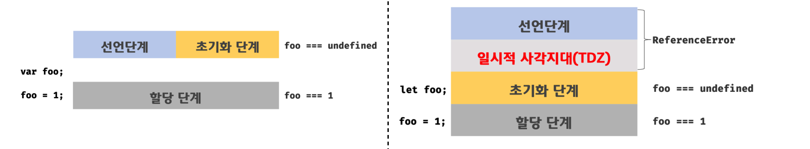

# 💨var, let, const

> 모던 자바스크립트 deep dive를 참고했습니다.

---

### var

> 함수 레벨 스코프. 함수 레벨 스코프는 전역 변수를 남발할 가능성을 높이기 때문에 사용을 자제해야 한다.

### let, const

> 블록 레벨 스코프. ES6 이상 버전의 자바스크립트를 사용 중이라면 var 대신 let과 const를 사용해야 한다.

---

var 키워드로 선언한 변수는 중복 선언이 가능하다.

```javascript
// var 키워드로 선언된 변수는 같은 스코프 내에서 중복 선언을 허용한다.
// 초기화 문이 있는 변수 선언문은 자바스크립트 엔진에 의해 var 키워드가 없는 것처럼 동작한다.
var x = 1
var x = 100

// let, const로 선언된 변수는 중복 선언이 불가하다.
let x = 1
let x = 100 // Error!
```

---



왼쪽이 var 키워드로 선언한 변수의 생명 주기이고 오른쪽이 let 키워드로 선언한 변수의 생명 주기이다. 

```javascript
// var 키워드로 선언된 예제
// var 키워드로 선언한 변수는 런타임 이전에 선언 단계와 초기화 단계가 동시에 일어난다.
// 이 덕분에 변수 선언문 이전에 변수를 참조할 수 있다.

console.log(foo)    // undefined

var foo 
console.log(foo)    // undefined

foo = 1
console.log(foo)    // 1
```

```javascript
// let 키워드로 선언된 예제
// 런타임 이전에 선언 단계가 실행된다. 하지만, 초기화가 같이 이루어지지는 않는다.
// 초기화 이전의 일시적 사각지대에서는 변수를 참조할 수 없다.
// 이미 이 지점에서 foo에 대한 선언은 이루어졌다.

console.log(foo)    // Reference Error: foo is not defined

let foo    // 초기화 단계
console.log(foo)    // undefined

foo = 1    // 할당 단계
console.log(foo)    // 1
```

즉, `let foo` 코드를 통해 `foo`가 초기화되기 이전에도, `foo`는 선언되어 있다. 하지만, 초기화 되지 않았기 때문에 접근할 수 없다. 이 사이의 시간은 TDZ(일시적 사각지대) 라고 한다.  

결국, let과 const 또한 호이스팅되어 있는 것이다. 이를 명확히 보여주는 예제 코드 하나를 보자. (이 예제 코드는 정말 중요하고 재미있다고 생각한다. 잘 기억해둘 필요가 있다.)

```javascript
let foo = 1    // 전역 변수

{
	console.log(foo)     // Reference Error: Cannot access 'foo' before initialization
	let foo = 2    // 지역 변수
}
```

let 키워드로 선언한 변수의 경우 변수 호이스팅이 발생하지 않는다면 위 예제는 스코프 체인을 타고 가서 전역 변수 foo의 값을 출력했어야 했다. 하지만 let 키워드로 선언한 변수도 호이스팅이 발생하기 때문에 블록 내부에 foo가 선언되어있음을 알고 있고, 이 때문에 선언은 있지만 초기화가 되지 않은 변수에 접근할 때 나타나는 에러인 참조 에러가 나타나는 것이다. 

---

var 키워드로 선언된 변수와 함수, 그리고 암묵적 전역은 전역 객체 window의 프로퍼티가 된다. 전역 객체의 프로퍼티를 참조할 때 window를 생략할 수 있다. (브라우저 환경에서!!!!)

```javascript
// 전역 변수
var x = 1

// 암묵적 전역
y = 2

console.log(x)    // 1
console.log(window.x)    // 1

console.log(y)    // 2
console.log(window.y)    // 2
```

반면 let 키워드로 선언한 전역 변수는 전역 객체의 프로퍼티가 아니다. 즉, `window.`으로 접근할 수 없다. let 전역 변수는 보이지 않는 개념적인 블록 내에 존재하게 된다. (브라우저 환경에서!!!!)

```javascript
let x = 1

console.log(x)    // 1
console.log(window.x)    // undefined
```

---

const 키워드는 재할당을 금지할 뿐 "불변"을 의미하지는 않는다. 반드시 기억해두어야 한다. 

다만 우리가 const를 불변이라고 오해하는 이유는, const 키워드로 선언된 변수에 원시 값을 할당한 경우 원시 값은 변경할 수 없는 값(immutable value)이고 const 키워드에 의해 재할당이 금지되므로 할당된 값을 변경할 수 있는 방법은 없다는 두가지 사실 때문이다. 

오... 뭐지? 그러면 const는 불변인거 아닌가? 라는 생각이 들 수 있다.

맞다. const는 불변이다. 하지만, 원시 값을 할당한 경우에만 그러하다. const에 참조값을 할당한 경우에는 const는 불변이 아니다.
