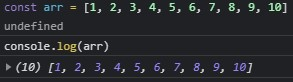
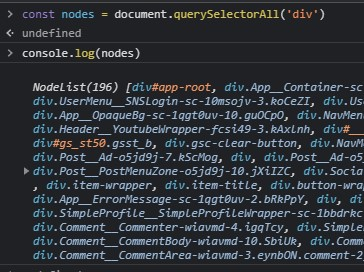
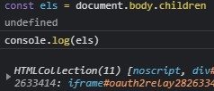

# 😍배열과 유사배열

---







3개의 사진에서 확인할 수 있는 가장 큰 차이점은 무엇일까?

바로 `(배열의 길이)` 앞에 무언가 붙어있느냐이다.

첫번째 사진에는 아무것도 없지만 두번째, 세번째 사진에는 괄호 앞에 각각 NodeList, HTMLCollection이 붙어 있다.

 이 차이로인해 첫번째 경우는 일반 배열, 두번째 세번째의 경우는 유사 배열이라고 한다.


이 사진에서 확인할 수 있듯이, 일반 배열만이 배열로 간주되고 유사 배열들은 배열로 간주되지 않는다.

유사배열은 객체의 모양으로 직접 만들 수도 있다.

```javascript
const arr = {
	0: 'i',
	1: 'am',
	2: 'iron',
	3: 'man',
	length: 4
}

console.log(arr[0])  // 'i'
console.log(arr[1])  // 'am'
console.log(arr[2])  // 'iron'
console.log(arr[3])  // 'man'
```

---

### 그렇다면 배열과 유사 배열을 왜 구분해야 하는 것이냐?

이 둘을 구분해야하는 가장 큰 이유는 배열 메서드의 사용가능 여부 때문이다. 배열은 당연히 배열 메서드(slice, push, includes, ...)들을 사용할 수 있지만, 유사 배열은 배열 메서드들을 사용하지 못한다.

하지만, 다행히도 유사 배열 또한 배열 메서드들을 사용할 수 있는 방법이 존재하긴 한다.

1. 배열 프로토타입에서 배열 메서드를 빌려오는 방법. 

   ```javascript
   // forEach라는 배열 메서드를 빌려온다고 가정한다. call만 적어놨지만 apply 또한 가능하다.
   
   Array.prototype.forEach.call(nodes, function(element) { console.log(element) })
   [].forEach.call(els, function(element) { console.log(element) })
   ```

2. ES6부터 지원하는 `Array.from` 을 사용하는 방법

   >*`Array.from()` 메서드는 유사 배열 객체(array-like object)나반복 가능한 객체(iterable object)를 얕게 복사해 새로운 `Array` 객체를 만듭니다.* - MDN
   >
   >새로운 Array 객체를 만든다는 것을 유의해서 보자.

   ```javascript
   Array.from(nodes).forEach(function(element) { console.log(element) })
   ```

   만약에 배열 메서드를 여러번 사용해야 한다면 `const tmp = Array.from(nodes)` 처럼 다른 변수에 배열로 바꾼 값을 저장해두고 사용하는 것이 좋다.

---

## 참고문헌

https://www.zerocho.com/category/JavaScript/post/5af6f9e707d77a001bb579d2

https://sub0709.tistory.com/13

https://developer.mozilla.org/ko/docs/Web/JavaScript/Reference/Global_Objects/Array/from

https://kamang-it.tistory.com/entry/JavaScript15%EC%9C%A0%EC%82%AC%EB%B0%B0%EC%97%B4-%EA%B0%9D%EC%B2%B4Arraylike-Objects