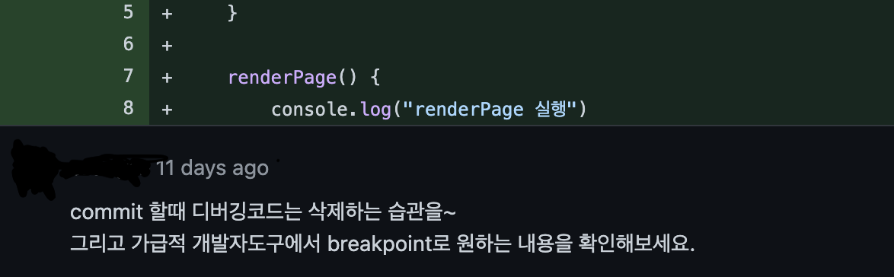

# 🛠 자바스크립트의 디버깅

> [해당 유튜브 강의](https://www.youtube.com/watch?v=ECaolDy7nQY)를 참고하여 작성하는 문서입니다.
>
> Debug Driven Development 라고 표현하실 정도로 디버깅의 가치와 중요성을 잘 설명해주고 있는 좋은 강의입니다.

---

개발을 하다보면 코드를 작성하는 것보다 이미 있는 코드를 수정하고 가꿔나가는데 더 많은 시간을 쓰게 됩니다. 때문에 우리는 코드를 더 편하고 빠르게 수정하기를 원합니다. 이러한 관점에서 어떻게 디버깅할 것이냐에 대한 고민은 우리의 개발 시간을 줄이는 지름길이 될 수 있습니다.

자바스크립트 개발자인 우리는 어떻게 디버깅을하고 있을까요?

저같은 경우에는 `console.log()` 를 활용합니다. 다음 코드처럼 말이죠.

```javascript
function foo(a, b, c) {
  let d = "It's";
  let e = "your";
  let f = "debugging";
  
  console.log(a, b, c, d, e, f);
}
```

이 코드의 가장 큰 문제점은 무엇일까요?

바로 코드를 작성한다는 점에 있습니다.



이렇게 디버깅을 위해 적어놓은 console.log 들이 코드상에 남아있게 되는 경우가 굉장히 많다는 것이죠.

때문에 우리는 개발자 도구와 함께 코드 자체를 수정하지 않는 디버깅 방법을 배워볼 것입니다. 

---

### 콘솔창을 이용한 디버깅 연습

다음과 같이 콘솔창에 foo 함수를 입력하고 실행해봅니다.


자동으로 개발자 도구의 Sources 탭으로 넘어가고 debugger로 명시해놓은 시점에서 멈추게 됩니다.


이 시점에서 우리는 우측 Scope 영역을 통해 debugger가 호출된 시점의 this와 변수값들을 확인할 수 있습니다. 또한 Call Stack 영역에서 어떠한 순서로 foo 함수가 호출되었는지도 확인해볼 수 있습니다.

조금 더 어려운 개념을 디버깅해봅시다.


"무엇이 콘솔에 찍힐까요?" 라는 물음에 대부분의 자바스크립트 개발자들은 어렵지 않게 정답을 이야기할 수 있을 것이라 생각합니다. 

"왜 그렇게 찍힐까요?" 라는 물음에는 얼마나 많은 자바스크립트 개발자들이 설명할 수 있을까요?

저는 못합니다. 때문에 디버깅해서 확인해보겠습니다.


Scope 영역을 통해 next 값이 존재하는 것을 확인할 수 있습니다. 

previous 값은 어디에 있을까요? foo 함수가 남겨놓은 클로저 속에 저장되어 있습니다.

foo 함수는 실행이 종료되어 Call Stack에서 제거되었지만 그 내부의 previous 값은 클로저에 의해 살아 있는 것을 확인할 수 있습니다.

조금 더더 어려운 개념을 확인해봅니다.


첫번째 `myObj.play()` 에서는 다음과 같은 결과가 나옵니다.


musicList에 "라일락" 이 있고 다른 메서드들을 통해 this가 myObj 객체라는 것을 알 수 있습니다.

두번째 `myObj.play.call(other)` 에서는 다음과 같은 결과가 나옵니다.


이번에는 other 라는 객체가 this에 들어가 있는 것을 확인할 수 있습니다.

---

### 실제 프로젝트에서 디버깅하기

실제 프로젝트에서 우리가 지금껏 연습해온 디버깅 기법을 사용하기 위해서는 웹팩 설정이 필요합니다.


웹팩은 여러 개의 자바스크립트 파일들을 뭉쳐 하나의 bundle.js로 만듭니다. 이 과정에서 난독화가 이루어지고 알아보기 어려운, 디버깅 할 수 없는 코드가 만들어지게 됩니다.

때문에 개발과정에서는 난독화되지 않은 코드들이 그대로 개발자 도구에 노출될 수 있도록 만들어야 합니다.

그것이 바로 웹팩의 devtool이라는 속성입니다. [devtool 속성](https://webpack.js.org/configuration/devtool/)은 굉장히 다양하기 떄문에 상황에 맞추어 필요한 속성을 사용하면 됩니다.

저는 `devtool: "eval-source-map"` 이라는 속성을 적용해보았습니다.


코드가 그대로 들어날 뿐만 아니라 폴더 구조 또한 그대로 나타나게 됩니다. (코드 부분에 약간의 변형이 있습니다. 다른 devtool 속성을 활용해 이를 해결 할 수 있습니다.)

**개발시에 이렇게 devtool 설정을 통해 개발자 도구에서 쉽게 디버깅 할 수 있습니다. (필요없는 추가 파일을 만드는 것이기 때문에 배포시에는 반드시 제거해야 합니다. 그렇지 않으면 성능, 보안에 문제가 생길 수 있습니다.)**

**또한 중단해야 하는 지점에 `debugger`를 명시하는 대신, 좌측 라인 넘버를 클릭하여 중단 시점을 정의할 수도 있습니다.**

---

- 함수 호출
- closure, this
- 객체 안에서의 this
- 비동기 안에서의 this

난해하기로 유명한 자바스크립트의 개념들입니다. 물론 이 모든 것들을 익히는 것이 가장 좋겠지만, 이는 쉽지 않은 일이라는 것을 모두가 알고 있습니다.  또한 이 모든 것들을 익히는 지름길은 디버깅을 통해 순간의 상태를 시각적으로 확인하는 것입니다.

우리가 기계가 되어야 할 필요는 없습니다. 기계를 잠시 멈추고 그 안을 들여다볼 수 있다면 그것으로 충분합니다.

---

### 추가되어야 하는 내용

souceMap에 대한 개념

디버깅을 위한 리팩터링 => 변수에 계속해서 담아두는 습관

---

### 참고문헌

https://velog.io/@seeker1207/SourceMap%EC%9D%B4%EB%9E%80-%EB%AC%B4%EC%97%87%EC%9D%BC%EA%B9%8Cwith-webPack-devtool

https://www.youtube.com/watch?v=ECaolDy7nQY
