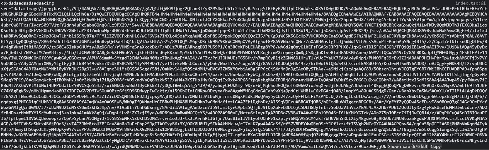
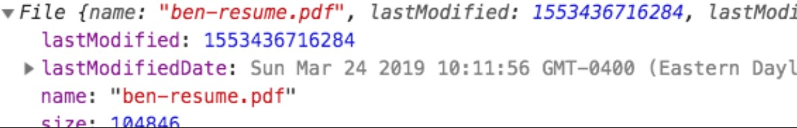

# 🧧이미지의 여러 형식

> 이번에 팀구 프로젝트를 진행하면서 이미지를 처리해야하는 일들이 굉장히 많았다. 
>
> 이를 처리하면서 이미지에 다양한 형식이 존재하고, 어떠한 형식이 어느 경우에 사용되는지를 제대로 알고 있을 필요가 있겠다 싶어서 정리한다.

---

가장 먼저 data uri를 이해하기 위해 base 64부터 알아본다.

### Base64

Base64란 8비트 2진 데이터를 문자 코드에 영향을 받지 않는 공통 아스키 영역의 문자들로만 이루어진 일련의 문자열로 바꾸는 인코딩 방식을 가리키는 개념이다.

Base64는 데이터를 64진법으로 나타낸다.

이를 0부터 63까지 ABCDEFGHIJKLMNOPQRSTUVWXYZabcdefghijklmnopqrstuvwxyz0123456789+/ 으로 나타낸다.

---

이미지를 활용할 수 있는 방식은 크게 3가지이다.

- image 태그의 src에 url을 넣는 방법

- image 태그의 src에 dataURI를 넣는 방법



- 파일 형태의 image



첫번째와 마지막 형태의 이미지는 본 적이 있었지만 개인적으로 두번째 형태의 이미지는 처음이었다.

dataURL은 웹페이지에 데이터를 인라인으로 포함하는 방법이다. dataURL은 작은 이미지 같은 파일을 문서(HTML, JS, CSS)에 인라인으로 작성할 수 있는데, 작성된 이미지와 같은 정보는 이미 문서에 포함되어 있기 때문에 서버에 요청하지 않고도 이미지를 사용할 수 있다.

data: 으로 시작하며 `,`으로 실제 데이터와 구분한다. 해당 형식은 다음과 같다.

`data: [<mediatype>][;base64],<data>`

즉, 간단하게 말하면 이미지 데이터를 base64로 변환해서 사용하는 것이다.

dataURI를 사용하게 되면 이미지를 저장하고 url을 받아와서 렌더하는 일련의 과정이 사라지기 때문에 HTTP 요청을 절약할 수 있고, HTML 파일로 데이터를 관리할 수 있다는 장점을 가진다.

물론 단점 또한 존재하고 dataURI의 알려진 단점은 다음과 같다.

- 캐시되지 않아 매번 불러와야 한다.
- 기존 파일보다 용량이 30% 커진다.
- 일부 브라우저에서 제한 및 지원되지 않는다.

이 단점들에 대한 설명과 의문(?)은 [해당 블로그](https://mygumi.tistory.com/282[)에 잘 정리되어 있다. 

---

### 그렇다면 실제로 어느 경우에 사용해야 하는 걸까?

가장 먼저 파일 형태의 경우 파일 형태를 유지해야 하는 경우에 사용될 것이다. 즉, 서버로 넘어가게 될 자원이라고 생각하면 좋을 것 같다.

src에 url을 넣는 경우는 이미 해당 이미지 파일이 서버에 저장이 된 경우일 것이다. 이 때문에 해당 이미지를 위한 url이 이미 존재하고, 이를 src에 넣어서 렌더링해주면 된다.

src에 dataURI를 넣는 경우는 결국 위 두 경우의 중간 쯤에 위치한 것이라고 생각하면 이해하기 좋다. 실제 팀구에서는 이미지 프리뷰를 구현할 때 dataURI를 사용하였다. 프로필 이미지를 등록하는 경우, 사용자가 이미지를 업로드하면 실제로 해당 이미지가 서버로 넘어가지는 않지만 화면에 해당 이미지를 렌더해줄 필요가 있었다. 그래야 사용자의 입장에서 내가 선택한 이미지가 잘 업로드되었고 확인 버튼만 누르면 이 사진이 나의 프로필이 되겠구나라고 인지할 수 있기 때문이다. 이를 위해서는 파일 형태여서도 안되고, 아직 이미지를 서버에 저장하지 않은 상태이다 보니 image url을 사용하는 것은 더더욱 불가능할 것이다. 때문에 이런 이미지 프리뷰가 필요한 경우에 dataURI를 사용하면 굉장히 유용하다.

---

### 그렇다면 사용자가 올리는 이미지는 파일 형식인데 파일 형식을 어떻게 dataURI로 바꾸죠?

이를 위한 메서드가 다행히도 자바스크립트에 존재한다. 뿐만 아니라 역으로의 변환 또한 가능하다.

실제로 팀구에서 이를 위해 사용한 함수는 다음과 같다.

- 파일은 dataURI로 바꾸기

  > 이 경우 `FileReader()`를 사용하면 된다.

```react
const [image, setImage] = useState('');

const onSelectFile = (e: Event & { target: HTMLInputElement }) => {
    if (e.target.files && e.target.files.length > 0) {
      const reader = new FileReader();
      reader.readAsDataURL(e.target.files[0]);
      reader.addEventListener('load', () => {
        setImage(reader.result);
      });
    }
  };
```

이런 식의 함수를 만들면 이미지가 업로드 되었을 때 dataURI로 변환되고 해당 dataURI가 state로 저장되면서 화면에 렌더된다.

- dataURI를 파일로 바꾸기

```react
export const dataURLtoFile = (dataurl: string, filename: string) => {
  const arr = dataurl.split(',');
  const mime = arr[0].match(/:(.*?);/)[1];
  const bstr = atob(arr[1]);
  let n = bstr.length;
  const u8arr = new Uint8Array(n);

  while (n--) u8arr[n] = bstr.charCodeAt(n);

  return new File([u8arr], filename, { type: mime });
};
```

해당 함수를 사용하면 dataURI를 filename을 이름으로 하는 파일로 변환할 수 있다.

>**btoa()** 은 입력 문자열을 Base 64 으로 표현되는 문자열을 반환한다.
>만약 입력 문자열에 유니 코드 같은 btoa 에서 이해할 수 없는 문자열이 들어오면 InvalidCharacterError 가 발생한다.
>
>**atob()** 은 인코딩된 Base 64 문자열을 디코드한다.
>만약 입력 문자열에 Base 64 에 포함되지 않는 문자 (A-Z,a-z,0–9+/ 이외) 가 입력되면 DOMException 이 발생한다.

- 일반 이미지 url(서버에 이미 저장된 이미지)을 파일로 바꾸기

```react
export const urltoFile = async (url: string, studentNumber: string) => {
  const response = await fetch(url);
  const data = await response.blob();
  const ext = url.split('.').pop(); // url 구조에 맞게 수정할 것
  const filename = `${studentNumber}_profile.${ext}`; // url 구조에 맞게 수정할 것
  const metadata = { type: `image/${ext}` };
  return new File([data], filename!, metadata);
};
```

---

##  참고자료

https://mygumi.tistory.com/282

https://developer.mozilla.org/ko/docs/Web/HTTP/Basics_of_HTTP/Data_URIs

https://pks2974.medium.com/base-64-%EA%B0%84%EB%8B%A8-%EC%A0%95%EB%A6%AC%ED%95%98%EA%B8%B0-da50fdfc49d2

