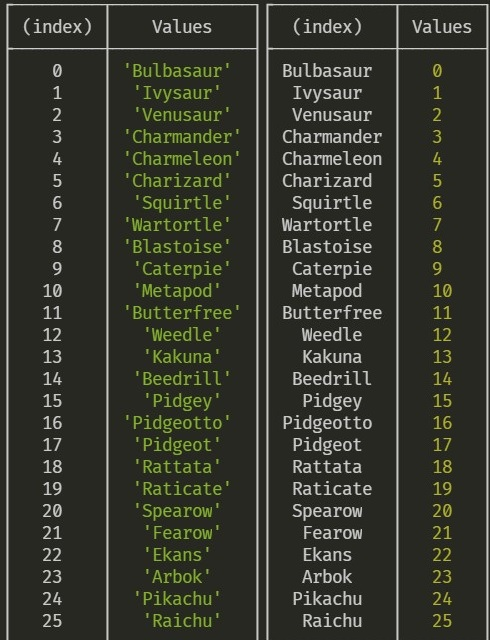

# 🧨Hash in JS

---

http://egloos.zum.com/sweeper/v/925740

정말 자세하게 해쉬의 기본적이고 중요한 개념들을 설명하고 있는 블로그의 글이다. 워낙 해쉬는 중요한 개념이기 때문에 해당 내용을 읽고 외울 필요가 있다. 최소한 이 글을 읽기 시작한다면, 반드시 저 블로그의 내용을 읽고 오는 것이 좋겠다.

---

### 먼저 알아야 할 것이 있다!

자바스크립트에는 배열이라는 type이 존재하지 않으며, 배열은 특수한 객체일 뿐이다.

```javascript
const arr = [];
typeof arr; // Object
```

즉, 우리는 객체를 일반적인 프로퍼티를 저장하는 객체로 사용할 수도, 원소를 저장하는 배열처럼 사용할 수도 있다.

```javascript
const obj = {};
obj[1] = 1;    // element로 저장
obj['foo'] = 1;    // property로 저장
```

객체가 원소를 저장하는 배열처럼 사용될 때는 일반 객체와는 구별되는 독특한 특징이 존재하고 이는 [이곳](./🎉배열.md)에 정리해 두었다.

---

### 자바스크립트에서의 해쉬

자바스크립트에서는 해쉬를 어떻게 사용할까?

자바스크립트에서 해쉬, 해쉬 테이블을 사용하는 방법은 Map, Set, Weakmap, Weakset, 일반 객체 이 5가지의 방법이 존재할 것이다. 

나는 항상 사용하기 편하다는 이유만으로 일반 객체를 해쉬로 사용해왔다.

다음은 배열의 key와 index를 바꾸기 위해서 사용했던 코드와 그 결과물이다.



```javascript
  const question_sort = questions.reduce((acc, curr, idx) => {
    acc[curr] = idx;
    return acc;
  }, {});
```

이 코드에서도 해쉬 테이블을 만들기 위해 일반 객체를 사용하였다.

그러다가 문득 들었던 생각이 똑같은 작업을 Map을 통해서도 할 수 있을 텐데, 어떤 방식을 사용하는 것이 더 좋은 선택지일까에 대한 의문이 들었다.

이에 대한 설명을 [모질라](https://developer.mozilla.org/ko/docs/orphaned/Web/JavaScript/Reference/Global_Objects/Map)에서 굉장히 자세하게 다루고 있다.

|                                                           | Map                                                          | Object                                                       |
| --------------------------------------------------------- | ------------------------------------------------------------ | ------------------------------------------------------------ |
| 의도치 않은                                            키 | Map은 명시적으로 제공한 키 외에는 어떤 키도 가지지 않습니다. | Object는 프로토타입을 가지므로 기본 키가 존재할 수 있다. 주의하지 않으면 직접 제공한 키와 충돌할 수도 있다. (참고: ES5부터, 프로토타입으로 인한 키 충돌은 `Object.create(null)`로 해결할 수 있지만, 실제로 쓰이는 경우는 적다.) |
| 키 자료형                                                 | Map의 키는 함수, 객체 등을 포함한 모든 값이 가능하다.        | Object의 키는 반드시 String 또는 Symbol 이어야 한다.         |
| 키 순서                                                   | Map의 키는 정렬된다. 따라서 Map의 순회는 삽입순으로 이뤄진다. | Object의 키는 정렬되지 않는다. (참고: ECMAScript 201 이후로, 객체도 문자열과 Symbol 키의 생성 순서를 유지한다. ECMAScript 2015 명세를 준수하는 JavaScript 엔진에서 문자열 키만 가진 객체를 순회하면 삽입 순을 따라간다.) |
| 크기                                                      | Map의 항목 수는 size 속성을 통해 쉽게 알아낼 수 있다.        | Object의 항목 수는 직접 알아내야 한다.                       |
| 순회                                                      | Map은 순회 가능하므로, 바로 순회할 수 있다.                  | Object를 순회하려면 먼저 모든 키를 알아낸 후, 그 키의 배열을 순회해야 한다. |
| 성능                                                      | 잦은 키-값 쌍의 추가와 제거에서 더 좋은 성능을 보인다.       | 잦은 키-값 쌍의 추가와 제거의 위한 최적화가 없다.            |

```javascript
// 예제들은 모두 이곳에서 가지고 왔습니다.
// https://erim1005.tistory.com/entry/Javascript-%EC%97%90%EC%84%9C-Object%EB%A5%BC-%ED%95%B4%EC%8B%9C%EB%A7%B5%EC%B2%98%EB%9F%BC-%EC%82%AC%EC%9A%A9%ED%95%98%EC%A7%80-%EB%A7%88%EC%84%B8%EC%9A%94
// 의도치 않은 키

const map = new Map();
map.set('someKey1', 1);
map.set('someKey2', 2);
map.set('toString', 3); // No problem for Map

const plainObjMap = new Map();
plainObjMap['someKey1'] = 1;
plainObjMap['someKey2'] = 2;
plainObjMap['toString'] = 3; // Oops, native property
```

```javascript
// 크기

const map = new Map();

map.set('someKey1', 1);
map.set('someKey2', 1);
...
map.set('someKey100', 1);

console.log(map.size);    // 100, O(1)

const plainObjMap = {};

plainObjMap['someKey1'] = 1;
plainObjMap['someKey2'] = 1;
...
plainObjMap['someKey100'] = 1;

console.log(Object.keys(plainObjMap).length) // 100, O(n)
```

```javascript
// 순회

const map = new Map();
map.set('someKey1', 1);
map.set('someKey2', 2);
map.set('someKey3', 3);

for (let [key, value] of map) {
  console.log(`${key} = ${value}`);
}
// someKey1 = 1
// someKey2 = 2
// someKey3 = 3

const plainObjMap = {};
plainObjMap['someKey1'] = 1;
plainObjMap['someKey2'] = 2;
plainObjMap['someKey3'] = 3;

for (let key of Object.keys(plainObjMap)) {
  const value = plainObjMap[key];
  console.log(`${key} = ${value}`);
}
// someKey1 = 1
// someKey2 = 2
// someKey3 = 3
```

이러한 여러 이유들 때문에 해쉬 테이블이 필요한 경우 map을 사용하는 것이 훨씬 좋은 선택지이다. (물론, 일반 객체를 사용하는 것이 훨씬 사용하기는 편하기 때문에 빠르게 풀어야 하는 코딩 테스트에서는 일반 객체를 활용하는 것이 더 좋은 선택지가 될 수도 있겠다.)

---

### 여기서부터는 훨씬 깊은 이야기이다.

## V8에서의 해쉬 테이블

자바스크립트에서 객체의 프로퍼티에 접근할 때 해쉬 테이블처럼 접근한다는 사실을 위에서 알아보았다.

그렇다면 V8에서도 그런 식으로 동작할까???

아니다. V8 엔진에서는 해쉬테이블을 통해 객체의 프로퍼티에 접근하는 것보다 더 좋은 성능을 가진 접근 방식으로 접근한다. 이 차이를 알기 위해서는 동적 탐색(dynamic lookup)에 대한 이해가 필요하다.

---

출처: https://engineering.linecorp.com/ko/blog/v8-hidden-class/

자바스크립트는 동적 타이핑(dynamic typing) 언어입니다. 즉 코드를 실행할 때의 상황에 따라 데이터의 타입이 정해지는데, 그러다보니 객체의 프로퍼티에 접근하는 속도 면에서는 정적 타이핑 언어의 코드와 비교했을 때 불리해질 수 있습니다. 정적 타이핑(static typing) 언어를 사용하면, 가변길이 배열(variable-length array)과 같은 동적인 데이터 타입을 사용하지 않는 이상, 프로퍼티(혹은 구조체의 멤버)의 메모리 오프셋을 컴파일 시에 결정할 수 있습니다. 이론상으로는 그렇습니다. 따라서 프로퍼티를 선언할 때 오프셋 값을 어딘가에 저장해 둔 뒤, 각 프로퍼티의 값이 필요할 때 오프셋 값을 그대로 사용하면 되는 것이지요.

반면에 데이터 타입이 동적으로 정해지는 코드로는 프로퍼티의 메모리 오프셋을 컴파일할 때 결정하는 것은 불가능합니다. 프로퍼티를 선언했을 때의 프로퍼티의 데이터 타입이나 순서가 실제로 프로퍼티 값을 접근할 때는 달라질 수 있기 때문이지요. 따라서 프로퍼티를 선언했을 때의 오프셋 값은 참조할 수 없게 되고, 이에 대한 대책이 따로 없는 한, 프로퍼티 값을 읽어야 할 때마다 프로퍼티를 찾아내야 합니다. 즉 동적 탐색(dynamic lookup)이 필요합니다. 자바스크립트처럼 사전형(dictionary) 형태의 객체를 이용한다면, 객체의 프로퍼티를 읽어들일 때 비용이 발생하며 이 비용은 구현 방식에 따라 달라집니다.

---

그렇다. V8에서는 프로퍼티에 접근할 때, 동적 탐색을 피하는 설계를 하여 더 높은 성능을 보장한다. 

그렇다면, 어떻게 피할까??

V8 엔진은 동적으로 hidden class 라는 것을 만든다. 이 히든 클래스를 통해 프로퍼티에 훨씬 더 빠른 접근이 가능해진다.

히든 클래스가 만들어지는 과정은 https://engineering.linecorp.com/ko/blog/v8-hidden-class/

해당 블로그에서 굉장히 자세하게 설명하고 있다. 주의깊게 볼 필요가 있겠다.

또한 인라인 캐싱에 대한 설명은 이 블로그에서 정말 잘 설명해주고 있다.

https://velog.io/@cheal3/JavaScript-%ED%9E%88%EB%93%A0%ED%81%B4%EB%9E%98%EC%8A%A4-%EC%9D%B8%EB%9D%BC%EC%9D%B8-%EC%BA%90%EC%8B%B1-%EA%B7%B8%EB%A6%AC%EA%B3%A0-%EC%B5%9C%EC%A0%81%ED%99%94

---

## 참고문헌

https://stackoverflow.com/questions/33611509/es6-map-and-set-complexity-v8-implementation

https://stackoverflow.com/questions/33611509/es6-map-and-set-complexity-v8-implementation

https://simplenotions.wordpress.com/2011/07/05/javascript-hashtable/

https://engineering.linecorp.com/ko/blog/v8-hidden-class/    (제일 중요한 내용들이 있다. 꼭 읽어보기를)

https://velog.io/@cheal3/JavaScript-%ED%9E%88%EB%93%A0%ED%81%B4%EB%9E%98%EC%8A%A4-%EC%9D%B8%EB%9D%BC%EC%9D%B8-%EC%BA%90%EC%8B%B1-%EA%B7%B8%EB%A6%AC%EA%B3%A0-%EC%B5%9C%EC%A0%81%ED%99%94
