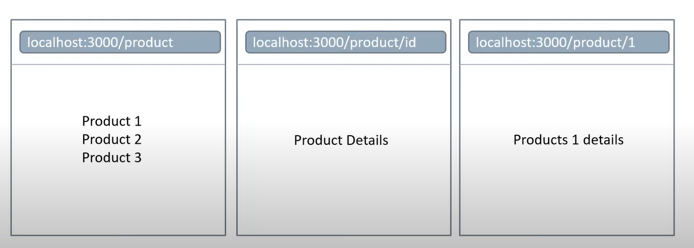
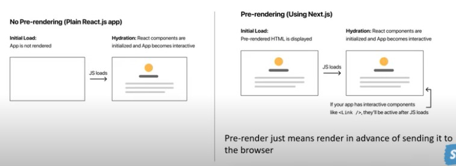

# Next.js

> 유튜브 Codevolution의 넥스트 강의 요약입니다!!! 좋은 강의 만들어주셔서 정말 감사합니다.

---

Next.js를 한 줄로 정의하면 `The React Framework for Production`

리액트 기반의 프레임워크이나 훨씬 더 생산성을 개선한 것이 Next.js

리액트의 경우 라우팅, 스타일링, authentication, 이미지 레이지 로드와 같은 것들을 직접 다른 라이브러리를 설치해서 구현하거나 직접 구현해야 했다. 하지만, Next.js에서는 이러한 것들을 기본적으로 제공.

---

`npx create-next-app <레포이름>`    

> 만드는 명령어

`yarn dev`    

> 실행 명령어

---

루트 폴더에 `next.config.js` 파일을 만들고 코드를 다음과 같이 한다.

```javascript
module.exports = {
	reactStrictMode: true,
}
```

이렇게 하면 리액트에서 사용하면 안되는 구문을 사용했을 때도 에러 표시가 나게 된다.

---

기본 `.eslintrc`

```
{
	"extends": ["next", "next/core-web-vitals"]
}
```

---

### 리액트에서의 라우팅

- Install a third party package
- routes.js file to configure the routes
- For each route, create a component file, export the component, import it in routes.js and configure the new route with a path property.

### 넥스트에서의 라우팅

- File system based routing mechanism
- When a file is added to the pages folder in a project, it automatically becomes available as a route
- By mixing and matching file names with a nested folder structure, it is possible to pretty much define the most common routing patterns.
- Route with Pages
- Nested routes
- Dynamic routes
- Catch-all routes
- Navigate from the UI
- Programmatically navigate between Pages

---

### Pages 폴더 내부를 기준으로 자동 라우팅 된다.


---

### Dynamic Routing



```react
/pages/product/index.js

export default function ProductList() {
	return (
		<>
			<h2>Product 1</h2>
			<h2>Product 2</h2>
			<h2>Product 3</h2>
		</>
	)
}
```

```react
/pages/product/[productId].js

export default function ProductDetail() {
    return <h1>Details about product</h1>
}
```

이렇게 하면 `https://localhost:3000/product/<아무거나 다 가능>` 해당 주소를 입력하면 `ProductDetail` 컴포넌트가 렌더링된다.

<아무거나 다 가능> 이곳애 들어온 값을 얻어내기 위해서는 useRouter를 사용해야 한다.

```react
/pages/product/[productId].js

import { useRouter } from 'next/router'

export default function ProductDetail() {
	const router = useRouter()
	const productId = router.query.productId             // 파일명의 쿼리값과 동일하게 해야 한다.
    return <h1>{productId}</h1>
}

```

그렇다면 여기에서 들 수 있는 의문이 `pages/product` 폴더 내부에 `[productId].js` 와 `sweater.js` 이 두 파일이 있다면 실제로 쿼리값이 sweater일 때 어떠한 컴포넌트가 렌더링 될지에 대해 의문을 가질 수 있다. 이 경우 `sweater.js`가 렌더링된다. Dynamic Routing은 낮은 우선순위를 가지기 때문이다.

---

### Nested Dynamic Routing

`https:localhost:3000/product/[id]/review/[id]` 와 같이 중첩된 다이나믹 라우팅의 경우 어떻게 해야 할까??

이 경우 아예 폴더 이름을 `[productId]`로 짓고, 내부에 `review` 폴더, 그리고 그 안에 `[reviewId].js` 파일을 생성해서 구성하면 된다.

살짝 복잡하기는하나 굉장히 직관적이다.

https://www.youtube.com/watch?v=nfAxNTmme64&list=PLC3y8-rFHvwgC9mj0qv972IO5DmD-H0ZH&index=8

해당 강의를 참조하라.

---

https://www.youtube.com/watch?v=ZHn726VDoIY&list=PLC3y8-rFHvwgC9mj0qv972IO5DmD-H0ZH&index=9

---

### Link Component

```react
import Link from 'next/link'

export default function App() {
	return (
		<>
			<Link href="/blog">       // Home 클릭시 localhost:3000/blog 로 갑니다.
				<a>Home</a>
			</Link>
		</>
	)
}
```

---

### Navigating Programmatically

```react
import { useRouter } from 'next/router'

export default function Home() {
	const router = useRouter()
	
	const handleClick = () => {
		router.push('/product')    // go 클릭시 localhost:3000/product 로 갑니다.
	}
	
	return (
		<>
			<button onClick={handleClick}>go</button>
		</>
	)
}
```

---

### Pre-rendering & Data Fetching 

React vs Next.js

> By default, Next.js pre-renders every page in the application

What does pre-render mean?

> Next.js generates HTML for each page in advance instead of having it all done by client-side Javascript



Pre-render의 장점

1. Pre-rendering improves performance
   1. In a React app, you need to wait for the JavaScript to be executed. (넥스트의 경우 HTML, CSS를 통한 화면을 먼저 보여주는 것이지 실제로 자바스크립트 파일까지 실행된 상태는 아닌 것이다. 때문에 이 사이 시간에서 발생하는 화면을 보이지만 인터랙션이 안되는 문제가 존재한다.)
   2. Perhaps fetch data from an external API and then render the UI
   3. There is a wait time for the user
   4. With a pre-rendered page, the HTML is already generated and loads faster
2. Pre-rendering helps with SEO
   1. With a React app, If the search engine hits your page, it only sees a div tag with id equal to root.
   2. If search engine hits a pre-rendered page though, all the content is present in the source code which will help index that page.
   3. 근데 사실 이거는 네이버와 다음같이 국내 브라우저 크롤링 봇에서만 해당하는 것이다. 구글의 크롬봇은 자바스크립트 파일도 크롤링이 가능해서 React라고 더 SEO 측면에서 손해를 보지는 않는다.

---

Next.js supports two forms of pre-rendering

- Static Generation

  > - A method of pre-rendering where the HTML pages are generated at build time.
  > - The HTML with all the data that makes up the content of the web page are generated in advance when you build your application
  > - Page can be built once, cached by a CDN and served to the client alomost instantly.
  > - ex) Blog pages, e-commerce product pages, documentation and marketing pages

- Server-side Rendering

 

