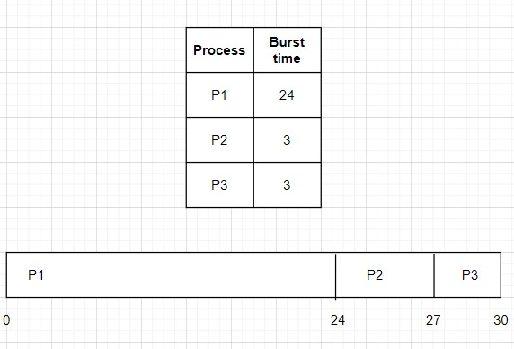
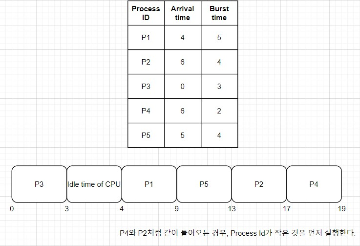
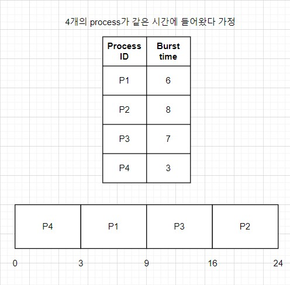
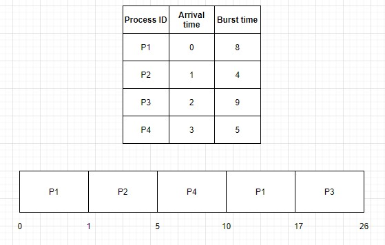
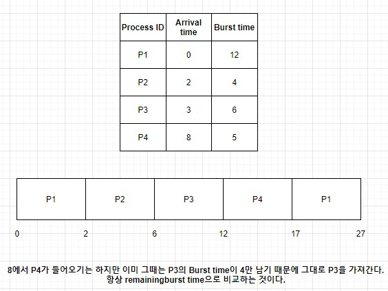
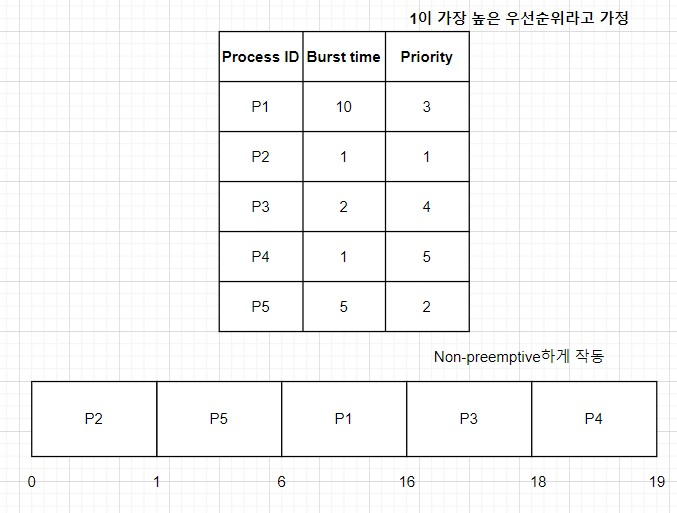
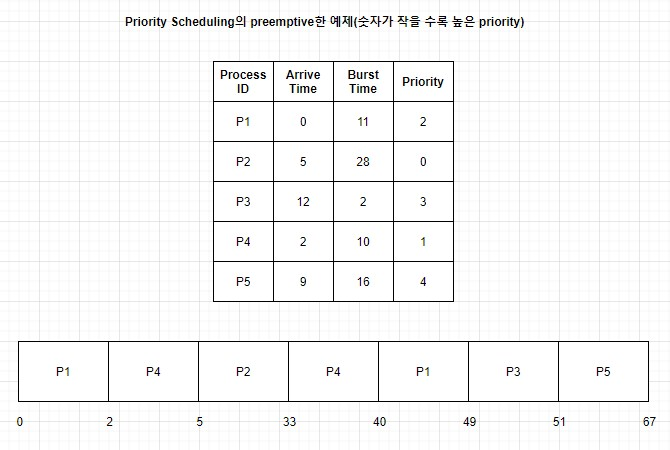
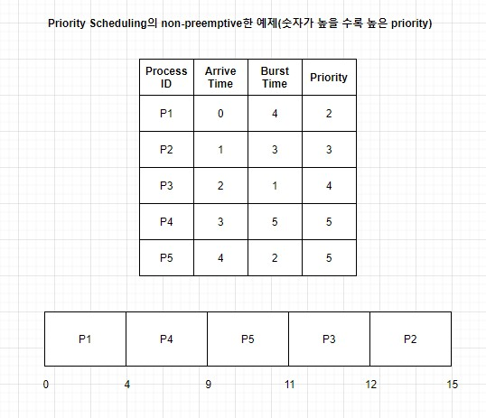
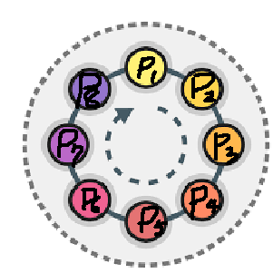

# CPU Scheduling

> Ready 상태의 프로세스들 중 누구에게 CPU를 줄 것이냐!!!
>
> 최신 운영체제에서는 실질적으로 프로세스가 아닌 커널 수준 쓰레드를 스케줄한다. 하지만, 보다 편한 설명과 이해를 위해 스케줄링의 대상을 프로세스로 가정하고 설명하겠다. 실제로, 프로세스 스케줄링과 스레드 스케줄링 이라는 두 단어는 상호 교환적으로 사용된다. 
>
> Ready Queue는 반드시 선입선출(FIFO) 방식의 큐가 아니어도 되는 것에 유의해야 한다. (이름은 큐이지만 보통 링크드 리스트로 구성한다.) Ready Queue 속에 있는 모든 프로세스는 CPU에서 실행될 기회를 기다리며 대기한다. 큐에 있는 레코드들은 일반적으로 프로세스들의 PCB이다.

---

### 🔴CPU Scheduling

- CPU Scheduling is the basis of multiprogrammed operating systems.
- By switching the CPU among processes, the OS can make the computer more productive.
- In a single-processor system, only one process can run at a time.
- Any others must wait until the CPU is free and can be rescheduled.
  - The objective of multiprogramming is to have some process running at all times, to maximize CPU utilization.
  - A process is executed until it must wait, typically for the completion of some I/O request.
  - 하지만, 이런 식으로 I/O가 끝날 때까지 기다린다면 CPU의 활용시간을 낭비하는 것이다.
- 때문에, 멀티프로그래밍에서 우리는 이 기다리는 시간을 효율적으로 사용하기 위한 노력을 해야 한다.
  - Several processes are kept in memory at one time.
  - When one process has to wait, the operating systems takes the CPU away from that process and gives the CPU to another process and this pattern continues.

**A 프로세스에서 B 프로세스로 CPU를 옮기는 일을 디스패쳐가 수행한다!**

---

### 🔴Dispatcher

> 유저 프로그램과 유저 프로그램이 수행되는 중간에 개입해서 CPU를 A 프로세스에서 B 프로세스로 넘겨주는 역할을 한다. 이때 가장 중요한 것이 디스패쳐가 수행되기 위해서는 CPU를 차지해야 한다는 것! (지금까지 잘못 알고 있었다. 나는 프로세스가 바뀔 때 CPU가 논다고 생각했다. 하지만, CPU가 놀든 본래의 용도(명령어 처리)가 아닌 다른 일을 하든 이 시간은 오버헤드이다.) 다시 말해 CPU에 대한 점유권, CPU에 대한 control이 유저 프로그램에서 디스패쳐로, 디스패쳐에서 다시 다른 유저 프로그램으로 넘어가야 한다. 디스패쳐가 수행된다는 것은 커널로 execution control이 진입하는 것이다. 그리고 다시 다른 유저 프로그램으로 execution control이 넘어가는 것을 의미한다. 유저 모드에서 커널 모드로 바꾸려면 Interrupt가 필요하고 이 때문에 Interrupt 하는 순간 OS(정확히 말하면 디스패쳐)가 CPU를 사용하는 것이다.

### System Call

> 운영체제의 커널이 제공하는 서비스를 응용 프로그램에 요청하기 위한 Interface. 즉, OS는 커널 모드에서 수행되는 라이브러리 함수들의 집합체이다. 커널 모드에서 수행되는 라이브러리 함수는 System Call 함수 외에 한가지가 더 있다. 바로 Interrupt(Interrupt Service Routine) . 왜냐? Interrupt가 일어나면 mode change가 일어나고 하드웨어적인 정의에 의해 해당 Interrupt Service Routine이 불려진다. 결국, 커널 함수하고 하는 것은 System Call을 구현하는 함수들과 Interrupt Service Routine들로 구성되어있다.

---

### CPU and I/O Burst Cycles

- Process execution consists of a cycle of CPU execution and I/O wait.
- CPU execution 상태를 CPU Burst, I/O 처리가 끝나기를 기다리는 상태를 I/O Burst 라고 한다.

Process execution begins with a

​												**CPU** **Burst**   That is followed by an

​																										**I/O** **Burst** which is followed by another

​																																									**CPU** **Burst**

​																																															and so on.....

결국 마지막 CPU Burst는 또 다른 I/O Burst가 뒤따르는 대신, 실행을 종료하기 위한 시스템 요청과 함께 끝난다.

---

### Preemptive and Non-Preemptive Scheduling

> CPU Scheduler는 CPU를 받을 프로세스를 정하고, 디스패쳐가 그 프로세스에 직접적으로 CPU를 전달한다.

 

CPU Scheduling은 아래 4개의 상황에서 발생한다.

1. When a process switches from the `running state` to the `waiting state` (I/O 요청이나 프로세스가 종료되기를 기다리기 위해 `wait()`을 호출할 때)
2. When a process switches from the `running state` to the `ready state` (인터럽트가 걸릴 때)
3. When a process switches from the `waiting state` to the `ready state` (I/O가 끝났을 때)
4. When a process terminates

1, 4번의 경우 이후에 Ready Queue에 있는 프로세스들 중 하나를 선택하면 된다. 하지만, 2, 3번의 경우에는 조금 다르다. 

2번의 경우 원래의 프로세스가 `ready state`로 가게 된다. 그렇다면 원래 처리하던 프로세스를 다시 선택할 지 아니면 새로운 프로세스를 선택할 지 골라야 한다.

3번의 경우 I/O 처리를 위해 `waiting state`로 갔던 프로세스가 `ready state`로 온다면 이 프로세스를 먼저 처리할 것인지 아니면 새로운 프로세스를 선택할 지 골라야 한다.

1, 4번의 상황에서 발생하는 Scheduling을 `Non-Preemptive` 혹은 `Cooperative` 하다고 부른다.

2, 3번의 상황에서 발생하는 Scheduling을 `Preemptive` 하다고 부른다.

`Non-Preemptive`

> 어떤 프로세스가 CPU를 할당 받으면 그 프로세스가 종료되거나 I/O request가 발생하여 자발적으로 대기 상태로 들어갈 때까지 계속 실행된다.
>
> 일반적으로 Premptive한 방식보다 스케줄러 호출 빈도가 낮고, context switching overhead가 적다.
>
> 즉, 어떤 프로세스가 작업을 마치고 자발적으로 대기 상태로 들어가거나 종료되는 경우 다른 프로세스가 실행된다.

`Preemptive`

> 프로세스를 쫓아 내고 CPU 자원을 선점할 수 있는 방식.(선점의 근거는 우선순위에 있다.)
>
> 현대 OS는 대부분 시분할 `Premmptive` 스케줄링을 사용한다. 생각해보면 당연한게 `Non-preemptive` 방식은 해당 작업이 끝날 때까지 계속 실행되기 때문에 멀티 프로세스 환경에서 응답성을 기대할 수 없다.

`nonpreemptive`가 더 좋고, `preemptive`가 나쁘다 이런 건 존재하지 않는다. 상황에 따라 유리한 선택지가 달라질 수 있다.

+참고문헌)

https://umbum.dev/60

---

### Scheduling Criteria

- CPU Utilization (개념적으로 0-100%이지만, 실제 시스템에서는 40(for a lightly loaded system)-90(for a heavily used system)%이다.)
- Throughput
- Turnaround Time
- Waiting Time
- Response Time

---

#### 여기서부터 스케줄링 알고리즘들을 하나씩 확인한다.

---

### FCFS(First come, first served)

- 가장 간단한 알고리즘
- 온 순서대로 프로세스에 CPU를 배정한다.
- The implementation of the FCFS policy is easily managed with a FIFO(First in first out) queue.
- When a process enters the ready queue, its PCB is linked onto the tail of the queue.
- When the CPU is free, it is allocated to the process at the head of the queue.
- Running process가 일을 다 끝마치게 되면 해당 프로세스의 PCB는 큐에서 제거된다. (일을 다 끝마칠 때까지 CPU를 가지고 있기 때문)
- Average waiting time이 길어지는 경우가 많다.
- Non-preemptive한 알고리즘이다.
- 프로세스가 CPU를 한 번 가지면, I/O가 발생하거나 프로세스가 종료될 때까지 CPU를 계속 가진다.

Waiting Time for P1 = 0ms

Waiting Time for P2 = 24ms                                       =>                  average waiting time = (0+24+27)/3 = 17ms

Waiting TIme for P3 = 27ms

만약, 순서를 바꿔서 P2P3P1 순이었다고 가정하면 average waiting time은 (0+3+6)/3 = 3ms

앞의 경우보다 훨씬 더 효율적이다.

즉, FCFS에서 나오는 average waiting time은 최소가 아닐 확률이 너무나도 높다. 때문에 실제로 쓰이기는 어려운 알고리즘

 

#### FCFS를 잘 이해하기 위한 예제

 

Turn around time = Completion time - Arrival time

Waiting time = Turn around time - Burst time 

| Process ID | Completion time | Turn around time | Waiting time |
| ---------- | --------------- | ---------------- | ------------ |
| P1         | 9               | 9 - 4 = 5        | 5 - 5 = 0    |
| P2         | 17              | 17 - 6 = 11      | 11 - 4 = 7   |
| P3         | 3               | 3 - 0 = 3        | 3 - 3 = 0    |
| P4         | 19              | 19 - 6 = 13      | 13 - 2 = 11  |
| P5         | 13              | 13 - 5 = 8       | 8 - 4 = 4    |

**Average turn around time = (5 + 11 + 3 + 13 + 8) / 5 = 8 units**

**Average waiting time = (0 + 7 + 0 + 11 + 4) / 5 = 4.4 units**

---

### SJF(Shortest job first)

- When the CPU is available, it is assigned to the process that has the smallest next CPU burst.
- 같은 CPU burst를 가지는 2 개의 프로세스가 오는 경우에는 FCFS로 처리한다.
- SJF 알고리즘은 preemptive 일수도 nonpreemptive 일수도 있다.
- A more appropriate term for this scheduling method would be the **Shortest-Next-CPU-Burst** algorithm because scheduling depends on the length of the next CPU burst of a process, rather than its total length.

P1's waiting time = 3 ms

P2's waiting time = 16 ms

P3's waiting time = 9 ms 

P4's waiting time = 0 ms 

Average waiting time = (3 + 16 + 9 + 0) / 4 = 7 ms  (FCFS는 Average waiting time이 10.25ms가 나온다.)

 

매 초마다 어떤 프로세스가 가장 작은 Burst Time을 가지는지 찾으면 된다.

Waiting time = Total waiting time - No.of miliseconds process executed - Arrival time 

P1's waiting time = (10 - 1 - 0) = 9 ms

P2's waiting time = (1 - 0 - 1) = 0 ms

P3's waiting time = (17 - 0 - 2) = 15 ms

P4's waiting time = (5 - 0 - 3) = 2 ms

Average waiting time = (9 + 0 + 15 + 2) / 4 = 6.5 ms 

 

P1의 waiting time = 17 - 2 - 0 = 15 ms

P2의 waiting time = 2 - 0 - 2 = 0 ms 

P3의 waiting time = 6 - 0 - 3 = 3 ms

P4의 waiting time = 12 - 0 - 8 = 4 ms

Average waiting time = (15 + 0 + 3 + 4) / 4 = 5.5 ms

 

### SJF 알고리즘의 문제

- 다음 CPU request의 길이를 알아내기가 너무 어렵다.

- 짧은 burst time이 반복되는 경우에서는 사용하기 어렵다. 

  

  **이러한 문제점을 해결하기 위한 한가지 다른 접근 방법이 존재한다.**

  - We may not know the length of the next CPU burst, but we may be able to predict its value.
  - We expect that the next CPU burst will be simmilar in length to the previous one.
  - Thus, by computing an approximation of the length  of the next CPU burst, we can pick the process with the shortest predicted CPU burst.(단순 예측이기는 하나 그럴 확률이 높다.)

  
  
  ---
  

### Priority Scheduling

- A priority is associated with each process, and the CPU is allocated to the process with the highest priority.
- Equal priority processes are scheduled in FCFS order.
- SJF 알고리즘은 Priority 알고리즘에 포함된다고 할 수 있다.(CPU burst가 크면 우선순위가 낮고, CPU burst가 작으면 우선순위가 크다.)
- Priority Scheduling can be either preemptive or nonpreemptive.
-  Preemptive하게 동작할 경우 더 높은 우선순위의 프로세스가 오면 바로 CPU를 넘겨준다. Nonpreemptive하게 동작하는 경우 계속 쓰게 두고 작업이 끝나면 가장 높은 우선순위의 프로세스에게 CPU를 준다.

P1's waiting time = 6 ms

P2's waiting time = 0 ms

P3's waiting time = 16 ms

P4's waiting time = 18 ms

P5's waiting time = 1 ms

Average waiting time = 8.2 ms

우선순위 스케줄링의 가장 큰 단점은 heavily loaded computer system에서 낮은 우선순위를 가지는 프로세스는 평생 CPU를 가질 수 없게 될 수도 있다는 것이다.

=> starvation 발생!

이 문제를 해결하기 위해서 만들어진 개념이 **aging**

Aging is a technique of gradually increasing the priority of processes that wait in the system for a long time.

예를 들어 0(low priority)에서 127(high priority)까지의 우선순위가 있을 때, waiting process들의 우선순위를 15분 마다 1씩 증가시키다보면 127의 우선순위를 가지는 프로세스도 결국 언젠가는 실행될 것이다.

 

$$

$$
Waiting time = Total waiting time - NO.of miliseconds Process executed - Arrival time

P1's waiting time = (40 - 2 - 0) = 38 ms

P2's waiting time = (5 - 0 - 5) = 0 ms

P3's waiting time = (49 - 0 -12) = 37 ms

P4's waiting time = (33 - 3 - 2) = 28 ms 

P5's waiting time = (51 - 0 - 9) = 42 ms

Average waiting time = 29 ms

 

P4와 P5 중 P4를 먼저 처리하는 이유는 우선순위가 같은 경우 FCFS로 처리하기 때문

Turn around time = Completion time - Arrival time
Waiting time = Turn around time - Burst time

| PID  | Completion time | Turnaround time | Waiting time |
| ---- | --------------- | --------------- | ------------ |
| P1   | 4               | 4 - 0 = 4       | 4 - 4 = 0    |
| P2   | 15              | 15 - 1 = 14     | 14 - 3 = 11  |
| P3   | 12              | 12 - 2 = 10     | 10 - 1 = 9   |
| P4   | 9               | 9 - 3 = 6       | 6 - 5 = 1    |
| P5   | 11              | 11 - 4 = 7      | 7 - 2 = 5    |

Average turn around time = 8.2 ms

Average waiting time = 5.2 ms

---

### Round Robin

- RR은 time sharing(시분할) 시스템을 위해서 설계된 알고리즘이다.
- FCFS 스케줄링과 비슷하지만, preemption한 특징을 가진다는 차이가 존재한다.
- **A small unit of time, called a time quantum or time slice, is defined(generally from 10 to 100 miliseconds.)**
- **The ready queue is treated as a circular queue.**
- The CPU scheduler goes around the ready queue, allocating the CPU to each process for a time interval of up to 1 time quantum.
- 즉, P1이 1 time quantum만큼 CPU를 가지고, P2가 1 time quantum만큼 가지고 ... P8이 1 quantum 만큼 가지고, 다시 P1이 끝나지 않았다면 1quantum 만큼 가지고 ... 이런 식으로 원형 큐를 돌면서 모든 프로세스들을 조금씩 처리.
- **1 time quantum을 정하는 것은 매우 중요하다. 너무 낮게 하면 cost가 있는 context switch가 너무 자주 발생하고, 너무 크게 하면 그냥 FCFS가 돼버린다.**
- We keep the ready queue as a FIFO queue of processes.
- New processes are added to the tail of the ready queue.
- The CPU Scheduler picks the first process from the ready queue, sets a timer to interrupt after 1 time quantum, and dispatches the process. 이 이후 2개의 상황이 나타날 수 있다.
  - 첫번째 상황은 The process may have a CPU burst of less than 1 quantum인 상황이다. 이 경우 프로세스는 자발적으로 CPU를 놓아준다. CPU 스케줄러는 Ready queue의 헤드에 있는 프로세스에게 CPU를 준다.
  - 두번째 상황은 The CPU burst of the currently running process is longer than 1 quantum, the timer will go off and will cause an interrupt to the OS. 이후 context switch가 발생하면서 현재 프로세스는 Ready queue의 tail에 들어간다. CPU 스케줄러는 Ready queue의 헤드에 있는 프로세스에게 CPU를 준다.