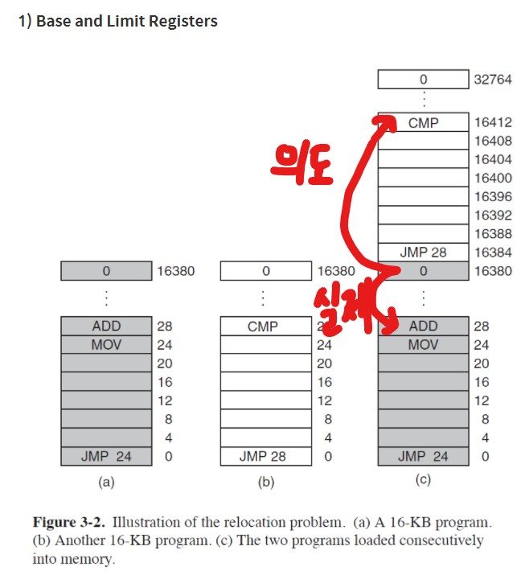
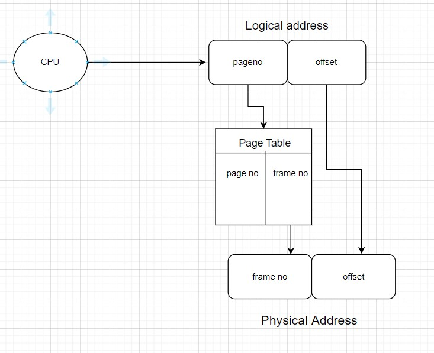

# 메모리

---

여러 프로그램들이 메인 메모리에 적재되다보면 원래 의도와는 다른 동작을 하는 경우들이 발생한다.

다음 사진에서 또한 원래 jump 해야 하는 곳이 아닌 다른 곳으로 jump 하면서 잘못된 접근을 하고 있음을 알 수 있다. 때문에 우리는 제대로 된 동작을 만들기 위해 relocation이 필요하다.

이를 해결하기 위해 Base and Limit Registers를 사용한다. 위의 사진에서 위에 적재된 프로그램의 Base register 값은 16384가 된다. 떄문에 jump 28이라는 동작을 수행하면 28 + 16384인 곳으로 jump 하다.

cpu는 실제로 실행 중인 프로세스의 Base Register만을 가지고 있는다.

---

​                 Logical(virtual) address                                       physical address

cpu ----------------------------------------------> MMU -----------------------------------------------------> Memory

프로그램이 컴파일 된 이후 프로세스의 각 페이지는 런타임에 메인 메모리 속에 relocate된다. 하지만, 컴파일러는 각 페이지가 메인 메모리 속 어디에 위치해야 하는지 모르고 단순히 메인 메모리의 가장 처음 위치할 것이라고만 추측한다.

CPU 또한 프로세스의 주소를 만들어내는데 CPU도 정확한 위치를 모르기 때문에 가장 처음에 위치할 것이라고만 추측한다.

이렇게 만들어지는 logical address는 실제로 위치해야 하는 주소(physical address)로 변환되어야 한다. (이 변환은 프로그램의 런타임에 이루어짐)

또한 프로세스의 페이지들이 메인 메모리에 들어갈 때 프로세스 간에 빈 공간이 있을 수도, 같은 프로세스의 페이지들이지만 떨어져 있을 수도, 순서가 뒤집힐 수도 있다.

이런 문제들을 해결하기 위해 offset bit가 필요하다.

---

여기서 제일 중요한 것은 페이지 테이블을 어떻게 구성할 것이냐

1. 전용 레지스터를 둔다.
   - 매우 빠르다.
   - context switch가 발생할 때마다 페이지 테이블의 모든 레지스터를 reload해야 한다.
   - 페이지 테이블의 크기가 작을 때만 사용이 가능하다. 하지만 대부분의 경우 페이지 테이블의 크기는 크다.
2. 이러한 문제를 해결하는 방법 -> page table을 메인 메모리 속에 넣는다. 이렇게 되면 context switch가 발생할 때 1개의 register(pagetable base register)만 바꾸면된다. 하지만, 이 또한 문제가 있는데 바로 메모리에 2번 접근해야 한다는 것. 즉 context switch time은 줄지만 memory access time은 증가한다.

이 메모리 접근 시간을 줄이기 위해 고안된 것이 TLB!

TLB는 하드웨어 캐시면서 페이지 테이블의 few entry만을 가지고 있는다.

메인 메모리에 한 번 접근할 때 (40-100 cycle 정도 걸린다.)

TLB는 CPU 내부에 존재

page fault가 일어나서 디스크에 접근해서 가져오는 entry는 TLB에도 로딩하고, 페이지 테이블에도 로딩한다. 

TLB entry의 개수를 작게 유지하는 이유는 모든 entry와 logical address의 page no이 비교되는게 동시에 일어나기 때문. 동시 비교가 1 cycle에 수행되게 하기 위해서 TLB entry의 개수를 제한한다.

페이지 테이블이 갱신되어서 특정 entry의 데이터가 변경되었는데 그 엔트리가 TLB에 있다면 TLB의 valid를 0으로 바꾼다. 

TLB가 잘 동작하려면 hit ratio가 중요. hit ratio를 높이려면 TLB의 크기를 크게 만들면됨. 하지만, TLB의 크기를 크게 만들면 비용과 1사이클에서 모든 비교가 동시에 일어나지 못함. 때문에 적정선을 찾아야 함. (64개~128개만 되어도 98%이상의 적중률이 나옴)

왜? 컴퓨터의 특징인 locality 떄문 (sparse locality, temporal locality)

하나의 프로세스는 한 개의 페이지 테이블을 갖는다.

context switch가 발생하면 TLB table의 valid를 모두 0으로 바꾸어주는 방식으로 flush한다.

