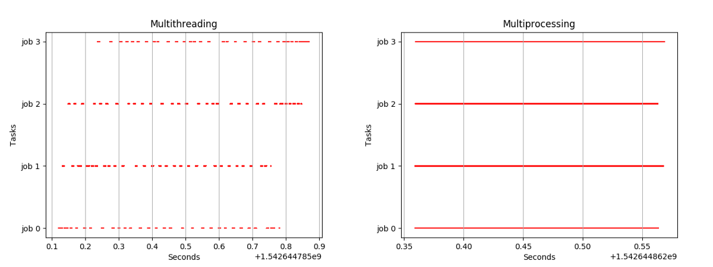

# Multiprocessing vs Multithreading

---

Context Switching이란?

> CPU를 한 프로세스에서 다른 프로세스로, 한 프로세스에서 다른 스레드로, 한 스레드에서 다른 프로세스로, 한 스레드에서 다른 스레드로 전환하는 것을 의미한다. 
>
> 컨텍스트 스위칭의 대상은 프로세스만 있는 것이 아니며, 실제로 현대 운영체제에서 컨텍스트 스위칭의 대상은 보통 스레드가 된다.

Context Switching의 과정을 설명해보세요

> Process 0와 Process 1이 있고 P0의 실행 중간에 컨텍스트 스위칭이 필요해졌다고 가정한다. 
>
> 1. 가장 먼저, Interrupt 혹은 System call이 걸린다.
>
> 2. 중단되어야 하는 P0에 대한 정보들이 P0의 PCB에 저장(store)된다. 
>
> 3. 실행되어야 하는 P1에 대한 정보들이 P1의 PCB에서 로드(load)된다.
>
> 4. P1을 실행한다.
>
> 만약 컨텍스트 스위칭의 대상이 스레드라면 저장 혹은 로드하는 대상은 PCB가 아닌 TCB가 될 것이다.

그러면 Interrupt와 System Call의 차이가 뭔가요?

> 이 질문에 대한 답변은 따로 하나의 파일로 작성하는 것이 좋겠다.

프로세스의 구성요소는?

> 스택, 힙, 데이터, 코드(텍스트)

스레드의 구성요소는?

> 먼저, 스레드란 프로세스에서 동작하는 여러 실행의 흐름. 프로세스는 최소 1개 이상의 스레드를 가진다. 
>
> 같은 프로세스에 속하는 여러 스레드들은 해당 프로세스의 힙, 데이터, 코드 영역을 공유한다.
>
> 각각의 스레드는 자신만의 스택 영역을 가진다.

멀티프로세싱이란?

> 두 개 이상의 프로그램을 동시에 실행하는 것.

멀티스레딩이란?

> 한 개의 프로그램을 여러 조각으로 나누어 두 개 이상의 조각을 동시에 실행하는 것.

싱글코어와 멀티코어의 차이는?

> 일단 기본적으로 싱글코어와 멀티코어 모두 여러 프로그램들을 동시에 실행합니다. 
>
> 하지만, 싱글코어에서의 동시와 멀티코어에서의 동시는 다른 개념입니다. 
>
> 싱글코어에서의 동시를 우리는 Concurrency라 합니다.
>
> 멀티코어에서의 동시를 우리는 Parallelism이라 합니다.
>
> 다음 사진은 싱글코어에서 동작 중인 멀티스레딩과 멀티코어에서 동작 중인 멀티프로세싱의 처리 과정을 보여줍니다.
>
> 
>
> 왼쪽은 코어가 한 개입니다. 때문에 계속해서 컨텍스트 스위치가 발생하면서 하나의 코어가 여러 프로그램을 마치 동시처럼 처리하고 있는 모습을 보여줍니다. 실제로는 동시가 아니지만 이 과정이 워낙 빠르게 지나가서 사람의 감각으로는 느끼지 못합니다. 때문에 사용자의 입장에서는 동시처럼 보이는 것입니다.
>
> 반면 오른쪽은 최소 코어가 4개 이상일 것입니다. 1개의 job을 1개의 프로세서가 처리하고 있음을 보여줍니다. 이 처리 과정은 정확히 동시에 일어납니다.
>
> 즉, Parallelism은 실제 우리가 알고 있는 동시라는 단어의 뜻을 가집니다. 
>
> 반면, Concurrency는 엄밀히 말하자면 동시는 아니지만 마치 동시인것처럼 착각을 불러일으키는 것을 말합니다.
>
> 하지만, 이 과정에서 "그러면 멀티스레딩은 항상 하나의 코어를 Concurrency하게, 즉 시분할(time sharing)로 사용하는 것인가?" 와 같은 오해를 해서는 안됩니다.
>
> 일단 기본적으로 멀티프로세싱은 당연히 2 개 이상의 프로세서를 가질 것입니다. 
>
> 반면, 멀티스레딩은 위의 예제처럼 싱글코어를 가질 수도 있지만, 멀티코어를 가질 수도 있습니다. 만약에 한 개의 프로세스만이 존재하고 이 안에는 3개의 스레드가 있는 상황에서,코어의 개수가 3개라고 가정해봅시다. 그렇다면 3개의 스레드가 각각의 코어에 의해 실행될 것이고 처리 흐름은 오른쪽 그림과 동일해질 것입니다. (1개의 스레드가 여러 코어에 의해 실행될 수도 있다고 합니다.)
>
> https://stackoverflow.com/questions/16116952/can-multithreading-be-implemented-on-a-single-processor-system
>
> https://www.backblaze.com/blog/whats-the-diff-programs-processes-and-threads/

스레드의 장점은?

> 1. 컨텍스트 스위칭의 비용이 작다. (많은 영역들을 공유하기 때문에)
> 2. 불필요한 공간을 절약할 수 있다. (많은 영역들을 공유하기 때문에 이 영역들은 딱 한 번만 선언하면 된다.)
> 3. Concurrency를 높일 수 있다.
>
> 3번을 말하면 Concurrency가 무엇인지 물어볼 것이고 이때 Parallelism과 함께 비교하면서 설명한다면 Good!

멀티프로세싱이 유리한가요 멀티스레딩이 유리한가요?

> 반드시 상황 마다 다르다는 것을 먼저 말해야한다. 이후에 "통상적으로는 IO bound가 크면 멀티스레딩이 유리하고 CPU bound가 크면 멀티프로세싱이 유리합니다."

# 추가해야하는 내용 shared memory, IPC, 프로세스동기화 스레드 동기화 구분의 초입도 필요, 스레드 풀에 대한 내용

멀티 프로세서 - 공유 메모리가 존재. 메모리를 공유하기 때문에 이 경우에도 당연히 동기화가 필요하겠지.

멀티 쓰레딩 - 하나의 프로세서 안에 여러개의 쓰레드. 만약에 멀티 프로세서라면 각 프로세서마다 여러개의 쓰레드를 가지고 있겠지. 이경우 

아니 멀티 프로세싱은 여러 개의  CPU가 여러 개의 프로세스를 처리하는거자나. 그러면 여기서 여러개의 프로세스 중 하나의 프로세스 안에 또 멀티 쓰레딩을 수행할 수 있는거 아닌가

동기화가 쓰레드 간에만 이루어지는건가? 아니지 않나? 프로세스 간에서도 쉐어드 메모리가 있으니까 동기화가 필요한거 아닌가?

https://stackoverflow.com/questions/4623335/thread-synchronization-vs-process-synchronization

https://www.geeksforgeeks.org/difference-between-multitasking-multithreading-and-multiprocessing/?ref=leftbar-rightbar

https://velog.io/@zehye/%EC%93%B0%EB%A0%88%EB%93%9CThreads%EC%99%80-%EB%8F%99%EA%B8%B0%ED%99%94Synchronization

https://www.geeksforgeeks.org/difference-between-multiprocessing-and-multiprogramming/

https://www.slideshare.net/aparnacbhadran/synchronization-in-multiprocessing

동기화는 쓰레드에서만 일어나는게 아니라 프로세스 단위에서도 일어나게 된다.

https://d2.naver.com/helloworld/5237120

https://developers.google.com/web/updates/2018/09/inside-browser-part1