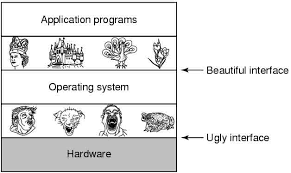
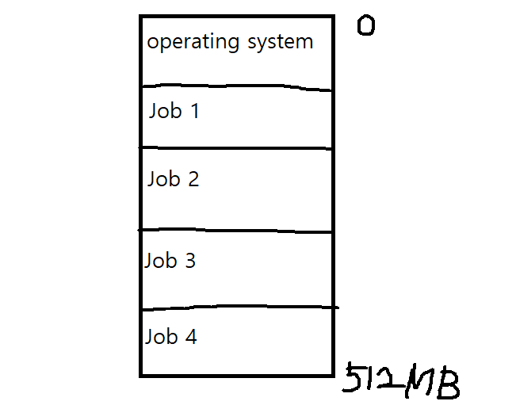
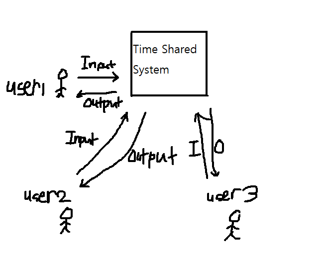

# 💥Operating System(Chapter 1 - Introduction)

---

> 본 내용은 WILEY 출판사에서 발간한 운영체제 10판(번역본)을 바탕으로 작성하였습니다.

운영체제란 기본적으로 컴퓨터 하드웨어를 관리하는 소프트웨어이다. 컴퓨터 사용자(User)와 컴퓨터 하드웨어(Hardware) 사이에 위치하며 중재자 역할을 수행한다.

이 사진은 이러한 운영체제의 역할을 잘 보여준다. 운영체제는 그 자체로 유용한 기능을 수행하는 소프트웨어가 아니다. 운영체제는 단순히 다른 프로그램이 유용한 작업을 할 수 있는 환경을 제공하는 역할을 한다.

---

Modern computer system consists of one or more CPUs and a number of device controllers(ex. Disk Controller, USB Controller). Those are connected by common bus and they shared memory.

일반적으로 운영체제에는 각 장치 컨트롤러마다 장치 드라이버가 있다. 이 장치 드라이버는 장치 컨트롤러의 작동을 잘 알고 있고 나머지 운영체제에 장치에 대한 일관된 인터페이스를 제공한다.

---

## 운영체제의 목표는 크게 3가지로 분류할 수 있다.

1. Convenience - It is an interface between User & Hardware.
2. Efficiency -  Allocation of Resources.
3. Both - Management of Memory, Security, etc.

---

## ROM vs RAM

> RAM(Random Access Memory)
>
> ROM(Read Only Memory)

* RAM은 **휘발성 메모리**입니다. 즉, 모듈에 한시적으로 저장된 정보는 컴퓨터를 재시작하거나 종료할 때 삭제된다는 의미입니다. 정보는 전류가 없을 때 트랜지스터에 전기적으로 저장되므로 데이터는 사라집니다. 파일이나 정보는 요청될 때마다 컴퓨터의 스토리지 디스크 또는 인터넷으로부터 검색됩니다. RAM에 데이터가 저장됩니다. 따라서 하나의 프로그램이나 페이지가 다른 프로그램이나 페이지로 이동할 때마다 기존 정보가 즉석 제공됩니다. 컴퓨터가 종료되었을 때 메모리는 프로세스가 다시 시작될 때까지 빈 상태가 됩니다. **휘발성 메모리는 사용자가 손쉽게 변경, 업그레이드 및 확장할 수 있습니다. **

- ROM은 **비휘발성 메모리**로, 정보가 칩에 영구 저장된다는 의미입니다. 메모리의 경우 데이터 저장에 전류에 의존하지 않고, 바이너리 코드를 사용해 개별 셀에 쓰이기 때문입니다. 비휘발성 메모리는 소프트웨어의 초기 부팅 관련 부분, 프린터 작동에 관여하는 펌웨어 명령 등 변하지 않는 컴퓨터 부품에 사용됩니다. 컴퓨터 전원을 끈다 해도 ROM에는 영향을 주지 않습니다. **비휘발성 메모리는 사용자가 변경할 수 없습니다.(변경할 수 없기 때문에 READ ONLY MEMORY라 부르는 것이다.)**

출처)https://www.crucial.kr/articles/about-memory/what-is-the-difference-between-ram-and-rom

---

##  중요한 개념인 Bootstrap program, Interrupt, system call에 대한 간단한 설명

- #### Bootstrap Program

  > - The initial program that runs when a computer is powered up or rebooted.
  > - It is stored in the ROM(Read-Only-Memory).
  > - It must know how to load the OS and start executing that system.
  > - It must locate and load into Memory the OS kernel.

- #### Interrupt(주로 Hardware에서 발생, 굉장히 중요한 개념이기 때문에 아래에 설명을 추가하겠습니다.)

  > - The occurrence of an event is usually signaled by an Interrupt from Hardware or Software.
  >
  > - Hardware may trigger an interrupt at anytime by sending a signal to the CPU, usually by the way of the system bus.
  >
  > - Execution Progress 1 
  >
  >   When the CPU is interrupted, it stops what it is doing and immediately transfers execution to a fixed location.(The fixed location usually contains the starting address where the Service Routine of the interrupt is located.)
  >
  > - Execution Progress 2
  >
  >   The Interrupt Service Routine executes. On completion, the CPU resumes the interrupted computation.

- #### System Call(Software에서 발생)

  > - Software may trigger an interrupt by executing a special operation called System Call.

---

## 🔴Interrupts

> CPU가 프로그램을 실행하고 있을 때, 입출력 하드웨어 장치의 요청이나 예외상황이 발생하여 처리가 필요한 경우 CPU에게 알려서 처리할 수 있도록 하는 것

 

하드웨어는 어느 순간이든 시스템 버스를 통해 CPU에 신호를 보내 인터럽트를 발생시킬 수 있다.

CPU가 인터럽트 되면

1. CPU는 하던 일을 중단하고 즉시 고정된 위치로 실행을 옮긴다.(고정된 위치란 일반적으로 인터럽트를 위한 서비스 루틴이 위치한 시작 주소이다.)
2. 인터럽트를 위한 서비스 루틴이 실행된다.
3. 인터럽트 서비스 루틴의 실행이 완료되면 CPU는 인터럽트 되었던 연산을 재개한다.

여기서 중요한 것은 인터럽트 되었던 연산을 재개하기 위해서는 해당 연산이 남아있어야 한다는 것이다. 하지만, 현재 CPU는 인터럽트를 위한 서비스 루틴을 실행한 직후이고 모든 값들이 인터럽트를 위한 서비스 루틴에 맞추어져 있는 상태이다.

때문에! 반드시 1번 과정 이전에 현재의 상태를 저장해두어야 한다. 상태를 저장해두어야 인터럽트를 위한 서비스 루틴을 수행한 후, 저장되어 있던 복귀 주소를 프로그램 카운터에 적재하고, 인터럽트에 의해 중단되었던 연산이 인터럽트가 발생하지 않았던 것처럼 다시 시작할 수 있다.(어떻게 어디에 저장하는지는 이후 챕터에서 나온다.)

이 사진 한 장이 인터럽트의 과정을 잘 설명하고 있다. 하지만, 조금 더 구체적으로  인터럽트는 단순히 외부에서만 발생하지 않는다.

- 외부 인터럽트

> 하드웨어가 발생시키는 인터럽트
>
> CPU가 아닌 다른 하드웨어 장치가 CPU에 요청하는 경우
>
> 아마 외부 인터럽트가 일반 인터럽트의 대부분을 차지하지 않을까?

- 내부 인터럽트

  >CPU 내부에서 실행하면서 인터럽트에 걸리는 경우
  >
  >
  >
  >Divide by Zero, Overflow, Underflow

- 소프트웨어 인터럽트

  > 소프트웨어가 발생시키는 인터럽트
  >
  > 
>
  > 예외상황, system call

   

  `+` 인터럽트 기법에는 우선순위 레벨도 존재한다고 한다. 우선순위가 높은 인터럽트를 먼저 처리할 수도, 우선순위가 낮은 인터럽트를 늦게 처리할 수도 있다.

   

   
  
  **요약하면, 인터럽트는 최신 운영체제에서 비동기 이벤트를 처리하기 위해 사용된다. 장치 컨트롤러 및 하드웨어 오류로 인해 인터럽트가 발생한다. 가장 긴급한 작업을 먼저 수행하기 위해 최신 컴퓨터는 인터럽트 우선순위 시스템을 사용한다. 인터럽트는 시간에 민감한 처리에 빈번하게 사용되므로 시스템 성능을 좋게 하려면 효율적인 인터럽트 처리가 필요하다.**

---

## 🔴DMA(Direct Memory Access)

> 기본으로 알아야 하는 내용
>
> 1. OS 코드는 많은 부분들이 I/O를 manage 하는데 할당된다. 왜냐하면,  I/O의 reliability(신뢰성)와 performance(성능)이 중요하고, I/O 디바이스의 종류가 굉장히 다양하기 때문
> 2. Each device controller is in charge of a specific type of device. (Device controller maintains load storage buffer and set of special purpose registers.)
> 3. Typically OS has a device driver for each device controller.

 

위에 언급한 interrupt를 통한 I/O는 소량의 데이터일 때는 괜찮지만, 대량의 데이터 이동 시에는 굉장히 높은 오버헤드를 발생시킬 수 있다.(당연하지 한 바이트마다 인터럽트가 발생할 것이고 인터럽트 자체가 pure overhead이다.)

이 문제를 해결하기 위해 **DMA**가 사용된다.  

DMA는 블록마다 딱 1번의 인터럽트가 발생한다.(디바이스 드라이버의 동작이 완료 되었을 때)

인터럽트를 거는 횟수가 월등히 적어지고 디바이스와 메모리가 직접적으로 데이터를 transfer하기 때문에 CPU는 그동안 다른 일을 처리할 수 있다.

---

![심심해서 하는 블로그 :: [컴퓨터 구조] 캐시 메모리(Cache)와 매핑 방법](../assets/img/mapping.png)

블록이란 메모리에서 캐쉬로 이동하는 데이터의 단위이다.

---

## 조금 더 심화된 의문. OS는 어떤 디바이스들이 연결되어 있는지 어떻게 알고 있는 것일까?

기본적으로 I/O  디바이스는 I/O 포트에 의해 머신에 연결된다. 디바이스는 자신만의 디바이스 컨트롤러를 갖는다. 디바이스 컨트롤러는 I/O machine과 OS, 그 중간에 위치한 하드웨어이다.

OS가 I/O 디바이스 조작을 위해 CPU에 Instructions를 보낸다. 그러면 이 CPU는 이 I/O 디바이스들에 시그널을 보낸다.(디바이스 컨트롤러를 통해) 그렇다면 OS는 어떤 디바이스들이 연결되어 있는지, 디바이스 working을 위해 어떤 instructions를 보내야 하는지 어떻게 알고 있는 것일까.

=> manufacture가 디바이스를 만들 때 `디바이스 프로그램` 또한 같이 배포하게 된다. 이 때문에 OS에는 디바이스에 대한 정보들이 전혀 존재하지 않는다. 따라서, OS가 디바이스와 상호작용할 수 있는 유일한 수단은 이것의 `디바이스 프로그램`을 통해서 이다. 많은 초심자들이 일단 드라이버가 설치만 되면 OS는 디바이스의 모든 정보를 이해한다고 생각한다. 하지만, 이것은 사실이 아니고, 드라이버는 OS의 한 부분이 절대 될 수 없다. 결국 드라이버 프로그램이 instructions을 보내고 디바이스로부터 데이터를 받으면 드라이버 프로그램이 그 정보를 OS에 전달하는 식의 플로우이다. OS와 드라이버 간의 소통은 굉장히 간단하게 이루어지는데 둘다 메모리에서 load 되는 것들이기 때문이다. 드라이버는 메모리 공간에서 오랫동안 존재하는 **daemon program**(멀티태스킹 운영 체제에서 사용자가 직접적으로 제어하지 않고, 백그라운드에서 돌면서 여러 작업을 하는 프로그램)이라 생각할 수 있다. 이러한 이유들 때문에 드라이버 프로그램이 crash 되자마자 I/O 디바이스의 동작이 멈추는 것이다.

**위의 내용은 굉장히 심화된 내용이면 나 또한 부분부분 이해하지 못한 내용들이 많다. 언젠가 실력이 올라서 이 내용을 이해할 수 있는 순간이 오지 않을까라는 생각에 일단 적어둔다.**

---

## Storage Structure

 

- 위로 갈수록 비싸고 양이 적지만 **빠르다**.
- 아래로 갈수록 **싸고 양이 많지만** 느리다.

- 캐쉬 - SRAM(Static random-access Memory)  메인 메모리 - DRAM(dynamic random-access memory)  하드디스크 - HDD(Hard Disk Drive)

- 범용 컴퓨터는 프로그램 대부분을 메인 메모리(random-access-memory 또는 RAM 이라 부른다)라 불리는 재기록 가능한 메모리에서 가져온다. 메인 메모리는 dynamic random-access memory(DRAM)이라 불리는 반도체 기술로 구현한다.
- 캐쉬는 CPU 속에 들어가 있다.
- 보통 비휘발성 저장장치 전부를 `DISK`로 표현한다.(이건 정확하지 않을 수 있다. 근데 보통 그런 식으로 다들 그림을 그리는 것 같다.)

---

## SRAM vs DRAM

- 많은 컴퓨팅 시스템에서 사용되는 메인 메모리는 DRAM이다. 용량 대비 가격이 저렴(SRAM에 비해)하나 저장된 정보가 시간이 지나면 상실되게 된다. 저장된 정보를 주기적으로 refresh시켜야 하는데, 이 특징 때문에 **Dynamic**하다고 부른다. 전원이 공급되지 않으면 저장된 정보는 상실되기 때문에 휘발성(volatile) 메모리에 속한다.
- 애초에 SRAM은 DRAM과 구조부터가 다르다. [이곳](https://m.blog.naver.com/PostView.nhn?blogId=laonple&logNo=220923427487&proxyReferer=https:%2F%2Fwww.google.com%2F)에 잘 설명되어있다.(읽어보았지만 정확히 이해하지 못하였다.) SRAM은 cache memory에 사용되며 가격은 비싸지만 상대적으로 빠르게 access할 수 있다는 장점이 존재한다. **Cache는 빠른 processor와 느린 main memory 사이에서의 속도차를 극복하기 위한 것이다.**

---

## 🔴Single Processor System vs Multi Processor System vs Clustered System

 

### Single Processor System

> `general purpose`를 위한 프로세서가 1개인 것이지 전체 프로세서가 1개인 것은 아니다. 
>
> 전체 프로세서의 개수 = `general purpose processor`의 개수 + `special purpose processor`의 개수

- One main CPU capable of executing a general purpose instruction set including instructions from user processes.
- Other special purpose processors are also present which perform device specific tasks.

### Multi Processor System

- Also known as parallel systems or tightly coupled systems.
- Has two or more processors in close communication, sharing the computer bus and sometimes the clock, memory, and peripheral devices
- 멀티 프로세서 시스템의 가장 큰 장점은 처리량 증가에 있다. 이 때문에 싱글 프로세서 시스템보다 훨씬 효율적이지만, bus, clock, memory 등을 공유하기 때문에 reliability가 증가한다는 단점이 존재한다.
- 프로세서의 개수가 N개가 되면 보통, 속도 향상의 비율 또한 N배가 되지 않을까 쉽게 예측해 볼 수 있다. 하지만, 현실은 그렇지 않다. 여러 프로세서가 하나의 작업에 협력할 때 모든 프로세서가 올바르게 작동하도록 유지하기 위해서는 일정한 양의 오버헤드가 발생한다. 

### Clustered System

> *클러스터 시스템은 둘 이상의 독자적 노드(시스템)를 연결하여 구성한다는 점에서 멀티 프로세서와 차이를 가진다. 각 노드들은 통상 다중 코어 시스템이며 약결합(loosely coupled)된 상태로 존재한다. 클러스터형의 정의는 분명하지 않다. 일반적으로 받아들여지는 정의에 의하면 클러스터 컴퓨터는 저장장치를 공유하고 근거리 통신망(LAN)이나 [InfiniBand](https://ko.wikipedia.org/wiki/%EC%9D%B8%ED%94%BC%EB%8B%88%EB%B0%B4%EB%93%9C)와 같은 고속의 상호 연결망으로 연결된다.* - 공룡책 p.21

- 멀티 프로세서 시스템과 같이 computational work를 수행하기  위해 여러개의 CPU들을 모은다.

- 클러스터드 시스템과 멀티 프로세서의 다른점은 멀티 프로세서는 여러 개의  프로세서들을 사용하지만, 클러스터드 시스템은 여러 개의 individual  computer systems를 사용한다는 것이다.(그냥 말 그대로 여러 대의 컴퓨터를 돌린다고 이해하면 좋을 것 같다.)

- 클러스터드 시스템은 고사용성(High availability)을 보장한다. 여러 개의 시스템을 사용하기 때문에 시스템 1개가 죽더라도 다른 시스템이 해당 task를 이어받아 수행할 수 있다.(조금 더 구체적으로 말하자면, *각 노드는 하나 이상의 다른 노드(네트워크로 연결되어 있는)들을 감시한다. 만일 감시받던 노드가 고장 나면 감시하던 노드가 고장 난 노드의 저장장치에 대한 소유권을 넘겨받고, 그 노드에서 실행 중이던 응용 프로그램을 다시 시작한다. 사용자와 응용 프로그램의 클라이언트는 잠깐의 서비스 중단만을 경험하게 된다.* - 공룡책 p.20)

- Clustered System can be structured asymmetrically or symmetrically.

  > asymmetrically 
  >
  > - One machine is hot stand-by mode.(Master)
  > - Master는 다른 활성 서버들을 감시하는 역할을 수행한다.  만약, 모든 활성 서버들이 고장난다면 Master가 활성 서버가 된다.
  > - Others run applications.
  >
  > symmetrically
  >
  > - Two or more hosts run applications.
  > - Monitors each other.

## SMP, NUMA에 대한 설명!!!!!!! 추가 필요

---

## 🔴Multiprogramming vs Multitasking

 

### Multiprogramming(Space(memory) sharing)

- 한 user가 CPU 를 사용중이라면 다른 user가 이 CPU 혹은 I/O Device를 사용하는 것은 불가능.(아마도 DMA를 사용하게 되면 I/O Device를 사용하는데 CPU 가 필요하지 않으니까 I/O Device 정도는 쓸 수 있을 듯.)
- 만약 Job1이 실행되고 CPU를 사용하다가 I/O Device를 사용하기 위해 넘어간다고 가정. 이때 Job1이 끝나지 않았기 때문에 CPU는 idle한 상태로 Job1에 머무르게 된다. => 굉장히 비효율적!!!!!! 이런 모양을 Batch system이라 한다.
- 이를 해결하기 위한 개념이 멀티프로그래밍. Job1이 다른 일을 하는 동안 CPU는 Job2를 처리한다. 또, Job2가 다른 일을 처리하러 간다면 CPU는 Job3를 처리.(그러다가 Job1이 다시 CPU가 필요해지면 Job1으로 가야지. 근데, 바로 가지는 않고 추후에 나오는 스케쥴링 알고리즘에 의해 선택이 되어야 CPU를 다시 가질 수 있다.)
- Multiprogramming increases CPU utilization by organizing jobs(code and data) so that the CPU always has one to execute.
- Multiprogrammed systems provide an environment in which the various system resources(for example, CPU, Memory, and Peripheral devices) are utilized effectively, but they do not provide for user interaction with the computer system.(but 이하 내용은 무슨 소리인지 이해하지 못 하였다. 나중에 다시 확인.)

 

### Multitasking(Time sharing)

> Time Sharing 
>
> - Uses CPU scheduling and multiprogramming to provide each user with a small portion of a time-shared computer.
> - Each user has at least one seperate program in memory.
> - A program loaded into memory and executing is called a **"PROCESS"**

- CPU가 여러개의 프로세스에 의해서 Multiplexing(다중화) 되는 것.
- CPU executes multiple jobs by switching among them.
- 이 switch의 속도가 굉장히 빨라서 실제로는 여러 user들이 system에 붙어있는 모양이지만, user는 자신이 system 전체를 사용하고 있다고 느낀다.
- Time Sharing requires an interactive computer system which provides direct communication between the user and the system.
- A time-shared operating system allows many users to share the computer simultaneously.