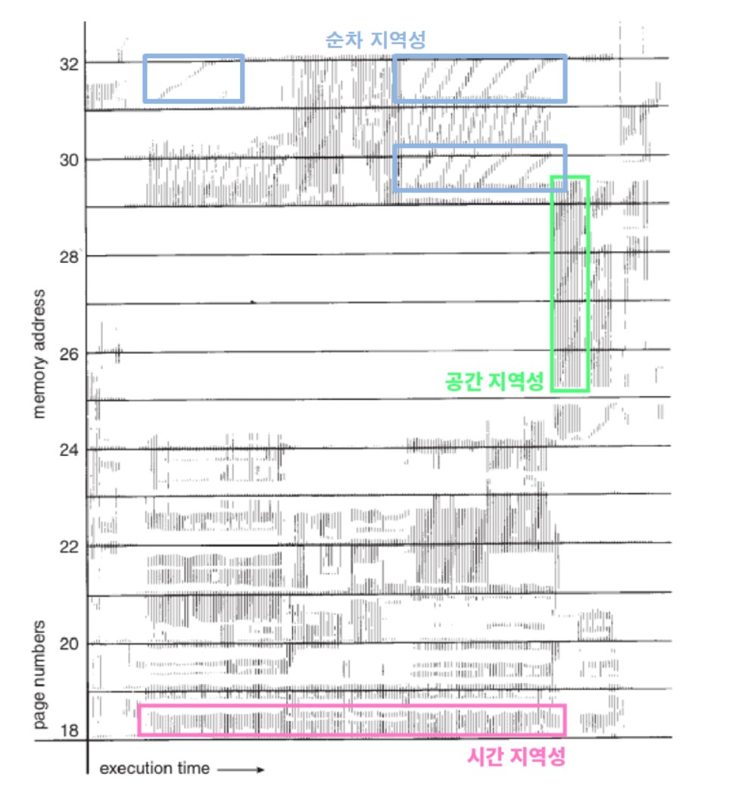

# 💥Operating System(Chapter 10 - Virtual Memory)

---

지금까지 메모리의 관리 전략에 대해서 다룬 이유는 다중 프로그래밍을 실현하기 위해 메모리에 많은 프로세스를 동시에 유지하기 위해서이다. 그러나 지금까지의 접근 방식은 프로세스 전체가 실행되기 전에 메모리로 올라와야 한다는 것을 전제로 하고 있다. 

가상 메모리라는 것은 프로세스 전체가 메모리 내에 올라오지 않더라도 실행이 가능하도록 하는 기법이다. 이 기법의 주요 장점 중 하나는 사용자 프로그램이 물리 메모리보다 커져도 된다는 점이다. 가상 메모리는 물리 메모리로부터 프로그래머 관점의 논리 메모리를 분리해 메인 메모리를 균일한 크기의 저장 공간으로 구성된 엄청나게 큰 배열로 추상화시켜준다. 이 기법을 통해서 프로그래머는 메모리의 크기에 제약으로부터 자유로워진다.

---

만일 프로그램의 일부분만 메모리에 올려놓고 실행할 수 있다면 다음과 같은 이점을 가진다.

- 프로그램은 물리 메모리 크기에 의해 더는 제약을 받지 않는다. 사용자들은 매우 큰 가상 주소 공간을 가정하고 프로그램을 만들 수 있으므로, 프로그래밍 작업이 간단해진다.
- 각 프로그램이 더 작은 메모리를 차지하므로 더 많은 프로그램을 동시에 수행할 수 있게 된다. 이에 따라 응답 시간은 늘어나지 않고, CPU 이용률과 처리율은 높아진다.

- 프로그램을 메모리에 올리고 스왑하는데 필요한 I/O 횟수가 줄어들기 때문에 프로그램들이 보다 빨리 실행된다.

---

### 요구 페이징(Demanding Page)

실행 프로그램을 어떻게 보조저장기억장치(Disk)에서 메모리로 적재할 수 있을지 생각해보자. 

한 가지 방법은 프로그램 실행 시작 시 프로그램의 전부를 물리 메모리에 적재하는 것이다.  이 방법의 가장 큰 문제는 초기에는 프로그램의 전체가 메모리에 있을 필요는 없을 지도 모른다는 점이다.

때문에 우리는 프로그램 실행 시 필요한 페이지만을 적재한다. 이후에 다른 페이지가 필요해지는 순간이오면 그때서야 그 페이지를 불러오는 것이다.

이러한 기법을 요구 페이징이라 한다.

---

하지만, 이런 요구 페이징 기법을 사용하게 되면 발생하는 문제가 있는데, 같은 프로그램에 소속되어 있는 페이지이더라도 메모리에 가있는 페이지가 있고 디스크에 가있는 페이지도 있다는 것이다.

때문에 이 두 종류를 구분할 필요가 생겼고 1bit (valid bit)를 해당 목적을 위해 사용한다. 1(유효) 하다고 설정되면 해당 페이지는 메모리에 있는 것이고, 0(무효) 하다고 설정되면 디스크에 있거나 아예 없는 경우를 의미하게 된다.

---

그렇다면, 메모리에 적재되지 않은 페이지에 접근하려고하면 어떠한 일이 발생할까?

이 경우 페이지 폴트 트랩(page fault trap)이 발생하고 일련의 과정은 다음과 같다.

1. 프로세스에 대한 페이지 테이블(일반적으로 PCB와 함께 유지)을 검사해서 그 메모리 참조가 유효한지 무효한지 알아낸다.
2. 만약 무효한 페이지에 대한 참조라면 그 프로세스는 중단. 유효한 참조인데 페이지가 아직 메모리에 올라오지 않은 거라면 그것을 디스크에서 가져와야 한다. (이 부분 무슨 개소리인지 모르겠다. 일단 여기서 말하는 유효, 무효 참조가 valid bit을 의미하는 것 같지는 않다.)
3. 빈 공간, 즉 가용 프레임을 찾는다.
4. 디스크에서 메모리로 해당 페이지를 가져온다.
5. 이 페이지가 메모리에 있다는 것을 알리기 위해 페이지 테이블을 갱신한다.
6. 트랩에 의해 중단되었던 명령어를 다시 수행한다. 이제 프로세스는 마치 그 페이지가 항상 메모리에 있었던 것처럼 해당 페이지에 접근한다.

---

## 🔴Trap vs Interrupt

> http://melonicedlatte.com/computerarchitecture/2019/02/12/213856.html
>
> 해당 블로그의 내용을 참고하였습니다.

### 인터럽트

> 인터럽트에는 동기(exception)와 비동기(interrupt)가 있다.

- 비동기식 인터럽트

  > 우리가 흔히 interrupt라고 부르는 것이다. 하드웨어 인터럽트라고도 한다.
  >
  > 정해진 기준없이 예측 불가하게 이벤트가 발생.
  >
  > ex) I/O interrupt, keyboard event

- 동기식 인터럽트

  > exception이라고 부르는 것이 동기식 인터럽트에 해당한다. 이벤트가 언제든지 예측 불가하게 발생하는 것이 아니라 기준 혹은 시간에 맞추어서 발생한다. 그래서 동기식 인터럽트는 명령어 실행 후 그 결과로 발생하는 경우가 많다.
  >
  > 소프트웨어 인터럽트라고도 부른다.
  >
  > ex) 0으로 나누기, Page fault

### 트랩

> 트랩은 실행 중인 프로그램 내에 테스트를 위해 특별한 조건을 걸어놓은 것을 말한다.
>
> interrupt이든, system call이든, exception이든 발생이 되면 trap에 의해 catch가 되고, trap handler가 각 상황에 맞게 처리하도록 알맞게 매핑해주어서 각 서비스 루틴 또는 핸들러에서 처리를 시킨다.
>
> 다른 블로그에서 트랩을 표현하는 걸 보면 아래와 같다.
> 트랩은 발생하는 시점이 프로그램의 일정한 지점이다.
> 하드웨어에 의해 자동적으로 미리 알려진 위치에 조건적으로 점프하는 것.
>
> interrupt **→** interrupt service routines(ISR) 을 실행하도록 처리 
> system call **→** system services 을 실행하도록 처리
> exception **→** exception handler 을 실행하도록 처리

여기에서 그러면 트랩과 동기식 인터럽트는 뭐가 다른건가요? 라는 의문이 제기될 수 있다. 실제로 둘을 구분하는 것은 무의미하다. 왜냐하면 트랩은 동기식 인터럽트의 한 종류이기 때문이다. (trap is a car, exception is a vehicle)

---

### 요구페이징을 사용하면 page fault가 더 많이 발생하는거 아닌가?

간단하게만 생각해보면 page fault가 더 많이 발생할 것 같다. 특정한 프로그램을 실행시켰을 때 해당 프로그램의 일부분만을 가져오게 되면 당연히 그 외의 부분이 필요할 때마다 page fault가 발생할 것이기 때문에 높은 page fault가 발생하지 않을까? 라는 의문은 합리적이다.

하지만, 이러한 의문은 컴퓨터의 특징인 참조 지역성(locality of reference)을 생각하지 않은 결과이다.

모든 프로그램은 참조의 지역성이라는 성질이 있어서 프로그램의 어느 한 특정 작은 부분만 한동안 집중적으로 참조하게 된다. 이러한 성질 때문에 요구 페이징은 만족할 만한 성능을 보여준다.

---

- 공간(spatial) 지역성

  - 특성 클러스터의 기억 장소들에 대해 참조가 집중적으로 이루어지는 경향
  - 참조된 메모리 근처의 메모리를 참조

- 시간(temporal) 지역성

  - 최근 사용되었던 기억 장소들이 집중적으로 액세스되는 경향
  - 참조했던 메모리는 빠른 시간에 다시 참조될 확률이 높음

- 순차(sequential) 지역성

   : 공간 지역성에 편입되어 설명되기도 함

  - 데이터가 순차적으로 액세스되는 경향
  - 프로그램 내의 명령어가 순차적 구성에 기인

---

### 가용 프레임 리스트

페이지 폴트가 발생하면 운영체제는 요청된 페이지를 보조저장장치에서 메인 메모리로 가져와야 한다. 페이지 폴트를 해결하기 위해 대부분의 운영체제는 이러한 요청을 충족시키기 위해 사용하기 위한 가용 프레임의 풀인 **가용 프레임 리스트**를 유지해야 한다. 프로세스의 스택 또는 힙 세그먼트가 확장될 때도 가용 프레임이 할당되어야 한다. 

운영체제는 일반적으로 zero-fill-on-demand라는 기법을 사용하여 가용 프레임을 할당한다. zero-fill-on-demand 프레임은 할당되기 전에 모두 0으로 내용이 채워진다.

시스템이 시작되면 모든 가용 메모리가 가용 프레임 리스트에 넣어진다. 가용 프레임이 요청되면 가용 프레임 리스트의 크기가 줄어든다. 어떤 시점에서, 리스트의 크기는 0으로 떨어지거나 특정 임계값 밑으로 떨어지거나 특정 임계값 밑으로 떨어지며, 이 시점에서 다시 채워져야 한다.

---

### 쓰기 시 복사(Copy on Write)

fork()를 하면 부모 프로세스의 페이지들이 실제로 자식 프로세스에 복사해줌으로써 자식 프로세스의 주소 공간을 구성해주었다. 그렇지만 대부분의 자식은 이렇게 만들어지자마자 곧 exec() 시스템 콜을 한다. 그러면 부모로부터 복사해온 페이지들은 다 쓸모 없는 것들이 되고 만다. 그래서 부모의 페이지들을 다 복사해오는 대신 쓰기 시 복사 방식을 사용한다.

쓰기 시 복사란 결국 수정이 발생하기 전까지는 복사본을 만들지 않는 기법이다. 복사가 수행되면 그냥 같은 메모리에 포인터가 2개가 생기는 것일 뿐이다. 이후에 둘 중 하나라도 수정 이벤트가 발생하면 그 때서야 두 포인터가 포인팅 하는 메모리가 나뉘게 된다.

실제 자바스크립트를 포함한 많은 언어들에서 복사 이벤트가 발생했을 때 이 방식을 사용한다.

---

### 페이지 교체

우리는 요구페이징을 사용하여 더 많은 프로그램들을 동시에 돌릴 수 있게 되었다. 하지만, 만약 페이지가 저장되는 위치인 페이지 테이블이 가득 찬 상태에서 디스크에 있는 새로운 페이지를 가져와야 하는 상황이 발생한다면 어떻게 해야 하는가.

결국 이러한 상황에 도달하게 되면 기존에 페이지 테이블 내에 존재하던 페이지를 빼고 해당 공간에 새로운 페이지를 넣어야 한다. 우리는 페이지 테이블 내에서 가장 최적의 희생자를 찾아야하고 이를 위한 알고리즘들을 설명한다.

---

### Belady's Algorithm (Optimal Algorithm)

Basic Idea: replace the page that will not be used for the longest time in the future.

Basic problem: hard to know the future

사실상 앞으로 사용할 프로세스를 정확히 알 수 없기에 현실적으로 이 알고리즘은 사용할 수 없다. 하지만, 이 알고리즘이 최고의 성능을 내기 때문에 이 알고리즘의 성능과 비슷한 알고리즘이라면 성능이 좋다고 말할 수 있다. 때문에 이 알고리즘을 비교대상으로해서 효율성을 계산한다.

---

### NRU (Not Recently Used Page) 

Each page has R bit, M bit.

- R bit: set when page is referenced

- M bit: set when the page is modified

Pages are classified

- class 0: not referenced, not midified (R = 0, M = 0)
- class 1: not referenced, modified (R = 0, M = 1)
- class 2: referenced, not modified (R = 1, M = 0)
- class 3: referenced, modified (R = 1, M = 1)

NRU 알고리즘에서는 낮은 클래스의 페이지를 우선적으로 제거한다.

R이 1이면 최근에 사용한 것, 이건 가능한 replace 하지 않는다. R이 0인 것들 중에 교체를 해야 하는데 M이 1이면 메인 메모리에 접근해서 새로 write해야 하기 때문에 M도 0인 것을 우선순위로 고른다.

Modified bit이 한번 (1로) setting되면 디스크로 가기 전까지는 변하지 않는다.

---

### FIFO 

사용하기도 쉽고 이해하기도 쉽다. 그만큼 성능이 좋지 않아서 쓰지 못한다.

---

### Second Chance Page Replacement Algorithm

---

### The Clock Page Replacement Algorithm

---

### LRU(Least Recently Used)

LRU 알고리즘에서는 페이지마다 마지막 사용 시간을 유지한다. 페이지 교체 시에 LRU는 가장 오랫동안 사용되지 않은 페이지를 선택한다. 

LRU 정책은 페이지 교체 알고리즘으로 자주 사용되며 좋은 알고리즘으로 인정받고 있다. 문제는 어떻게 페이지들을 최근 사용된 시간 순서로 파악할 수 있냐는 것이고, 두 가지의 구현 방법이 있다.

- 계수기(counter)

  >각 페이지 항목마다 사용 시간 필드를 넣고 CPU에 논리적인 시계나 계수기를 추가한다. 메모리가 접근할 때마다 시간은 증가한다. 페이지에 대한 참조가 일어날 때마다 페이지의 사용 시간 필드에 시간 레지스터의 내용이 복사된다. 이렇게 각 페이지의 마지막 참조 시간을 유지할 수 있다.
  >
  >이 기법에서는 LRU 페이지를 찾기 위해 페이지 테이블을 탐색하여야 하며, 메모리 참조 때마다 (페이지 테이블의 사용 시간 갱신을 위해) 메모리 쓰기 작업을 필요로 한다.

- 스택(stack)

  > LFU 교체 정책의 다른 구현 방법은 페이지 번호의 스택을 유지하는 방법이다. 페이지가 참조될 때마다 페이지 번호는 스택 중간에서 제거되어 스택의 top에 놓이게 된다. 이런 방식으로 하면 스택의 꼭대기는 항상 가장 최근에 사용된 페이지이고, 밑바닥은 가장 오랫동안 이용되지 않은 페이지이다. 스택의 중간에서 항목을 제거해야 할 필요가 있으므로 스택은 보통 doubly-linked-list로 구현한다. 어떤 페이지를 참조해서 그것을 스택의 중간에서 꼭대기로 이동하는 것은 최악의 경우 6개의 포인터 값을 바꿔야 한다. 매 갱신 시에는 약간 더 오버헤드가 크지만 교체가 일어날 경우 페이지를 탐색할 필요가 없게 된다. 리스트의 tail 포인터가 스택의 밑바닥을 가리키고 있기 때문이다.

---

## 참고문헌

---

https://stackoverflow.com/questions/56877451/difference-between-trap-and-exceptions

http://melonicedlatte.com/computerarchitecture/2019/02/12/213856.html

 https://itwiki.kr/w/%EC%B0%B8%EC%A1%B0_%EC%A7%80%EC%97%AD%EC%84%B1
