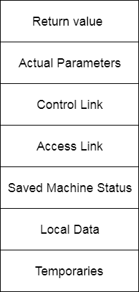
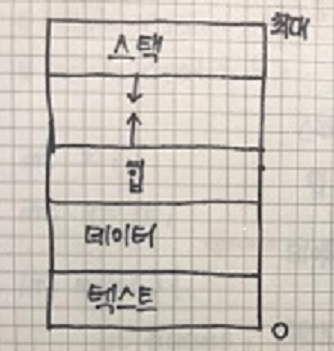
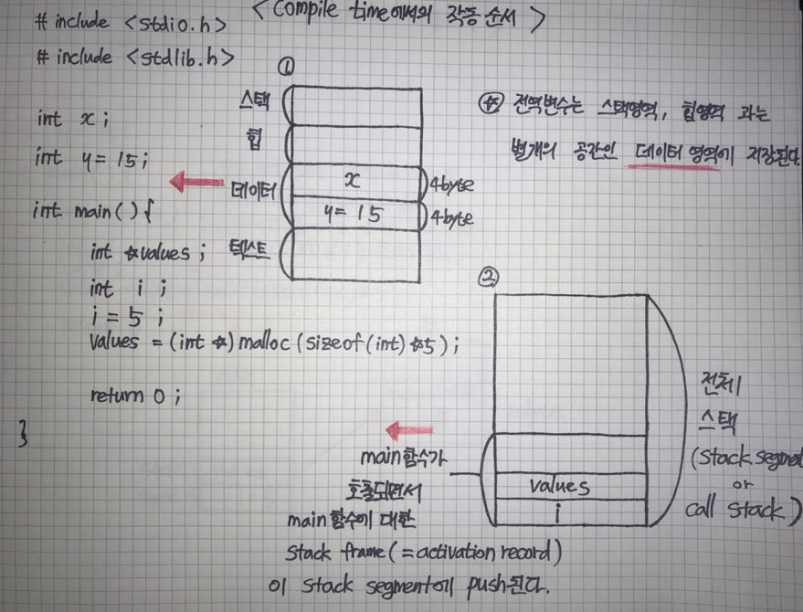
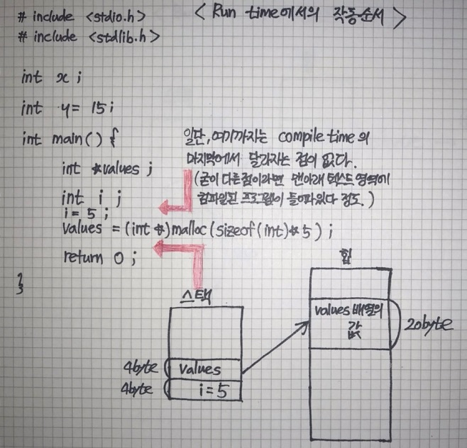
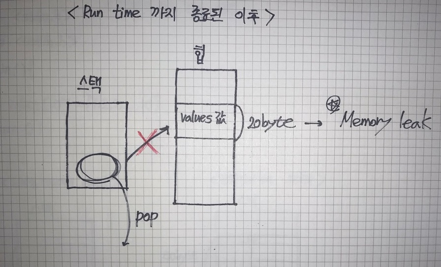
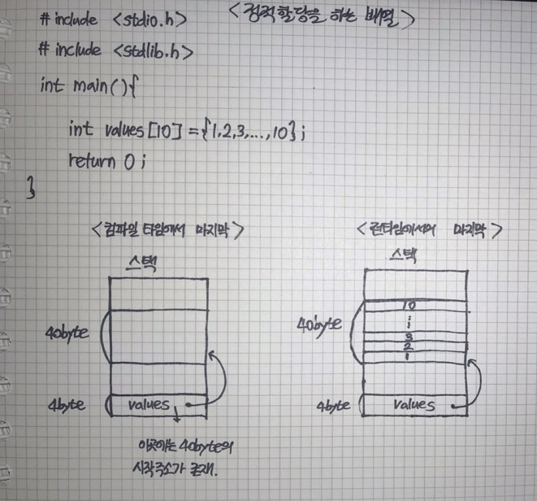

# 💥Operating System(Chapter 2 - Process)

> *초기의 컴퓨터 시스템은 한 번에 하나의 프로그램만을 실행하도록 허용했다. 반면, 오늘날의 컴퓨터 시스템들은 메모리에 다수의 프로그램들을 적재해놓고 병행 실행하는 것을 허용한다. 이러한 발전은 다양한 프로그램들을 보다 견고하게 제어하고 보다 구획화할 것을 필요로 했다. 이러한 필요성이 프로세스의 개념을 낳았으며, **프로세스란 실행 중인 프로그램을 말한다.(정확히 말하면 실행되어 메인 메모리에 적재된 프로그램)** - 공룡책 p,117
>
> 프로그램은 수동적인 존재(passive entity), 프로세스는 능동적인 존재(active entity) 라고 할 수 있다.
>
> 프로그램의 실행 파일이 메모리에 적재(load)되는 순간, 프로그램은 프로세스가 된다. 프로그램의 실행 파일은 메모리에 적재하는 방법은 아이콘을 더블 클릭하는 방식과 명령어 라인상에서 `prog.exe` 또는 `a.out` 과 같이 파일 이름을 입력하는 방식이다.

---

### 프로세스의 메모리 배치

- 텍스트 섹션 - 실행 코드
- 데이터 섹션 - 전역 변수
- 힙 섹션 - 프로그램 실행 중에 동적으로 할당되는 메모리
- 스택 섹션 - 함수를 호출할 때 임시 데이터 저장장소(ex. 함수 매개변수, 복귀 주소 및 지역 변수)

함수가 호출 될 때마다 함수 매개변수, 지역 변수 및 복귀 주소를 포함하는 **활성화 레코드(activation record)**가 스택에 푸시 된다. 함수에서 제어가 되돌아오면 스택에서 활성화 레코드가 팝 된다. 마찬가지로, 메모리가 동적으로 할당됨에 따라 힙이 커지고 메모리가 시스템에 반환되면 축소된다. 스택 및 힙 영역이 서로의 방향으로 커지더라도 운영체제는 이 둘이 서로 겹치지 않게 만들어야 한다.

---

### 활성화 레코드




하나의 활성화 레코드는 이런 모양을 가지고 있다.

called procedure는 해당 활성화 레코드를, calling procedure는 함수를 호출한 프로세스를 말한다고 생각하면 이해하기가 좋을 것 같다.

- **Return Value** : It is used by calling procedure to return a value to calling procedure.
- **Actual Parameter** : It is used by calling procedures to supply parameters to the called procedures.
- **Control Link:** It points to activation record of the caller.
- **Access Link:** It is used to refer to non-local data held in other activation records.
- **Saved Machine Status:** It holds the information about status of machine before the procedure is called.
- **Local Data:** It holds the data that is local to the execution of the procedure.
- **Temporaries:** It stores the value that arises in the evaluation of an expression.

출처)https://www.javatpoint.com/activation-record

> 이 부분은 조금 더 공부해보고 내용을 추가할 필요가 있을 것 같다. 일단은 대략적으로만 이해하고 넘어간다.

---

### 🔴스택 영역 vs 힙 영역

> 만약에 면접에 가서 ""스택과 힙의 차이가 무엇인가요?" 라는 질문이 나오면
>
> **"스택은 컴파일 타임에 크기가 결정되는 메모리를 올리는 공간이고 힙은 런타임에 크기가 결정되는 메모리를 올리는 공간입니다." **라고 말할 수 있어야 한다. 

#### 스택이란?

- 함수에 의해 만들어지는 임시 변수(temporary variables)들이 저장되는 컴퓨터 메모리의 특별한 영역이다.

- 스택 속에서 변수들은 **컴파일 타임에 크기가 결정되고, 런타임에 값이 결정된다.**

  > 다른거 다 까먹더라도 이거는 까먹지말자.

- 스택은 임시 저장 메모리(temporary storage memory)이다. 

- When the computing task is complete, the memory of the variable will be automatically erased.

- The stack section mostly contains methods, local variable, and reference variables.

#### 힙이란? 

- 동적 할당(Dynamic memory allocation)된 변수들이 힙 영역에 저장된다.

- **The heap is not managed automatically for you and is not as tightly managed by the CPU.**

  > 이 말은 C/C++에서만 해당하는 말이다. C/C++에서는 Garbage Collector가 존재하지 않는다. 때문에 동적으로 할당(malloc)된 변수들을 프로그래머가 직접 해제(free)해 주어야 한다.
  >
  > 반면, 자바와 자바스크립트 같은 언어에서는(물론, 자바는 컴파일 언어, 자바스크립트는 스크립트 언어라는 점에서 결이 다르다.) Garbage Collector가 존재한다. 때문에 프로그래머가 직접 해제하지 않아도 가비지 컬렉터가 해제해야하는 대상을 알아서 찾아내고 해제한다.
  >
  > Garbage Collector => 동적으로 할당한 메모리 영역 중 사용하지 않는 영역을 탐지하여 해제하는 기능
  >
  > https://www.youtube.com/watch?v=vZRmCbl871I     => 가비지 컬렉터의 동작 방식은 이 유튜브 영상에서 정말 자세하게 설명하고 있다. 재미있고 좋은 영상이라고 생각한다.
  >
  > 

#### Key differences between Stack and Heap

| Parameter                   | Stack                                                | Heap                                     |
| --------------------------- | ---------------------------------------------------- | ---------------------------------------- |
| Basic                       | Memory is allocated in a contiguous(연속적인) block. | Memory is allocated in any random order. |
| Allocation and Deallocation | Automatic by complier instructions.                  | Manual by the programmer.                |
| Cost                        | Less                                                 | More                                     |
| Implementation              | Easy                                                 | Hard                                     |
| Access Time                 | Faster                                               | Slower                                   |
| Main Issue                  | Shortage of Memory                                   | Memory fragmentation                     |
| Locality of reference       | Excellent                                            | Adequate                                 |
| Flexibility                 | Fixed-size                                           | Resizing is possible                     |
| Data type structure         | Linear                                               | Hierarchical                             |


참고문헌)

https://www.guru99.com/stack-vs-heap.html

https://stackoverflow.com/questions/44359953/are-global-variables-in-c-stored-on-the-stack-heap-or-neither-of-them

>첫번째로 적어놓은 guru99 저 사이트 내용 때문에 애를 많이 먹었다. 저 사이트에서 "전역 변수들은 모두 힙 영역에 저장된다."라고 설명하고 있다. 하지만, 아래 스택오버플로우 질문을 보게 되면 전역 변수는 힙 영역이 아닌 (스택 영역, 힙 영역과는 별개의) 데이터라는 영역에 저장됨을 알려준다. 정확히 어떤 곳에 저장되는지 바로 아래에서 설명하겠다.(근데 또 읽어보니까 내가 잘못 해석한건가? 라는 생각도 든다.....)

---

## 🔴🔴정확하게 어떤 순서로 스택영역과 힙영역에 메모리가 할당되는가!!??(C언어의 관점에서)(위에 써놓은 모든 주제들을 다시 한번 구체적으로 확인한다.)

<br/>



프로세스(activated program)가 사용하는 메모리는 일반적으로 **세그먼트(segment)**라고 하는 몇가지 다른 영역으로 나뉘게 된다.

- 스택 세그먼트 - 함수 매개 변수, 지역 변수 및 기타 함수 관련 정보가 저장되는 영역
- 힙 세그먼트 - 동적으로 할당된 변수가 할당되는 영역
- 데이터 세그먼트 - 전역 변수가 저장되는 영역
- 텍스트 세그먼트 - 컴파일된 프로그램이 저장되는 영역, 일반적으로 Read-Only 속성이다.

여기에서 제일 중요한 스택, 힙 세그먼트에 대해 자세히 알아볼 필요가 있다.

---

### 스택 세그먼트(=콜 스택)

스택 세그먼트는 main() 함수부터 현재 실행 지점까지의 모든 활성 함수를 추적하고 모든 함수 매개 변수와 지역 변수의 할당을 처리한다.

스택은 후입선출(LIFO) 자료구조다. 즉, 가장 늦게 들어간 자료를 가장 먼저 꺼내게 된다. 함수 호출이 끝나고, 이전 함수로 돌아갈 때 이 함수의 바로 이전 함수로 돌아가야 한다. 그래서 컴퓨터는 내부적으로 스택 세그먼트를 스택 자료구조로 표현한다.

> 콜 스택(call stack)이란 컴퓨터 프로그램에서 현재 실행 중인 함수에 관한 정보를 저장하는 스택 자료구조이다. - 위키백과

응용 프로그램이 시작되면 main() 함수가 운영체제에 의해 스택 세그먼트에 푸시(push)된다. 그 후 프로그램이 실행되기 시작한다. 함수 호출이 발생하면 함수가 스택 세그먼트에 푸시된다. 현재 함수가 끝나면 해당 함수는 스택 세그먼트에서 팝(pop)된다. 따라서 스택 세그먼트에 푸시된 함수를 살펴보면 현재 실행 지점으로 이동하기 위해 호출된 모든 함수를 볼 수 있다.

스택 세그먼트 자체는 고정된 크기의 메모리 영역이다.(window 운영체제의 경우 1MB) 여기서 스택 세그먼트에 넣고 빼는 데이터 자체를 **스택 프레임(stack frame)**이라고 한다.**(스택 프레임은 활성화 레코드(activation record)와 같은 의미의 단어이다.)** 스택 프레임은 하나의 함수 호출과 관련된 모든 데이터를 추적한다. 또한, **스택 포인터(Stack Pointer)**라고 하는 CPU의 작은 조각인 레지스터는 현재 호출 스택의 최상위 위치를 가리킨다.(스택의 top을 스택 포인터가 가리킨다고 보면 된다.)

스택 세그먼트가 어떻게 작동하는지 좀 더 자세히 살펴보자. 함수를 호출할 때 발생하는 단계는 다음과 같다.

1. 프로그램에 함수 호출이 발생한다.

2. 스택 프레임이 생성되고 스택 세그먼트에 푸시된다. 스택 프레임은 다음과 같이 구성된다.

   - 함수가 종료되면 복귀할 주소
   - 함수의 모든 매개 변수
   - 지역 변수
   - 함수가 반환할 때 복원해야 하는 수정된 레지스터의 복사본

   (물론, 몇개 더 있는데 이 4가지가 가장 중요하다고 할 수 있다. 더 자세한 내용은 위에 활성화 레코드 설명에 적어두었다.)

3. CPU가 함수의 시작점으로 뛴다.

4. 함수 내부의 명령어를 실행한다.

함수가 종료되면 다음 단계가 수행된다.

1. 레지스터가 스택 프레임에서 복원된다.
2. 스택 프레임이 스택 세그먼트에서 팝된다. 이렇게 하면 모든 지역 변수와 매개 변수에 대한 메모리가 해제(free)된다.
3. 반환 값이 처리된다.
4. CPU는 반환 주소에서 실행을 재개한다.

일반적으로 스택 세그먼트가 어떻게 동작하는지에 대한 모든 세부 사항이 중요하지는 않다.(물론, 알면 더할나위 없이 좋다.) 그러나 함수가 호출될 때와 종료될 때 함수가 스택 세그먼트에서 효과적으로 작동한다는 것을 이해하면 재귀를 이해하기 편하다.

스택에는 장단점이 있다.

- 스택에 메모리를 할당하는 것은 비교적 빠르다.
- 스택에 할당된 메모리는 스택 범위에 있을 때만 접근 할 수 있다. 즉, 스택에 할당된 메모리는 전역 접근이 불가하다. (반면, 힙에 할당된 메모리는 전역적으로 접근이 가능하다. ) (자주 조언을 구하고 있는 승영님에게 여쭤봤는데 스택에 할당된 메모리가 전역 접근이 불가능한 것과 힙에 할당된 메모리가 전역적으로 접근이 가능한 것은 자명한 사실이라고 한다. 스택에서는 함수가 시작되면서 값이 할당되고, 함수가 끝나면서 값이 해제되는데 이 값을 전역적으로 접근할 수 있게 해버린다면 함수가 끝나서는 안된다. 함수가 끝나서 해당 메모리가 사라졌는데 그 공간을 다시 접근하려한다면 당연히 에러가 나기 때문이다. 반면, 힙에서는 반드시 전역적인 접근이 가능한 형태이어야 한다. 가비지 컬렉터가 해제되지 않은 메모리를 찾아내서 해제시키기 위해서는 기본적으로 사용하지 않는(앞으로도 사용하지 않을) 메모리에 접근할 수 있어야 한다. 사용하지 않음에도 불구하고 메모리를 잡아먹는 값이 존재할 수 있는 곳은 힙 세그먼트 뿐이다. 때문에 이 영역에 대한 전역접근을 허용해서 가비지 컬렉터가 청소할 수 있게 설계해야 한다.)
- 스택에 할당된 모든 메모리는 컴파일 타임에 알려진다.(컴파일 타임에 알려지는거고, 실제 값이 배정되는 것은 런타임에서 수행된다. 메모리는 변수를 통해 직접 접근할 수 있다.
- 스택은 비교적 크기가 작은 공간이다. 때문에 공간을 많이 차지하는 지역 변수를 이곳에 만드는 것은 좋지 않다.

---

### 힙 세그먼트

힙 세그먼트는 동적 메모리 할당에 사용되는 메모리를 추적한다. C++에서 `new` 연산자, C에서 `malloc` 연산자를 사용해서 메모리를 할당하면 이 메모리는 응용 프로그램의 힙 세그먼트에 할당된다.(여기서 주의해야 할 것이, 힙 세그먼트에 값이 할당되는 것이지 스택 세그먼트에 아무것도 생기지 않는 것은 아니다.)

```c++
int *ptr = new int;
//ptr은 힙 세그먼트에서 4byte로 값이 할당된다. 하지만, 이 값을 포인팅하기 위해서
//스택 세그먼트에도 해당 힙 세그먼트의 주소가 저장된다. 이 포인팅에 대한 자세한 설명은
//밑에 그림으로 추가할 예정이다.

```

또한, 여러 메모리 요청이 순차적 메모리 주소를 할당하는 결과가 아닐 수 있다.

```c++
int *ptr = new int;
int *ptr2 = new int;
//ptr1과 ptr2는 순차적인 주소가 아닐 수 있다.
//왜냐? 힙 영역에서는 메모리가 random order하게 배치되기 때문이다.
```

동적으로 할당된 변수가 해제(free)되면 메모리는 힙으로 반환되고, 이후 그 공간은 재사용될 수 있다. 포인터(스택 세그먼트에 존재)를 삭제하면 변수가 삭제되는 것이 아니라 관련 주소의 메모리를 운영 체제에 반환하는 것이다.

힙에는 장단점이 있다.

- 힙에 메모리를 할당하는 것은 비교적 느리다.
- 할당된 메모리는 명시적으로 할당 해제하거나 응용 프로그램이 종료될 때까지 유지된다.(이러한 상황을 **메모리 누수(Memoey Leak)**라고 부른다.)
- 동적으로 할당된 메모리는 포인터를 통해 접근한다: 포인터를 역참조하는 것은 변수에 직접 접근하는 것보다 느리다. 때문에 **스택 세그먼트는 빠르고**, **힙 세그먼트는 느리다** 라고 표현하는 것이다.
- 힙은 큰 메모리 풀 이므로 큰 배열, 구조체 또는 클래스를 할당할 수 있다.

---

### 스택 오버플로(Stack Overflow)

스택 세그먼트는 크기가 제한되어 있으므로 제한된 양의 데이터만 저장할 수 있다. 응용 프로그램이 스택 세그먼트에 너무 많은 정보를 넣으려고 하면 **스택 오버플로**가 발생한다. 스택 오버플로는 스택 세그먼트의 모든 메모리가 할당되어 꽉 찼을 때 발생하며, 이 경우 추가 할당이 메모리의 다른 섹션으로 넘치기 시작한다.

스택 오버플로는 일반적으로 스택 세그먼트에 너무 많은 변수를 할당하거나 중첩된 함수 호출을 너무 많이 한 결과다.

---

### 실제로 할당되는 순서와 모양

<br/>



- 빨간 화살표가 가리키는 코드의 시점에서의 프로세스 메모리를 그린 것이다.

- 해당 그림은 컴파일 타임에서의 상황이다.

- ① 일단 기본적으로 전역변수들은 스택, 힙 세그먼트와는 별개의 영역인 **데이터 세그먼트**에 저장된다.

- ①번 그림의 스택 이외의 세그먼트들은 계속해서 그대로 상태유지되기 때문에 스택 세그먼트만을 확장해서 그린 그림이 ②번 그림이다.

- main 함수가 호출되면서 main 함수에 대한 stack frame이 스택 세그먼트에 푸시된다. 이후 지역 변수인 `values`와 `i`에 대한 메모리가 할당된다. 이때 값을 넣을 공간에 대한 크기를 결정하고 그 크기만큼을 할당한다. 실제로 해당 메모리에 값을 넣는 것은 런타임에서 수행된다.  `values`와 `i`는 int로 선언되므로 각각 4byte만큼의 공간을 차지한다. 

- 값을 넣을 공간만을 할당하고 실제로 값을 넣는 것은 런타임에 수행된다는 사실을 간단한 코드를 통해 증명이 가능하다.

  ```c
  int a = 4;
  int arr[a] = {1, 2, 3, 4};
  ```

  c언어에서 이런 식의 코드는 컴파일 에러를 발생시킨다. 이 또한 ②번의 그림을 보게 되면 자명한 사실임을 알 수 있다. 컴파일 타임에서는 값에 대한 공간만을 할당하지 해당 값을 넣지는 않는다. 때문에 main 함수의 스택 프레임에서는 i의 존재를 알기는 하지만, i의 값이 무엇인지는 알지 못한다. 

  바로 위의 코드에서도 마찬가지이다. 컴파일 타임에서 a의 존재는 인식하지만, a의 값이 무엇인지는 알지 못한다. 때문에 알지 못하는 a값을 arr 배열의 크기로 할당할 수 없는 것이다. 

  <br/>

  

- 해당 그림은 컴파일 타임이 끝나고 런타임에 온 상황이다.
- 일단 가장 먼저, 컴파일 타임이 끝나게 되면서 텍스트 세그먼트에 컴파일된 프로그램이 저장된다.
- 컴파일 타임에 할당해 놓은 공간에 실제 값을 넣는다.(i = 5)
- 컴파일 타임에 할당해 놓은 공간에 실제 값을 넣어야 하는데 이 값이 동적 할당된 경우, 이 동적 할당된 값들은 힙 세그먼트에 저장된다. 저장한 이후, 포인터를 스택 세그먼트에 미리 할당해 놓은 공간에 반환한다. 이를 통해 스택 세그먼트의 공간에는 실제 값이 저장되어 있는 힙 영역에서의 시작주소가 저장되게 된다. 예를 들어, `values` 값에 접근하기 위해서는 가장 먼저 스택 세그먼트에서 `values`의 주소를 찾고, 해당 주소로 뛰어서 원하는 인덱스의 값을 찾는 것이다. 스택 세그먼트를 한 번 거쳐야만, 실제 값에 접근할 수 있기 때문에 힙 세그먼트가 상대적으로 느리다고 말하는 것이다.

<br/>



- 해당 상황은 런타임까지 종료된 상황이다.
- 실행된 함수가 종료된 상황이기 때문에, 해당 함수에 대한 스택 프레임이 스택 세그먼트에서 팝된다. 이를 통해 스택 세그먼트에 저장해두었던 `i`와 `values`는 깔끔하게 지워지지만, 스택 세그먼트 속의 `values`가 포인팅하고 있는 실제 `values`의 값(힙 세그먼트에 존재)들은 지워지지 않는다. 오히려, 스택 세그먼트 속의 `values`가 사라지면서, 힙 영역에 저장되어 있는 20byte 만큼의 공간은 접근할 수도, 삭제할 수도 없는 메모리가 되어 버린다.(필요도 없고, 쓰지도 않을 값들임에도 불구하고 말이다.) 이런 문제를 **메모리 누수(Memory Leak)**라고 한다. 
- 이런 메모리 누수를 막기 위해 C/C++에서는 반드시 명시적으로 함수가 종료되기 전에 힙 세그먼트의 공간을 할당 해제해주어야 한다. 반면, 자바스크립트 혹은 자바와 같이 **가비지 컬렉터(garbage collector)**가 존재하는 언어에서는 프로그래머가 명시적으로 할당 해제해주지 않더라도 알아서 가비지 컬렉터가 해제해버린다.

<br/>



- 배열이긴 하지만, 정적 할당을 하는 경우에는 이런 식의 메모리 사용이 이루어 진다. 포인팅 하는 대상이 스택에 있냐 힙에 있냐의 차이로 볼 수 있다.
- values[10] 정확히 40 byte 만큼의 크기가 컴파일 타임에서 확인되기 때문에, 스택 세그먼트에 공간을 배정하는 것이다.

<br/>

참고문헌)

https://boycoding.tistory.com/235     // 거의 절반 정도 이곳의 내용을 똑같이 적었다. 정말 자세하고 정확하게 정리해주셔서 이해할 수 있었다.

https://www.geeksforgeeks.org/stack-vs-heap-memory-allocation/   

https://www.geeksforgeeks.org/difference-between-static-and-dynamic-memory-allocation-in-c/

https://ooooohs.tistory.com/entry/%EB%8D%B0%EC%9D%B4%ED%84%B0data-%EC%8A%A4%ED%83%9Dstack-%ED%9E%99heap-%EC%98%81%EC%97%AD

---

### 🔴스크립트 언어 vs 컴파일 언어

> 파이썬과 같은 스크립트 언어를 사용하고 있는 상황에서 이 차이를 확실히 짚고 넘어갈 필요성이 있겠다라는 생각이 들었다. 단순히 파이썬은 느린 언어야! 라고 말하는 프로그래머보다는 어떠한 이유 때문에 느린 언어야! 라고 말할 수 있는 프로그래머가 돼야 한다.

C, C++, Java와 같은 컴파일 언어는 코드를 작성한 후 컴파일을 하면, 컴파일러에 의해 기계어로 변환된 파일이 생성되고 컴퓨터는 그 파일을 실행한다.

컴파일러에 의해 기계어 코드로 변환되어 실행 가능한 프로그램이 되는 일련의 시간을 통틀어 **컴파일 타임(Complile Time)** 이라고 한다. 

컴파일 타임을 거쳐서 만들어진 실행 파일이 실행되어지는 일련의 시간을 통틀어 **런타임(Run Time)** 이라고 한다.

컴파일 언어들을 통해 작성된 코드는 컴파일 타임과 런타임을 거쳐서 실행된다.

<br/>

스크립트 언어에 대해서 말하기 위해서는 먼저 인터프리터 언어와의 명확한(?)(솔직히 명확하다고는 할 수 없는 것 같다.) 구분이 필요하다. 인터프리터 언어는 인터프리터 방식을 사용하는 언어를 뜻하고 스크립트 언어는 이미 존재하는 소프트웨어를 제어하기 위한 용도로 쓰이는 언어이다. 단지 스크립트 언어 용도상 인터프리터 방식이 유용하기 때문에 스크립트 언어 대부분이 인터프리터 방식을 쓰는 인터프리터 언어 일 뿐이다. 이러한 스크립트 언어로 대표되는 언어는 파이썬과 Javascript가 있다. 

> 인터프리터 방식이란?
>
> - 인터프리터 방식이란 코드를 한줄 한줄 읽어가며 명령을 처리하는 방식. 즉, 한줄 읽고 해석하고 처리, 다음 한줄 읽고 해석하고 처리하는 것을 반복한다. Intepreter(통역사)가 통역을 하는 방식과 똑같다. 나라의 정상이 한 문장을 말하면 통역사가 다른 언어로 해석하고, 또 다음 한 문장을 말하면 다시 해석하는 방식인 것이다.  

### 정리

#### 컴파일 언어

- 실행 전 소스코드를 컴파일하여 기계어로 변환 후 해당 파일을 실행
- 이미 기계어로 변환된 것을 실행하기 때문에 빠름
- 문법적 제약이 일반적으로 많음
- 운영체제에 따라 다르게 작업해야 한다.

#### 스크립트 언어

- 코드를 작성함과 동시에 인터프리터가 기계어로 번역하고 실행
- 실행 과정 상에 번역 과정이 존재하기 때문에 느림
- 문법적 제약이 적음
- 운영체제를 고려할 필요가 없음

<br/>

**하지만!!!!!! 위와 같은 구분은 컴파일 언어와 스크립트 언어의 특징을 구분해서 파악하기 위해 어쩔 수 없이 나눈 것이지, "어떠한 언어는 컴파일/스크립트 언어야!" 라고 단언해서 말하는 것은 바보같은 짓이다. Javascript만을 봐도 웹 환경이 고도화, 표준화되고 Node.js 런타임이나 Electron 등이 등장함에 따라 그 자체만으로도 독립적인 프로그램 개발에 사용될 수 있도록 발전한지라 이를 단순히 웹 브라우저용 언어라고만 정의할 수 없게 되었다. 더 나아가 TypeScript와 같이 컴파일 결과물로 기계어가 아닌 JavaScript를 출력해서 동작하는 언어까지 등장한 상황이다. (심지어 파이썬을 컴파일하는 컴파일러도 있다.) 최근 개발되는 언어들은 컴파일 언어와 스크립트 언어의 장점을 모두 취하는 방향으로 개발되기 때문에 지금의 시점에서 이 둘을 구분하는 것은 칼로 물베기이다.**


+참고문헌)

https://soooprmx.com/archives/11330       //여기 내용이 가장 재미있다.

https://namu.wiki/w/%EC%8A%A4%ED%81%AC%EB%A6%BD%ED%8A%B8%20%EC%96%B8%EC%96%B4

https://spaghetti-code.tistory.com/35

https://ryusm.tistory.com/105

---