# 💥Operating System(Chapter 2 - Process && Thread)

> 지난 주는 의도치 않게 스택 영역과 힙 영역에 집중해서 글을 썼다. 이번 주부터 제대로 프로세스 전체에 대한 글을 작성해보려 한다.

---

### Process와 Thread의 정의!

Process 

> A process can be thought of as a program in execution.(실행 중인 프로그램을 프로세스라 한다.)

Thread

> A thread is the unit of execution within a process. A process can have anywhere from just one thread to many threads. (스레드는 프로세스 속에 있으며, 프로세스는 1개 이상의 스레드를 가진다.)

---

### PCB

> 각각의 process는 OS 안에서 Process Control Block 이라고 불린다.(Task Control Block으로 불리기도 함.)


- 1개의 프로세스는 1개의 PCB를 가진다.
- 이 PCB에는 PID와 Process Scheduling과 같은 정보들이 존재한다.
- 우리가 말하는 OS는 Multiprocessing이 되는 Time-Sharing OS. 때문에 당연히 한 OS 안에 프로세스가 여러개 있을 것이고, PCB 또한 여러개 있을 것이다. 이 wild하게 존재하는 여러 PCB들을 array로 만들면 **Process Table**  
- 하지만, 단순히 array 방식으로 만들면 OS가 제공할 수 있는 프로세스의 개수가 제한된다는 단점이 있다. 
- 이를 극복하기 위해서 링크드 리스트 방식을 사용하는 것이다.  (아마도 prev 포인터와 next 포인터 모두를 가지는 doubley-linked-list 방식으로 구현되지 않을까 싶다.)

---

### Process State

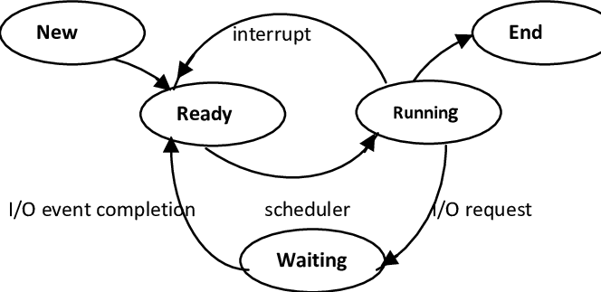

new - The process is being created.

running - Instructions are being executed.

waiting - The process is waiting for some event to occur.

Ready - The process is waiting to be assigned to a processor. (new와 running 사이)

Terminated - The process has finished execution.

<br/>

- Ready 상태에 있는 프로세스들을 묶어서 큐로 구성하고 그 큐를 **Ready Queue**라 한다. 

  > Ready Queue: Ready 상태의 프로세스들을 관리하기 위한 큐 형태의 자료구조. 일반적으로 PCB들을 링크드 리스트로 연결하여 구현
  >
  > 

- Ready 상태에서 CPU를 받게 되면 Running 상태가 된다. 

<br/>

Q. Waiting 상태의 프로세스가 여러개 있을 수 있을까??

A. 그렇다. 하지만 waiting의 이유는 각 프로세스마다 다를 수 있다. OS는 waiting하는 이유에 따라 별도의 큐를 사용한다. 결국, OS는 프로세스가 생성되면 하나의 PCB를 할당하고 그 프로세스를 일련의 조건에 따라 다른 상태로 전이 시킨다. (상태 전이를 위해 ReadyQueue, WaitingQueue 같은 것들이 필요)

---

### 🔴Process Scheduling

> 프로세스의 상태를 나누는 이유는 스케쥴링 때문이다.

- The objective of multiprogramming is to have some process running at all times, to maximize CPU utilization.(멀티프로그래밍의 목적은 CPU의 효율을 최대로 높이는 것이다. 이를 위해서는 특정한 프로세스가 항상 실행 중이어야 한다.)
- The objective of time sharing is to switch the CPU among processes so frequently that users can interact with each program while it is running.(실질적으로 이 여러 프로세스들이 **actual same time** 에 동시에 실행되는 것은 아니다! 워낙 자주, 빠르게 CPU가 옮겨다니기 때문에 사람의 감각으로는 그 차이를 파악하지 못하는 것일 뿐이다.)
- To meet these objectives, the process scheduler selects an available process(possibly from a set of several available processors) for program execution on the CPU.
  - For a single-processor system, there will never be more than one running system.
  - If there are more processes, the rest will have to wait until the CPU is free and can be rescheduled.

<br/>

Q. Running state의 프로세스가 CPU를 빼앗기는 경우는 I/O request가 왔을 때 뿐인가?

A. 아니다. Running state의 프로세스가 CPU를 빼앗기게 되는 경우는 크게 2가지가 존재한다.

첫번째로는 I/O request가 올 때, 두번째로는 Running state의 프로세스보다 더 높은 우선순위의 프로세스가 오는 경우이다.

하지만, 이 두가지 경우에는 큰 차이가 존재한다. I/O request가 오는 경우에는 해당 I/O request가 끝날 때까지 기다려야만 한다. 때문에 현재 Running state의 프로세스는 Waiting queue에 들어가게 된다. 반면, 더 높은 우선순위의 프로세스가 오는 경우에는 단순히 CPU를 뺏기기만 하는거지 기다릴 이유가 없다. 때문에 바로 Ready queue에 들어간다.

---

### 🔴Context Switch

- 위에서 언급했듯이, 프로세스를 수행하는 도중 더 높은 우선순위를 가지는 프로세스가 오게 되면, 원래 하던 프로세스에 interrupt를 걸고 더 높은 우선순위의 프로세스를 처리한다.
- Such operations happen frequently on general-purpose system.
- When an interrupt occurs, the system need to save the current **context** of the process currently running on the CPU so that it can restore that context when its(새롭게 들어온 우선순위가 높은 프로세스) processing is done. (interrupt가 걸려서 CPU가 이동하기 전에, 지금까지 이 프로세스에서 했던 작업들을 저장해두고 가야 다음에 돌아왔을 때 이어서 처리할 수 있다.)
- The **Context** is represented in the PCB of the process. (이 context를 저장해놓을 공간이 필요하기 때문에!! 프로세스마다 하나의 PCB를 할당하는 것이다.) 
- Switching the CPU to another process requires performing a state save of the current process and a state restore of a different process. 이 두 동작을 합쳐서 우리는 `Context Switch` 라 부른다. 
- It's speed varies from machine to machine, depending on the memory speed, the number of registers that must be copied, and the existence of special instructions.(such as a single instruction to load or store all registers.)

<br/>

Q. Context Switching은 오버헤드가 없는 동작일까?

A.아니다. Context Switching은 pure overhead를 갖는다.(1번당 5 microseconds on today's hardware) 왜냐하면, Switching을 하는 동안에는 CPU가 다른 일을 할 수 없다. 

---

### Process Creation

- A process may create several new processes, via a create-process system call `fork()`, during the course of execution.
- The creating process is called a **parent process** , and the new processes are called the **children of that process**.
- Each of these new processes may in turn(차례로) create other processes, forming a tree of processes.

  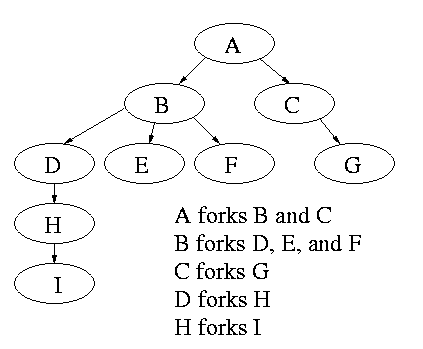
- When a process creates a new process, two possibilities exist in terms of execution
  	1. The parent continues to execution concurrently with its children.
   	2. The parent waits until some or all of its children have terminated.
- There are also two possibilities in terms of the address space of the new process.
  1. The child process is a duplicate of the parent process.(It has the same program and data as the parent.)
  2. The child process has a new program loaded into it.

---

### Process Termination

- A process terminates when it finishes executing its final statement and asks the operating system to delete it by using the `exit()` system call.
- At that point, the process may return a status value(typically an integer) to its parent process. (via the `wait()` system call) 
- Process가 종료 되면, all the resources of the process - including physical and virtual memory, open files and I/O buffers - are deallocated by the OS.
- **Termination can occur in other circumstances as well**
  - A process can cause the termination of another process via an appropriate system call.
  - Usually, such a system call can be invoked only by the parent of the process that is to be terminated. (즉, 부모 프로세스가 종료될 때 시스템콜을 통해 자식 프로세스를 종료시킬 수 있다.)
  - Otherwise, users could arbitrarily kill each other's jobs.
- **A parent may terminate the execution of one of its children for a variety of reasons, such as these**
  - The child has exceeded its usage of some of the resources that it has been allocated. (이걸 알기 위해서 the parent must have a mechanism to inspect the state of its children.)
  - The task assigned to the child is no longer required.
  - The parent is exiting, and the operating system does not allow a child to continue if its parent terminates. (parent가 종료되면 이 parent의 child를 OS가 모두 종료시키는 경우도 있다.)

---

### fork() and exec() system call

- fork()

  > The fork() system call is used to create a separate, duplicate process.

- exec()

  > When an exec() system call is invoked, the program specified in the parameter to exec() will replace the entire process - including all threads.
  >
  > Replace process by another process and then another process has a same process id with older one.(왜냐하면, 새로 프로세스를 만든 것이 아니라 replace한 것이기 때문. 결국 pid는 둘 다 같지만 그 안에 내용이 다르게 된다.)

  ```c
  int main(){
  	① fork();
  	② fork();
  	③ fork();
  	④ print("Hello");
  }
  ```

  이 코드를 실행하면 가장 먼저 ④가 실행되면서 Hello가 출력된다. 그 다음 ①이 실행되는데 ④에 의해 만들어진 process의 child process가 1개 생긴다.(현재 전체 프로세스 2개) 그 다음 ②가 실행되는데 현재 process가 2개이고 각각에 child process가 붙는다.(현재 프로세스 4개) 그 다음 ③이 실행되면 현재 process는 4개이고 각각의 process에 child가 붙어서 process는 총 8개가 된다. fork()를 통해 새로운 process를 만든 것이기 때문에 pid는 모두 다르다.
  
  <br/>
  
  **결국! fork()와 exec()을 통해 자식 프로세스를 만드는 이유는 여러 작업들을 동시(물론 프로세서가 굉장히 빨리 움직여서 '동시' 처럼 보이는 것이지 실제로 완전한 동시는 아니다.)에 처리하기 위함에 있다. 하지만, 위의 내용들을 읽다보면 부모 프로세스의 내용들이 똑같이 자식 프로세스에 복사되는 일련의 과정들이 굉장히 비효율적이라는 생각이 들 수 밖에 없다. 때문에 "공통적으로 필요한 부분들은 공동으로 소유하면 어떨까?" 라는 아이디어가 나왔고, 이 아이디어를 바탕으로 만들어진 개념이 쓰레드(thread)이다.**

---

### 🔴Thread

> 1 개의 프로세스에 여러 쓰레드가 존재 가능하다. 이 여러 쓰레드들은 1개의 프로세스 안에서 많은 것들을 공유하면서 CPU를 나눠 사용한다.
>
> 프로세스를 만드는 것은 오버헤드가 큰 반면, 쓰레드는 프로세스에 비해 훨씬 **simple && light** 하다.

- A thread is a basis unit of CPU utilization.

- It comprises Thread ID, Program Counter, Register Set and Stack.

- It shares with other threads belonging to the same process its **code section, data section, and other operating systam resources, such as open files and signals.**

- A traditional/heavyweight process has a single thread of control. If a process has multiple threads of control, it can perform more than one task at a time.

  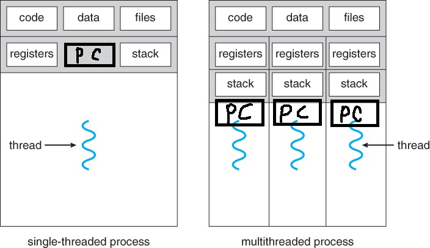

- code, data, files와 같이 공통적으로 사용하는 부분들은 공유하면서 각각의 쓰레드가 독립된 레지스터와 스택을 갖는다.

<br/>

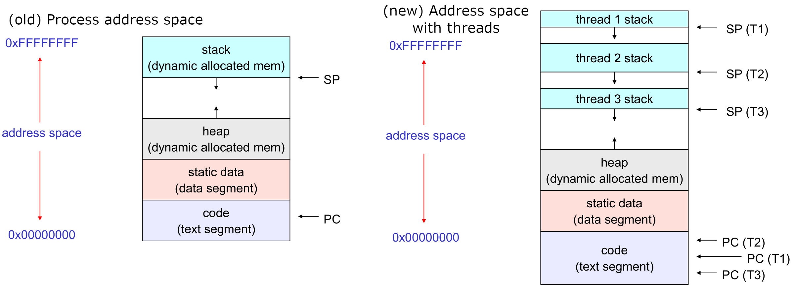

이 사진이 어떠한 부분들을 공유하는지 파악하기 조금 더 쉬운 것 같다. 어쨋든 위의 두 사진들을 통해서 쓰레드의 모양을 파악하면 되겠다.

<br/>

### Thread의 장점

- Responsiveness

  > Multithreading an interactive application may allow a program to continue running even if part of it is blocked or is performing a lengthy operation, thereby increasing responsiveness to the user. (일부가 block되더라도 나머지는 본래대로 실행 가능)

- Resource Sharing

  > By default, threads share the memory and the resources of the process to which they belong. The benefit of sharing code and data is that it allows an application to have several different threads of activity within the same address space.

- Economy

  > Allocating memory and resources for process creation is costly. Because threads share resources of the process to which they belong. It is more economical to create and context-switch threads.

- Utilization of Multiprocessor Architectures

  > The benefits of multithreading can be greatly increased in a multiprocessor architecture, where threads may be running in parallel on different processors. A single-threaded process can only run on one CPU, no matter how many are available. Multithreading on a multi-CPU machine increases concurrency.
  >
  > (프로세서가 4개인데 single thread일 경우 1개의 프로세서만 사용. multithread라면 한번에 여러 프로세서를 사용할 수 있다.)

<br/>

**Q. 그렇다면, 멀티 쓰레딩이 항상 멀티 프로세싱에 비해 좋은 선택지인 것일까?**

**A. 전혀 그렇지 않다. 현재 상황이 어떤지 확인해야할 뿐만 아니라 멀티 쓰레딩을 사용하기 위해서는 가장 중요한 Synchronization(동기화) 문제를 해결해야 한다. 공통적으로 가지게 되는 code, data, files 부분을 새로 만드는 것이 비효율적이기 때문에 우리는 쓰레드라는 개념을 만들어냈고 여러 쓰레드가 공동으로 code, data, files 부분을 가지게 구성했다. 하지만, 이는 또 다른 문제를 발생시켰다. 바로 각 쓰레드 모두가 공통적인 부분들에 store도 하고 load도 한다는 것이다.(사견이긴 하지만, git에서 branch를 나눌 때 골 때리는 문제들이 자주 발생하는 것도 결국은 여기 쓰레드에서 발생하는 문제와 매우 유사하다고 생각한다.) 때문에 동기화 문제가 발생하고 이는 이 챕터 후반부에서 깊게 다룰 예정이다. **

**Q. 프로세스가 여러 개의 쓰레드를 가질 수 있다. 그렇다면 이 쓰레드에 대한 정보들은 어디에 저장되는거지?? PCB 안에 저장되는 것인가?**

**A. 쓰레드에 대한 정보는 TCB(Thread Control Block)에 저장된다. TCB는 쓰레드 별로 존재하는 자료구조이며, PC(Program Counter)와 Register Set, 그리고 PCB를 기리키는 포인터를 가진다.(아마도 TCB에 스택 정보가 없는 이유는 프로세스의 스택을 나누어서 사용하기 때문이지 않을까 싶다.) **

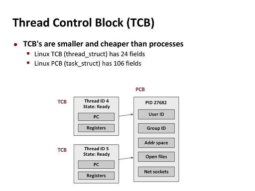

**TCB는 PCB보다 적은 데이터를 가지는 자료구조이다. 해당 쓰레드에 대한 정보만을 저장하면 되기 때문이다. **

**Q. Context Switch의 대상이 프로세스만 있는 것인가?**

**A. 아니다. 물론, Running Process가 교체되어야 할 때 Context Switch에 의해 실행 중이던 내용들이 해당 프로세스의 PCB에 저장되고, 새롭게 실행되어야 하는 프로세스의 PCB가 로드된다. 하지만, Context Switch가 교체하는 대상은 프로세스만 있는 것이 아니다. 바로 쓰레드 또한 Context Switch의 대상이 된다. 그 과정은 PCB가 교체되는 과정과 같다. 실행 중인 쓰레드와 어떠한 이유에서 CPU를 가져야하는 쓰레드가 존재하는 상황을 가정한다. 그렇다면 실행 중인 쓰레드가 가지고 있는 CPU를, 다른 쓰레드로 넘기기 위해 실행 중이던 쓰레드에 대한 정보들이 해당 쓰레드의 TCB에 저장되고, 새롭게 CPU를 가지게 되는 쓰레드의 TCB를 새로 로드하게 된다. 결국, TCB는 쓰레드에 대한 Context Switch의 기본 단위가 되며, 같은 프로세스에서의 두 쓰레드를 스위칭하는 경우에 대해서는 TCB 정보만을 저장하면 된다. 하지만, 다른 프로세스 간의 스위칭을 할 때에는 PCB/TCB 정보 모두를 저장해야 한다. **

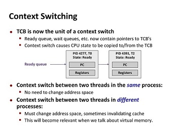

#### 참고문헌))

https://www.crocus.co.kr/1510   //이 글의 내용이 좋다.

https://chanyeong.com/blog/post/44  // 자바스크립트 자체도 싱글 쓰레드를 사용한다. 이에 대한 설명이 자세하게 되어있다.

*그렇다면 오늘 이 포스트를 작성한 이유인 자바스크립트가 왜 싱글 쓰레드로 구성되어 있는지 알아보자. 지금까지 자바스크립트가 싱글 쓰레드로 여러 요청을 처리하는 과정을 살펴봤는데 아직 이해가 가지 않는 부분이 조금 있다. 저 과정 자체는 모두 이해가 가는데 아직 내 머릿속엔 **왜 싱글 쓰레드야?🤔** 라는 물음이 아직 그치지 않았다. 내 단순한 생각으로는 "그냥 멀티 쓰레드를 써도 되지않아?"라는 생각이 들었기 때문이다. 이유는 바로 **쉬워서**이다. 만약 자바스크립트가 멀티 쓰레드로 실행되는 언어였다면 웹페이지에서 발생하는 동시성 문제에 대해 해결해야 했다. 실제로 멀티 쓰레드로 구현된 서비스에서는 이 동시성 문제에 대해 정말 많은 신경을 쓴다. 하지만 자바스크립트는 단일 쓰레드로 실행되므로 인해 교착 상태와 같은 다중 쓰레드 환경에서 발생할 수 있는 복잡한 시나리오를 신경 쓸 필요가 없으며 비동기 처리를 통해 쉽게 여러 요청을 처리할 수 있다. 실제로 구글의 Chrome 브라우저 마저도 기존 웹 페이지에서 엄청난 동시성 문제를 일으킬 수 있다는 이유로 단일 웹 사이트 페이지의 자바스크립트 코드가 동시에 실행되는 것을 허용하지 않는다.*

https://www.joinc.co.kr/w/Site/system_programing/Book_LSP/ch05_Process // 교수님께서 알려주신 사이트. 내용이 되게 자세하고 좋은 것 같다. 천천히 정독하고 여기 내용에 살을 붙이는 식으로 활용해야겠다.

https://teraphonia.tistory.com/802   // TCB에 대한 내용

---

###   Thread 종류

> 쓰레드를 나누는 가장 큰 기준은 "누가 쓰레드를 만들고 관리하냐?" 이다. 유저 쓰레드에서는 라이브러리가, 커널 쓰레드에서는 OS가 쓰레드를 관리하게 된다.
>
> 또한, 이 글을 읽기 전에 알아야 할 사실이 하나 있다. 우리는 흔히 OS를 공부 할 때 스케쥴러가 스케쥴링 하는 것을 프로세스라 생각했고 한 발 더 나아가면 PCB라 생각했지만, 이제는 스케쥴러가 context switch하는 단위가 프로세스 혹은 쓰레드임을 알아야 한다. context switch를 하는 단위가 쓰레드인 경우 저장되는 정보는 TCB이다. - [crocus 님의 블로그 내용](https://www.crocus.co.kr/1404)

- User Threads

  > Supported above the kernel and are manager without kernel support

  - 운영체제에서 쓰레드를 지원할 필요가 없다. (엄밀히 말하면 kernel에서 유저 레벨 쓰레드의 존재 자체를 알지 못한다.)
  - 왜? 사용자 영역에서 **라이브러리**를 활용하여 유저 레벨 쓰레드들을 만들어 내기 때문.
  - 스케줄링 결정이나 동기화를 위해 커널을 호출하지 않기 때문에 인터럽트가 발생할 때 커널 레벨 쓰레드보다 오버헤드가 적다. 즉, 유저 레벨  쓰레드에서 행동을 하기 때문에 OS 스케줄러의 context switch가 없다. (대신 유저 레벨  쓰레드 스케줄러에 의한 context switch가 존재한다(아마 이 또한 라이브러리가 관리하겠지).)
  - 커널은 유저 레벨 쓰레드의 존재조차 모르기 때문에 모드 간의 전환이 없고 성능 이득이 발생한다. (이 성능 이득으로 인해 유저 레벨 쓰레드가 커널 레벨 쓰레드에 비해 10에서 100배 정도 빠르다고 한다.)
  - 시스템 전반에 걸친 스케줄링 우선순위를 지원하지는 못한다. (무슨 스레드가 먼저 동작할 지 모른다.)
  

<br/>

- Kernel Threads

  > Supported and managed directly by the operating system

  - 커널 레벨 쓰레드는 가장 가벼운 커널 스케쥴링 단위이다.
  - 하나의 프로세스는 적어도 하나의 커널 레벨 쓰레드를 가지게 된다.
  - 커널 영역에서 쓰레드 연산을 수행한다.
  - 커널이 쓰레드를 관리하기 때문에 커널에 종속적이다.
  - 프로그래머 요청에 따라 쓰레드를 생성하고 스케쥴링하는 주체가 커널일 때 커널 레벨 쓰레드라고 한다.
  - 프로세스의 쓰레드들을 몇몇 프로세서에 한번에 디스패치할 수 있기 때문에 멀티프로세서 환경에서 매우 빠르다.
  - 커널이 커널 레벨 쓰레드의 존재를 인지하기 때문에 각 쓰레드들을 개별적으로 관리할 수 있다.
  - 커널이 직적 쓰레드를 제공해주기 때문에 안전하고 다양한 기능들이 제공된다. 
  - 사용자 모드에서 커널 모드로의 전환이 빈번하게 이뤄져 성능 저하가 발생한다. 
  - pure overhead인 context switch가 발생한다.

<br/>

유저 쓰레드와 커널 쓰레드의 구체적인 동작과 모습을 살펴보겠다. (여기서부터는 거의 다 [crocus님의 블로그](https://www.crocus.co.kr/1404) 내용이다.)

---

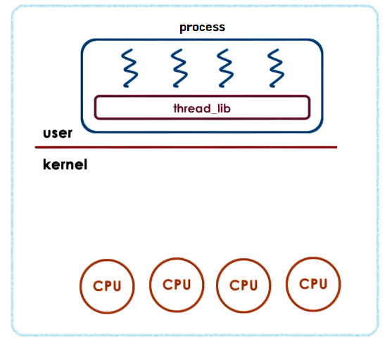

프로세스에 현재 4개의 쓰레드가 생성되어 있다.(유저 쓰레드이기 때문에 라이브러리에 의해 만들어졌음을 유추할 수 있다.) 이때 프로세스가 CPU 사용을 위해 OS에게 쓰레드 2개를 달라고 요청한다.

---

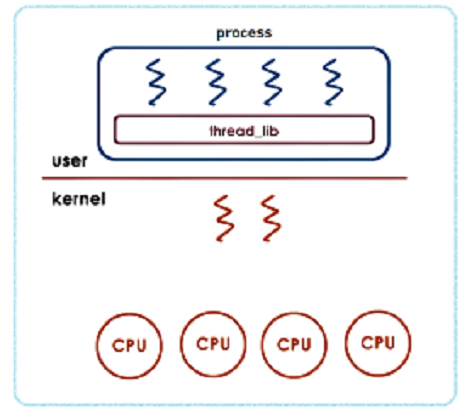

  그럼 위와 같이 2개의 쓰레드를 현재 프로세스에서 쓸 수 있도록 할당해준다. 이것이 커널 쓰레드이다.

---

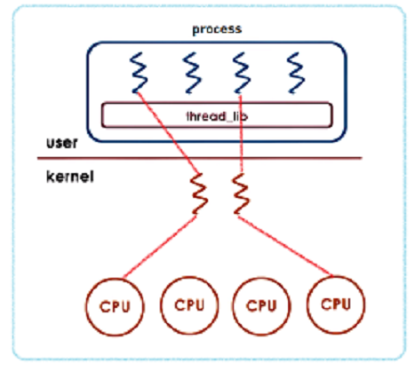

OS의 스케쥴러에 의해 현재 프로세스를 보고 있는 커널 쓰레드에 CPU를 할당해주면 이제 해당 프로세스를 보고 있는 커널 쓰레드는 동작하기 시작한다. 유저 쓰레드가 커널 쓰레드를 통해 CPU에 연결되면서 작업을 진행할 수 있게 된다. 이때 유저 쓰레드는 라이브러리의 스케쥴려가 관리하고, 우선순위를 두는 방법이 따로 없기 때문에 어느 유저 쓰레드가 우선적으로 커널 쓰레드와 결합될지는 아무도 모른다.

---

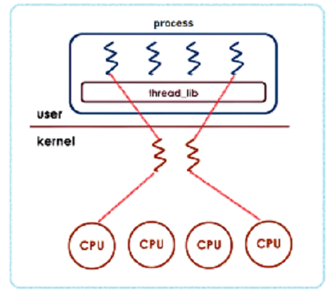

위의 그림은 커널 쓰레드는 context switching 되지 않았지만, 유저 쓰레드가 context switching 되었음을 알 수 있다.

---

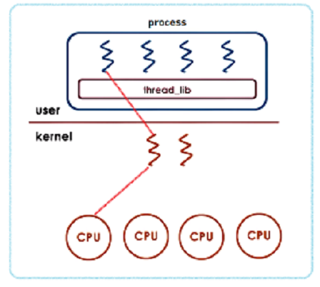

위의 그림은 커널 쓰레드가 OS의 스케쥴러에 의해 context switching을 당하면서, TCB가 저장, 스왑된 상황이다.(만약 인터럽트가 걸려서 프로세스 자체가 context switching된다면 PCB 또한 저장, 스왑될 것이다.)

유저 쓰레드가 커널 쓰레드 보다 오버헤드가 적은 이유는 쓰레드간 전환할 때마다 커널 스케쥴러를 호출할 필요가 없기 때문이다.(애초에 커널에서는 유저 쓰레드의 존재를 모르기 때문에 호출할 수가 없다.)

커널 스케쥴러로 진입하기 위해서는 프로세서 모드를 사용자 모드에서 커널 모드로 전환해야 하는데, 이때 사용자쪽 하드웨어 레지스터들을 모두 저장시키고, 커널 레지스터들을 복구하는 일들이 발생한다.

때문에 사용자 모드와 커널 모드를 많이 왔다갔다 할 수록 성능은 급격하게 떨어지게 된다.

유저 쓰레드는 이 모드 체인지가 발생하지 않기 때문에 이런 오버헤드가 발생하지 않는다.

---

#### Ultimately, there must exist a relationship between user threads and kernel threads.

3 개의 가장 흔한 관계가 존재

1. Many to one model
2. One to one model
3. Many to many model


#### 1. Many to one model(= User Level Thread(N:1))

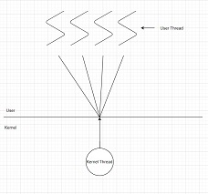

장점

- Maps many user-level threads to one kernel thread.
- Thread management is done by the thread library in user space, so it is efficient.

단점

- The entire process will block if a thread makes a blocking system call. (유저 쓰레드 중 1개가 커널 쓰레드를 블락시키면 커널 쓰레드가 1개 밖에 없기 때문에 유저 쓰레드 전체가 멈춘다.)
- Because only one thread can access the kernel at a time, multiple threads are unable to run in parallel on multiprocessors. (1개의 커널 쓰레드는 1개의 프로세서만을 가질 수 있기 때문.)
- 이런 단점들 때문에 이 모델을 사용 중인 시스템은 거의 존재하지 않는다.

<br/>

#### 2.One to one model (= Kernel Level Thread(1:1))

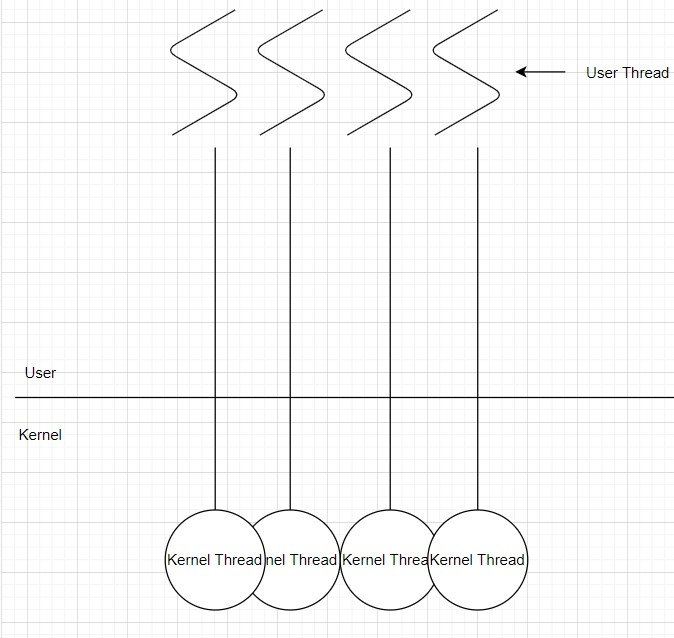

장점

- Maps each user thread to a kernel thread.
- Provides more concurrency then the many-to-one model by allowing another thread to run when a thread makes a blocking system call.(유저 쓰레드 하나가 블락되더라도 다른 쓰레드에 영향을 끼치지 않는다.)
- Also allows multiple threads to run in parallel on multiprocessors.
- 대부분의 운영체제가 이 방식을 사용한다.

단점

- Creating a user thread requires creating the corresponding kernal thread. (유저 쓰레드를 만들려면 해당 커널 쓰레드를 만들어야 하며 많은 수의 커널 쓰레드가 시스템 성능에 부담을 줄 수 있다.)
- Because the overhead of creating kernel threads can burden the performance of an application, most implementations of this model restrict the number of threads supported by tthe system. (즉, 만약 4개의 프로세서가 있는 상황이라면 쓰레드의 개수 또한 4개로 제한. 어짜피 더 만들어봐야 쓰지도 못하고, 쓰레드를 만드는 행위 자체가 성능에 부정적인 영향을 끼친다.) 

<br/>

#### 3. Many to many model(N:M)  

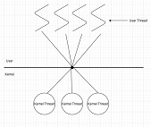

장점

- Multiplexes many user-level threads to a smaller or equal number of kernel threads.
- The number of kernel threads may be specific to either a particular application or a particular machine.
- Developers can create as many user threads as necessary, and the corresponding kernel threads can run in parallel on a multiprocessor.
- Also when a thread performs a blocking system call, the kernel can schedule another thread for execution.

<br/>

Q. 냉정하게 3개의 모델들 중 Many to many model이 가장 합리적으로 보인다. 그럼에도 불구하고 대부분의 운영체제들이 일대일 모델을 사용하는 이유는 무엇일까?

A. 현대에 들어서면서 대부분의 시스템에서 처리 코어의 개수가 증가하였다. 이 덕분에 커널 쓰레드의 개수를 제한하는 것의 중요성이 줄어들었다. 때문에 커널 쓰레드를 많이 갖추어 더 많은 코어를 동시에 사용하는 것이 훨씬 더 효율적인 설계가 되었다.

<br/>

Q. 디스크 입력은 커널 레벨 쓰레드(1:1), 유저 레벨 쓰레드(N:1) 중 어느 방식에서 더 유리한가?

A. 조금 간단하게 생각하면 쉽게 답을 할 수 있는 질문이다. 당연히 성능은 (context switching의 오버헤드가 적은) 유저 레벨 쓰레드가 높다. 하지만, 디스크 입력식 I/O가 발생하고 해당 유저 쓰레드와 연결된 커널 쓰레드는 블락될 것이다. 그런데, 커널 쓰레드가 한 개 뿐인, 유저 레벨 쓰레드에서의 커널 쓰레드가 블락된다면? 전체 유저 레벨 쓰레드가 블락될 것이다. 이는 엄청난 오버헤드이다. 때문에 디스크 입력시 커널 레벨 쓰레드를 사용하는 것이 훨씬 유리하다. (근데 사실 거의 대부분의 경우에서 커널 레벨 쓰레드가 유리하지 않을까라는 생각이 든다.)

<br/>

참고문헌))

https://www.crocus.co.kr/1255

https://helloinyong.tistory.com/293

https://www.crocus.co.kr/1404

---

### Threading Issues

Fork() 및 Exec() 시스템 콜 

- 일단 기본적으로 Fork는 프로세스 복제(새로운 프로세스가 하나 생기는 것이기 때문에 pid가 다르다.), Exec은 프로세스 대체(기존 프로세스에 새로운 값을 넣는 것이기 때문에 pid가 같다.) 라는 것을 알고 있다. 그렇다면 만약 다중 쓰레드 프로그램에서 하나의 쓰레드가 fork()를 호출한다면 새로운 프로세스는 모든 쓰레드를 복제해야 하는가 아니면 한 개의 쓰레드만 가지는 프로세스여야 하는가? 몇몇 UNIX 기종은 이 두 가지 버전 `fork()` 를 다 제공한다. 하나는 모든 쓰레드를 복사하는 것과 다른 하나는 `fork()`를 호출한 쓰레드만 복제하는 것이다. 
- 두 버전의 fork() 중 어느 쪽을 택할 것인지는 응용 프로그램에 달려있다. `fork()`를 부르자마자 다시 `exec()`을 부른다면 모든 쓰레드를 다 복제해서 만들어주는 것은 불필요하다. 왜냐하면 `exec()`에서 지정한 프로그램이 곧 모든 것을 다시 대체할 것이시 때문이다. 이 경우에는 `fork()` 시스템 콜을 호출한 쓰레드만 복사해주는 것이 적절하다. 그러나 새 프로세스가 `fork()` 후 `exec()`을 하지 않는다면 새 프로세스는 모든 쓰레드들을 복제해야 한다.
- exec()은 그냥 항상 모든 쓰레드를 포함한 전체 프로세스를 대체시킨다.

---

### 🔴Thread에 대한 정리

- 다중 쓰레드가 효율적이라는 사실은 지금까지 계속 설명해왔다. 하지만, 다중 쓰레드 응용 프로그램을 설계하는 데에는 몇가지 도전과제가 있다. 작업 분할 및 균형 조정, 서로 다른 쓰레드 간에 데이터 분할 및 데이터 종속성 식별이 포함된다. 마지막으로, 다중 쓰레드 프로그램은 테스트 및 디버깅에 특히 어려움이 있다.

- 사용자 응용 프로그램은 유저 쓰레드를 생성하며, 이 쓰레드는 궁극적으로 CPU에서 실행되도록 커널 쓰레드에 매핑되어야 한다.

  ---

  

