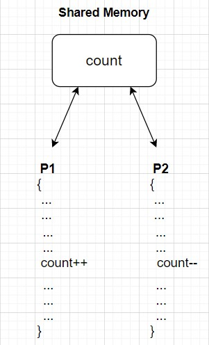
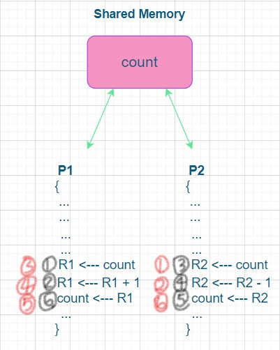
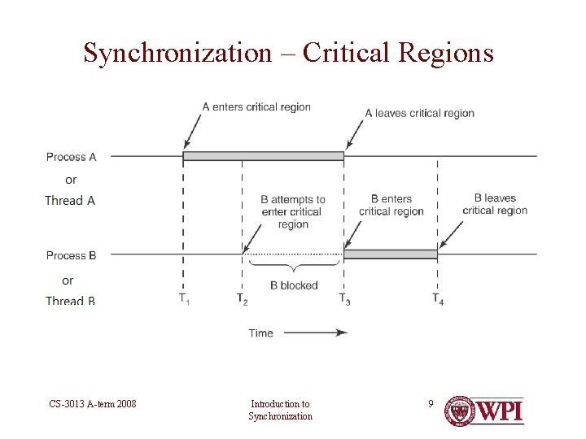
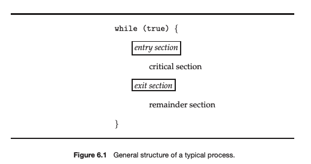
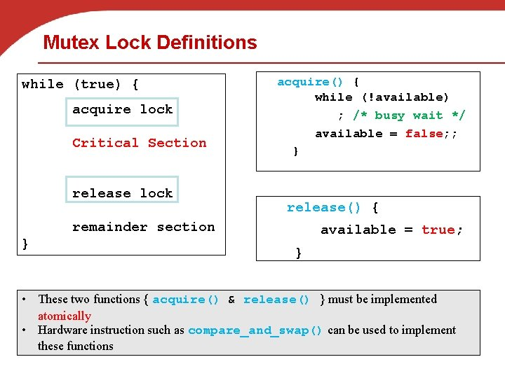

# 💥Operating System(Chapter 6 - Process Synchronization and Thread Synchronization)

> *시스템은 일반적으로 concurrently하게 또는 parallelism하게 실행되는 수백 개 또는 수천 개의 스레드로 구성된다. 스레드는 종종 사용자 데이터를 공유한다. 공유 데이터에 대한 액세스가 제어되지 않으면 경쟁 조건이 존재하여 데이터 값이 손상될 수 있다. 프로세스 동기화는 경쟁 조건을 피하고자 공유 데이터에 대한 액세스를 제어하는 도구를 사용한다.* - 공룡책 Part3 도입
>
> 이 설명 때문에 엄청나게 시간을 버렸다. "수백 수천 개의 스레드로 구성되고 스레드가 사용자 데이터를 공유하는데 이에 대한 해결이 프로세스 동기화라고??"
>
> 지금까지의 나의 지식으로 바라봤을 때 이 설명은 완전히 잘못된 설명이다. 동기화의 대상은 프로세스만 있는 것이 아니다. 스레드 또한 동기화의 대상이다.
>
> 멀티 프로세싱에서는 여러 프로세스들이 concurrently혹은 parallelism하게 shared memory에 접근하게 된다. 때문에 프로세스 동기화는 이 shared memory와 관련되어 있다. 
>
> 멀티 스레딩은 1개의 프로세스 내부에 여러 스레드들이 존재하는 것이다. 이 안에서 여러 스레드들은 해당 프로세스의 힙, 데이터, 코드 영역을 공유해서 사용한다. 때문에 스레드 동기화는 이 힙, 데이터, 코드 영역과 관련되어 있다.

---

### Race Condition

>둘 이상의 입력 또는 조작의 타이밍이나 순서 등이 결과값에 영향을 줄 수 있는 상태

프로세스 스케줄링의 역할을 소개했고 코어가 1개인 상황에서 프로세스가 여러개라면 CPU 스케줄러가 프로세스 사이에서 빠르게 오가며 각 프로세스를 실행하여 모든 프로세스를 concurrently하게 실행시킨다는 것을 설명하였다. 이는 한 프로세스가 스케줄되기 전에 일부분만 진행할 수 있다는 것을 의미한다.

여기서 문제가 되는 것은 여러 프로세스 혹은 여러 스레드가 공통적으로 참조하는 영역이 존재한다는 것이다. 공통적으로 참조하는 영역의 값을 바꿔버리면 다음에 오는 프로세스 혹은 스레드는 이게 원래 값인지 바뀐 값인지 알 수 없다. 이러한 상황을 **Race Condition**이라 한다. 

즉, Race Condition은 "타이밍에 따라 결과값이 바뀌는 상황"으로 정의할 수 있겠다. 정의는 알았지만 더 빠른 이해를 위해 그림을 통해 설명하겠다. (아래 그림은 프로세스 동기화의 예제이기 때문에 shared memory가 등장했지만, 만약 스레드 동기화의 예제였다면 shared memory가 아닌 힙, 데이터, 코드 영역이 등장했을 것이다.)



- P1의 실행이 앞서는 경우

  count = 5

  P1: count++   =>   count = 6

  P2: count--     =>   count = 5

- P2의 실행이 앞서는 경우

  count = 5

  P2: count--     =>   count = 4

  P1: count++   =>   count = 5

이렇게만 보면 결국 결과는 둘 다 5가 나오기 때문에 별 문제가 없어 보일 수 있다. 때문에 컴파일 후의 코드로 생각해볼 필요가 있다.



검정색 숫자의 ①~⑥의 순서로 진행되면 count: 5 -> 4 -> 6 으로 변한다.

빨간색 숫자의 ①~⑥의 순서로 진행되면 count: 5 -> 6 -> 4 으로 변한다.

이렇게 어떤 코드가 먼저 실행될지 모르는 상황에서, 타이밍에 따라 다른 결과가 나오는 이 상황을 race condition이라 한다.

그렇다면 이 race condition을 어떻게 막을 수 있을까?

바로 **critical section**을 사용하는 것이다. P1의 어셈블리 코드 3줄과 P2의 어셈블리 코드 3줄과 같은 부분이 critical section의 대상이 될 수 있는 부분이다.

이렇게 critical section을 정해두고 이 critical section이 실행되는 동안에는 다른 프로세스가 접근할 수 없도록 막음으로써 race condition 문제를 해결하는 것이다.

---

Q. 멀티프로세싱에서는 항상 프로세스 동기화가 필요할까?

A. 당연히 항상 필요한 것은 아니다. 설명에 앞서 멀티프로세싱에 대한 정의를 짚고 넘어갈 필요가 있다. 

Two or more processors or CPUs present in same computer, sharing system bus, memory and I/O is called Multiprocessing System.

즉, 멀티프로세싱은 기본적으로 두 개 이상의 CPU를 가지는 체계이다. (지금까지 나는 CPU가 하나만 있어도 이 하나의 CPU가 여러 프로세스를 옮겨다니면서 concurrently하게 처리한다면 멀티프로세싱인줄 알았는데 아니었다.)

멀티프로세싱 속에서 처리되는 여러 개의 프로세스들은 Independent 할 수도 Cooperative 할 수도 있다. Independent한 경우 이론적으로 동기화가 필요하지 않다. 하지만, 모든 프로세스들을 각각 Independent하게 동작하도록 설계하는 것은 엄청난 비효율일 것이다.

---

### Critical Section(Critical Region)

> 적어도 하나 이상의 다른 프로세스 혹은 스레드와 공유하는 데이터에 접근 혹은 갱신하는 코드 부분

위의 예제에서 확인했듯이, 각 프로세스 혹은 스레드는 임계 구역(Critical Section)이라고 부르는 코드 부분을 포함하고 있고, 그 안에서는 적어도 하나 이상의 다른 프로세스와 공유하는 데이터에 접근하고 갱신할 수 있다.

이 시스템의 중요한 특징은 한 프로세스가 자신의 임계 구역에서 수행하는 동안에는, 다른 프로세스들이 그들의 임계 구역에 들어갈 수 없다는 사실이다.



출처: https://slidetodoc.com/introduction-to-synchronization-cs3013-operating-systems-slides-include/

그렇다면 자신의 임계 구역이 실행되는 동안, 다른 프로세스들이 그들의 임계 구역에 들어가지 못하도록 어떻게 막을 것이냐?

이 문제에 대한 해결안이 되기 위해서는 세 가지의 요구 조건을 충족해야 한다.

1. 상호 배제(mutual exclusion): 프로세스 P1이 자신의 임계구역에서 실행된다면, 다른 프로세스들은 그들 자신의 임계구역에서 실행될 수 없다. (P1이 임계 구역에 들어갔다면 처리가 끝날 때까지 다른 프로세스들의 접근을 차단해야 한다.)
2. 진행(progress): 자기의 임계구역에서 실행되는 프로세스가 없고 그들 자신의 임계구역으로 진입하려고 하는 프로세스들이 있다면, 나머지 구역에서 실행 중이지 않은 프로세스들만 다음에 누가 그 임계구역으로 진입할 수 있는지를 결정하는 데 참여할 수 있으며, 이 선택은 무한정 연기될 수 없다. (만약 P1과 P2가 동시에 각각의 임계 구역에 도착한다면, P1의 임계 구역을 먼저 수행시키고 P2의 임계 구역은 기다린다. P1이 exit된 이후에 P2의 임계 구역이 시작된다. P2의 임계 구역이 exit하고 P3의 임계 구역이 와야 하는데 P1의 다음 임계 구역이 먼저 온다면? 그렇다면 P1의 임계 구역을 블락해놓고 P3의 임계 구역이 오기를 기다린다.(반드시 순서를 지켜야한다.))
3. 한정된 대기(bounded waiting): 프로세스가 자기의 임계구역에 진입하려는 요청을 한 후부터 그 요청이 허용될 때까지 다른 프로세스들이 그들 자신의 임계구역에 진입하도록 허용하는 횟수에 한계가 있어야 한다. 

https://stackoverflow.com/questions/33143779/what-is-progress-and-bounded-waiting-in-critical-section

이 세 가지 요구 조건을 만족시키는 해결방안들이 가지는 일반적인 구조는 다음과 같다.



---

### Peterson's Solution

이 문제를 해결할 수 있는 가장 고전적인 해결책이다.

Pi라는 프로세스와 Pj라는 프로세스, 두 개가 있는 상황이라고 가정한다. 피터슨의 해결안은 두 프로세스가 두 개의 데이터 항목을 공유한다.

`int turn`

`bool flag[2]`

변수 turn은 임계구역으로 진입할 순번을 나타낸다. 즉, 만일 turn === i라면 프로세스 Pi가 임계구역에서 실행될 수 있다. flag 배열은 프로세스가 임계구역으로 진입할 준비가 되었음을 나타낸다. 예를 들어 flag[i]가 true라면 Pi는 임계구역으로 진입할 준비가 된 것이다.

```javascript
// Process i의 경우

while(true) {
	flag[i] = true
	turn = j
	while(flag[j] && turn == j){
		// Process j가 실행 중인 상황이기 때문에 기다린다.
	}
		**ciritical section**    
	flag[i] = false       flag[i] = false turn = i flag[j]= true
		**remainder section**
}
        
        
// Process j의 경우
     while(true) {
	flag[j] = true       flag[i] = true, turn = j, flag[j] = true
	turn = i			flag[i] = true, turn = i flag[j] = true
	while(flag[i] && turn == i){
		// Process i가 실행 중인 상황이기 때문에 기다린다.
	}
		**ciritical section** 
	flag[j] = false
		**remainder section**
}
```

  임계구역으로 진입하기 위해서 Pi는 먼저 `flag[i]`를 `true`로 만들고, `turn`을 `j`로 지정한다. 이렇게 함으로써 프로세스 j가 임계구역으로 진입할 준비가 된 상태라면 진입을 보장한다.

만일 두 프로세스가 동시에 진입하기를 원한다하더라도 둘 중 오직 한 배정만이 지속된다. 다른 배정은 발생하기는 하지만 곧바로 겹쳐 쓰이게 된다. 

우리는 이 해결책이 어떻게 3가지 요구조건을 충족하는지 증명할 필요가 있다.

1번을 증명하기 위해서는 Pi가 임계구역에 들어가기 위해서는 반드시 `flag[j] == false`이든지 아니면 `turn == i`여야 함을 주목해야 한다. 우리는 Pi와 Pj 모두 while문을 동시에 성공적으로 지나가지는 못했을 것이라고 추측할 수 있다. 왜냐하면 `turn`이 `i`와 `j`를 동시에 가질 수는 없기 떄문이다. 때문에 두 개의 프로세스 중 하나만이 성공적으로 while문을 지나갔을 것이고, 이 떄문에 상호 배제가 지켜진다. 

2번 3번을 증명하기 위해 특정한 상황을 가정해본다. Pi와 Pj가 동시에 준비가 되었지만(`flag[i] = true, flag[j] = true`) 미묘한 타이밍 차이로 인해 `turn`이 `j`로 바뀌었다가 곧바로 `i`로 바뀌었다. 이렇게 되면 Pi만이 성공적으로 while문을 통과하고 임계구역에 들어간다. 임계구역에서의 일들을 마치고 나오면서 Pi는 자기 자신의 `flag[i]`를 `false`로 바꾼다. 이 순간 Pj가 성공적으로 while문을 통과하고 임계구역에 들어가게 된다. 즉, 이렇게 Pj는 Pi가 지난번에 진입했다면 이번에는 자기도 한번은 들어갈 수 있게 보장된다. 이 때문에 진행과 한정된 대기가 지켜진다.

하지만, 이 피터슨의 해결안을 최신 컴퓨터 아키텍쳐에서 사용할 수는 없다.

주된 이유는 시스템 성능을 향상하기 위해 프로세스 또는 컴파일러가 종속성이 없는 읽기 및 쓰기 작업을 재정렬할 수 있기 때문이다. 싱글 스레드에서는 문제를 일으키지 않지만(싱글 스레드에서도 명령어의 순서가 달라질 수는 있으나 결과값이 달라지지는 않는다.), 데이터를 공유하는 다중 스레드에서는 명령 순서가 바뀌게 되면 데이터의 일관성이 깨지거나 예기치 못한 결과를 낳을 수 있다.

때문에 우리에게는 다른 해결방안이 필요하다.

---

### TSL

---

### Mutex Lock

TSL 방식과 같은 하드웨어 기반 해결책은 복잡할 뿐만 아니라 응용프로그래머는 사용할 수 없다. 대신 운영체제 설계자들은 임계구역 문제를 해결하기 위한 상위 수준 소프트웨어 도구들을 개발했다.

가장 간단한 도구가 바로 **Mutex Lock**이다. 사실 mutex는 mutual exclusion의 축약 형태이다. 따라서 경쟁 조건을 방지하기 위해 mutex lock을 사용한다. 즉, 프로세스는 임계구역에 들어가기 위해서 반드시 lock이 필요하고, 임계구역을 빠져나올 때는 반드시 lock을 반환해야 한다.

Mutex Lock은 availalble이라는 bool 타입의 변수를 가지는데, 이 변수 값이 lock의 가용 여부를 표시한다.



acquire 함수에서 available을 가질 수 있는(true) 상황에서만 while문을 통과하고, 해당 프로세스가 available을 가지면서 available은 사용 불가(false)하게 된다. 임계구역을 빠져나갈 때는 available을 사용 가능(true)하게 바꾸고 나간다.

---

### Busy Waiting

피터슨, TSL, Mutex 해결방식을 보면 모두 while문이 사용된다. 언뜻봐도 굉장히 비효율적이라는 생각이 들 수 밖에 없다. 하나의 프로세스가 임계구역에 들어가 있는 동안, 임계구역에 들어가기를 원하는 다른 프로세스들은 모두 계속해서 while문을 돌아야 한다. 이러한 계속된 루프의 실행은 분명히 문제가 되고 이런 상황을 **Busy Waiting**이라 한다. Busy Waiting은 다른 프로세스가 생산적으로 사용할 수 있는 CPU 주기를 낭비한다. 

우리가 위에서 설명한 mutex lock 유형을 **스핀락(spinlock)**이라고도 한다. lock을 사용할 수 있을 때까지 프로세스가 회전하기 때문이다. 그러나 이 쓰레기일 것만 같은 스핀락은, context switch에 상당한 시간이 소요될 때 context switch를 하지 않아도 된다는 장점이 있다.

이렇게 Busy Waiting이 장점이 되는 굉장히 특수한 상황이 존재하기는 하나, 기본적으로 Busy Waiting은 효율적이지 않다. 때문에 우리는 Busy Waiting이 존재하지 않는 다른 대안을 찾아야 한다.

> **그렇다면 정확히 context switch에 어느 정도의 시간이 걸려야, 스핀락이 더 유리해지는 걸까?*
>
> 락을 기다리는 스레드는 2번의 context switch가 필요하다. 첫번째는 스레드를 대기 상태로 옮기기 위한 context switch이고, 두번째는 락이 사용 가능해지면 대기 중인 스레드를 복원하기 위한 문맥 교환이다. 일반적인 규칙은 락이 유지되는 기간이 context switch를 두 번 하는 시간보다 짧은 경우 스핀락을 사용하는 것이 더 유리하다.

---

### Semaphores

세마포 S는 정수 변수로서, 초기화를 제외하고는 단지 두 개의 atomic한 연산 `wait()`과 `signal()`로만 접근할 수 있다. 

`wait()`과 `signal()`의 기본적인 모양은 다음과 같다.

```javascript
wait(S) {
	while(S<=0){//busy wait}
	S--
}

signal(S){
	S++
}
```

운영체제는 종종 카운팅(counting)과 이진(binary) 세마포를 구분한다.

카운팅 세마포는 제한 없는 영역을 갖는다. (-무한대 ~ 무한대)

이진 세마포는 0과 1만 가능하다.

따라서, 이진 세마포는 사실상 mutex 락과 유사하게 동작한다.

카운팅 세마포는 유한한 개수를 가진 자원에 대한 접근을 제어하는 데 사용될 수 있다. 세마포는 가용한 자원의 개수로 초기화한다. 각 자원을 사용하려는 프로세스는 세마포에 `wait()` 연산을 수행하며, 이때 세마포의 값은 감소한다. 프로세스가 자원을 방출 할 때는 `signal()` 연산을 수행하고 세마포는 증가하게 된다. 세마포의 값이 0이 되면 모든 자원이 사용 중임을 나타낸다. 이후 자원을 사용하려는 프로세스는 세마포 값이 0보다 커질 때까지 봉쇄된다.

하지만, 이런 `wait()`, `signal()`로는 Busy Waiting 문제를 해결할 수 없다. 때문에 기존 `wait()`, `signal()` 함수를 좀 더 효율적으로 개선할 필요가 있다. 이 과정에서 우리는 **Waiting Queue(대기 큐)**를 사용한다. 대기 큐를 사용하는 과정은 다음과 같다. 

프로세스가 `wait()` 연산을 실행하고 세마포 값이 양수가 아닌 것을 발견하면, 프로세스는 반드시 대기해야 한다. 하지만 프로세스는 Busy Waiting 하면서 대기하지 않는다. 프로세스는 자기 자신을 일시 중지시키고, 상태를 대기 상태로 전환한 다음, 대기 큐에 들어간다. 그 후에 제어가 CPU 스케줄러로 넘어가고, 스케줄러는 다음으로 실행될 프로세스를 Ready Queue에서 선택한다.

세마포 S를 대기하면서 일시 중지된 프로세스는 다른 프로세스가 `signal()` 연산을 실행하면 재시작되어야 한다. Waiting Queue에서 대기하고 있던 프로세스는 `wakeup()` 연산에 의해 재시작되는데 이것은 프로세스의 상태를 대기 상태에서 준비 완료 상태로 변경한다. 그리고 해당 프로세스는 Ready Queue에 들어간다.

이러한 정의를 따르는 세마포를 구현하기 위해, 우리는 세마포를 다음과 같이 정의한다.

```c
typedef struct {
	int value;
	struct process *list;
}semaphore;
```

각 세마포는 한 개의 정수 `value`와 프로세스 리스트 `list`를 가진다. 프로세스가 세마포를 기다려야 한다면, 이 프로세스를 세마포의 프로세스 리스트에 추가한다. 

wait 연산은 다음과 같이 정의될 수 있다.

```c
wait(semaphore *S) {
	S->value--;
	if(S->value < 0) {
		add this process to S->list;
		sleep();
	}
}
```

signal 연산은 다음과 같이 정의될 수 있다.

```c
signal(semaphore *S) {
	S->value++;
	if(S->value <= 0) {
		remove a process P from S->list;
		wakeup(P);
	}
}
```

Busy Waiting을 하는 세마포의 고전적 정의에서는 세마포의 값은 음수를 가질 수 없으나, 이처럼 구현하면 음수 값을 가질 수 있게 된다. 세마포 값이 음수일 때, 그 절대값은 세마포를 대기하고 있는 프로세스들의 수가 된다.

대기하는 프로세스들의 리스트는 각 PCB에 있는 연결 필드에 의해 쉽게 구현될 수 있다. 대기하는 프로세스들의 한정된 대기를 보장해주는 가장 간단한 방법은 FIFO 방식의 큐를 그대로 이용하는 것이다. 그러나 일반적으로는 이런 식의 큐 보다는 임의의 큐잉 전략을 사용한다. (ready queue가 일반적인 큐처럼 동작하지 않는 것처럼)

하지만, 지금까지 설명한 개선된 세마포도 단점이 존재한다. 세마포 방식에서 가장 중요한 것은 세마포가 atomic하게 실행되어야 한다는 것이다. 프로그래머는 같은 세마포에 대해 두 프로세스가 동시에 `wait()`과 `signal()` 연산들을 실행할 수 없도록 반드시 보장해야 한다. 싱글 코어에서는 단순히 `wait()`과 `signal()` 연산들이 실행되는 동안에는 인터럽트를 금지함으로써 간단히 해결할 수 있다. 

진짜 문제는 멀티 코어에서이다. 멀티 코어에서는 모든 처리 코어에서 인터럽트를 금지시켜야 한다. 그렇지 않으면 (다른 코어에서 실행되는) 상이한 프로세스들의 명령어들이 임의의 방법으로 서로 끼어들 수 있다. 모든 코어에서 인터럽트를 금지시키는 일은 매우 어려운 작업이며 성능을 심각하게 감소 시킨다. 때문에 우리는 또 다른 대안을 찾아야 한다.

---

### Monitors


---

### Deadlock

\- 프로세스가 자원을 얻지 못해 다음 처리를 하지 못하는 상태로, ‘교착 상태’라고도 하며 시스템적으로 한정된 자원을 여러 곳에서 사용하려고 할 때 발생한다.

\- 데드락이 발생할 수 있는 경우 :


P1과 P2가 리소스 A, B 둘 다를 얻어야 한다고 가정할 때,

t1에 P1이 리소를 A를 얻고 P2가 리소스 B를 얻었다면 t2때 P1은 리소스 B를, P2는 리소스 A를 기다리게 된다.

하지만 서로 원하는 리소스가 상대방에게 할당되어 있기 때문에 이 두 프로세스는 무한정 기다리게 되는데 이러한 상태을 DeadLock상태라고 한다.

더 자세한 설명과 해결 방안은 8장에서 진행될 예정이다.

---

참고문헌

https://www.geeksforgeeks.org/g-fact-57/  // atomic의 정의가 나와있다. atomic이라는 단어의 뜻을 정확하게 파악할 필요가 있다.

운영체제 10판(Wiley Abraham Silberschatz 지음, 박민규 옮김)

https://jwprogramming.tistory.com/12 [개발자를 꿈꾸는 프로그래머]