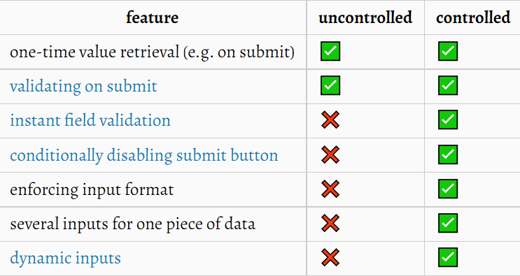

# ⚛Controlled Input vs unControlled Input

> 항상 input의 value는 useState로 관리해왔다. 하지만, 현재 진행 중인 프로젝트의 팀장님께서 setState로 input의 value를 관리하는 것이 비효율적인 경우가 있으며, 이 개념이 unControlled input이라고 알려주셨다. 처음 들어보는 개념, 중요한 개념이라 이렇게 정리한다.

---

### Controlled Input

기존의 useState를 사용하는 방식이다.

```javascript
import React, { useState } from 'react';

export default function App() {
	const [inputValue, setInputValue] = useState("");
	
	const handleInputChange = (e) => {
		setTinputValue(e.target.value);
	};

	const handleSubmitButton = () => {
		alert(inputValue);
	}
	
	return (
		<div className="App">
			<input value={inputValue} onChange={handleInputChange} />
			<input type="submit" value="submit" onClick={handleSubmitButton} />
         </div>
	)
}
```

여기서 들 수 있는 의문!

input에서 타이핑이 될 때마다 `handleInputChange` 함수가 실행될거고 i`nputValue`라는 state가 변경되면서 화면이 리렌더링되는 일이 계속해서 발생하겠구나를 예측할 수 있다.

한, 두 개의 input이라면 성능에 큰 영향을 끼치지 않겠지만, input 이벤트가 끝나고 맨 마지막에 남은 문자열만을 원하는 경우에는 모든 이벤트가 `handleInputChange` 함수를 작동시키는 이 상황이 조금 껄끄러울 수 있다.

때문에 등장한 것이 unControlled Input이다.

---

### unControlled Input

기본적으로 useRef를 사용한다.

```javascript
import React, { useRef } from 'react';

export default function App() {
	const inputRef = useRef(null);
	
	const handleSubmitButton = () => {
		alert(inputRef.current.value);
	};
	
	return (
		<div className="App">
			<input type="text" ref={inputRef} />
			<input type="submit" value="submit" onClick={handleSubmitButton} />
		</div>
	)
}
```

기존의 HTML스러운 접근이다. 직접 DOM 접근을 통해 input의 값을 알아낸다.

가장 장점은 state를 사용하지 않기 때문에 state가 변경될 때마다 리렌더링 되지 않는 다는 것이다.

----

### 그렇다면 무엇을 쓰는 것이 더 좋은 방법일까?

일단 기본적으로 submit 이벤트가 발생하는 순간!!!!! 

이 때만 input 내부의 값이 필요한거라면 unControlled를 사용하는 것이 좋다.

그렇지 않은 경우, 예를 들어 각 input에 validation을 다는 경우. 매 input 이벤트가 발생할 때마다 내부의 값이 타당한지, 타당하지 않은지 알려주어야 하기 때문에 이런 경우에는 Controlled를 사용하는 것이 유리할 것이다.

무엇이 더 좋고 무엇이 나쁘고는 없다. 그때 그때 상황에 맞추어 선택해서 사용하면 된다.



---

### 참고문헌

https://medium.com/tech-tajawal/controlled-and-uncontrolled-components-in-react-6d5f260b46dd

https://www.geeksforgeeks.org/react-js-uncontrolled-vs-controlled-inputs/

https://ko.reactjs.org/docs/uncontrolled-components.html

https://goshakkk.name/controlled-vs-uncontrolled-inputs-react/