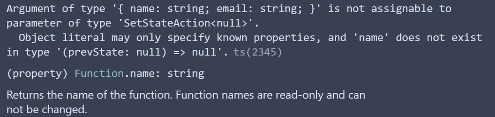

# React with TypeScript

----

### Typing Props

```react
// App.tsx
import { Greet } from './components/Greet'

export default function App() {
	return (
		<div className='App'>
			<Greet name='dongkyun' />
		</div>
	)
}
```

```react
// Greet.tsx
type GreetProps = {
	name: string
}

export function Greet(props: GreetProps) {
	return (
		<h2>{props}!</h2>
	)
}
```

이런 식으로 `props`를 통해 받아오는 데이터의 타입을 정의할 수 있다. 그렇다면, 반드시 `props`를 정의해야 할 때는 `interface`가 아닌 `type`을 써야 하는 걸까?

> https://dev.to/reyronald/typescript-types-or-interfaces-for-react-component-props-1408

그건 아니다. `interface`를 쓸 수도, `type`을 쓸 수도 있다. 정답은 없으면 자신의 상황에 맞추어 사용하면 된다. 해당 링크에 이와 관련된 내용들이 있다. 굉장히 좋은 내용이라 한번 번역해서 글을 올려야겠다.

---

### Object Props

```react
// App.tsx
import { Greet } from './components/Greet'
import { Person } from './components/Person'

export default function App() {
	const personName = {
		first: 'Bruce',
		last: 'Wayne',
	}
               
	return (
		<div className='App'>
			<Greet name='dongkyun' />
			<Person name={personName} />
		</div>
	)
}
```

```react
type PersonProps = {
	name: {
		first: string,
		last: string
	}
}

export const Person = (props: PersonProps) => {
	return <div>{props.name.first}</div>
}
```

---

### Object Array Props

```react
// App.tsx
import { Greet } from './components/Greet'
import { Person } from './components/Person'

export default function App() {
    const nameList = [
         {
			first: 'Bruce',
			last: 'Wayne',
		},
         {
			first: 'Bruce',
			last: 'Wayne',
		},
         {
			first: 'Bruce',
			last: 'Wayne',
		},
    ]
               
	return (
		<div className='App'>
			<Greet name='dongkyun' />
             <PersonList names={nameList} />
		</div>
	)
}
```

```react
type PersonListProps = {
	names: {
		first: string
		last: string
	}[]
}

export const PersonList = (props: PersonListProps) => {
	return(
		<div>
        	{props.names.map(name => {
                return (
                	<h2 key={name.first}>{name.first}</h2>
                )
            })}
        </div>
	)
}
```

---

### Advanced Props

```react
import { Status } from './components/Status'

function App() {
	return (
		<div>
			<Status status='asdasd' />
		</div>
	)
}
```

```react
type StatusProps = {
	status: string
}

export const Status = (props: StatusProps) => {
	let message
	if (props.status === 'loading') {
		message = 'Loading...'
	}
	else if (props.status === 'success') {
		message = 'Data fetched successfully!'
	}
	else if (props.status === 'error') {
		message = 'Error fetching data'
	}
	return (
		<div>
			<h2>Status - {message}</h2>
		</div>
	)
}
```

해당 코드는 어떠한 에러도 발생시키지 않는다. 

얼핏보면 틀린 것 없어보이지만 분명히 잘못된 코드이다. 현재 `props`로 넘어오는 `status`의 값은 `loading`, `success`, `error` 이 3개 중에 하나여야 한다. 하지만, 우리는 `status`의 `type`을 `string`으로만 지정해놓았기 때문에 `status` 값으로 `asdasd`가 와도 에러가 발생하지 않는다.

때문에 우리는 이런 경우 유니온 타입을 사용해야 한다.

```react
type StatusProps = {
	status: 'loading' | 'success' | 'error'
}
```

---

### Children Props

```react
import { Heading } from './components/Heading'

function App() {
	return (
		<div>
			<Heading>Placeholder text</Heading>
		</div>
	)
}
```

```react
type HeadingProps = {
	children: string
}

export const Heading = (props: HeadingProps) => {
    return <h2>{props.children}</h2>
}
```

이런 식으로 children값도 타입을 지정해주어야 한다.

만약 children 값이 지금처럼 단순한 문자열이 아니라면 어떨까?

```react
import { Heading } from './components/Heading'
import { Oscar } from './components/Oscar'

function App() {
	return (
		<div>
			<Oscar>
				<Heading>Placeholder text</Heading>
			</Oscar>
		</div>
	)
}
```

```react
type OscarProps = {
	children: React.ReactNode
}

export const Oscar = (props: OscarProps) => {
	return <div>{props.children}</div>
}
```

이런 식으로 `React.ReactNode`를 사용하여 리액트 노드가 `children` 값으로 왔음을 명시하면 된다.

---

### Optional Props

```react
import { Greet } from './components/Greet'

function App() {
	return (
		<div>
             <Greet name='Vishwas' messageCount={10} isLoggedIn={false} />
			<Greet name='Vishwas' isLoggedIn={false} />
		</div>
	)
}
```

```react
type GreetProps = {
    name: string
    messageCount?: number
    isLoggedIn: boolean
}

export const Greet = (props: GreetProps) => {
    // 이런 식으로 messageCount에 값이 들어오지 않는 경우에 대한 디폴트 값을 설정할 수 있다.
    const { messageCount = 0 } = props
    return (
    	<div>
        	<h2>
            	// ...
            </h2>
        </div>
    )
}
```

이런 식으로 물음표를 사용하면 optional한 props를 명시할 수 있다. 

---

### Event Props

Button의 click 이벤트를 넘긴다고 가정한다.

```react
import { Button } from './components/Button'

function App() {
	return (
		<div>
			<Button
				handleClick={() => {
					console.log('Button Clicked')
				}}
		</div>
	)
}
```

단순히 이런 모양이라면 우리는 다음과 같이 이벤트에 대한 타입을 지정할 수 있다.

```react
type ButtonProps = {
	handleClick: () => void
}

export const Button = (props: ButtonProps) => {
	return <button onClick={props.handleClick}>Click</button>
}
```

하지만, 만약에 void가 넘어가는 것이 아니라 event가 넘어가야 한다면 어떻게 할까? 또한, 당연히 대부분의 경우에서 이벤트도 같이 넘어가게 된다. 이 경우 조금 더 고차원적인 타입 선언이 필요하다.

```react
import { Button } from './components/Button'

function App() {
	return (
		<div>
			<Button
				handleClick={(event) => {
					console.log('Button Clicked')
				}}
		</div>
	)
}
```

```react
import React from 'react'

type ButtonProps = {
	handleClick: (event: React.MouseEvent<HTMLButtonElement>) => void
}

export const Button = (props: ButtonProps) => {
	return <button onClick={props.handleClick}>Click</button>
}
```

이번에는 input에 대한 event props를 확인해본다.

```react
import { Input } from './components/Button'

function App() {
	return (
		<div>
			<Input value='' handleChange={(event) => console.log(event)} />	
		</div>
	)
}
```

```react
import React from 'react'

type InputProps = {
    value: string
    handleChange: (event: React.ChangeEvent<HTMLInputElement>) => void
}
    
export const Input = (props: InputProps) => {
    return <input type="text" value={props.value} onChange={props.handleChange} />
}
```

조금 찾아보니 이런 이벤트 타입들도 존재한다고 한다.

- ChangeEvent<T>
- KeyboardEvent<T>
- MouseEvent<T>
- FormEvent<T>

해당 이벤트들은 모두 SyntheticEvent<T> 로 부터 비롯된다.

---

### setState 함수 넘기기

```react
// App.tsx

import React from 'react'

export interface IState {
	people: {
		name: string
		age: number
		url: string
		note?: string
	}[]
}

function App() {
	const [people, setPeople] = useState<IState['people']>)([])
	
	return (
		<AddToList people={people} setPeople={setPeople} />
	)
}
```

```react
// AddToList.tsx

import React, { useState } from 'react'
import { IState as Props } from 'App'

interface IProps {
    people: Props['people']
    setPeople: React.Dispatch<React.SetStateAction<Props['people']>>
}
    
const AddToList: React.FC<IProps> = ({ people, setPeople }) => {
    
}
```

이런 식으로 setState 함수의 타입은 `React.Dispatch<React.SetStateAction>`를 사용해서 선언하면 된다.

---

### Style Props

> 솔직히 이거는 거의 쓸 일이 없을 것 같다. 그냥 있다는 정도만 알아두면 되겠다.

```react
import { Container } from './components/Container'

function App() {
	return (
		<Container styles={{ border: '1px solid black', padding: '1rem' }} />
	)
}
```

```react
type ContainerProps = {
	styles: React.CSSProperties
}

export const Container = (props: ContainerProps) => {
	return <div style={props.styles}>GoGoGo</div>
}
```

---

### type을 조금 더 깔끔하게 선언하기

지금까지 여러 타입 선언들을 보면서 다음과 같은 타입들이 너무 더럽게 선언되어 있다는 것을 느낄 수 있었다.

```react
// PersonList.tsx

type PersonListProps = {
	names: {
		first: string
		last: string
	}[]
}

// ...
```

해당 타입선언을 어떻게 깔끔하게 수정할 수 있을까?

이런 경우 타입만을 다른 파일로 분리하면 더 좋은 코드를 쓸 수 있다.

```react
// PersonList.types.ts

export type Name = {
	first: string
	last: string
}
```

```react
// PersonList.tsx

import { Name } from './Person.types'

type PersonListProps = {
	names: Name[]
}

// ...
```

---

### React.FC를 사용한 props의 타입 체크

```react
// App.tsx

import React, { useState } from 'react'
import List from './List'

interface IState {
	people: {
		name: string
		age: number
		url: string
		note?: string
	}[]
}

export default function App() {
	const [people, setPeople] = useState<IState['people']>([])
	
	return (
		<List people={people} />
	)
}
```

해당 App.tsx에서 연결된 List.tsx에서 props의 타입을 지정할 수 있는 방법은 2가지이며 다음과 같다.

```react
import React from 'react'

interface IProps {
	people: {
		name: string 
		age: number
		url: string
		note?: string
	}[]
}

const List = ({ people }: IProps) => {
    return(
    )
}
```

```react
import React from 'react'

interface IProps {
	people: {
		name: string 
		age: number
		url: string
		note?: string
	}[]
}

const List: React.FC<IProps> = ({ people }) => {
    return(
    )
}
```

항상 첫번쨰 예제 처럼만 사용해왔는데, 두번째 예제가 더 많은 정보를 제공하기 때문에 더 좋다고 한다.  (제로초님에 의하면 두번째 경우처럼 사용하는 것이 타입에러가 더 빠르게 뜨기 때문에 훨씬 안전하다고 한다.)

---

### useState Hook

기본적으로 보통의 useState를 사용하는 경우 타입 추론에 의해 타입이 지정되므로 프로그래머가 굳이 명시적으로 타입을 지정해야할 필요는 없다. 하지만, useState를 사용하는 특수한 경우들에서는 타입을 지정해야할 필요가 생기는 경우들이 존재하며 이에 대해 알아본다.

```react
import { useState } from 'react'

export const User = () => {
	const [user, setUser] = useState(null)
	const handleLogin = () => {
		setUser({
			name: 'Vishwas',
			email: 'vishwas@example.com'
		})
	}
	const handleLogout = () => {
		setUser(null)
	}
	return (
		<div>
			<button onClick={handleLogin}>Login</button>
			<button onClick={handleLogout}>Logout</button>
		</div>
	)
}
```

이 코드는 얼핏 보기에 에러가 없을 것 같아 보이지만 에러가 발생한다.



null type으로 타입 추론이 된 상태에서 name과 email로 이루어진 객체가 들어왔기 때문이다.

때문에 이런 경우 미래에 들어올 데이터에 대한 타입을 미리 지정해줄 필요가 있다.

또한, 이 경우 데이터가 있을 수도, 없을 수도 있기 때문에 렌더 부분에 옵셔널 체이닝을 사용하여 렌더할 필요가 있다.

```react
import { useState } from 'react'

type AuthUser = {
	name: string
    email: string
}

export const User = () => {
	const [user, setUser] = useState<AuthUser | null>(null)
	const handleLogin = () => {
		setUser({
			name: 'Vishwas',
			email: 'vishwas@example.com'
		})
	}
	const handleLogout = () => {
		setUser(null)
	}
	return (
		<div>
			<button onClick={handleLogin}>Login</button>
			<button onClick={handleLogout}>Logout</button>
             <div>User name is {user?.name}</div>
             <div>User email is {user?.email}</div>
		</div>
	)
}
```

또한, 이 코드는 다음과 같이 개선시킬 수도 있다.

```react
import { useState } from 'react'

type AuthUser = {
	name: string
    email: string
}

export const User = () => {
	const [user, setUser] = useState<AuthUser>({} as AuthUser)
	const handleLogin = () => {
		setUser({
			name: 'Vishwas',
			email: 'vishwas@example.com'
		})
	}
	return (
		<div>
			<button onClick={handleLogin}>Login</button>
			<button onClick={handleLogout}>Logout</button>
             <div>User name is {user.name}</div>
             <div>User email is {user.email}</div>
		</div>
	)
}
```

이런 식으로 타입을 선언할 수도 있다. 빈 객체(null)이지만 해당 타입을 AuthUser로 선언하겠다는 의미이다.

이런 식으로 하면 null을 지울 수 있고 이 덕분에 렌더 부분 코드에서 사용하였던 옵셔널 체이닝 또한 제거할 수 있다.

물론. 명시적으로 null을 넣어버리던 로그아웃 함수는 없애야 한다.

---

### useRef Hook

```react
import { useRef, useEffect } from 'react'

export const DomRef = () => {
	const inputRef = useRef<HTMLInputElement | null>(null) 
	
	useEffect(() => {
		inputRef.current?.focus()
	}, []);
	
	return (
		<div>
			<input type='text' ref={inputRef} />
		</div>
	)
}
```

`useRef` 자체에는 해당 `ref`가 어떠한 종류의 DOM을 가리키고 있는지 명시해 주어야 한다.

DOM의 current는 존재할 수도 존재하지 않을 수도 있기 때문에 옵셔널을 달아준다. (useRef의 디폴트 값이 null이기 때문)

다음은 타이머를 만드는 예제를 확인한다.

```react
import { useState, useRef, useEffect } from 'react'

export const MutableRef = () => {
	const [timer, setTimer] = useState(0)
	const interValRef = useRef<number | undefined>(undefined)
	
	const stopTimer = () => {
		window.clearInterval(interValRef.current)
	}
	
	useEffect(() => {
		interValRef.current = window.setInterval(() => {
			setTimer((timer) => timer + 1)
		}, 1000)
		return () => {
			stopTimer()
		}
	}, [])
	
	return(
		<div>
			<button onClick={() => stopTimer()}>Stop Timer</button>
		</div>
	)
}
```

```react
import { useState, useRef, useEffect } from 'react'

export const MutableRef = () => {
	const [timer, setTimer] = useState(0)
	const interValRef = useRef<number | null>(null)
	
	const stopTimer = () => {
		if (interValRef.current) window.clearInterval(interValRef.current)
	}
	
	useEffect(() => {
		interValRef.current = window.setInterval(() => {
			setTimer((timer) => timer + 1)
		}, 1000)
		return () => {
			stopTimer()
		}
	}, [])
	
	return(
		<div>
			<button onClick={() => stopTimer()}>Stop Timer</button>
		</div>
	)
}
```

이 경우 이렇게 두가지의 방법이 존재한다.

기본적으로 `intervalRef`는 타이머의 시간이기 때문에 number 타입이 있어야 한다.

또한, `ref`의 특성상 기본적으로 `null` 혹은 `undefined`의 타입을 가질 수 있어야 하는데 (디폴트 value가 `null`이기 때문에) `undefined`를 사용하는게 훨씬 더 깔끔한 코드를 짤 수 있다는 것을 알 수 있다.

---

#### forwardRef

useRef를 사용하다보면 부모 컴포넌트에서 만든 ref를 자식 컴포넌트로 넘겨야 할 때가 생긴다, 이때 사용할 수 있는 것이 forwardRef이다.

```react
import { useRef } from 'react'
import Player from './components/player'
import Controls from './components/controls'

const TRACK_URL = '/elevator.wav'

function App() {
	const audioPlayer = useRef(null)
	
	return (
		<>
			<Player src={TRACK_URL} ref={audioPlayer} />
			<Controls audioPlayer={audioPlayer} />
		</>
	)
}

export default App
```

```react
// ./components/player

import { forwardRef } from 'react'

type PlayerProps = {
	src: string
}

const Player = forwardRef<HTMLAudioElement, PlayerProps>(({ src }, ref) => {
    return(
    	<audio src={src} ref={ref}>
        	This browser~
        </audio>
    )
})

export default Player
```

```react
// ./components/controls

import type { RefObject } from 'react'

type ControlProps = {
    audioPlayer: RefObject<HTMLAudioElement | null>
}
    
const Controls = ({ audioPlayer }: ControlProps) => {
    const jump10Seconds = () => {
        if (audioPlayer !== null && audioPlayer.current) {
            audioPlayer.current.currentTime += 10
        }
    }
    
    return (
    	<div>
        	<button onClick={() => jump10Seconds() }></button>
        </div>
    )
}
```

forwardRef의 경우 이런 식으로 타입 정의를 하게 된다. 

가장 유의깊게 봐야하는 부분은

`forwardRef<HTMLAudioElement, PlayerProps>(({ src }, ref)`

이곳이다.  타입 정의와 파라미터의 순서가 뒤바뀌어 있기 때문에 잘 기억해두어야 한다. (아마 제네릭 타입이라 이렇게 순서가 바뀌는 것 같다.)

---

### Component를 Props로 보내기

1. attribute 값이 전혀없는 Component를 보내는 경우

```react
// Private.tsx

import { Login } from './Login';

type PrivateProps = {
	isLoggedIn: boolean
    Component: React.ComponentType
}

export const Private = ({ isLoggedIn, Component }) => {
    if (isLoggedIn) {
        return <Component />
    } else {
        return <Login />
    }
}
```

2. attribute 값이 존재하는 Component를 보내는 경우

```react
// Private.tsx

import { Login } from './Login';

type ProfileProps = {
	name: string
}

type PrivateProps = {
	isLoggedIn: boolean
    Component: React.ComponentType<ProfileProps>
}

export const Private = ({ isLoggedIn, Component }: PrivateProps) => {
    if (isLoggedIn) {
        return <Component name="장동균" />
    } else {
        return <Login />
    }
}
```

정확한 이유는 모르겠지만 해당 코드의 props를 다시 다음과 같이 바꿔서 사용한다.

```react
// Private.tsx

import { Login } from './Login';

type ProfileProps = {
	name: string
}

type PrivateProps = {
	isLoggedIn: boolean
    component: React.ComponentType<ProfileProps>
}

export const Private = ({ isLoggedIn, component: Component }: PrivateProps) => {
    if (isLoggedIn) {
        return <Component name="장동균" />
    } else {
        return <Login />
    }
}
```

기본적으로 컴포넌트만 첫글자를 대문자로 표기하는 것으로 아는데, props로 전달될 때에는 소문자로 전달되어야 하는건가...?

---

### Generic Props

```react
// List.tsx

type ListProps = {
	items: string[] | number[]
	onClick: (value: string | number) => void
}

export const List = ({ items, onClick }: ListProps) => {
	return (
		<div>
			<h2>List of items</h2>
			{items.map((item, index) => {
				return (
					<div key={index} onClick={() => onClick(item)}>
						{item}
					</div>
				)
			})}
		</div>
	)
}
```

```react
// App.tsx

import { List } from './List'

export default function App() {
	return (
		<div className="App">
			<List
				items={['Batman', 'Superman', 'Wonder Woman']}
				onClick={(item) => console.log(item)}
			/>
			<List items={[1, 2, 3]} onClick={(item) => console.log(item)} />
             <List 
                 items={[
                    {
                        first: 'Bruce',
                        last: 'Wayne',
                    },
                    {
                        first: 'Clark',
                        last: 'Kent',
                    },
                    {
                        first: 'Princess',
                        last: 'Diana',
                    },
                ]}
                 onClick={(item) => console.log(item)}
             />
        </div>
	)
}
```

```react
type ListProps = {
	items: string[] | number[]
	onClick: (value: string | number) => void
}
```

해당 코드를 통해 문자열 배열, 숫자 배열은 커버가 가능하다. 하지만, 위의 경우처럼 객체 배열이 props로 들어오는 경우 당연히 에러가 나게 된다. 물론 `items: string[] | number[] | object[]` 이런 식으로 선언하여 문제를 해결할 수도 있을 것이다. 하지만 이런 식의 코드는 확장성에서 문제가 존재한다. 

때문에 지금과 같이 여러 타입들이 들어올 수 있는 경우에 제네릭을 사용해주어야 한다.

```react
// List.tsx

type ListProps<T> = {
	items: T[]
	onClick: (value: T) => void
}

export const List = <T extends {}>({ items, onClick }: ListProps<T>) => {
	return (
		<div>
			<h2>List of items</h2>
			{items.map((item, index) => {
				return (
					<div key={index} onClick={() => onClick(item)}>
						{item}
					</div>
				)
			})}
		</div>
	)
}
```

제네릭 코드의 핵심은 결국 이 부분이다. `<T extends {}>`

객체를 상속받고 있는 T는 결국 모든 타입을 허용하게 된다. (any와 같은 기능을 한다고 생각해도 무방하지만 any보다 훨씬 좋은 선택지이다.)

만약 `<T extends string | number>` 이런 식으로 제네릭 코드를 작성한다면,

```react
type ListProps = {
	items: string[] | number[]
	onClick: (value: string | number) => void
}
```

결국 기존의 이 코드와 동일한 기능을 하게 되는 것이다.

위의 객체 배열만을 허용해야 한다면 제네릭 코드는 다음과 같아 질 수 있다.

`<T extends {first: string, last: string}>`

---

### Restricting Props 

랜덤한 숫자 한개를 받고 이를 렌더하는 컴포넌트가 있다고 가정한다. 

이 컴포넌트는 자신이 양수일 경우 어트리뷰트로 isPositive를, 자신이 음수일 경우 어트리뷰트로 isNegative를, 자신이 0일 경우 어트리뷰트로 isZero를 보낸다고 가정한다. 

이 경우 랜덤한 숫자 한 개는 양수 | 0 | 음수 중 딱 한 개에만 해당하기 때문에 어트리뷰트 또한 딱 한 개만 보내져야 한다.

이 경우 어떻게 하나의 어트리뷰트만 올 수 있게 제한할 수 있을까?

