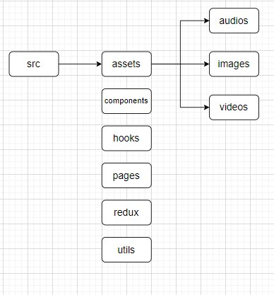

# React 폴더 구조

---

assets - 정적인 파일들을 보관

components - 사용자 정의 태그들 보관 (ex. Button. Input) 

hooks - 사용자 정의 hook들 보관. 내 생각에 api call 하는 모든 것들을 이곳에 함수화시켜서 보관하는게 좋을 것 같음. auth(Login, Logout, Signup)와 관련된 친구들도 이곳에 배치되는게 좋을 듯

pages - 실제 page들. 각 페이지(홈페이지, 로그인 페이지, 마이페이지 ...) 별로 하나의 폴더를 만들어서 사용하는 것이 좋음

utils - ??? 

redux - redux와 관련되 것들

interfaces - typescript에서 type들 정의해두는 곳

---

일단, 이 정도의 폴더 구조가 가장 바람직하지 않을까? 라고 생각한다.

폴더 구조에 정답이 있는 것은 아니기에 이 부분은 계속 고민해서 수정해나갈 필요가 있겠다.