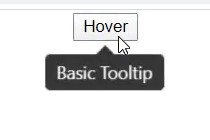
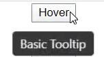
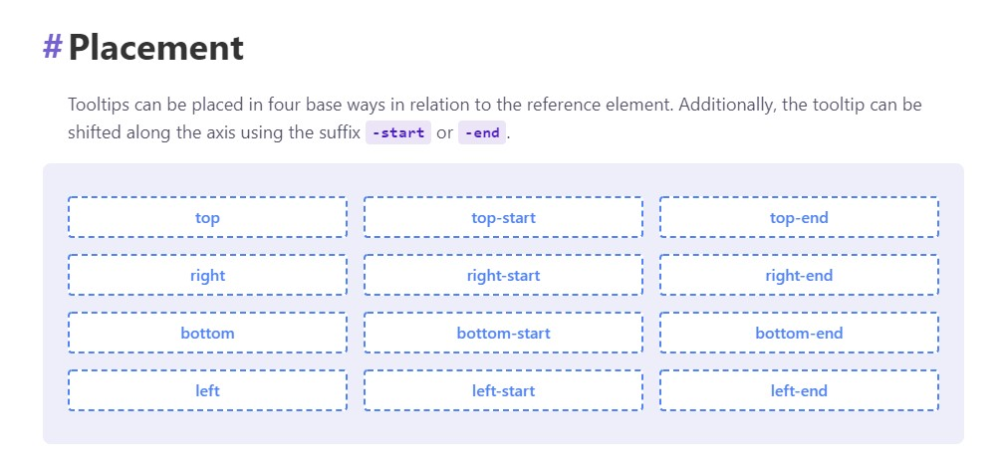

# React Tooltip

---

Tooltip이란 특정한 요소에 커서를 올렸을 때, 해당 요소에 대한 설명을 보여주는 기능이다.

기본적인 코드와 실행했을 때의 모습은 다음과 같다.

```javascript
import React from 'react'
import './App.css'
import Tippy from '@tippy.js/react'
import 'tippy.js/dist/tippy.css'

function App(){
	return (
		<div className='App'>
			<Tippy content='Basic Tooltip'>
				<button>Hover</button>
			</Tippy>
		</div>
	)
}
```



사진을 보면 tooltip의 위 혹은 아래쪽에 화살표가 있는 것을 쉽게 확인 할 수 있다. 이 화살표는 생략이 가능하다.

```javascript
import React from 'react'
import './App.css'
import Tippy from '@tippy.js/react'
import 'tippy.js/dist/tippy.css'

function App(){
	return (
		<div className='App'>
			<Tippy arrow={false} content='Basic Tooltip'>
				<button>Hover</button>
			</Tippy>
		</div>
	)
}
```



delay 속성을 적용하면 커서가 해당 요소에 올라갔을 때 tooltip이 몇 초 뒤에 뜨게 만들고, 커서가 떨어졌을 때 tooltip이 몇 초 후에 사라지게 할지 정할 수 있다. 다음 예제는 1000으로 했기 때문에 1초 후에 tooltip이 만들어지고, 커서가 떨어지고 1초 후에 tooltip이 사라진다.

```javascript
import React from 'react'
import './App.css'
import Tippy from '@tippy.js/react'
import 'tippy.js/dist/tippy.css'

function App(){
	return (
		<div className='App'>
			<Tippy arrow={false} delay={1000} content='Basic Tooltip'>
				<button>Hover</button>
			</Tippy>
		</div>
	)
}
```

tooltip이 생겨날 위치 또한 지정할 수 있다. 다음과 같은 예제는 오른쪽에 tooltip이 생겨날 것이다.

```javascript
import React from 'react'
import './App.css'
import Tippy from '@tippy.js/react'
import 'tippy.js/dist/tippy.css'

function App(){
	return (
		<div className='App'>
			<Tippy placement='right' arrow={false} delay={1000} content='Basic Tooltip'>
				<button>Hover</button>
			</Tippy>
		</div>
	)
}
```

사용할 수 있는 위치들은 다음 사진을 통해 확인이 가능하다.




아래와 같이 Tooltip에 CSS를 적용할 수도 있다.

```javascript
import React from 'react'
import './App.css'
import Tippy from '@tippy.js/react'
import 'tippy.js/dist/tippy.css'

function App(){
	return (
		<div className='App'>
			<Tippy content={<span style={{ color: 'orange' }}>Colored</span>}>
				<button>Hover</button>
			</Tippy>
		</div>
	)
}
```

하지만, 이런 식의 코드는 가독성이 떨어진다는 것을 쉽게 알 수 있다. 때문에 하나의 컴포넌트로 분리해서 사용할 필요가 있다.

```javascript
import React from 'react'
import './App.css'
import Tippy from '@tippy.js/react'
import 'tippy.js/dist/tippy.css'

const ColoredTooltip = () => {
	return <span style={{ color: 'orange'}}>Colored</span>
}

function App(){
	return (
		<div className='App'>
			<Tippy content={<ColoredTooltip />}>
				<button>Hover</button>
			</Tippy>
		</div>
	)
}
```

 

초반 부분 자식 속성에 적용하는 거 추가해야하