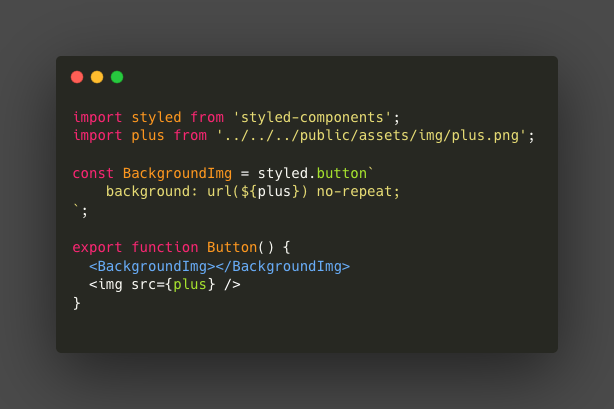
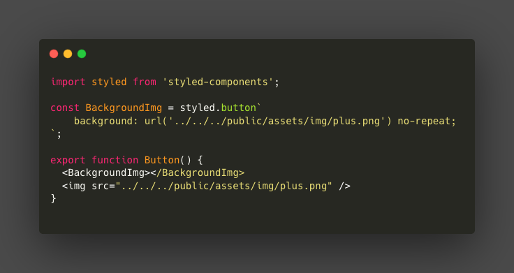
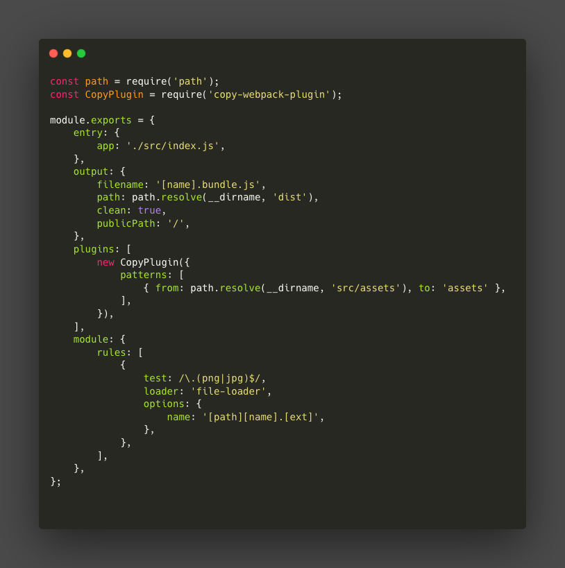
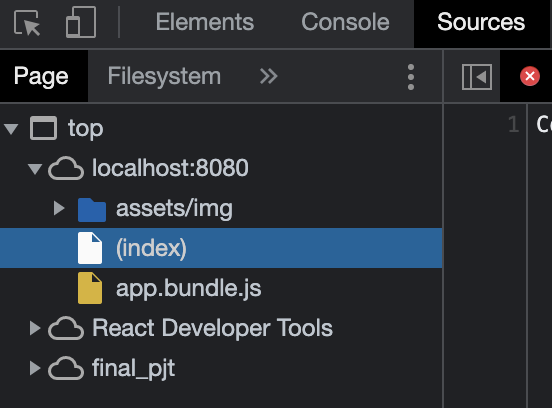
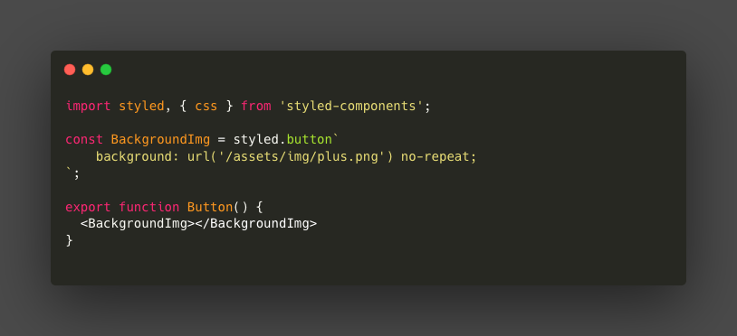

CRA를 사용하지 않고 리액트 프로젝트를 진행하다 겪은 문제를 정리한 글 입니다.

---

### 문제상황

해당 코드는 정상적으로 동작한다.

하지만 이런 식의 코드는 동작하지 않는다.

두 코드의 차이는 이미지 파일을 import 해서 사용하냐, 아니면 폴더 구조의 상대 경로로 접근해서 사용할 것이냐 이다. import해서 사용하는 경우에는 해당 이미지 파일을 정상적으로 가져올 수 있지만, 상대 경로를 사용하는 경우에는 그 요청이 서버로 넘어가게 된다. (ex. baseURL이 `http://localhost:3000`인 경우 `http://localhost:3000/public/assets/img/plus.png` 로 이미지 파일에 대한 요청을 보내게 된다.) 

---

### 해결방안

그렇다면 어떻게 해야 요청이 서버로 넘어가더라도 정상적으로 이미지 파일을 가져올 수 있을까?

그에 대한 해답으로 찾은 것이 [copy-webpack-plugin](https://github.com/webpack-contrib/copy-webpack-plugin) 이었다. copy-webpack-plugin은 특정한 파일 혹은 폴더를 빌드된 결과물이 저장되는 폴더에 복사해준다.

적용 방법은 다음과 같다.

`from: path.resolve(__dirname, 'src/assets'), to: 'assets'`

> src/assets 폴더 내부의 모든 파일을 빌드 폴더 내부에 복사하겠다. 복사된 파일이 저장되는 폴더의 이름은 assets이다.

다음과 같이 개발자 도구 Sources 탭 build 폴더 내부에 assets라는 이름의 폴더 내부에 이미지 파일들이 복사되었음을 확인할 수 있다.

해당 파일의 접근 또한 다음과 같은 코드로 하면 된다.

`baseURL + /assets/img/plus.png` 로 요청이 가기 때문에 정상적으로 plus 이미지를 가져올 수 있게 된다.

---

### 어려웠던 점

가장 처음에 CopyPlugin의 from을 `public/assets`으로 설정했다. 정상적으로 동작하지 않았는데 그 이유는 웹팩의 entry point가 `src/index.js`이기 때문이다. `src` 폴더 외부의 다른 폴더(`public`)을 `from`으로 설정하다 보니 웹팩에서는 해당 폴더의 존재 유무를 알 수 없었다. 이를 해결하기 위해서 `public` 폴더 내부에 위치시켰던 `assets` 폴더를 `src` 폴더 내부로 이동시켰다.

---

### 참고문헌

https://runebook.dev/ko/docs/webpack/plugins/copy-webpack-plugin

https://medium.com/a-beginners-guide-for-webpack-2/copy-all-images-files-to-a-folder-using-copy-webpack-plugin-7c8cf2de7676

https://webpack.js.org/plugins/copy-webpack-plugin/
