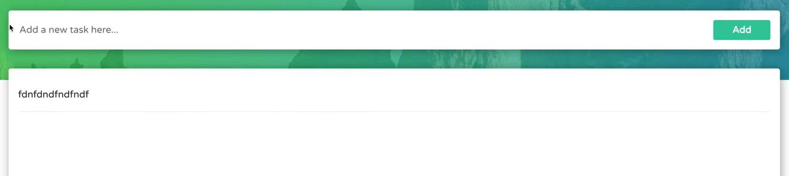

테스트의 종류

- Unit Tests
- Integration Tests
- End to End Tests

보통 딱 하나의 컴포넌트를 대상으로 테스팅하게 되면 Unit Tests, 여러 개의 컴포넌트 간의 상호작용에 대해 테스팅하게 되면 Integration Tests라고 한다.

```javascript
  "@testing-library/jest-dom": "^5.11.4",
  "@testing-library/react": "^11.1.0",
  "@testing-library/user-event": "^12.1.10",
```

리액트 테스팅을 위해 필요한 라이브러리

```javascript
  "scripts": {
    "test": "react-scripts test",
  },
```

테스팅 시작 명령어

test 혹은 it 명령어를 통해 테스트 구문을 작성할 수 있다.

---

### 테스트 블록

- Render a component we to test
- Find elements we want to interact with
- Interact with those elements
- Assert that the results are as expected

```react
import { render, screen } from "@testing-library/react";
import App from "./App";

test("renders learn react link", () => {
  render(<App />);  // Render a component we do test
  const linkElement = screen.getByText(/learn react/i); // Find elements we want to interact with
  
  // Interact with those elements (this tutorial doesn't have this part.)

  expect(linkElement).toBeInTheDocument();  // Assert that the results are as expected
});
```

learn react라는 텍스트가 렌더링 되는지 확인하는 테스트 코드

---

### `AllBy*`와 `By*`

`findAllBy*`는 *에 해당하는 값들을 모두 가져오게 된다.

`findBy*`은 *에 해당하는 값을 딱 하나 가져오게 된다.

이와 비슷하게  `getAllBy*`와 `getBy*`, `queryAllBy*`와 `queryBy*`또한 같은 차이점을 가진다.

|          | getBy  | findBy | queryBy | getAllBy | findAllBy | queryAllBy |
| -------- | ------ | ------ | ------- | -------- | --------- | ---------- |
| No Match | error  | error  | null    | error    | error     | array      |
| 1 Match  | return | return | return  | array    | array     | array      |
| 1+ Match | error  | error  | error   | array    | array     | array      |
| Await    | no     | yes    | no      | no       | yes       | no         |

---

### Priority

`AllBy*` 혹은 `By*` 뒤에 붙는 요소들이 여러가지가 존재하는데 이들의 우선순위는 다음과 같다.


---

### 실제 유닛 테스팅


헤더에 대한 테스트를 진행한다고 가정한다. 그렇다면 헤더의 폴더 구조는 다음과 비슷하게 될 것이다.

```react
// Header.js

export default function Header({ title }) {
	return <h1>{title}</h1>
}
```

```react
// Header.test.js

import { render, screen } from '@testing-library/react';
import Header from '../Header';

it('should render same text passed into title prop', async () => {
	render(<Header title="My Header" />);
	const headingElement = screen.getByText(/my header/i);
	expect(headingElement).toBeInTheDocument();
});    // success

it('should render same text passed into title prop', async () => {
	render(<Header title="My Header" />);
	const headingElement = screen.getByRole("heading");
	expect(headingElement).toBeInTheDocument();
});    // success
```

`h1` 태그가 존재하기 때문에 두번째 테스트 코드 또한 통과한다.

테스트 코드 상에서는 단순히 h, p가 아닌 heading, paragraph라는 것을 잘 기억해둘 필요가 있겠다.

 만약 `Header.js`가 다음과 같이 변경되었다면 어떨까

```react
// Header.js

export default function Header({ title }) {
	return (
        <>
        	<h1>{title}</h1>
        	<h3>Cats</h3>
        </>
    )
}
```

이 경우 위의 테스트 코드는 에러가 난다. 왜냐하면 `getByRole`의 경우 1개를 초과하는 매칭이 일어나면 에러가 나게 되어있기 때문이다. 이럴 때 특정 요소의 전부에 대한 테스트가 아닌 특정 요소의 특정한 케이스에만 테스트를 하고 싶은 경우가 존재할 것이다. 예를 들면 text 값이 "My Header"인 heading만 찾는 예제처럼 말이다. 해당 경우 2번째 인자로 특정한 값을 지정해 주면 그것만 가져올 수 있게 된다.

```react
// Header.test.js

import { render, screen } from '@testing-library/react';
import Header from '../Header';

it('should render same text passed into title prop', async () => {
	render(<Header title="My Header" />);
	const headingElement = screen.getByText(/my header/i);
	expect(headingElement).toBeInTheDocument();
});    // success

it('should render same text passed into title prop', async () => {
	render(<Header title="My Header" />);
	const headingElement = screen.getByRole("heading", { name: "My Header" });
	expect(headingElement).toBeInTheDocument();
});    // success
```

특정한 요소를 고를 때 단순히 텍스트만 가능한 것은 아니다. 굉장히 많은 경우들이 존재하지만, title을 사용하는 예제 하나를 살펴본다.

```react
// Header.js

export default function Header({ title }) {
	return (
        <>
        	<h1>{title}</h1>
        	<h3 title="Header">Cats</h3>
        </>
    )
}
```

여기에서 title이 Header인 값을 테스트하기 위해서는 어떻게해야 할까.

```react
it('should render some text passed into title prop', async () => {
	render(<Header title="My Header" />);
	const headingElement = screen.getByTitle("Header");
	expect(headingElement).toBeInTheDocument();
})
```

다음과 같은 코드로 테스팅이 가능하다.

testId를 통해서도 이런 테스팅이 가능하다. 해당 부분의 코드도 확인해본다.

```react
// Header.js

export default function Header({ title }) {
	return (
        <>
        	<h1 className="header" data-testid="header-1">{title}</h1>
        	<h3 title="Header">Cats</h3>
        </>
    )
}
```

```react
it('should render some text passed into title prop', async () => {
	render(<Header title="My Header" />);
	const headingElement = screen.getByTest("header-1");
	expect(headingElement).toBeInTheDocument();
})
```

---

### findBy*

```react
it('should render same text passed into title prop', async () => {
	render(<Header title="My Header" />);
	const headingElement = await screen.findByText(/my header/i);
	expect(headingElement).toBeInTheDocument();
});
```

`findBy*` 메서드는 await과 함께 써야 한다는 특징을 가진다.

---

queryBy*

```react
it('should render same text passed into title prop', async () => {
	render(<Header title="My Header" />);
	const headingElement = screen.getByText(/dog/i);
	expect(headingElement).toBeInTheDocument();
});
```

해당 코드는 당연히 에러를 테스팅 실패를 뱉게 된다. 왜냐하면 그 어떤 곳에서도 dog라는 단어를 찾을 수 없기 때문이다. 그렇다면 에러가 나는 시점은 어디일까? 바로 3번째 줄이다.

```react
it('should render same text passed into title prop', async () => {
	render(<Header title="My Header" />);
	const headingElement = screen.getByText(/dog/i);
	expect(headingElement).not.toBeInTheDocument();
});
```

3번째 줄에서 테스팅이 실패한다는 것을 이 테스팅 코드를 통해 정확하게 파악할 수 있다. 얼핏 봤을 때 해당 코드는 성공해야할 것 같지만 실패하게 된다. 그 이유는 4번째 행이 실행되기도 전에 3번째 행에서 실패하고 그곳에서 테스팅이 끝나기 때문이다.

때문에 실패하더라도 테스팅을 더 진행시켜서 원래의 개발자 의도와 맞게 실행시키기 위해서 `queryBy*`를 사용하게 된다.

```react
it('should render same text passed into title prop', async () => {
	render(<Header title="My Header" />);
	const headingElement = screen.queryByText(/dog/i);
	expect(headingElement).not.toBeInTheDocument();
});    // success
```

---

### Assertions

```react
export default function TodoFooter({ numberOfIncompleteTasks }) {
    return (
    	<div className="todo-footer">
        	<p>{numberOfIncompleteTasks} {numberOfIncompleteTasks === 1 ? "task" : "tasks"} left</p>
            <Link to="/followers">Followers</Link>
        </div>
    )
}
```

```react
import { render, screen } from "@testing-library/react";
import TodoFooter from "../TodoFooter";

it("should render the correct amount of incomplete tasks", () => {
  render(<TodoFooter numberOfIncompleteTasks={5} />);
  const paragraphElement = screen.getByText(/5 tasks left/i);
  expect(paragraphElement).toBeInTheDocument();
});
```

해당 테스트 코드는 전혀 문제가 없어 보이지만 실제로는 실패하게 된다.

그 이유는 에러 메시지에서 정확하게 파악할 수 있다.

`Invariant failed: You should not use <Link> outside a <Router>`

결국 테스팅을 위해 작성된 코드에서는 `<BrowserRouter>`에 의해 감싸지지 않기 때문이다. 

때문에 우리가 임의로 mock 함수를 만들고 이를 라우터로 감싸주어야 에러가 나지 않는다.

```react
import { render, screen } from "@testing-library/react";
import TodoFooter from "../TodoFooter";
import { BrowserRouter as Router } from "react-router-dom";

const MockTodoFooter = ({ numberOfIncompleteTasks }) => {
  return (
    <Router>
      <TodoFooter numberOfIncompleteTasks={numberOfIncompleteTasks} />
    </Router>
  );
};

it("should render the correct amount of incomplete tasks", () => {
  render(<MockTodoFooter numberOfIncompleteTasks={5} />);
  const paragraphElement = screen.getByText(/5 tasks left/i);
  expect(paragraphElement).toBeInTheDocument();
});
```

위의 테스트코드를 이렇게 수정하면 기존의 에러가 해결된다.

또한, 해당 코드의 경우

`<p>{numberOfIncompleteTasks} {numberOfIncompleteTasks === 1 ? "task" : "tasks"} left</p>`

다음과 같은 조건부 연산자가 사용된다. 결국 이 말은 테스트가 2개가 필요하다는 이야기이다.

때문에 우리는 다음과 같은 2개의 테스트 코드를 작성해서 테스트 해볼 수 있을 것이다.

```react
import { render, screen } from "@testing-library/react";
import TodoFooter from "../TodoFooter";
import { BrowserRouter as Router } from "react-router-dom";

const MockTodoFooter = ({ numberOfIncompleteTasks }) => {
  return (
    <Router>
      <TodoFooter numberOfIncompleteTasks={numberOfIncompleteTasks} />
    </Router>
  );
};

it("should render the correct amount of incomplete tasks", () => {
  render(<MockTodoFooter numberOfIncompleteTasks={5} />);
  const paragraphElement = screen.getByText(/5 tasks left/i);
  expect(paragraphElement).toBeInTheDocument();
});

it("should render the task which amount is only one", () => {
  render(<MockTodoFooter numberOfIncompleteTasks={1} />);
  const paragraphElement = screen.getByText(/1 task left/i);
  expect(paragraphElement).toBeInTheDocument();
});
```

---

### toBeVisible

`expect(*Element)`. 이 뒤에 붙을 수 있는 메서드들은 굉장히 많다. 하나하나 설명하기에는 정말 방대한 양이기에 그때 그때 호버해서 어떠한 특징을 갖는지 파악하고 익숙해질 필요가 있다.

이 문단에서는 여러 메서드들 중에서도 `visible`에 대해서 알아본다. `visible`은 사용자에게 해당 element가 보여지는지 아닌지에 대해 테스팅해준다.

```react
export default function TodoFooter({ numberOfIncompleteTasks }) {
    return (
    	<div className="todo-footer">
        	<p>{numberOfIncompleteTasks} {numberOfIncompleteTasks === 1 ? "task" : "tasks"} left</p>
            <Link to="/followers">Followers</Link>
        </div>
    )
}
```

```react
it("should render the task which amount is only one", () => {
  render(<MockTodoFooter numberOfIncompleteTasks={1} />);
  const paragraphElement = screen.getByText(/1 task left/i);
  expect(paragraphElement).toBeVisible;
});
```

다음과 같이 `toBeVisible`을 사용해주면 된다. 해당 경우는 사용자에게 보이는 요소이기 때문에 테스트가 통과하게 된다.

하지만,  만약 `<p style={{ opacity: 0 }}>{numberOfIncompleteTasks} {numberOfIncompleteTasks === 1 ? "task" : "tasks"} left</p>` 

이런 식으로 opacity 값을 주어서 투명하게 만든다면 해당 테스트는 실패하게 된다.

---

### toContainHTML

요소에 특정한 HTML 태그가 포함되는지 테스트하는 메서드이다.

```react
export default function TodoFooter({ numberOfIncompleteTasks }) {
    return (
    	<div className="todo-footer">
        	<p>{numberOfIncompleteTasks} {numberOfIncompleteTasks === 1 ? "task" : "tasks"} left</p>
            <Link to="/followers">Followers</Link>
        </div>
    )
}
```

```react
it("exercise toContainHTML", () => {
  render(<MockTodoFooter numberOfIncompleteTasks={1} />);
  const paragraphElement = screen.getByText(/1 task left/i);
  expect(paragraphElement).toContainHTML("p");
});
```

1 task left 라는 텍스트의 HTML element는 p tag이다. 때문에 해당 테스트는 성공한다.

하지만, 만약에 다음과 같이 테스트 코드를 작성했다고 가정해보자.

```react
it("exercise toContainHTML", () => {
  render(<MockTodoFooter numberOfIncompleteTasks={1} />);
  const paragraphElement = screen.getByText(/1 task left/i);
  expect(paragraphElement).toContainHTML("h3");
});
```

해당 텍스트에 h3 태그는 존재하지 않기 때문에 해당 테스트는 실패한다.

---

### toHaveTextContent

지금까지는 계속해서 `getByText`를 통해 엘리먼트를 가져와서 내용을 검사하는 경우가 없었지만, 만약 다른 메서드를 통해서 엘리먼트를 가져오게 된다면 내용을 검사해야 하는 경우가 생길 수 있다.

이때 사용할 수 있는 메서드가 `toHaveTextContent`이다.

```react
export default function TodoFooter({ numberOfIncompleteTasks }) {
    return (
    	<div className="todo-footer">
        	<p data-testid="para">{numberOfIncompleteTasks} {numberOfIncompleteTasks === 1 ? "task" : "tasks"} left</p>
            <Link to="/followers">Followers</Link>
        </div>
    )
}
```

```react
it("exercise toHaveTextContent", () => {
  render(<MockTodoFooter numberOfIncompleteTasks={1} />);
  const paragraphElement = screen.getByTestId("para");
  expect(paragraphElement).toHaveTextContent("1 task left");
});
```

몰론 `toBe`를 활용하여 다음과 같이 테스트 코드를 작성할 수도 있다.

```react
it("exercise toHaveTextContent", () => {
  render(<MockTodoFooter numberOfIncompleteTasks={1} />);
  const paragraphElement = screen.getByTestId("para");
  expect(paragraphElement.textContent).toBe("1 task left");
});
```

---

### describe를 통해 여러 테스트 코드를 그룹핑하기


두 개의 모양 중 하나로 하게 되는 경우가 많다.

기존에는 다음과 같은 모양으로 테스트 코드를 작성해왔다.

```react
it("", () => {

});

it("", () => {

});

it("", () => {

});
```

하지만 앞으로는 describe를 활용하여 다음과 같이 그룹핑 한다.

```react
describe("", () => {
	it("", () => {

	});

	it("", () => {

	});

	it("", () => {

	});
});
```

describe 안에 여러 개의 describe를 넣어서 두번째 사진처럼 그룹핑 하는 방법 또한 존재한다.

```react
describe("", () => {
	describe("", () => {
		it("", () => {

		});

		it("", () => {

		});
	});
	
	describe("", () => {
		it("", () => {

		});
	});
});
```

---

### useState와 관련된 테스트

```react
import React, { useState } from 'react'
import "./AddInput.css"
import { v4 } from "uuid"

function AddInput({
    setTodos, todos
}) {

    const [todo, setTodo] = useState("")

    const addTodo = () => {
        if(!todo) return
        let updatedTodos = [
            ...todos,
            {
                id: v4(),
                task: todo,
                completed: false
            }
        ]
        setTodos(updatedTodos);
        setTodo("")
    }

    return (
        <div className="input-container">
            <input 
                className="input" 
                value={todo} 
                onChange={(e) => setTodo(e.target.value)}
                placeholder="Add a new task here..."
            />
            <button 
                className="add-btn"
                onClick={addTodo}
            >
                Add
            </button>
        </div>
    )
}

export default AddInput
```

부모의 상태 `todos`와 이를 변경하는 함수 `setTodos`를 받아오는 AddInput 컴포넌트가 있다고 가정한다.

가장 먼저 placeholder가 잘 렌더되는지 확인하기 위해서는 다음과 같은 테스팅 코드를 작성할 수 있다.

```react
describe("check placeholder is right", () => {
  it("should render placeholder", () => {
    render(<AddInput todos={[]} setTodos={() => {}} />);
    const inputElement = screen.getByPlaceholderText(/Add a new task here.../i);
    expect(inputElement).toBeInTheDocument();
  });
});
```

실질적으로 해당 테스팅에서 props로 받아오는 setTodos를 사용하지 않기 때문에 저런 식(`() => {}`)의 아무 기능 없는 함수를 넣을 수 있다.

하지만, 이렇게 빈 함수를 넣는 것 보다 더 좋은 방법이 존재하는데 mock 함수를 하나 만들어서 넣는 것이다. 해당 코드는 다음과 같다.

```react
const mockedSetTodo = jest.fn();

describe("check placeholder is right", () => {
  it("should render placeholder", () => {
    render(<AddInput todos={[]} setTodos={mockedSetTodo} />);
    const inputElement = screen.getByPlaceholderText(/Add a new task here.../i);
    expect(inputElement).toBeInTheDocument();
  });
});
```

---

### fireEvent를 사용하여 이벤트 테스트




현재 상황이다. input 박스에 텍스트를 입력하고 Add 버튼을 클리하면 input 박스는 초기화되면서 입력해놓은 텍스트들은 아래의 박스에 추가된다.

여기의 input 박스에 대한 테스트를 수행한다면 할 수 있는 부분은 크게 2가지 일 것이다.

- input 이벤트가 제대로 동작하는가?
- Add button 클릭 이벤트 이후 input의 값이 초기화 되는가?

먼저, 첫번째 테스트부터 확인해본다. 해당 테스트를 수행하기 위해서는 이벤트를 감지해야하고 이를 위해서 fireEvent라는 것을 사용하게 된다.

```react
import { render, screen, fireEvent } from "@testing-library/react";
import AddInput from "../AddInput";

const mockedSetTodo = jest.fn();

describe("AddInput", () => {
  it("should be able to type into input", () => {
    render(<AddInput todos={[]} setTodos={mockedSetTodo} />);
    const inputElement = screen.getByPlaceholderText(/Add a new task here.../i);
    fireEvent.change(inputElement, {
      target: { value: "Go Grocery Shopping" },
    });
    expect(inputElement.value).toBe("Go Grocery Shopping");
  });
}    // success
```

이런 식으로 테스트 코드를 작성하면 inputElement에 "Go Grocery Shopping" 이라는 input 이벤트가 발생했을 때의 값을 테스팅 할 수 있다.

그 다음으로, 버튼 클릭이 발생했을 때 초기화되는지는 어떻게 확인해볼 수 있을까?

```react
describe("AddInput", () => {
	it("should be able to type into input", () => {
    	render(<AddInput todos={[]} setTodos={mockedSetTodo} />);
    	const inputElement = screen.getByPlaceholderText(/Add a new task here.../i);
    	const buttonElement = screen.getByRole("button", { name: /Add/i });
    	fireEvent.change(inputElement, {
      	target: { value: "Go Grocery Shopping" },
    	});
    	fireEvent.click(buttonElement);
    	expect(inputElement.value).toBe("");
  	});
}     // success
```

해당 테스트 코드를 통해 가능하다. buttonElement에 click 이벤트가 발생했을 때, inputElement의 값이 ""임을 확인하는 테스트 코드이다.

### 즉, 이벤트에 대한 테스팅은 fireEvent를 통해 수행이 가능하다.

---

### Integration Test


이전 까지는 각 컴포넌트 단위에 대한 테스트만을 진행해왔다. 하지만, 이번에는 여러 컴포넌트 간의 테스트, 즉 통합 테스트를 진행한다.

위 사진을 통해 2개의 분리된 컴포넌트가 존재한다는 것을 파악할 수 있다. input 박스와 input된 텍스트들을 저장하는 아래의 박스 이 2개다. input 박스에 텍스트가 입력되고 Add 버튼이 눌리면 해당 텍스트가 아래의 박스에 추가되는 형식이기 때문에 이 두 컴포넌트를 통합하여 테스팅 할 필요가 존재한다.

해당 부분의 코드는 다음과 같다.

```react
import React, { useState } from 'react'
import AddInput from '../AddInput/AddInput'
import Header from '../Header/Header'
import TodoList from '../TodoList/TodoList'
import "./Todo.css"

function Todo() {

    const [todos, setTodos] = useState([])

    return (
        <div className="todo">
            <Header title="Todo" />
            // 위쪽의 인풋 박스
            <AddInput 
                setTodos={setTodos}
                todos={todos}
            />
            // 인풋에 의해 생성된 텍스트들이 쌓이는 곳
            <TodoList 
                todos={todos}
                setTodos={setTodos}
            />
        </div>
    )
}

export default Todo
```

우리의 의도에 맞는 테스트 코드는 다음과 같이 작성할 수 있을 것이다.

```react
import { render, screen, fireEvent } from '@testing-library/react';
import Todo from "../Todo"
import { BrowserRouter } from "react-router-dom"

// Todo의 하위 컴포넌트에서 Link 태그를 사용하고 있어서 해당 부분이 필요하다.
const MockTodo = () => {
    return (
        <BrowserRouter>
          <Todo/>
        </BrowserRouter>
    )
}

it('should be able to type into input', () => {
    render(
        <MockTodo />
    );
    // 인풋 태그 가져오기
    const inputElement = screen.getByPlaceholderText(/Add a new task here.../i);
    // 버튼 태그 가져오기
    const buttonElement = screen.getByRole("button", { name: /Add/i });
    // 인풋 이벤트 발생
    fireEvent.change(inputElement, { target: {value: "Go Grocery Shopping" }});
    // 클릭 이벤트 발생
    fireEvent.click(buttonElement);
    // 전체를 감싸는 div 태그 가져오기
    const divElement = screen.getByText(/Go Grocery Shopping/i);
    // 이전에 작성한 텍스트가 렌더 되었는지 테스트
    expect(divElement).toBeInTheDocument()
});
```

해당 테스트 코드도 얼핏보면 굉장히 괜찮아보인다. 하지만, 가장 큰 문제는 만약 여러 개의 텍스트를 테스팅해야 한다면 딱 작성한 만큼의 코드를 테스팅 해야 하는 텍스트의 개수만큼 반복해야 한다. 이는 굉장한 비효율이기 때문에 이 문제를 해결하기 위해 테스팅 코드를 함수로 리팩토링해서 분리한다.

1. 하나의 테스트만 수행

```react
import { render, screen, fireEvent } from '@testing-library/react';
import Todo from "../Todo"
import { BrowserRouter } from "react-router-dom"

const MockTodo = () => {
    return (
        <BrowserRouter>
          <Todo/>
        </BrowserRouter>
    )
}

const addTask = (tasks) => {
    const inputElement = screen.getByPlaceholderText(/Add a new task here.../i);
    const buttonElement = screen.getByRole("button", { name: /Add/i} );
    tasks.forEach((task) => {
        fireEvent.change(inputElement, { target: { value: task } });
        fireEvent.click(buttonElement);
    })
}

it('should be able to type into input', () => {
    render(
        <MockTodo />
    );
    addTask(["Go Grocery Shopping"])
    const divElement = screen.getByText(/Go Grocery Shopping/i);
    expect(divElement).toBeInTheDocument()
});
```

2. 여러 개의 테스트를 수행하지만 모두 내용이 같음

```react
// 위와 동일...

it('should render multiple items', () => {
    render(
        <MockTodo />
    );
    addTask(["Go Grocery Shopping", "Go Grocery Shopping", "Go Grocery Shopping"])
    const divElements = screen.queryAllByText(/Go Grocery Shopping/i);
    expect(divElements.length).toBe(3)
});
```

3. 여러 개의 테스트를 수행하면서 모두 내용이 다름

이 경우 기존 코드에 약간의 수정이 필요하다.

```react
todos.map((todo, index) => (
	<div 
		className={`todo-item ${todo.completed && "todo-item-active"}`} 
		onClick={() => updateTask(todo.id)}
        // 추가된 부분
        data-testid="task-container"
	>
	{todo.task}
	</div>
))
```

해당 부분은 `<TodoList />` 컴포넌트 내부에서 todos를 렌더하는 곳이다.

이곳에 `data-testid` 값을 추가하는데 내부의 텍스트가 다른 경우에는 기존의 `screen.queryAllByText(/Go Grocery Shopping/i);` 이런 코드로는 원하는 부분을 모두 가져올 수 없기 때문이다.

테스트 코드는 다음과 같이 작성한다.

```react
it('should render multiple items', () => {
	render(<MockTodo />);
	addTask(["Go Grocery Shopping", "Pet my Cat", "Wash my Hands"]);
	const divElements = screen.getAllByTestId("task-container");
	expect(divElements.length).toBe(3);
});
```

---

### Dynamic class test

이전 코드를 다시 본다.

```react
todos.map((todo, index) => (
	<div 
		className={`todo-item ${todo.completed && "todo-item-active"}`} 
		onClick={() => updateTask(todo.id)}
        // 추가된 부분
        data-testid="task-container"
	>
	{todo.task}
	</div>
))
```

`todo.completed`의 값이 true 라면 `todo-item-active` 클래스가 추가되는 것을 확인할 수 있다. `todo.completed`의 값은 클릭 이벤트에 의해 변하게 된다.

이 경우 테스트할 수 있는 부분은 크게 2가지 일 것이다. 클릭 이벤트 발생 이전 `todo-item-active` 클래스가 존재하지 않는 것을 한번 확인하고, 클릭 이벤트 발생 이후 해당 클래스가 존재하는지를 확인하면 될 것이다.

이벤트 발생 이전에 해당 클래스가 존재하지 않는지 확인하는 코드는 다음과 같다.

```react
it('should not have active class', () => {
	render(<MockTodo />);
	addTask(["Go Grocery Shopping"]);
	const divElement = screen.getByText(/Go Grocery Shopping/i);
	expect(divElement).not.toHaveClass("todo-item-active");
});
```

이벤트 발생 이후 해당 클래스가 존재하는지 확인하는 코드는 다음과 같다.

```react
it('should have active class after click event', () => {
	render(<MockTodo />);
	addTask(["Go Grocery Shopping"]);
	const divElement = screen.getByText(/Go Grocery Shopping/i);
    fireEvent.click(divElement);
	expect(divElement).toHaveClass("todo-item-active");
});
```

---

### async에 대한 테스트

```react
import React, { useEffect, useState } from 'react'
import "./FollowersList.css"
import axios from "axios"
import { Link } from 'react-router-dom';

export default function FollowersList() {

    const [followers, setFollowers] = useState([]);

    useEffect(() => {

        const fetchFollowers = async () => {
            const { data } = await axios.get("https://randomuser.me/api/?results=5")
            setFollowers(data.results)
        }

        fetchFollowers()
    }, []);


    return (
        <div className="followerslist-container">
            <div>
                {followers.map((follower, index) => (
                    <div className="follower-item" data-testid={`follower-item-${index}`}>
                        
                        <div className="followers-details">
                            <div className="follower-item-name">
                                <h4>{follower.name.first}</h4> <h4>{follower.name.last}</h4>
                            </div>
                            <p>{follower.login.username}</p>
                        </div>
                    </div>
                ))}
            </div>
            <div className="todo-footer">
                <Link to="/">Go Back</Link>
            </div>
        </div>
    )
}
```

다음과 같이 useEffect 안에서 사용자의 정보를 호출하게 되는 컴포넌트가 있다고 가정한다. 아래 return문이 잘 렌더되었는지 확인하기 위해 테스트한다면 다음과 같은 코드를 짤 수 있을 것이다.

```react
import { render, screen, fireEvent } from '@testing-library/react';
import { BrowserRouter } from 'react-router-dom';
import FollowersList from "../FollowersList";

const MockFollowersList = () => {
    return (
        <BrowserRouter>
            <FollowersList />
        </BrowserRouter>
    )
}

describe("FollowerList", () => {
	it('should render same text passed into title prop', async () => {
		render(<MockFollowerList />);
		const followerDivElement = screen.getByTestId("follower-item-0");
		expect(followerDivElement).toBeInTheDocument();
	})
})
```

여러개가 렌더될 수 있겠지만 0번 인덱스만을 테스트하는 코드이다. 하지만 해당 테스트는 실패한다. 왜냐하면 useEffect 속에서 함수가 호출되어야 데이터가 받아와지고 그래야 아래 부분이 렌더되기 때문이다. 

이를 해결하기 위해서는 2가지의 수정이 필요하다

1. async/await 구문으로의 변환이 필요하다.
2. getByTestId에서는 Await에 대한 사용이 불가능 하기 때문에 다른 메서드를 사용해야 한다.

수정한 테스트 코드는 다음과 같아질 것이다.

```react
describe("FollowerList", () => {
	it('should render followers items', async () => {
		render(<MockFollowerList />);
		const followerDivElement = await screen.findByTestId("follower-item-0");
		expect(followerDivElement).toBeInTheDocument();
	})
})
```

이 테스트 코드에는 문제가 존재하는데 0번 인덱스만을 검사한다는 것이다. 때문에 지금까지 계속 그래왔듯이 multiple select를 수행하고 길이가 그와 동일한지 확인하는 식으로 전체 테스트를 진행할 필요가 있다.

```react
describe("FollowerList", () => {
	it('should render multiple followers items', async () => {
		render(<MockFollowerList />);
		const followerDivElements = await screen.findAllByTestId(/follower-item/i);
		expect(followerDivElements.length).toBe(5);
	})
})
```

---

### 기존 async 테스트에 대한 재고와 mock 데이터 사용

위에서 async/await으로 작성한 테스트 코드는 실제 api를 호출하게 된다. 하지만, 굳이 테스트 단계에서 api 호출이 필요하지는 않다. 또한, api를 직접 호출하는 것은 다음과 같은 이유들로 피해야 한다.

- Requests Cost Money
- Requests Are Slow
- Our Tests Dependent on Something External (api call의 실패가 테스팅의 실패로 이어질 수 있다.)

때문에 우리는 테스팅을 할 때에는 실제 데이터를 불러오는 것이 아닌 미리 정의해놓은 mock(가짜) 데이터를 사용할 필요가 있다.

---

### Before & After Each

테스트 직전과 직후에도 우리가 원하는 작업들을 실행 시킬 수 있다.

| 이름       | 설명                                     |
| ---------- | ---------------------------------------- |
| beforeEach | 모든 테스트의 맨 앞에 딱 한 번 실행된다. |
| beforeAll  | 각각의 테스트 앞에서 실행된다.           |
| afterEach  | 각각의 테스트 뒤에서 실행된다.           |
| afterAll   | 모든 테스트가 끝나고 딱 한 번 실행된다.  |

```javascript
describe("FollowersList", () => {
 
    beforeEach(() => {
        console.log("RUNS BEFORE EACH TEST")
    })

    beforeAll(() => {
        console.log("RUNS ONCE BEFORE ALL TESTS")
    })

    afterEach(() => {
        console.log("RUNS AFTER EACH TEST")
    })

    afterAll(() => {
        console.log("RUNS ONCE AFTER ALL TESTS")
    })

    it('should fetch and render input element', async () => {
        render(
            <MockFollowersList />
        );
        const followerDivElement = await screen.findByTestId(`follower-item-0`)
        expect(followerDivElement).toBeInTheDocument();
    });
    
    it('should fetch and render input element', async () => {
        render(
            <MockFollowersList />
        );
    
        const followerDivElement = await screen.findByTestId(`follower-item-0`)
        expect(followerDivElement).toBeInTheDocument();
    });
})
```


1. RUNS BEFORE EACH TEST

2. RUNS ONCE BEFORE ALL TESTS

3. 첫번째 테스트

4. RUNS AFTER EACH TEST

5. RUNS ONCE BEFORE ALL TESTS

6. 두번째 테스트

7. RUNS AFTER EACH TEST

8. RUNS ONCE AFTER ALL TESTS

