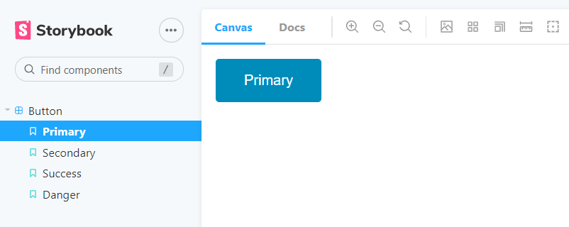
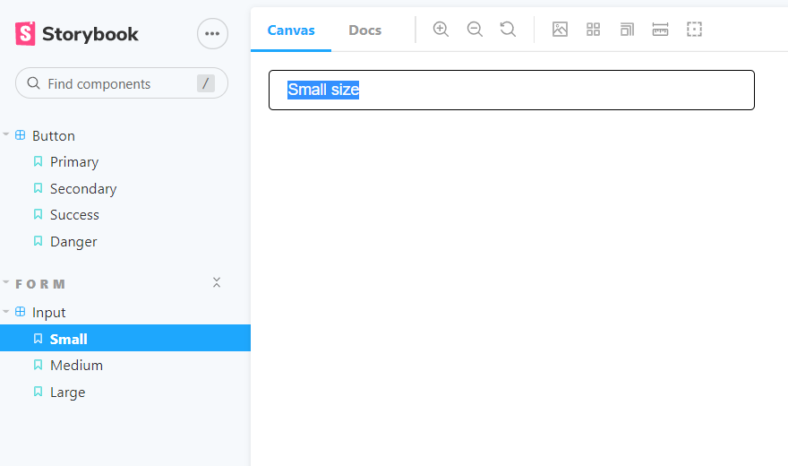
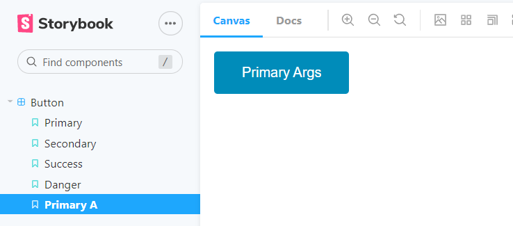

# 💥storybook

>Storybook은 React나 Vue, Angular를 위한 고립된 환경에서 컴포넌트 UI 개발을 위한 오픈소스 툴이다.
>
>React의 철학 중 하나가 "고립된 컴포넌트를 이용해 재사용성을 높이는 것"임을 생각하면, 리액트와 스토리북은 굉장히 궁합이 잘맞는 짝꿍이겠구나 라는 예상을 해볼 수 있다.
>
>또한, 스토리북을 활용한 개발을 `CDD (Component-Driven Development)` 컴포넌트 주도 개발이라고 한다.

---

### What and Why?

- create components independently
- Ability to view the different components that have already been developed
- View what are the different props that those developed components accept
- Ability to visually showcase those components to your stake holders for feedback
- Dynamically change props, accessibility score


`npx sb init` // 까는 명령어

`yarn storybook` // 실행 명령어

---

### 간단한 스토리북의 예시 (Button)

```javascript
// Button.js

import React from "react";
import "./Button.css";

function Button({ variant = "primary", children, ...rest }) {
  return (
    <button className={`button ${variant}`} {...rest}>
      {children}
    </button>
  );
}

export default Button;

```

```css
// Button.css

.button {
  border: none;
  color: white;
  padding: 15px 32px;
  text-align: center;
  text-decoration: none;
  display: inline-block;
  font-size: 16px;
  border-radius: 4px;
  cursor: pointer;
}

.primary {
  background-color: #008cba;
}
.secondary {
  background-color: #e7e7e7;
  color: black;
}
.success {
  background-color: #4caf50;
}
.danger {
  background-color: #f44336;
}

```

```javascript
// 스토리북을 사용하기 위해서는 반드시 [componentName].stories.js 파일이 필요하다.

import React from "react";
import Button from "./Button";

export default {
  title: "Button",
  component: Button,
};

export const Primary = () => <Button variant="primary">Primary</Button>;
export const Secondary = () => <Button variant="secondary">Secondary</Button>;
export const Success = () => <Button variant="success">Success</Button>;
export const Danger = () => <Button variant="danger">Danger</Button>;

```



`Button.stories.js` 파일 말미에서 실행한 4 종류의 버튼 컴포넌트들이 렌더링되었음을 볼 수 있다. 이러한 방식으로 컴포넌트를 테스트해나가는 것이다.

---

### 간단한 스토리북의 예시 (Input)

```javascript
// Input.js

import React from "react";
import "./Input.css";

// 기존 input에 적용될 수 있던 속성들이 ...rest를 통해 들어올 것이다. 이런 식으로 추상화가 가능하다.
export default function Input({ size = "medium", ...rest }) {
  return <input className={`input ${size}`} {...rest} />;
}
```

```css
// Input.css

.input {
  display: block;
  width: 400px;
  padding-left: 1rem;
  padding-right: 1rem;
  border-radius: 0.25rem;
  border: 1px solid;
  border-color: inherit;
  background-color: #fff;
}

.small {
  height: 2rem;
  font-size: 0.875rem;
}

.medium {
  height: 2.5rem;
  font-size: 1rem;
}

.large {
  height: 3rem;
  font-size: 1.25rem;
}
```

```javascript
// Input.stories.js

import React from "react";
import Input from "./Input";

export default {
  title: "Form/Input",
  component: Input,
};

export const Small = () => <Input size="small" placeholder="Small size" />;
export const Medium = () => <Input size="medium" placeholder="Medium size" />;
export const Large = () => <Input size="large" placeholder="large size" />;

```

이전의 Button과 다른 점은 바로 title 부분이다. 일부로 title을 그냥 Input이 아닌 Form/Input으로 주었다.



다음과 같이 좌측 폴더 구조가 변한 것을 알 수 있다. 즉, title에 적는 값은 스토리북을 실행시켰을 때 해당 컴포넌트들이 위치할 폴더 구조가 된다.

---

### Renaming

스토리북 페이지(`locahost:6006`) 에서 나타나는 이름을 명시적으로 바꿔 줄 수 있다.

```javascript
// Input.stories.js

import React from "react";
import Input from "./Input";

export default {
  title: "Form/Input",
  component: Input,
};

export const Small = () => <Input size="small" placeholder="Small size" />;
export const Medium = () => <Input size="medium" placeholder="Medium size" />;
export const Large = () => <Input size="large" placeholder="large size" />;

// Small 컴포넌트의 이름이 스토리북에서는 hangdongkyun이 된다.
Small.storyName = "hangdongkyun";
```


---

### 다른 폴더에 존재하는 여러 컴포넌트를 모아서 테스트하기

이 경우 따로 js 파일과 css 파일을 만들 필요 없이 바로 스토리 파일만을 만들면 된다. 

다음 예제는 Primary와 Large 컴포넌트 두 개를 같이 테스트 해보는 예제이다.

```javascript
// Subscription/Subscription.stories.js

import React from "react";
import { Primary } from "../Button/Button.stories";
import { Large } from "../Input/Input.stories";

export default {
  title: "form/Subscription",
};

export const PrimarySubscription = () => (
  <>
    <Large />
    <Primary />
  </>
);

```


---

### 스토리북에서 args사용하기

```javascript
import React from "react";
import Button from "./Button";

export default {
  title: "Button",
  component: Button,
};

const Template = (args) => <Button {...args} />;

export const PrimaryA = Template.bind({});
PrimaryA.args = {
  variant: "primary",
  children: "Primary Args",
};
```



이런 식으로 args를 사용할 수 있다.

또한, 원하는 default args가 있다면 이렇게도 사용할 수 있다.

```javascript
import React from "react";
import Button from "./Button";

export default {
  title: "Button",
  component: Button,
  args: {
  	children: "Primary Args"
  }
};

const Template = (args) => <Button {...args} />;

export const PrimaryA = Template.bind({});
PrimaryA.args = {
  variant: "primary",
};
```

위의 코드와 이 코드의 결과물은 같다.

