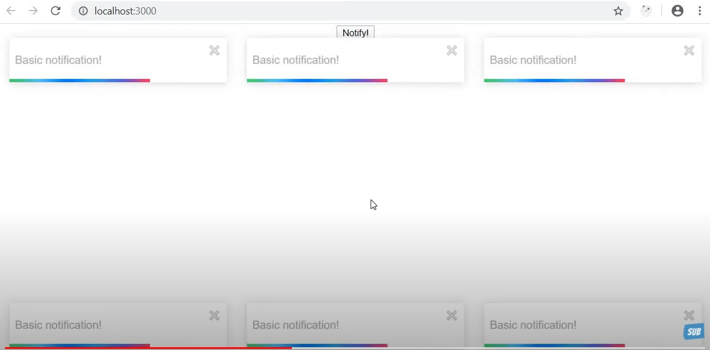

# ⚛️ React-Toast Notifications

> https://www.npmjs.com/package/react-toastify
>
> https://fkhadra.github.io/react-toastify/introduction

---

`$npm i react-toastify`로 설치가 가능하다.



이런 식의  모양이 toast이다.

```javascript
import React from 'react'
import './App.css'
import { toast } from 'react-toastify'
import 'react-toastify/dist/ReactToastify.css'

toast.configure()

//커스텀 토스트
// https://fkhadra.github.io/react-toastify/render-what-you-want 이곳에 조금 더 자세한 설명이 되어 있다.
const CustomToast = ({ closeToast }) => {
  return (
    <div>
      Something went wrong! <button onClick={closeToast}>Close</button>
    </div>
  )
}

function App () {
  const notify = () => {
    // toast의 내용과 위치를 지정할 수 있다.
    toast('Default!', { position: toast.POSITION.TOP_LEFT })
    
    // autoClose 속성을 통해 몇 초 후에 자동으로 사라지게 만들지 결정할 수 있다.(아래는 8초)  
    toast.success('Success!', {
      position: toast.POSITION.TOP_CENTER,
      autoClose: 8000
    })
      
    // 직접 닫기를 누르지 않는 이상 toast는 사라지지 않는다.
    toast.info('Info!', {
      position: toast.POSITION.TOP_RIGHT,
      autoClose: false
    })
      
    // 이런 식으로 커스텀 toast를 사용할 수 있다.
    toast.warn(<CustomToast />, {
      position: toast.POSITION.BOTTOM_LEFT
    })
    
    toast.error('Error!', { position: toast.POSITION.BOTTOM_CENTER })
    toast('Wow so easy !', { position: toast.POSITION.BOTTOM_RIGHT })
  }
  return (
    <div className='App'>
      <button onClick={notify}>Notify !</button>
    </div>
  )
}

export default App
```

<br/>

`react_toast`는 아예 특정 옵션들을 선택하면 자동으로 코드를 만들어서 주는 기능이 `github.io`에 구현 되어 있다.

활용해서 쓰면 굉장히 편리할 것 같다.

또한, `github.io`에 이 토스트를 커스텀 할 수 있는 방법들이 제시되어 있다. 그때 그때 필요한 내용들을 읽어보고 활용하는 식으로 사용하면 좋을 것 같다.