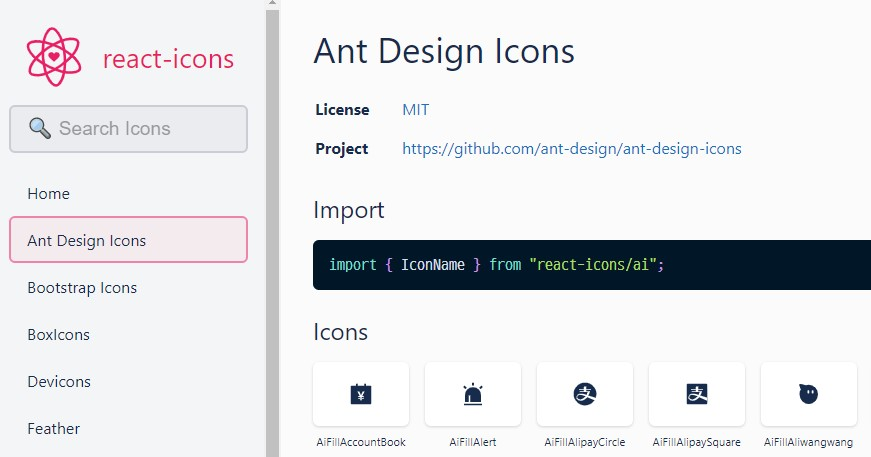

#  ⚛️React-Icons

> https://react-icons.github.io/react-icons
>
> https://github.com/react-icons/react-icons

---

react에서 아이콘을 사용하기 위한 패키지.

`$npm i react-icons` 로 설치한다.



AiFillAlert 아이콘을 사용하고 싶은 상황이라면 다음과 같이 코드를 구성할 수 있다.

```javascript
//App.js

import React from 'react'
import { AiFillAlert  } from "react-icons/ai"

function App(){
	return(
		<AiFillAlert />
	)
}
```

색상 혹은 사이즈를 조절하는 것은 태그 내부에서 가능하다.

```javascript
//App.js

import React from 'react'
import { AiFillAlert  } from "react-icons/ai"

function App(){
	return(
		<AiFillAlert color='purple' size='10rem' />
	)
}
```

만약 여러개의 아이콘에 동일한 CSS 속성을 적용해야 한다면 `IconContext.Provider` 를 사용한다.

```javascript
//App.js

import React from 'react'
import { IconContext } from 'react-icons'
import { AiFillAlert } from "react-icons/ai"

function App(){
	return(
		<IconContext.Provider value={{ color: 'blue', size: '5rem' }}>
			<AiFillAlert />
			<AiFillAlert />
			<AiFillAlert />
		<IconContext.Provider>
	)
}
```

각 `AiFillAlert` 태그에 `color` 혹은 `size`의 `css` 속성을 넣게 되면 오버라이딩된다.

```javascript
//App.js

import React from 'react'
import { IconContext } from 'react-icons'
import { AiFillAlert } from "react-icons/ai"

function App(){
	return(
		<IconContext.Provider value={{ color: 'blue', size: '5rem' }}>
			<AiFillAlert color='purple' size='10rem' />
			<AiFillAlert />
			<AiFillAlert />
		<IconContext.Provider>
	)
}
```

