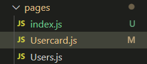

# 💞폴더 구조 (export vs export default)

---



기본적으로 원할한 import, export를 위해 각 폴더에 index.js 라는 파일을 만들게 된다.

index.js 라는 파일 자체가 디폴트한 접근이 가능하기 때문에 이런 식의 폴더 구조를 사용하게 된다.

```javascript
// index.js가 없는 폴더의 컴포넌트를 import 하는 경우

import Usercard from './pages/Usercard';
import Users from './pages/Users';

// index.js가 있는 폴더의 컴포넌트를 import 하는 경우

import Usercard from './pages';
import Users from './pages';
```

---

### 그렇다면 index.js 파일 내부의 코드는 어떻게 관리하는 것이 좋을까?

일단 크게 두가지 정도의 경우가 존재한다. 

---

### 1. export default 를 사용하는 경우 (export를 어쩔 수 없이 섞어 써야 하는 경우들이 있다.)

```javascript
// pages/Usercard.js

import React from 'react';

export default function Usercard({ users}) {
	...
}
```

```javascript
// pages/index.js

export { default } from './Usercard'
```

```javascript
// App.js

import { Usercard } from './pages';
```

하나의 폴더 내부에 default로 export 되는 컴포넌트가 한 개라면 이런 식으로의 코드 작성이 가능하다. 하지만, 만약 다음과 같은 `pages/User.js` 파일이 추가된다면 어떻게 될까?

```javascript
// pages/User.js

import React from 'react';

export default function User({ users}) {
	...
}
```

이 경우 index.js를 다음과 같이 작성할 수 없다.

```javascript
// pages/index.js

export { default } from './Usercard'
export { default } from './User'
```

하나의 모듈에서 하나의 default만이 export 될 수 있다는 규칙이 있다. 때문에 이런 식으로 default를 두 번 쓰게 되면 오류가 난다.

때문에 각각을 import 한 이후 하나의 객체 안에 넣어서 export 하는 방법이 존재한다.

```javascript
// pages/index.js

import Usercard from './Usercard';
import User from './User';

export { Usercard, User };
```

 만약, `Usercard.js`에 default는 아니지만 일반 함수를 export 해야 한다면 코드는 다음과 같아질 수 있다.

```javascript
// pages/Usercard.js

import React from "react";

export default function Usercard({ users }) {
	...
}

// 하나의 파일에 default 함수는 최대 한 개 뿐이다.
export function foo() {
	...
}

```

```javascript
// pages/index.js

import Usercard, { foo } from './Usercard';
import User from './User';

export { Usercard, User, foo };
```

---

### 2. export 만을 사용하는 경우

export 만을 사용하게 되면 index.js 내부의 코드는 굉장히 단순화 된다.

```javascript
// pages/Usercard.js

import React from 'react';

export function Usercard() {
	...
}

export function foo() {
	...
}
```

```javascript
// pages/User.js

import React from 'react';

export function Users() {
	...
}
```

```javascript
// pages/index.js

export * from './Users';
export * from './Usercard'
```

```javascript
// App.js

import { Users, Usercard, foo} from './pages';
```

---

## 어떤 코드가 더 좋은 코드일까?

일단 당연히 폴더 구조에서 더 좋은 코드란 없다. 본인이 더 좋다고 생각이 드는 형태를 사용하면 그만이다. 일단 지금 나의 얕은 지식만으로는 2번째 방법이 개인적으로 더 마음에 들기는 한다.

또한, 이 둘의 차이에 대해 설명하면서 아래를 사용하는 것이 더 좋다는 취지로 설명해주는 블로그를 발견 하였다.

https://yceffort.kr/2020/11/avoid-default-export

이 블로그에서는 여러 이유들을 제시하면서 `export default`를 사용하지 말라고 설명하고 있다. (블로그의 내용을 반드시 읽어볼 필요가 있다!)

- 검색이 어렵다.
- commonjs
- re-export
- 다이나믹 import
- 클래스나 함수가 아니면 한줄이 더 필요함.
- 리팩토링의 어려움
- 트리 쉐이킹

---

## 결론

clean architecture를 구성한다는 것은 어떤 것일까?

이에 대한 정답은 없다. 개인과 팀에 맞게 정해나가면 되는 것이다. 실제로 에어비엔비 자바스크립트 스타일 가이드에서는 `export default`를 사용할 것을 추천한다. 위의 두가지 선택지 중에서 본인이 마음에 드는 것을 선택해서 사용하면 된다.

**하지만! 가장 중요한 것은 내가 왜 이 선택지를 사용하는지에 대해 아는 것이다. 다른 선택지보다 이 선택지가 가지는 장점이 무엇이며, 단점은 무엇이고, 나는 어떠한 장점 때문에 이 선택지를 선택했는지가 가장 중요한 것이다.**