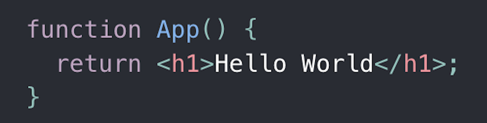
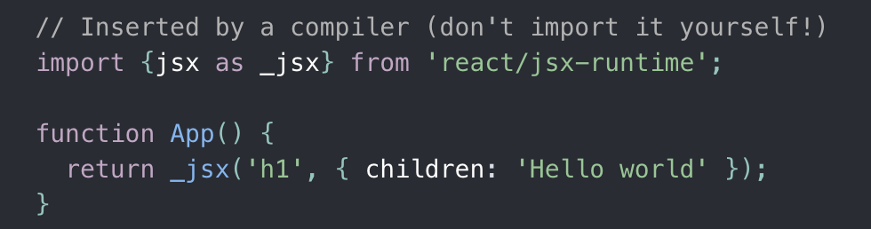

# 🔮import React from 'react' 구문 제거하기

---

내 코드에서는 `React`를 사용하지 않는데, 왜 `import React from 'react'`를 최상단에 선언해야 할까에 대한 의문이 생길 수 있다. 


사진에서 볼 수 있듯이 babel에 의해 `.jsx` 파일이 `.js`로 변환되면서 `React.createElement` 를 사용하게 된다.

하지만 이러한 변환은 문제가 있다.

- `.jsx` 파일이 `React.createElement`를 사용하는 형태로 컴파일되기 위해서는 `.jsx` 파일의 스코프 내에 React가 필요하다.
- `React.createElement` 를 사용하는 방식은 성능 향상과 코드 단순화가 어렵다.

이러한 문제를 해결하기 위해 React 17 버전부터는 `.jsx` 를 `React.createElement` 로 변환하는 것이 아닌, 새로운 JSX transform을 사용한다. (특별한 함수를 자동으로 import하여 `React.createElement`의 기능을 대체한다.)





CRA 4.0.0+, Gatsby v2.24.5+, Next.js v9.5.3+ 의 경우 별다른 추가설정 없이 `import React` 구문을 제거할 수 있다.

그렇지 않은 경우에도 다음과 같은 추가 설정을 통해 `import React` 구문을 제거할 수 있다.

1. `@babel/core` 와 `@babel/plugin-transform-react-jsx` 혹은 `@babel/preset-react` 가 최신버전이어야 한다. (둘 중 하나의 라이브러리만 있으면 된다.)

   > ```shell
   > # for @babel/plugin-transform-react-jsx user
   > npm update @babel/core @babel/plugin-transform-react-jsx
   > yarn upgrade @babel/core @babel/plugin-transform-react-jsx
   > 
   > # for @babel/preset-react user
   > npm update @babel/core @babel/preset-react
   > yarn upgrade @babel/core @babel/preset-react
   > ```

2. babel에 추가 설정을 해준다.

   > ```json
   > // If you are using @babel/preset-react
   > {
   >   "presets": [
   >     ["@babel/preset-react", {
   >       "runtime": "automatic"
   >     }]
   >   ]
   > }
   > ```
   >
   > ```json
   > // If you're using @babel/plugin-transform-react-jsx
   > {
   >   "plugins": [
   >     ["@babel/plugin-transform-react-jsx", {
   >       "runtime": "automatic"
   >     }]
   >   ]
   > }
   > ```

3. 만약 `eslint-plugin-react`를 사용 중이라면 `eslint` 파일에 다음 설정을 추가해준다.

   > ```json
   > {
   >   // ...
   >   "rules": {
   >     // ...
   >     "react/jsx-uses-react": "off",
   >     "react/react-in-jsx-scope": "off"
   >   }
   > }
   > ```

---

지금까지가 공식문서에서 설명하고 있는 방식이다. 추가적으로 웹팩을 활용한 방식도 소개해보려한다.

다음 코드를 `webpack.config.js`에 추가하면 된다.

```javascript
const webpack = require('webpack');

// ...

plugins: [
   new webpack.ProvidePlugin({
      "React": "react",
   }),
],
```

다만 이 방식은 공식 문서에서 설명한 바벨을 수정하는 방식과는 완전히 다르다. 어떠한 최적화도 되어있지 않으며 단순히 해당 모듈을 전역에서 가져오는 것이다.

더 좋은 방법이 존재하는 `import React from'react'` 가 아닌, `import $ from 'jquery'` 와 같은 구문이 모든 컴포넌트에서 사용된다면 이렇게 웹팩에 설정을 추가하는 방식이 좋은 선택지가 될 수 있다.

```javascript
const webpack = require('webpack');

// ...

plugins: [
   new webpack.ProvidePlugin({
      "$": "jquery",
   }),
],
```

---

### 참고자료

https://ko.reactjs.org/blog/2020/09/22/introducing-the-new-jsx-transform.html

http://daplus.net/javascript-%EC%9E%A1%ED%9E%88%EC%A7%80-%EC%95%8A%EC%9D%80-referenceerror-react%EA%B0%80-%EC%A0%95%EC%9D%98%EB%90%98%EC%A7%80-%EC%95%8A%EC%95%98%EC%8A%B5%EB%8B%88%EB%8B%A4/

https://webpack.js.org/plugins/provide-plugin/

