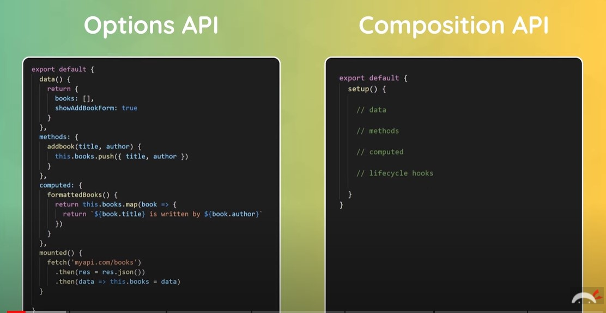

# Vue 각종 기능 알아보기

> script 안의 코드로 인해 해당 값이 바뀔 가능성이 존재하는 경우 html 태그 부분에서 바인드(:)를 한다고 생각하면 편할 것 같다.
>
> template 태그 안에서 자바스크립트 코드를 쓰고 싶다면 `"{ }"` 이 중괄호 안에 작성하면 된다. 
>
> 모든 내용은 The Net Ninja 유튜브의 강의를 바탕으로 작성했습니다. 사실 다 따라 쳤습니다. 때문에 강의를 보시는 것을 추천합니다.

---

### ref로 돔 조작하기

```html
<template>
  <h1>{{ title }}</h1>
  <input type="text" ref="name">
  <button @click="handleClick">Click me</button>
</template>

<script>
export default {
    name: "App",
    data() {
        return {
            title: 'My first Vue App'
        }
    },
    methods: {
        handleClick() {
            // 이런 식으로 this.$refs를 사용해서 DOM 조작을 할 수 있다.
            // input DOM의 ref를 name으로 지정했기 때문에 this.$refs.name
            // 으로 접근하는 것이다.
            this.$refs.name.classList.add('active') 
            this.$refs.name.focus() 
        }
    }
};
</script>

<style>
</style>
```

---

### 직접 구현한 modal

```html
<template>
  <div class="backdrop">
    <div class="modal">
      <p>Modal Content</p>
    </div>
  </div>
</template>

<style>
.modal {
  width: 400px;
  padding: 20px;
  margin: 100px auto; /* auto로 좌우 중앙 정렬 */
  background: white;
  border-radius: 10px;
}

.backdrop {
  top: 0;
  position: fixed;
  background: rgba(0, 0, 0, 0.5);
  width: 100%;
  height: 100%;
}
</style>
```

css 구성만 참고하면 나중에 직접 모달창을 구현할 때 쉽게 구현할 수 있을 듯.

---

### CSS 상속

만약 어떠한 vue 파일의 style 부분을 이렇게 구성했다고 가정하자.

```css
<style>
h1 {
    color: #03cfb4;
    border:none;
    padding: 0;
}
</style>
```

이렇게 되면 **global CSS**로 적용되어, 프로젝트 전체의 h1 태그에 해당 스타일이 적용된다. 

때문에 이러한 global CSS 대신 다른 방법을 사용해야 하는데 크게 2가지의 방법이 존재한다. 

```css
<style scoped>
h1 {
    color: #03cfb4;
    border:none;
    padding: 0;
}
</style>
```

1. scoped를 적용시킨다. - 이렇게 하면 해당 컴포넌트의 h1 태그에만 css가 적용된다.

```css
<style>
.modal h1 {
    color: #03cfb4;
    border:none;
    padding: 0;
}
</style>
```

2. 선택자를 명시한다. - 이렇게 하면 modal 클래스의 h1 태그에만 스타일이 적용된다.

대부분의 경우 해당 컴포넌트에서만 적용되기를 원하는 CSS 요소를 작성하지만, 가끔은 전역에 CSS를 적용시키고 싶을 때도 생긴다. 이때는 어떤 식으로 처리하는 것이 좋을까?

이럴 경우 `global.css` 파일을 하나 만드는 것이 좋다. 해당 파일에 전역으로 적용시키고자 하는 CSS 속성을 적고 `src/main.js`에 `import './assets/global.css'` 이런 식으로 `global.css`를 불러오는 식으로 사용하면 된다.

---

### Props

```html
// App.vue 

<template>
  <Modal header="Sign up for the Giveaway" />
</template>

<script>
import Modal from "./components/Modal.vue";

export default {
  name: "App",
  components: { Modal },
  data() {
    return {
      title: "My first Vue App",
    };
  },
};
</script>

<style>
</style>
```

```html
// Modal.vue 

<template>
  <h1>{{ header }}</h1>
</template>

<script>
export default {
  props: ["header"],
};
</script>

<style>
</style>
```

App.vue에서 props로 header 값을 넘겨주면, Modal.vue에서 header 값을 사용할 수 있게 된다.

하지만, 보통 이런 식으로 직접 값을 넣기 보다는 data 안의 값을 바인드해서 props로 보내는 경우가 많다. 이때는 바인드를 위한 콜론(:) 사용이 필요하다.

```html
// App.vue 

<template>
  <Modal :header="header" :text="text" />
</template>

<script>
import Modal from "./components/Modal.vue";

export default {
  name: "App",
  components: { Modal },
  data() {
    return {
      title: "My first Vue App",
      header: "Sign up for the Giveaway",
      text: "Grab your ninja~~"
    };
  },
};
</script>

<style>
</style>
```

```html
// Modal.vue 

<template>
  <h1>{{ header }}</h1>
  <p>{{ text }}</p>
</template>

<script>
export default {
  props: ["header", "text"],
};
</script>

<style>
</style>
```

props를 보내고 해당 데이터가 내가 원하는 데이터일 경우 class를 적용시키는 방법도 존재한다.

```html
// App.vue 

<template>
  <Modal :header="header" :text="text" theme="sale"/>
</template>

<script>
import Modal from "./components/Modal.vue";

export default {
  name: "App",
  components: { Modal },
  data() {
    return {
      title: "My first Vue App",
      header: "Sign up for the Giveaway",
      text: "Grab your ninja~~"
    };
  },
};
</script>

<style>
</style>
```

```html
// Modal.vue 

<template>
  <div :class="{sale: theme === 'sale'}">
    <h1>{{ header }}</h1>
    <p>{{ text }}</p>
  </div>
</template>

<script>
export default {
  props: ["header", "text", "theme"],
};
</script>

<style>
    .sale {
        padding: 20px;
    }
</style>
```

props로 온 theme의 값이 'sale' 이라면 sale이라는 class를 적용시키는 예제이다.

---

### Emitting Custom Event

부모에서 자식에게 데이터를 전달하는 법은 바로 위의 props에서 배웠다. 그렇다면, 자식에서 부모로 데이터를 전달하는 것도 가능할까? 안타깝게도 이는 불가능하다. 대신, 이벤트는 전달할 수 있는데 이를 Emit이라고 한다.

```html
// App.vue 

<template>
  <div v-if="showModal">
    <Modal :header="header" :text="text" theme="sale" @close="toggleModal" />
  </div>
  <button @click="toggleModal">open modal</button>
</template>

<script>
import Modal from "./components/Modal.vue";

export default {
  name: "App",
  components: { Modal },
  data() {
    return {
      title: "My first Vue App",
      header: "Sign up for the Giveaway",
      text: "Grab your ninja~~",
      showModal: false,
    };
  },
  methods: {
    toggleModal() {
      this.showModal = !this.showModal;
    },
  },
};
</script>

<style>
</style>
```

```html
// Modal.vue 

<template>
  <div :class="{ sale: theme === 'sale' }" @click="closeModal">
    <h1>{{ header }}</h1>
    <p>{{ text }}</p>
  </div>
</template>

<script>
export default {
  props: ["header", "text", "theme"],
  methods: {
    closeModal() {
      this.$emit("close");
    },
  },
};
</script>

<style>
.sale {
  padding: 20px;
}
</style>
```

먼저 Modal.vue를 본다. click 이벤트가 발생했을 때 closeModal 함수가 실행된다.

closeModal 함수 내부에는 `this.$emit()`이 있는데 이것이 emit 호출이다. 해당 호출의 이름으로 `close`를 사용한 것을 확인할 수 있다.

이제 다시 App.vue로 간다. App.vue의 <Modal/> 맨 마지막에 `@close="실행될 함수 이름"` 이 있는 것을 볼 수 있다. 즉, `@emit으로 보낸 이름="실행될 함수"`의 구조로 사용하는 것이다.

이런 식으로 코드를 구성하면 우리는 Modal.vue에서 일어난 클릭 이벤트를 상위의 App.vue로 전달할 수 있게 된다.

---

### 다양한 클릭 이벤트

```javascript
@click.right=""    // 오른쪽 클릭에만 반응
@click.shift=""    // shift를 누른 상태에서 클릭할 때만 반응
@click.self=""     // 내부의 자식 요소들이 존재하는 경우 클릭된 요소가 해당 엘리먼트와 일치하는 경우에만 바인딩된 함수를 호출한다. 다시 말해 이벤트 버블링 등의 간접적인 클릭 요소가 발생하여 함수 호출이 한 번이 아닌 다수가 일어나는 문제를 방지할 수 있다.
@click.once=""    // 클릭이 오직 한 번만 되어야 하는 경우
```

---

### signup form

```html
<template>
  <form @submit.prevent="handleSubmit">
    <label>Email:</label>
    <input type="email" required v-model="email" />

    <label>Password:</label>
    <input type="password" required v-model="password" />
    <div v-if="passwordError" class="error">{{ passwordError }}</div>

    <label>Role:</label>
    <select v-model="role">
      <option value="developer">Web Developer</option>
      <option value="designer">Web Designer</option>
    </select>

    <div class="terms">
      <input type="checkbox" v-model="terms" required />
      <label>Accept terms and com=ndition</label>
    </div>

    <div>
      <input type="checkbox" value="shaun" v-model="names" />
      <label>Shaun</label>
    </div>
    <div>
      <input type="checkbox" value="yoshin" v-model="names" />
      <label>Yoshin</label>
    </div>
    <div>
      <input type="checkbox" value="mario" v-model="names" />
      <label>Mario</label>
    </div>

    <div class="submit">
      <button>Create an Account</button>
    </div>
  </form>

  <p>Email: {{ email }}</p>
  <p>Password: {{ password }}</p>
  <p>Role: {{ role }}</p>
  <p>Terms accepted: {{ terms }}</p>
  <p>Names: {{ names }}</p>
</template>

<script>
export default {
  data() {
    return {
      email: "mario",
      password: "",
      role: "designer",
      terms: false,
      names: [],
      passwordError: "",
    };
  },
  methods: {
    handleSubmit() {
      // validate password
      this.passwordError =
        this.password.length > 5
          ? ""
          : "Password must be at least 6 chars long.";
      if (!this.passwordError) {
        // axios로 백엔드에 보내야지 데이터를
      }
    },
  },
};
</script>

<style>
form {
  max-width: 420px;
  margin: 30px auto;
  background: white;
  text-align: left;
  padding: 40px;
  border-radius: 10px;
}
label {
  color: #aaa;
  display: inline-block;
  margin: 25px 0 15px;
  font-size: 0.6em;
  text-transform: uppercase;
  letter-spacing: 1px;
  font-weight: bold;
}
input,
select {
  display: block;
  padding: 10px 6px;
  width: 100%;
  box-sizing: border-box;
  border: none;
  border-bottom: 1px solid #ddd;
  color: #555;
}
input[type="checkbox"] {
  display: inline-block;
  width: 16px;
  margin: 0 10px 0 0;
  position: relative;
  top: 2px;
}
button {
  background: #0b6dff;
  border: 0;
  padding: 10px 20px;
  margin-top: 20px;
  color: white;
  border-radius: 20px;
}
.submit {
  text-align: center;
}
.error {
  color: #ff0062;
  margin-top: 10px;
  font-size: 0.8em;
  font-weight: bold;
}
</style>
```

되게 깔끔하고 이쁜 signup form이다. 이거를 바탕으로 원하는 방향으로 조금씩 수정하면 더 좋은 결과물을 얻을 수 있을 것 같다.

---

### Router

```html
<template>
  <div id="nav">
    <router-link to="/">Home</router-link>
    <router-link :to="{ name: 'About' }">About</router-link>
  </div>
  <router-view />
</template>

<script>
export default {};
</script>

<style>
</style>
```

첫번째 라우터 링크처럼 일반 경로로 사용할 수도 있지만, 바인드를 시키면 컴포넌트의 이름을 활용해서 라우터를 사용할 수도 있다.

---

### Dynamic Routing

```html
/jobs/1
/jobs/2
/jobs/3
```

만약, 이런 식으로 뒤에 id 값이 붙는 경우의 라우트는 어떻게 하는 지에 대해 궁금할 수 있다.

이런 경우 다음과 같이 라우터를 구현해주면 된다.

```javascript
// /src/router/index.js

const routes = [
	{
		path: '/jobs',
		name: 'Jobs',
		component: Jobs
	},
	{
		path: '/jobs/:id',
		name: 'JobsDetails',
		component: JobDetails,
         props: true,
	}
]
```

```html
// /src/views/jobs/JobDetails.vue

<template>
  <h1>Job Detail Page</h1>
  <p>The job is {{ $route.params.id }}</p>
</template>

<script>
export default {
	props: ['id'], 
};
</script>

<style>
</style>
```

```html
// /src/views/jobs/Jobs.vue

<template>
  <h1>Jobs</h1>
  <div v-for="job in jobs" :key="job.id">
    <router-link :to="{ name: 'JobDetails', params: { id: job.id } }">
      <h2>{{ job.title }}</h2>
    </router-link>
  </div>
</template>

<script>
export default {
  data() {
    return {
      jobs: [
        { title: "UX designer", id: 1, details: "lorem" },
        { title: "Web designer", id: 2, details: "lorem" },
        { title: "Vue designer", id: 3, details: "lorem" },
      ],
    };
  },
};
</script>

<style>
</style>
```

우리가 라우터를 설정할 때 `props: true`값을 주었다. 이를 통해 해당 라우터는 props가 있다는 것을 미리 알고 있고 때문에 실제 해당 페이지에서 `props: ['id']`로 손쉽게 url 파라미터 값을 가져올 수 있다.

---

### Router redirect

```javascript
const routes = [
	{
		path: '/all-jobs',
         redirect: '/jobs'
	},
]
```

이런 식으로 라우터를 설정해두면 `/all-jobs`주소 요청을 바로 `/jobs`주소 요청으로 바꿔준다.

---

### 존재하지 않는 페이지로의 접근(404에러)

```javascript
const routes = [
	{
	    path: '/:catchAll(.*)',
        name: 'NotFound',
        component: NotFound 
	},
]
```

```html
// /src/views/NotFound.vue

<template>
	<h2>404</h2>
	<h3>Page not found</h3>
</template>
```

---

### 앞으로가기, 뒤로가기, 홈으로가기 버튼

```html
<template>
  <button @click="redirect">Redirect</button>
  <button @click="back">Go back</button>
  <button @click="forward">Go forward</button>
</template>

<script>
export default {
  methods: {
    redirect() {
      this.$router.push({name: 'Home'})
    },
    back() {
      this.$router.go(-1)
    },
    forward() {
      this.$router.go(1)
    }
  }
}
</script>

<style>

</style>
```

이런 식으로 앞으로 가기, 뒤로 가기, 홈으로 가기 버튼을 구현해볼 수도 있다.

---

### fetch data

```html
<template></template>

<script>
export default {
  data() {
    return {
      jobs: [],
    };
  },
  mounted() {
    fetch("http://localhost:3000/jobs")
      .then((res) => res.json())
      .then((data) => this.jobs = data)
      .catch((err) => {
        console.log(err);
      });
  },
};
</script>

<style>
</style>
```

React Hook에서의 useEffect가 mounted라고 보면 될 것 같다. 때문에 mounted 내부에서 fetch(or axios)를 수행한다.

---

### Conditionally showing data

React에서 useEffect를 활용할 때도 그랬지만, useEffect와 mounted는 DOM tree가 완성된 이후에 실행된다. 즉, useEffect 혹은 mounted 속에 api 통신이 있는 경우 해당 데이터가 없는 상태에서 DOM tree를 만들고 렌더하다보니 에러가 날 수 있다. 떄문에 우리는 Conditionally showing 기법을 사용할 필요가 있다.

```html
<template>
  <h1>Jobs</h1>
  <div v-if="jobs.length">
  	<div v-for="job in jobs" :key="job.id">
    	<router-link :to="{ name: 'JobDetails', params: { id: job.id } }">
      	<h2>{{ job.title }}</h2>
    	</router-link>
  	</div>
  </div>
  <div v-else>
  	<p>Loading...</p>
  </div>
</template>

<script>
export default {
  data() {
    return {
      jobs: [],
    };
  },
  mounted() {
  	fetch('http://localhost:3000/jobs')
  		.then(res => res.json())
  		.then(data => this.jobs = data)
  		.catch(err => console.log(err))
  }
};
</script>

<style>
</style>
```

배열일 때는 `.length` 속성을 활용해 데이터를 받아오는 작업이 끝났는지 확인하지만, 객체나 일반 데이터인 경우 그냥 해당 이름만 넣으면 될 것이다.

~~핵심은 Vue의 mounted === React의 useEffect 이다!~~ 제로초님에 의하면 두 개가 비슷한 개념이기는 하나 같지는 않다고 한다. 왜냐하면, React의 useEffect는 update도 반영하기 때문이라고 하시는데, 솔직히 이 말이 정확히 어떤 말인지에 대해 감이 잡히지 않는다. 일단 그렇다고만 알고 넘어가자.

---

### Options API vs Composition API



딱 봐도 지금까지 우리가 써온 Options API 보다는 Composition API가 훨씬 더 깔끔하다는 것을 알 수 있다.

---

### Composition API에서의 ref

```html
<template>
  <div class="home">
    Home
    <p ref="p">My name is {{ name }}</p>
    <button @click="handleClick">ㅎㅎ</button>
  </div>
</template>

<script>
import { ref } from "vue";

export default {
  name: "Home",
  setup() {
    // 이렇게 코드를 작성하면 ref값이 p(ref="p")인 DOM을 가져올 수 있다.
    const p = ref(null);

    const name = "동균";

    const handleClick = () => {
      console.log("you clicked me");
      console.log(p);
    };
    return { name, handleClick };
  },
};
</script>

```

하지만 이 코드는 치명적인 단점이 존재하는데, name의 값이 바뀌더라도 리렌더링 되지 않는 다는 것이다. Options API에서는 `data() return{}` 속에 작성하는 데이터들에 대한 변화를 감지하고 이를 화면에 반영했었다.

물론 당연히 Composition API에서도 이런 동작이 가능하다. 바로 값이 바뀌었을 때 화면이 리렌더링 되기를 바라는 데이터들을 `ref`로 감싸는 것이다. 

즉, `const name = "동균"` 이 아니라 `const name = ref("동균")`으로 적는 것이다.

실제 예제는 다음과 같다.

```html
<template>
  <div class="home">
    Home
    <p ref="p">My name is {{ name }}</p>
    <button @click="handleClick">ㅎㅎ</button>
  </div>
</template>

<script>
import { ref } from "vue";

export default {
  name: "Home",
  setup() {
    const name = ref("동균");
    const age = ref(30);

    const handleClick = () => {
      name.value = "lugigi";
      age.value = 35;
    };
    return { name, age, handleClick };
  },
};
</script>

```

값이 바뀌었을 때 화면이 리렌더링 되어야 하는 name, age가 ref로 감싸져 있는 것을 확인할 수 있다. 또한, 실제로 이 값을 바꾸기 위해서는 `name = "blabla"`가 아닌 `name.value = "blabla"`로 작성하여야 한다는 것 또한 확인해볼 수 있다. script 태그 안에서 ref 안의 값에 접근하기 위해서는 value 속성을 활용해야 한다는 것을 기억하자. 반면 template 태그 안에서 해당 값에 접근할 때는 value 값을 붙이지 않아도 된다.

```html
<template>
  <div class="home">
    Home
    <p ref="p">My name is {{ name }}</p>
    <button @click="age++">ㅎㅎ</button>
    <input type="text" v-model="name">
  </div>
</template>

<script>
import { ref } from "vue";

export default {
  name: "Home",
  setup() {
    const name = ref("동균");
    const age = ref(30);

    const handleClick = () => {
      name.value = "lugigi";
      age.value = 35;
    };
    return { name, age, handleClick };
  },
};
</script>
```

---

### reactive

script 태그 속에서는 value를 써야 하고, template 태그 속에서는 value를 쓰지 않아도 된다라.... 너무 어렵다.

때문에 등장한 것이 reactive이다. ref 자리에 reactive만 넣으면 된다. reactive로 만들어진 데이터는 value를 쓰지 않고 접근할 수 있다. 하지만, reactive에는 분명한 한계가 존재하는데, 바로 원시 타입의 데이터에서는 적용되지 않는 다는 것이다. 참조 타입인 객체나 배열에서만 쓸 수 있다.

```html
<template>
  <div class="home">
    <p ref="p">My name is {{ name }}</p>
    <button @click="handleClick">ㅎㅎ</button>
  </div>
</template>

<script>
import { ref, reactive } from "vue";

export default {
  name: "Home",
  setup() {
      
    const ninjaOne = ref({ name: "mario", age: 34 });
    const ninjaTwo = reactive({ name: "luigi", age: 45 });
	
    const updateNinjaOne = () => {
      ninjaOne.value.age = 40;
    };
    const updateNinjaTwo = () => {
      ninjaTwo.age = 45;
    };
	
    const nameOne = reactive('mario')
    
    const updatenameOne = () => {
        nameOne = 'liiji'       // 반영되지 않는다.
    }
    return { ninjaOne, ninjaTwo, updateNinjaOne, updateNinjaTwo,nameOne, updatenameOne};
  },
};
</script>

```

---

### Composition API 에서 computed를 사용하는 예제(기존 배열에 대한 검색 기능)

```html
<template>
  <div class="home">
    <input type="text" v-model="search" />
    <p>search term - {{ search }}</p>
    <div v-for="name in matchingNames" :key="name">{{ name }}</div>
  </div>
</template>

<script>
export default {
  name: "Home",
  setup() {
    const search = ref("");
    const names = ref(["mario", "yoshi", "luigi", "hippo"]);

    const matchingNames = computed(() => {
      return names.value.filter((name) => {
        name.includes(search.value);
      });
    });

    return { names, search, matchingNames };
  },
};
</script>

<style>
</style>
```

---

### watch와 watchEffect

```html
<template>
  <div class="home">
    <input type="text" v-model="search" />
    <p>search term - {{ search }}</p>
    <div v-for="name in matchingNames" :key="name">{{ name }}</div>
    <button @click="handleClick">stop watching</button>
  </div>
</template>

<script>
export default {
  name: "Home",
  setup() {
    const search = ref("");
    const names = ref(["mario", "yoshi", "luigi", "hippo"]);
	
	// 이 함수는 search라는 변수를 watch하고 있다. 때문에 search 값이 바뀔 때마다
	// 이후에 오는 콜백 함수가 실행된다.
    const stopWatch = watch(search, () => {
      console.log('watch function ran')
    })
	
	// watchEffect는 처음 렌더링 될 때 딱 한 번 실행된다.
	// 만약 그냥 watch처럼 특정 데이터가 바뀔 때마다 실행시키고 싶다면 두번째 인자로 
	// 해당 데이터를 적어주면 된다.
    const stopEffect = watchEffect(()=>{
      console.log('watchEffect function ran')
    })
    
    // 특정한 데이터가 바뀔 때마다 실행되던 것을 멈추고 싶다면 해당 함수를 그냥 실행시키
    // 면 된다.
    const handleClick = () => {
    	stopWatch()
    	stopEffect()
    }
    
    return { names, search, stopWatch, stopEffect };
  },
};
</script>

<style>
</style>
```

---

### Composition API에서 props 사용하기

```html
// App.vue

<template>
  <div class="home">
    <h1>Home</h1>
    <PostList :posts="posts" />
  </div>
</template>

<script>
import PostList from "../components/PostList.vue";
import { ref } from "vue";

export default {
  name: "Home",
  components: { PostList },
  setup() {
    const posts = ref([
      { title: "welcome", body: "loeem ipsumdsadsa", id: 1 },
      { title: "welcome2", body: "loeem ipsumdssafafaadsa", id: 2 },
    ]);

    return { posts };
  },
};
</script>

<style>
</style>
```

```html
// PostList.vue

<template>
  <div class="post-list">
    <div v-for="post in posts" :key="post.id">
      <SinglePost :post="post" />
    </div>
  </div>
</template>

<script>
import SinglePost from "./SinglePost.vue";

export default {
  props: ["posts"],
  components: { SinglePost },
  setup() {},
};
</script>

<style>
</style>
```

```html
// SinglePost.vue

<template>
  <div class="post">
    <h1>{{ post.title }}</h1>
    <p>{{ snippet }}</p>
  </div>
</template>

<script>
import { computed } from "vue";
export default {
  props: ["post"],
  setup(props) {
    // 받아온 props에 대한 접근은 props.post로 하는 거다.
    const snippet = computed(() => {
      return props.post.body.substring(0, 100) + "...";
    });

    return { snippet };
  },
};
</script>

<style>
</style>
```

---

### Life Cycles in Composition API

기존 Life Cycle 앞에 on만 붙여주면 된다.

```javascript
setup() {
	onMounted(() => console.log('component mounted'))
	onUnmounted(() => console.log('component unmounted'))
	onUpdated(() => console.log('component updated'))
}
```

---

###  Fetch Data in Composition API

```html
<template>
  <div class="home">
    <h1>Home</h1>
    <div v-if="error">{{ error }}</div>
    <div v-if="posts.length">
      <PostList :posts="posts" />
    </div>
    <div v-else>Loading ...</div>
  </div>
</template>

<script>
import PostList from "../components/PostList.vue";
import { ref } from "vue";

export default {
  name: "Home",
  components: { PostList },
  setup() {
    const posts = ref([]);
    const error = ref(null);

    const load = async () => {
      try {
        let data = await fetch("http://localhost:300/post");
        if (!data.ok) {
          throw Error("no data available");
        }
        posts.value = await data.json();
      } 
      catch (err) {
        error.value = err.message;
        console.log(error.value);
      }
    };
    load()
  },
};
</script>

<style>
</style>
```

이 async문을 잘 활용하면 좋을 듯.

---

### Reusable - Composition API's advantage

Composition API의 가장 큰 장점은 재사용성이 뛰어나다는 것이다. 바로 위의 코드를 분리해보겠다.

```javascript
// /src/composables/getPosts.js

import { ref } from 'vue'

const getPosts = () => {
    const posts = ref([]);
    const error = ref(null);

    const load = async () => {
        try {
            let data = await fetch("http://localhost:300/post");
            if (!data.ok) {
                throw Error("no data available");
            }
            posts.value = await data.json();
        } catch (err) {
            error.value = err.message;
            console.log(error.value);
        }
    };

    return { posts, error, load }
}
```

```html
// /src/views/Home.vue

<template>
  <div class="home">
    <h1>Home</h1>
    <div v-if="error">{{ error }}</div>
    <div v-if="posts.length">
      <PostList :posts="posts" />
    </div>
    <div v-else>Loading ...</div>
  </div>
</template>

<script>
import PostList from "../components/PostList.vue";
import getPosts from "../composables/getPosts";

export default {
  name: "Home",
  components: { PostList },
  setup() {
    const { posts, error, load } = getPosts();

    load();

    return { posts, error };
  },
};
</script>

<style>
</style>
```

이렇게 두 개로 분리하면 코드가 훨씬 더 깔끔해진다. 또한, post를 가져오는 일이 다른 컴포넌트에서도 반복된다면 이미 만들어놓은 함수를 사용해서 간단하게 코드를 작성할 수 있게 된다.

---

