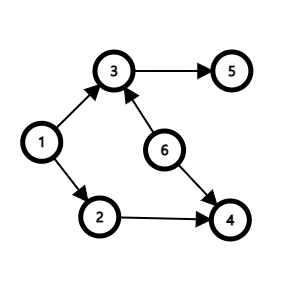

# 🎅위상 정렬(Topology Sort)

> 시간적 여유가 있다면
>
> https://blog.naver.com/ndb796/221236874984
>
> 나동빈님의 블로그 글을 읽어보자. 너무 설명이 잘 되어 있다.

---

일단 기본적으로 위상 정렬은 **순서가 정해져 있는 작업을 차례로 수행해야 할 때 그 순서를 결정해 주기 위해 사용하는 알고리즘이다.** 

가장 쉽게 들 수 있는 예시는 바로 "선수과목"에 대한 예이다. 선수과목처럼 어떠한 과목을 수강해야지만 해당 과목을 수강할 수 있는 즉, 순서가 정해져 있는 작업이 주어질 때 우리는 위상 정렬을 사용해야 한다.

위상 정렬은 DAG(Directed Acyclic Graph)에서만 적용 가능하다. DAG란 엣지가 방향성을 가지면서 싸이클이 생기지 않는 그래프를 의미한다. 싸이클이 생기는 경우 위상 정렬을 수행할 수 없다. (그나마 다행인 것은 위상정렬을 통해 싸이클이 존재하는지, 존재하지 않는지를 파악할 수 있다.)

위상정렬을 수행하기 위해 필요한 자료구조는 스택 혹은 큐이다. 보통의 경우에 큐를 사용하는 것을 선호한다고 한다. (이유는 모르겠다.) 때문에 나도 일단 큐로 위상 정렬을 공부해야 겠다.

가장 기본적인 흐름은 다음과 같다.

1. 진입 차수가 0인 정점을 큐에 삽입한다.
2. 큐에서 원소를 꺼내 연결된 모든 간선을 제거한다.
3. 간선 제거 이후에 진입차수가 0이 된 정점을 큐에 삽입한다.
4. 큐가 빌 때 까지 2~3번 과정을 반복한다. 모든 원소를 방문하기 전에 큐가 빈다면 싸이클이 존재하는 것이고, 모든 원소를 방문했다면 큐에서 꺼낸 순서가 위상 정렬의 결과이다.

여기서 진입 차수가 뭐지? 라는 의문이 생길 수 있다.

진입 차수란 해당 노드로 **들어오는** 간선의 개수이다.



다음과 같은 그래프가 존재한다고 가정하자.

해당 그래프의 가장 처음 진입 차수는 다음과 같다고 할 수 있다.

| 1번 노드 |  0   |
| :------: | :--: |
| 2번 노드 |  1   |
| 3번 노드 |  2   |
| 4번 노드 |  2   |
| 5번 노드 |  1   |
| 6번 노드 |  0   |

그러면 실제로 코드는 어떤 모양이 될까?

```javascript
// 간선의 개수가 M개일 경우에 간선을 연결하는 코드
// inDegree 배열이 바로 위에 표시한 진입 차수를 나타내기 위한 배열이다.
for (let i = 0; i < M; i++) {
    const [start, end] = input().split(' ').map(Number)
    graph[start].push(end)
    inDegree[end]++
}
```

```javascript
 // 가장 먼저 진입차수가 0인 노드들을 큐에 넣는다. 
    for (let i = 1; i <= N; i++) {
        if (!inDegree[i]) {
            queue.push({ 'x': i, 'cnt': 1 })
            ans[i] = 1
        }
    }

    // 위상정렬이 완전히 수행되려면 정확히 N개의 노드를 방문해야만 한다.
    for (let i = 1; i <= N; i++) {

        // N개의 노드를 방문하기 전에 큐가 빈다면 cycle이 생긴 것이고, 그렇다면 위상정렬 할 수 없는 문제가 된다.
        if (!queue.length) return

        let tmpNode = queue.shift()
        let nextNode = tmpNode['x']
        let nextCnt = tmpNode['cnt']

        for (let i = 0; i < graph[nextNode].length; i++) {
            let tmp = graph[nextNode][i]

            if (--inDegree[tmp] === 0) {
                queue.push({ 'x': tmp, 'cnt': nextCnt + 1 })
                ans[tmp] = nextCnt + 1
            }
        }
    }
```

백준(14567) 선수과목 문제에 대한 코드이다. 그냥 일반적으로 순서를 원한다면 `shift`를 통해 나온 값을 계속 `ans`에 더해나가면 되지만, 이 선수과목 문제에서는 최소 몇학기인지를 구해야 하는 문제이기 때문에 `cnt`를 활용한 것이다. 