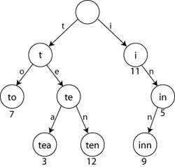

# ✔트라이(Trie)

---

사실 이 사진 하나만 봐도 바로 이해할 수 있을 만큼 어렵지 않은 개념이다. (하지만, 실제로 구현해야 하는 경우에는 쉽지 않다.)

기본적으로 루트 노드에는 아무 것도 들어가지 않는다.

루트 아래 노드부터 문자열들의 맨 앞의 한 글자 씩이 들어가게 된다. (key 값이 문자열들의 맨 앞 한 글자이다.)

이러한 특징 때문에 트라이는 **접두사 트리(Prefix Tree)**로 불리기도 한다.

시간 복잡도는 문자열의 길이만큼이 들 것이다.

문자열의 길이가 m이라면 원하는 단어를 찾기 위한 시간 복잡도도 O(m), 노드를 삽입하는 연산의 시간 복잡도도 O(m)이 될 것이다.

즉, 트라이를 사용하면 원하는 문자열을 선형 시간만에 찾을 수 있게 된다. (엄청나게 효율적이다.)

---

### 그렇다면 트라이는 문자열을 저장하는 최강의 자료구조겠네요?

이 질문에 대해서는 딱 잘라 말할 수 없다.

위의 그림에서도 볼 수 있듯이 문자열의 각 알파벳에 대한 노드들이 필요하다. 만약, 알파벳에 대해 트라이를 형성해야 한다면 a-z인 총 26개의 노드가 한 레벨에 존재해야 한다.

때문에 공간 복잡도 면에서 엄청나게 비효율적이다.

---

https://doublesprogramming.tistory.com/253

이곳에 더 자세한 설명과 사진, 영상들이 있다. 내 글을 간단히 읽고 이 게시물을 읽는 다면 트라이에 대해 완벽하게 이해할 수 있을 것이다.

---

## 참고문헌

https://namu.wiki/w/%ED%8A%B8%EB%9D%BC%EC%9D%B4

https://www.crocus.co.kr/1053

