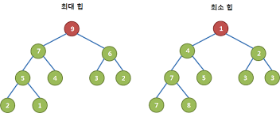
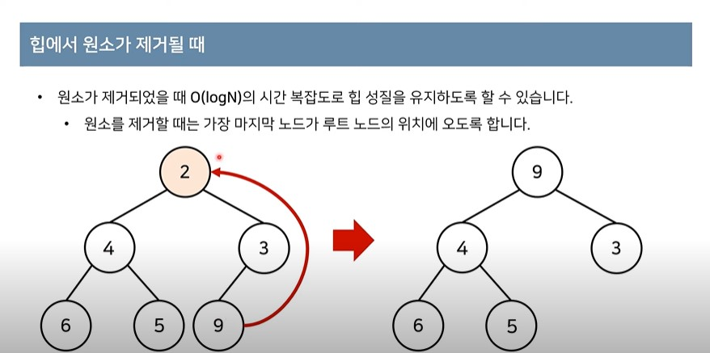
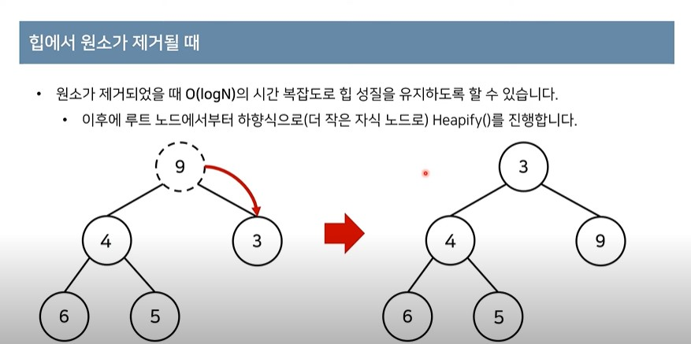

# ❤우선순위 큐와 힙

---

## 우선순위 큐(Priority Queue)

기본적으로 우선순위 큐를 구현하는 방법은 크게 3가지이다.

1. 단순히 배열을 이용하여 구현하는 경우
2. 연결리스트로 구현하는 경우
3. 힙(heap)을 이용하여 구현하는 경우

데이터의 개수가 N개일 때, 구현 방식에 따른 시간 복잡도는 다음과 같다.

| 우선순위 큐 구현 방식 | 삽입 시간 | 삭제 시간 |
| --------------------- | --------- | --------- |
| 배열                  | O(N)      | O(1)      |
| 연결리스트            | O(N)      | O(1)      |
| 힙                    | O(logN)   | O(logN)   |

1) 배열

최악의 경우 삽입해야 하는 위치를 찾기 위해 모든 인덱스를 탐색해야 할 수도 있다. 때문에 O(N)의 시간복잡도를 가진다. 또한, 우선순위가 중간인 것이 들어가야 하는 경우 뒤에 있는 모든 데이터들을 한 칸씩 뒤로 밀어야 한다는 단점 또한 존재한다.

2) 연결리스트

연결리스트 또한 그 위치를 찾을 때 최악의 경우 O(N)의 시간복잡도가 필요하게 된다.

3) 힙

힙은 기본적으로 완전 이진 트리 자료구조의 일종이다. 떄문에 값을 찾거나, 삭제할 때 O(logN)의 시간복잡도가 필요하게 된다. 

우선순위 큐를 구현하기 위해서는 힙 자료구조를 사용하는 것이 가장 유리하다는 것을 알 수 있다. 

때문에 힙에 대해서 더 알아보고자 한다.

---

## 힙(heap)

- 힙은 완전 이진 트리 자료구조의 일종이다.
- 힙에서는 항상 루트 노드를 제거한다.
- 최소 힙(min heap)
  - 루트 노드가 가장 작은 값을 가진다.
  - 따라서 값이 작은 데이터가 우선적으로 제거된다.
- 최대 힙(max heap)
  - 루트 노드가 가장 큰 값을 가진다.
  - 따라서 값이 큰 데이터가 우선적으로 제거된다.

최대 힙의 경우, 모든 서브 트리에서 루트 노드의 값이 가장 크고

최소 힙의 경우, 모든 서브 트리에서 루트 노드의 값이 가장 작다는 것을 알 수 있다.

 

### 힙에 데이터 추가하기

1. 가장 먼저 추가해야 하는 데이터를 트리의 맨 마지막에 넣는다. (힙은 완전 이진 트리이기 때문에 리프 노드 레벨의 맨 왼쪽부터 채워나가야 한다.)

2. 부모 노드로 거슬러 올라가며, 부모보다 자신의 값이 더 작은 경우에 위치를 교체한다. (최소 힙의 경우)

   부모 노드로 거슬러 올라가며, 부모보다 자신의 값이 더 큰 경우에 위치를 교체한다. (최대 힙의 경우)

.jpg)

출처: 동빈나 유튜브

### 힙에 데이터 삭제하기

1. 기본적으로 힙을 사용하는 이유는 최대 혹은 최솟값을 지속적으로 루트에 두어 해당 값을 빠르게 얻어내기 위함이다. 때문에 데이터를 제거하는 대상은 루트 노드이다.
2. 루트 노드를 제거할 때는 가장 마지막 노드가 루트 노드의 위치에 오도록 한다.
3. 이후에 루트 노드에서부터 하향식으로 (최대 힙의 경우 더 큰 자식 노드로, 최소 힙의 경우 더 작은 자식 노드로) 값을 바꾸어 나간다.

출처: 동빈나 유튜브

출처: 동빈나 유튜브

### 마무리

최대힙, 최소힙은 최대값 혹은 최솟값을 항상 루트에 두어, 해당 값을 빠르게 얻어내기 위한 자료구조이다. 때문에 루트 노드 이외의 값들이 어떤 위치에 있는 지에 대해서는 보장되지 않는다.

때문에 해당 트리를 순회하거나 탐색해서는 안되고, 그럴 이유도 존재하지 않는다.

---

## 참고문헌

https://www.youtube.com/watch?v=AjFlp951nz0

https://heung-bae-lee.github.io/2020/05/17/data_structure_07/

https://chanhuiseok.github.io/posts/ds-4/