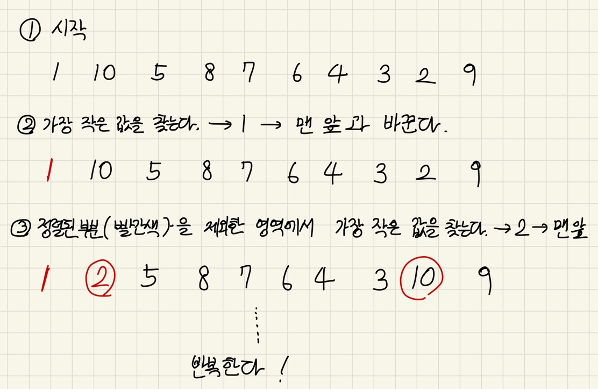
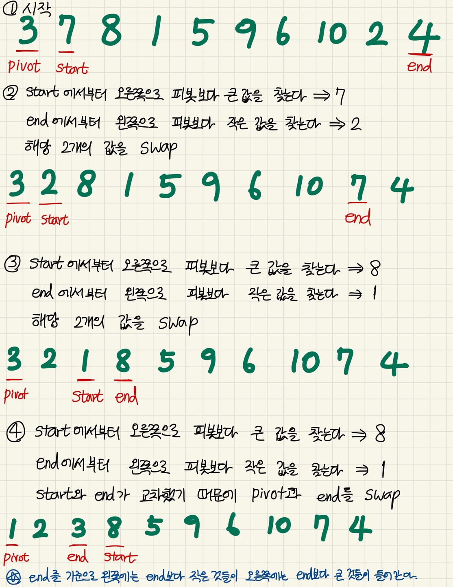
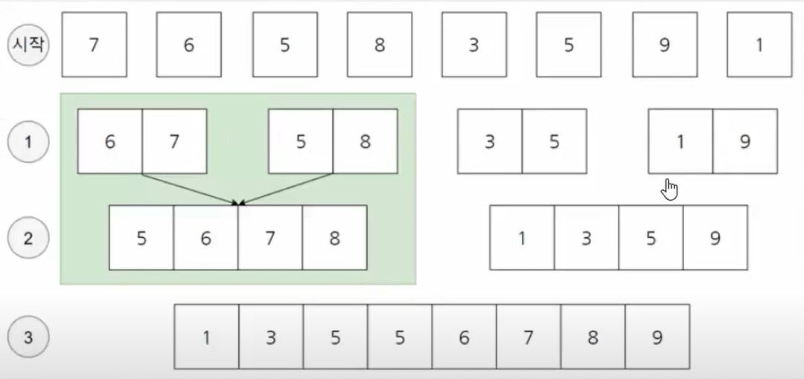
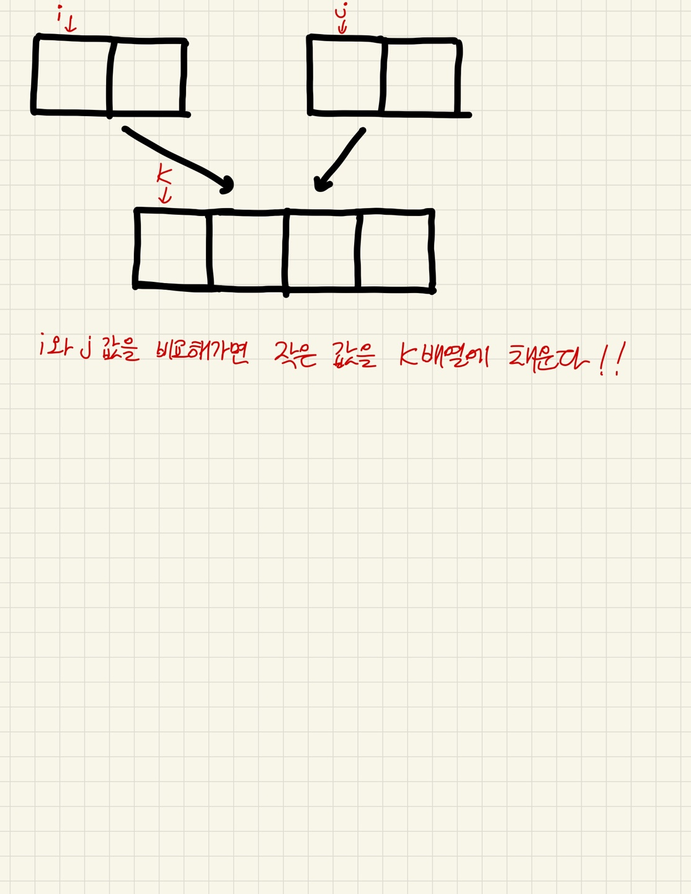

# 다양한 정렬 알고리즘들

> 전부다 동빈나 님의 유튜브 강의를 바탕으로 작성했습니다.

---

### 선택정렬

> https://www.youtube.com/watch?v=8ZiSzteFRYc&t=2s

가장 작은 것을 선택해서 제일 앞으로 보내자가 선택정렬의 핵심 알고리즘이다. 가장 직관적인 방법이라고 할 수 있다.



```c
int main() {
	int i, j, min, index, temp;
	int array[10] = {1, 10, 5,  8, 7, 6, 4, 3, 2, 9};
	for (i = 0; i < 10; i++) {
		min = 9999;
		for (j = i; j < 10; j++) {
			if (min > array[j]) {
				min = array[j];
				index = j;
			}
		}
		temp = array[i];
		array[i] = array[index];
		array[index] = temp;
	}
}
```

---

### 버블정렬

옆에 있는 값과 비교해서 더 작은 값을 앞으로 보내자

1 10 5 8 7 6 4 3 2 9 를 정렬한다면

| 1    | 10   | 5    | 8    | 7    | 6    | 4    | 3    | 2    | 9    |
| ---- | ---- | ---- | ---- | ---- | ---- | ---- | ---- | ---- | ---- |
|      | 5    | 10   |      |      |      |      |      |      |      |
|      |      | 8    | 10   |      |      |      |      |      |      |
|      |      |      | 7    | 10   |      |      |      |      |      |
|      |      |      |      | 6    | 10   |      |      |      |      |
|      |      |      |      |      | 4    | 10   |      |      |      |
|      |      |      |      |      |      | 3    | 10   |      |      |
|      |      |      |      |      |      |      | 2    | 10   |      |
|      |      |      |      |      |      |      |      | 9    | 10   |

이런 식으로 계속해서 바로 옆에 있는 것과 비교해서 작은 값을 앞으로 보내는 과정이 결과론적으로 가장 큰 값 한 개를 가장 오른쪽으로 밀어내게 된다.

```c
int main() {
	int i, j, temp;
	int array[10] = {1, 10, 5, 8, ...};
	for (i = 0; i < 10; i++) {
		for (j = 0; j < 9 - i; j++) {
			if (array[j] > array[j+1]) {
				temp = array[j];
				array[j] = array[j + 1];
				array[j + 1] = temp;
			}
		}
	}
	return 0;
}
```

---

### 삽입정렬

> https://www.youtube.com/watch?v=16I9Z7bS1iM

앞에 있는 원소들이 이미 정렬되어 있다고 가정한다. 이 가정 때문에 선택정렬, 버블정렬보다는 삽입정렬이 일반적으로 더 효율적이다.

1. 배열을 순회하면서 해당 인덱스 보다 앞의 모든 곳들 중 가장 적절한 곳을 골라서 들어간다.
2. 전체를 모두 살펴보지는 않기 때문에 앞의 두 친구보다는 상대적으로 효율적인 것이다.

평균 시간 복잡도 - O(N^2)

```c
int main() {
	int i, j, temp;
	int array[10] = {1, 10, 5, 8, 7, 6, 4, 3, 2, 9};
	for(i = 0; i < 9; i++) {
		j = i;
		while (array[j] > array[j + 1]) {
			temp = array[j];
			array[j] = array[j + 1];
			array[j + 1] = temp;
			j--;
		}
	}
    return 0;
}
```

**[2, 3, 4, 5, 6, 7, 8, 9, 10, 1] 과 같이 거의 정렬이 되어 있는 배열에서는 삽입 정렬이 가장 효율적이다.**

---

### 퀵소트

> https://www.youtube.com/watch?v=gBcUO_6JXIA

1. 피봇(pivot)을 설정한다. 보통 배열의 첫번째 원소를 피봇으로 설정하는 경우가 많다.
2. 이후 피봇을 제외한 배열의 맨 앞을 i로, 피봇을 제외한 배열의 맨 뒤를 j로 설정한다.
3. 맨 앞에서부터는 피봇보다 큰 값을, 맨 뒤에서부터는 피봇보다 작은 값을 찾고 두 값을 교환한다.



교차되면 pivot과 end의 값을 바꾸게 된다. 이후 while문에서 탈출하게 된다. 결과물을 보면 end의 왼쪽에는 end보다 작은 값들이 end의 오른쪽에는 end보다 큰 값들이 들어가게 되는 것을 알 수 있다. 왼쪽과 오른쪽을 구분하여 재귀로 돌리면 결국 전체가 정렬되게 된다.

평균 시간복잡도 - O(N * longN) // 데이터가 N개이고, 반씩 쪼개져서 각각이 정렬을 수행하기 때문에 logN이 된다.

최악 시간복잡도 - O(N^2)

```c
int number = 10;
int data[10] = {1, 10, 5, 8, 7, 6, 4, 3, 2, 9};

// data는 배열, start는 첫번째 원소의 index 번호, end는 마지막 원소의 index 번호
void quickSort(int *data, int start, int end) {
	if (start >= end) {    // 원소가 1개인 경우
		return;
	}
	
	int pivot = start;
	int i = start + 1;
	int j = end;
	int temp;
	
	while (i <= j) {     // 엇갈릴 때까지 반복
		while (data[i] <= data[pivot]) {    // 키 값보다 큰 값이 나올 때까지 찾는다.
			i++
		}
		while (data[j] >= data[pivot] && j > start) {    // 키 값보다 작은 값이 나올 때까지 찾는다. 
			j--;
		}
		if (i > j) {    // 현재 엇갈린 상태라면 키 값과 교체 시킨다. 
			temp = data[j];
			data[j] = data[pivot];
			data[pivot] = temp;
		}
		else {    // 엇갈리지 않았다면 가장 큰 값과 가장 작은 값을 교환한다.
			temp = data[j];
			data[j] = data[i];
			data[i] = temp;
		}
	}
    // 분할 정복
	quickSort(data, start, j - 1);
	quickSort(data, j + 1, end);
}

int main() {
	quickSort(data, 0, number - 1);
}
```

i는 end와 비교하지 않는데, j를 start와 비교시키는 이유는 어짜피 교차되면 두 값을 교환할 것이기 때문에 한 곳에서만 확인하면 충분하다.  

### 퀵소트를 사용할 때 최악의 시간복잡도(O(N^2))가 나오는 경우

=> 이미 정렬되어 있는 배열을 퀵소트로 정렬 할 때

ex) 1, 2, 3, 4, 5, 6, 7, 8, 9, 10

이렇게 이미 정렬이 되어 있는 경우에는 삽입 정렬이 더 빠르다. 즉 정렬할 데이터의 특성에 따라서 적절한 알고리즘을 사용하는 것이 중요하다. 항상 어떤 알고리즘이 제일 빠르고, 항상 어떤 알고리즘이 제일 느린 것은 존재하지 않는다.

---

### 머지 소트(병합 정렬)

>  https://www.youtube.com/watch?v=ctkuGoJPmAE

병합 정렬도 퀵 정렬과 똑같이 분할 정복 방법을 채택한 알고리즘이다. 때문에 퀵 정렬과 동일하게 O(N * logN)의 시간복잡도를 가진다. 다만, 퀵 정렬은 피봇 값에 따라서 편향되게 분할될 가능성이 있다는 점에서 최악의 경우 O(N ^ 2)의 시간복잡도를 가진다. 이에 반해 병합 정렬은 정확히 반절씩 나누다는 점에서 최악의 경우에도 O(N * logN)을 보장한다. 물론, 매번 절반씩 나눈다는 점 때문에 같은 O(N * logN)임에도 불구하고 앞에 곱해지는 N의 크기에 대한 차이가 존재한다. 이로 인해 퀵 소트가 대체적으로 머지 소트보다 더 빠르다.



두 개씩 붙이면서 정렬하고를 반복하는 것이다.



```c
int number = 8;
int sorted[8]; // 정렬 배열은 반드시 전역으로

void merge(int a[], int m, int middle, int n) {     // 위의 그림과 비교해보면 m이 왼쪽 배열, n이 오른쪽 배열, middle이 그 사이의 값이다.
    int i = m;
    int j = middle + 1;
    int k = m;
    
    // 작은 순서대로 배열에 삽입
    while(i <= middle && j <= n) {
        if (a[i] <= a[j]) {
            sorted[k] = a[i];
            i++;
        }
        else {
            sorted[k] = a[j];
            j++;
        }
        k++;
    }
    
    // 남은 데이터도 삽입
    if (i > middle) {
        for (int t = j; t <= n; t++) {
            sorted[k] = a[t];
            k++;
        }
    }
    else {
        for (int t = i; t <= middle; t++) {
            sorted[k] = a[t];
            k++;
        }
    }
    
    // 정렬된 배열을 삽입
    for (int t = m; t <= n; t++) {
        a[t] = sorted[t];
    }
}

void mergeSort(int a[], int m, int n) {
    if (m < n) {
        int middle = (m + n) / 2;
        mergeSort(a, m, middle);
        mergeSort(a, middle + 1, n);
        merge(a, m, middle, n);
    }
}

int main() {
    int arr[number] = {7, 6, 5, 8, 3, 5, 9, 1};
    mergeSort(arr, 0, number - 1);
}
```

---

### 힙 정렬

> https://www.youtube.com/watch?v=iyl9bfp_8ag&t=57s
>
> 이 부분은 영상을 다시보는게 더 잘 이해될 것 같다.

기본적으로 힙 정렬의 전체 시간복잡도는 O(n * logN)

```c
int number = 9;
int heap[9] = {7, 6, 5, 8, 3, 5, 9, 1, 6};

int main() {
	// 가장 먼저 전체 트리 구조를 최대 힙 구조로 바꾼다.
	for (int i = 1; i < number; i++) {
		int c = i;
		do {
			int root = (c - 1) / 2;
			if (heap[root] < heap[c]) {
				int temp = heap[root];
				heap[root] = heap[c];
				heap[c] = temp;
			}
			c = root;
		} while (c != 0);
	}
    
    // 크기를 줄여가며 반복적으로 힙을 구성
    for (int i = number - 1; i >= 0; i--) {
        int temp = heap[0];
        heap[0] = heap[i];
        heap[i] = temp;
        int root = 0;
        int c = 1;
        do {
            c = 2 * root + 1;
            if (heap[c] < heap[c + 1] && c < i - 1) {
                c++;
            }
            // 루트보다 자식이 더 크다면 교환
            if (heap[root] < heap[c] && c < i) {
                int temp = heap[0];
                heap[0] = heap[i];
                heap[i] = temp;
            }
            root = c;
        } while (c < i);
    }
}
```

