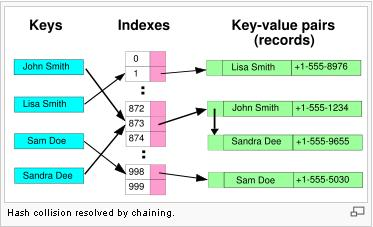
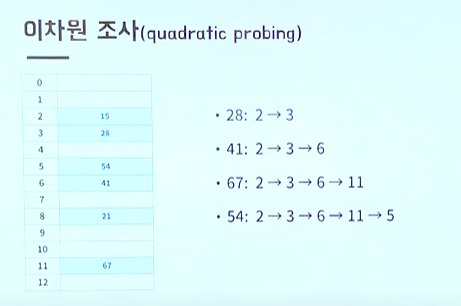
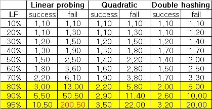
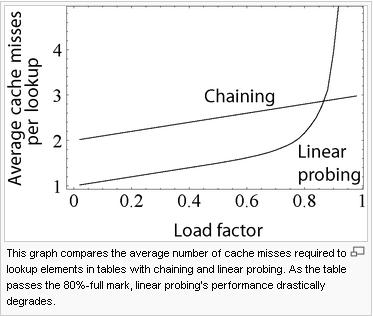

# 😍해시

---

배열은 원소 하나를 저장하고 검색하는데 평균 O(n)의 시간 소요

트리는 원소 하나를 저장하고 검색하는데 평균 O(logN)의 시간 소요

상수 시간(O(1))에 데이터에 접근할 수는 없을까? -> 해시 테이블

> 해시 테이블의 검색 성능은 해시 함수의 성능과 해시 테이블의 크기에 좌우된다. 충돌이 발생하면 할수록 성능은 점점 O(n)에 가까워지므로 충돌을 최대한 억제시키는 것이 해시의 핵심이다.

다음과 같은 해시 함수가 있다면 각각의 index는 다음과 같아진다.

h(x) = x mod 13

- h(7) = 7
- h(13) = 0
- h(15) = 2
- h(16) = 3
- h(25) = 12

---

### 기본적인 플로우

임의의 원소를 해시 테이블에 저장하려면

1. 해당 원소의 해시값을 해시 함수를 이용하여 계산한다.
2. 이 해시값을 주소로 하는 위치에 원소를 저장한다.
3. 저장 후에 검색을 할 때도 원소의 해시값을 계산해 바로 해당 위치로 이동한다.

이렇게 해시 테이블은 원소를 저장할 위치를 상수 시간에 계산할 수 있다.

---

### 해시 함수

해시 함수란 임의의 길이를 가진 데이터를 고정된 길이의 데이터로 매핑하는 함수이다.

기본적인 특징

- 같은 입력값에 대해서 같은 출력값이 보장된다.
- 서로 다른 입력값으로부터 동일한 출력값이 나올 가능성이 희박하므로 입력값에 대한 무결성이 보장된다.
- 일방향성을 갖는다.

좋은 해시 함수는 다음과 같은 조건을 가진다.

- 계산이 간단해야 한다.
- 입력 원소가 해시 테이블 전체에 고루 저장될 수 있어야 한다. -> 해시 충돌은 성능을 저하시키기 때문

좋은 해시 함수를 선택하는 것은 굉장히 까다로운 일이며, 정형화된 기준이 존재하지 않는다. 하지만, 참고한 글의 저자는 3가지 조건을 만족한다면 좋은 해시 함수라고 평가한다고 한다.

- simplicity
- speed
- strength

단순함과 속도는 쉽게 측정이 가능하지만 strength는 좀 더 애매한 개념이다. strength를 측정하는 표준 방식은 존재하지 않지만, 대개 해시 함수가 avalanche effect(눈사태 효과)를 낼 수 있는지 여부로 판단한다.

- 눈사태 효과 - 입력 데이터를 살짝만 바꿨을 때(ex. 맨뒤에 온점 하나만 추가) 출력 데이터가 상당히 바뀌는 효과

해시 테이블에 사용되는 대표적인 해시 함수로는 3가지가 존재한다.

- Division Method

  > 나눗셈을 이용하는 방법으로 입력값을 테이블의 크기로 나누어 계산한다.( 주소 = 입력값 % 테이블의 크기) 테이블의 크기를 소수로 정하고 2의 제곱수와 먼 값을 사용해야 효과가 좋다고 알려져 있다.

- Digit Folding

  > 각 key의 문자열을 아스키 코드로 바꾸고 값을 합한 데이터를 테이블 내의 주소로 사용하는 방법

- Multiplication Method

  > 숫자로 된 키값 K와 0과 1 사이의 실수 A, 보통 2의 제곱수인 m을 사용하여 다음과 같은 계산을 해준다. h(k) = (k * A mod 1) * m

- Univeral Hasing

  > 다수의 해시함수를 만들어 집합 H에 넣어두고, 무작위로 해시함수를 선택해 해시값을 만드는 기법

---

### 해시 테이블

좋은 해시 테이블은 어떤 특징을 가지고 있을까?

일단 기본적으로 좋은 해시 테이블은 크기가 소수여야하고, 최대한 2의 지수승으로부터 멀리에 있어야 한다.

---

## 해시 충돌을 해결하는 두가지 방법

> 해당 부분은 거의 [이곳](http://egloos.zum.com/sweeper/v/925740)의 내용을 가져다 사용하였습니다. 해시에 대한 정말 디테일하고 깊은 내용이 서술되어 있어서 해시를 이해하는데 정말 큰 도움이 되었습니다.

### 체이닝

모든 bucket을 링크드 리스트로 만들어 충돌이 발생하면 해당 bucket의 list에 추가하는 방식이다. 

체이닝 방식은 개방 주소 방식에 비해 크게 두 가지 이점을 가진다.

1. 삭제 작업이 간단하다. 

   > 앞 노드의 next를 뒷 노드의 prev로 연결하고 자기 자신을 free 시키기만하면 되니까
   >
   > 또한, 개방 주소 방식에서 데이터를 삭제하면 삭제된 공간은 Dummy Space로 활용되는데, 이 때문에 해시 테이블을 재정리 해주는 작업이 필요하다고 한다.

2. 모든 버켓이 사용중이더라도 성능 저하가 더디게 나타나므로 개방 주소 방식에 비해 테이블 확장을 상당히 늦출 수 있다.

실제로 많은 체이닝 해시 테이블에서는 확장이 전혀 필요하지 않다. 많은 데이터가 들어가더라도 성능 저하가 linear하게 발생하기 때문이다. 예를 들어, 체이닝 해시 테이블에 적정 크기보다 2배의 데이터가 삽입되어도 2배의 속도 저하만이 일어난다.

연결 리스트를 사용하는 chaining 해쉬 테이블은 연결 리스트의 단점도 그래도 물려받아, 작은 데이터들을 저장할 때 연결 리스트 자체의 오버헤드가 부담이 되고 traverse의 캐쉬 효율도 좋지 않다. 대체 자료구조로서 최악의 경우에 O(n)이 아닌 O(log n)의 검색 복잡도를 보장하는 self-balancing tree를 고려해 볼 필요도 있다.

그러나 해쉬 테이블이 꽉 찰 정도로 운영되거나 상당히 높은 확률로 충돌이 발생하지 않는다면(저렇게 되지 않도록 하는 것이 가장 좋다), 통상적으로 리스트의 길이는 대부분 상당히 짧으며 모든 버켓이 2개 이상의 개체를 가지지도 않기 때문에 연결 리스트를 이용한 chained 해쉬 테이블로도 충분히 효과적이다.

그리고 데이터의 크기가 작을 때는 space 오버헤드를 줄이고 캐쉬 효율을 높이기 위해 연결 리스트 대신 dynamic array를 쓸 수도 있다.

---

### 개방 주소 방법(Open Addressing)

- 체이닝과 달리 어떻게든 주어진 테이블 공간에서 해결한다.
- 따라서 모든 원소가 반드시 자신의 해시값과 일치하는 주소에 저장된다는 보장이 없다.
- 선형 조사(linear probing), 이차원 조사(quadratic probing), 더블 해싱(double hashing) 이 3가지 탐사 방식이 존재한다.

선형 조사 

- 가장 간단한 충돌 해결 방법
- 충돌이 일어난 자리에서 i에 관한 일차 함수의 보폭으로 점프한다.(+1, +2, +3)
- hi(x)는 h(x)에서 i만큼 떨어진 자리이다.
- 테이블의 경계를 넘어갈 경우에는 맨 앞으로 돌아간다.
- 캐쉬의 효율이 높다.
- 클러스터링에 가장 취약한 단점이 있다.

이차원 조사

- 바로 뒷자리를 보는 대신 보폭을 이차 함수로 넓혀가면서 본다.

- 예를 들어, i번째 해시 함수를 h(x)에서 i^2 만큼 떨어진 자리로 삼는다.

- 즉, h(x), h(x) + 1, h(x) + 4, h(x) + 9, h(x) + 16, ...

- 특정 영역에 원소가 몰려도 그 영역을 빨리 벗어날 수 있다.

- 이차원 조사의 가장 큰 문제는 다음과 같다.  최초 시도의 인덱스 값이 같을 경우 계속 충돌이 발생

- 캐쉬 효율, 클러스터링 모두 선형 조사와 더블 해싱 중간 정도의 성능을 가진다.

  

더블 해싱

- 두 개의 함수를 사용한다.
- 하나의 함수는 최초의 해시값을 얻을 때, 다른 하나의 함수는 해시 충돌이 일어났을 때 이동할 폭을 얻을 때 사용한다.
- 두 원소의 첫번째 해시값이 같더라도 두 번째 해시값까지 같을 확률은 매우 작으므로 서로 다른 보폭으로 점프를 하게 된다.
- 캐쉬 효율은 제일 안 좋다.
- 클러스터링에 거의 영향을 받지 않는다.
- 하지만, 가장 많은 연산량을 요구한다는 단점이 있다.

클러스터링이란?

> 말그대로 군집화의 정도이다. 얼마나 데이터들이 한 곳에 모여있는지를 의미한다고 생각하면 좋다. 

탐사 방식에 따라 개방 주소 방식 해시의 성능이 달라지지만, 가장 치명적인 영향을 미치는 요소는 해시 테이블의 **load factor(전체 슬롯에서 사용 중인 슬롯 비율)**이다. Load factor가 100%로 증가할수록 데이터를 찾거나 삽입하기 위해 필요한 탐사 횟수는 비약적으로 증가한다. 

위 표와 같이 아무리 좋은 해시 함수를 쓰더라도 일반적으로 load factor는 80%로 제한된다. 

클러스터링에 가장 취약한 선형 조사 방식이 load factor가 높을 수록 가장 급격하게 성능 저하가 발생한다. 따라서 load factor가 임계점을 넘어 큰 경우의 성능은

더블 해싱 > 이차원 조사 > 선형 조사 의 순서이다.

물론 질 낮은 해쉬 함수는 엄청난 클러스터링을 유발함으로써 아주 낮은 load factor에도 해쉬 테이블의 성능을 상당히 낮아지게 한다. 어떤 문제가 해쉬 함수의 클러스터링을 유발하는지 알기는 쉽지 않아도, 해쉬 함수가 심각한 클러스터링을 유발하게 하는 것은 상당히 쉽다. 그냥 잘 만들어진, 그리고 많은 사람들에 의해 충분히 검증된 공개된 함수들을 가져다 쓰는 것이 좋다.

---

### 체이닝 방식 vs 개방 주소 방식

> 이 부분도 위의 글을 가져온 블로그에서 대부분을 가져왔습니다.
>
> 출처:[[알고리즘\] Hash table](http://sweeper.egloos.com/925740)

Chained 해쉬 테이블은 open-addressing에 비해 다음과 같은 장점을 가진다.

1. 효과적으로 구현하기 간단하고 기본적인 자료구조 정도만 요구된다.

2. 해쉬 함수를 구현(선택)하는 관점에서 볼 때, chained 해쉬 테이블은 클러스터링에 거의 영향을 받지 않아 충돌의 최소화만 중점적으로 살펴보면 된다. 반면에 open-addressing 방식은 클러스터링까지 피해야 하므로 해쉬 함수의 성능에 지대한 영향을 받아 해쉬 함수를 구현(선택)하기가 쉽지 않다.

3. 테이블이 채워져도 성능 저하가 linear하게 발생한다. 비록 테이블이 채워질 수록 chain은 늘어나겠지만(리스트의 길이가 길어지겠지만) near-filled 상태의 open-addressing 방식에서 발생하는 급작스런 lookup 시간의 증가는 발생하지 않는다. (아래 그림을 보자)

4. 데이터의 크기가 대략 5 words and more 이라면, open-addressing 방식보다 적은 메모리를 사용한다.

5. 테이블의 데이터가 산재해 있다면(아주 큰 배열에서 빈 공간이 많은), chained 해쉬 테이블은 연결 리스트 등 테이블 외 별도의 외부 저장 공간에 동적으로 할당하여 사용함으로써 2 ~ 4 words의 작은 데이터라도 미리 공간을 잡아놓고 사용하는 open-addressing 방식보다 적은 메모리를 사용한다.

작은 크기의 데이터에 대해(a few words or less) open-addressing은 chaining에 비해 다음과 같은 장점을 가진다.

1. Open-Addressing 방식은 어떠한 포인터도 저장할 필요가 없고 테이블 외부에 어떠한 추가적인 저장 공간이 필요 없으므로 chaining 방식보다 메모리 효율이 높다.
2. 삽입시 메모리 할당 오버헤드가 없으며, 메모리 할당자가 없이도 구현이 가능하다.
3. 외부에 별도 공간을 필요로 하지 않기 때문에 chaining의 연결 리스트 같은 외부 공간에 필요한 추가적인 작업이 요구되지 않는다. 또한 (특히 linear probing에서) chaining보다 뛰어난 locality of reference(하나의 자원에 여러 번 접근하는 process)를 가진다. 데이터의 크기가 작다면, 특히 lookup에서, 이러한 특성들로 인해 chaining보다 성능이 좋을 수 있는 것이다.
4. 포인터를 사용하지 않음으로써 serialization이 용이하다.

반면에 open-addressing 방식은 큰 데이터를 다뤄야 할 때는 좋지 않은 선택인데, 데이터들이 캐쉬 라인을 채워버릴 것이며(캐쉬의 이득이 없어짐) 많은 공간이 (크기가 큰) 빈 슬롯들에 의해 낭비될 것이다.

정리하자면 open-addressing 방식은 테이블에 모두 저장될 수 있고 캐쉬 라인에 적합할 수 있을 정도로 데이터의 크기가 작을수록 성능이 더 좋아진다. 테이블의 높은 load factor가 예상되거나, 데이터가 크거나, 데이터의 길이가 가변일 때 chained 해쉬 테이블은 open-addressing 방식보다 적어도 동등하거나 훨씬 더 뛰어난 성능을 보인다.

---

### 테이블 리사이징

성능이 좋은 해쉬 함수를 사용하면 일반적으로 전체 슬롯의 70~80%가 채워져도 해쉬 테이블의 성능은 유지된다. 이 상태에서 더 많은 데이터가 추가되면, 충돌 해결 메커니즘에 따라 gradually or dramatically 하게 성능 저하가 발생한다. 이를 피하기 위해 load factor가 특정 임계점을 돌파하면 더 큰 테이블을 새로 만들어 데이터를 모두 옮기는 방법이 있다.

테이블 확장은 상당히 비용이 많이 드는 작업이며, 확장의 필요성은 해쉬 테이블의 단점 중 하나이다. 아주 무식하게 데이터가 하나씩 삽입될 때마다 매번 테이블을 늘어난 크기만큼 확장시킨다고 가정하면, 성능이 기하급수적으로 떨어질 것이며 더 이상 사용하기 힘든 해쉬 테이블이 될 것이다. 하지만 특정 퍼센트(예를 들어 10%, 100%)로 확장을 한다고 하면, 확장이 자주 발생하지 않아 lookup에 발생하는 평균적인 시간이 O(1)으로 되는 amortized(평소엔 좋지만 최악의 상황도 있는) 복잡도를 갖게 된다.

반면에 특히 real-time 시스템 같은 시스템에서는 테이블을 확장시키는 발생하는 비용을 감당하지 못할 수 있다. 이를 간단하게 해결하려면, 삽입될 데이터의 수보다 아주 큰 테이블을 만들거나 삽입 자체를 너무 많이 못하게 금지시키면 된다. 또 다른 방법으로 유용하지만 more memory-intensive인 기술은 다음과 같이 점진적으로 확장하는 방식이다.

\1. 새 해쉬 테이블을 할당하지만 이전 해쉬 테이블을 삭제하지 않고, lookup 과정에서 두 테이블 모두 체크한다.
\2. 데이터가 삽입될 때마다 새 테이블에 저장하고 특정 k 만큼 이전 테이블에서 새 테이블로 데이터를 이전한다.
\3. k 만큼 데이터를 옮기다가 이전 테이블에 저장된 데이터가 없으면 이전 테이블을 free 한다.

Linear hashing은 incremental 해쉬 테이블 확장을 가능하게 하는 해쉬 테이블 알고리즘이다. 하나의 해쉬 테이블로 구현되지만, 두 개의 유효한 lookup 함수를 가진다.

아무리 훌륭한 방법을 고안, 구현하더라도 확장은 분명 해쉬 테이블의 심각한 성능 저하를 초래할 것이다. 가급적 확장이 일어나지 않도록 해쉬 테이블을 설계하고, 필요하다면 load factor가 일정 이상 늘어나지 않도록 테이블의 데이터 수를 제한하는 것도 확장하는 것보다는 낫다고 생각한다.

출처:[[알고리즘\] Hash table](http://sweeper.egloos.com/925740)

---

### 해시의 단점

해쉬 테이블은 데이터를 pseudo-random 위치에 저장하기 때문에, 데이터를 정렬된 순서로 접근하는 것에 엄청난 비용이 발생한다. Self-balancing binary tree 같은 다른 자료구조에서는 일반적으로 lookup 시간이 O(log n)으로 느리고 구현도 더 복잡하지만 항상 데이터가 정렬되어 있다. 그리고 traverse 능력도 현저히 떨어지는데, 데이터가 산재해 있을 확률이 높은 해쉬 테이블의 특성상 빈 슬롯도 모두 체크하면서 순회를 해야 하기 때문이다.

해쉬 테이블은 일반적으로 locality-of-reference가 취약한데 데이터의 접근 패턴이 기본적으로 해쉬값을 이용한 jump around 방식이기 때문이며, 이는 프로세서의 캐쉬 미스를 발생(cause long delay)시킨다. 데이터의 수가 적고 key type이 integer 처럼 비교하기에 비용이 적게 든다면, linear search를 하는 배열 같은 간단한 자료구조에서 lookup에 더 나은 성능을 보인다.(일반적으로 hash는 개체수가 적을 때 성능이 떨어진다)

또한 해쉬 테이블은 구현 및 사용이 좀 더 어렵고 문제를 수반하기 쉽상이다. 모든 key type에 대해 강력한 해쉬 함수를 요구하는데, 다른 자료 구조의 간단한 비교 함수에 비해 설계하기도 구현하기도 디버그하기도 쉽지 않다. 특히 open-addressing 방식에서는 질 낮은 해쉬 함수를 만들기가 꽤나 쉽다.

출처:[[알고리즘\] Hash table](http://sweeper.egloos.com/925740)

---

## 참고문헌

---

https://www.youtube.com/watch?v=Rpbj6jMYKag

http://sweeper.egloos.com/925740#comment_925740

https://mangkyu.tistory.com/102