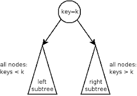
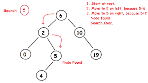
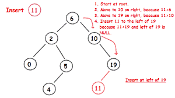

# 🤷‍♂️이진 탐색 트리(Binary Search Tree)

> 이 글에서 사용하는 모든 사진의 출처는
>
> https://m.blog.naver.com/PostView.nhn?blogId=4717010&logNo=60209820587&proxyReferer=https:%2F%2Fwww.google.com%2F
>
> 이곳입니다. 좋은 사진 자료를 제공해주셔서 감사합니다.

---

기본적으로 이진 탐색 트리는 탐색을 위한 자료구조이다.

이진 탐색 트리의 특징은 다음과 같다.

- BST의 모든 노드 값들은 유니크하다. (유니크하지 않아도 BST로 만들 수 있기는 하다. count 변수를 활용하여 해당 노드의 개수를 파악해두면 되기 때문이다. 자세한 내용은 참고문헌에 달아놓겠다.)
- 왼쪽 서브트리에 속하는 모든 노드의 값들은 루트의 값보다 작다.
- 오른쪽 서브트리에 속하는 모든 노드의 값들은 루트의 값보다 크다.

---

### BST 탐색

---

### BST 삽입

---

### BST 삭제

+ 두가지 경우 추가하자

---

## 참고문헌

https://www.geeksforgeeks.org/how-to-handle-duplicates-in-binary-search-tree/     // count변수 사용

https://m.blog.naver.com/PostView.nhn?blogId=4717010&logNo=60209820587&proxyReferer=https:%2F%2Fwww.google.com%2F